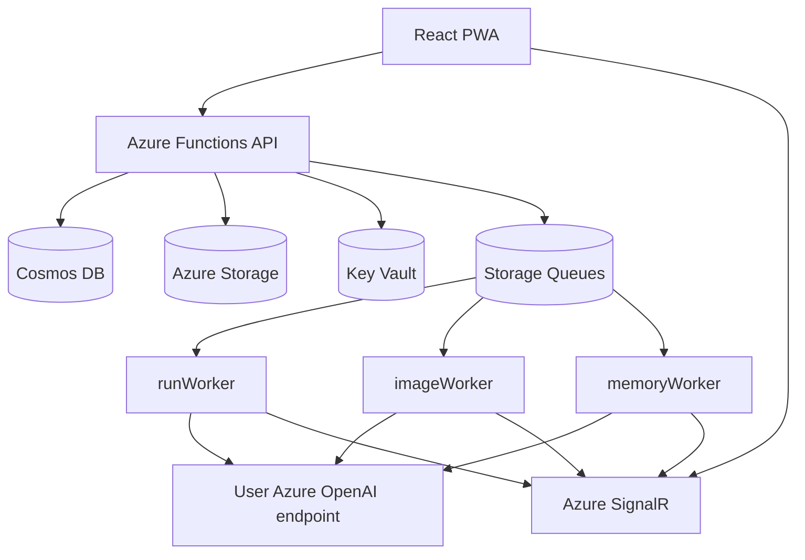

# Watai

Watai is a ChatGPT-style web app backed by Azure Functions and the user's own Azure OpenAI credentials. It is built as a React/Vite PWA with a server-authoritative generation path, cloud sync, realtime updates, image generation, agent tools, and an evolving memory system.

The live frontend is served from the `docs/` build output through GitHub Pages. The backend runs as an Azure Functions app.

## What It Does

- Chat with server-side generation that can continue after the browser closes.
- Store AI credentials encrypted server-side in the user's cloud account.
- Sync threads, messages, images, files, artifacts, settings, and memory across devices.
- Stream server-run snapshots through SignalR with polling fallback.
- Use tools such as web search, file search, code interpreter, image generation, speech, and transcribe when configured.
- Manage memory through saved/learned records, structured profile view, evidence view, and response-level memory source disclosure.
- Generate and browse images in a server-authoritative image studio.
- Manage reusable agent skills.

## Architecture



The browser owns the app shell and local cache. The server owns durable generation, memory retrieval/extraction, assets, credentials, and sync authority.

## Repository Layout

```text
api/                    Azure Functions backend
  src/domain/           Zod contracts and domain rules
  src/application/      Application services and workers
  src/adapters/         Cosmos, Azure, auth, and in-memory adapters
  src/functions/        Function registrations
  src/http/             HTTP controllers and route helpers
documentation/          Product, architecture, memory, and UI specs
docs/                   Built frontend for GitHub Pages
infra/                  Azure Bicep infrastructure
public/                 Static PWA assets
src/                    React frontend
spike/                  Small experiments and probes
```

## Prerequisites

- Node.js 20 or 22 recommended.
- npm.
- Azure CLI for cloud operations.
- Azure Functions Core Tools v4 for backend deploys.
- Access to the deployed Azure subscription/resource group for production deployment.

## Install

```powershell
npm install
Set-Location api
npm install
Set-Location ..
```

## Run Locally

Frontend:

```powershell
npm run dev
```

Backend local Functions execution is not the default workflow on this machine because Functions runtime support depends on the local Node version. Prefer backend unit tests and deploy-to-cloud smoke checks unless you have a compatible Node/Functions setup.

## Validate

Frontend:

```powershell
npm test
npm run build
```

Backend:

```powershell
Set-Location api
npm test
npm run typecheck
npm run build
Set-Location ..
```

The frontend production build writes to `docs/`. Commit those generated files when deploying the frontend through GitHub Pages.

## Deploy

Push `master` to publish the GitHub Pages frontend from `docs/`.

Backend:

```powershell
Set-Location api
func azure functionapp publish func-watai-cbroocyg3omrk --build remote
Set-Location ..
```

The `--build remote` flag is required so the Functions host receives dependencies and the bundled entrypoint correctly.

Health check:

```powershell
Invoke-RestMethod -Uri https://func-watai-cbroocyg3omrk.azurewebsites.net/api/health
```

## Azure Notes

The dev deployment currently uses:

- Resource group: `rg-watai-dev`
- Function app: `func-watai-cbroocyg3omrk`
- Cosmos database: `watai`
- Storage account: `stwataicbroocyg3omrk`
- Key Vault: `kv-watai-cbroocyg3omrk`
- SignalR: `sigr-watai-cbroocyg3omrk`

Be careful with full Bicep deployments. Azure App Service app settings are full-replacement in ARM/Bicep, so any live app setting missing from `infra/main.bicep` can be wiped by a full deployment. For one-off Cosmos containers, prefer surgical creation unless the template has been reconciled with live settings.

## Memory System

The memory system has three layers today:

- Atomic evidence records in the backend memory store.
- Background extraction through `memoryWorker` using the user's configured model.
- A structured profile view derived from active evidence for the Settings UI.

The structured direction is documented in [documentation/memory-system/10-structured-hierarchical-memory.md](documentation/memory-system/10-structured-hierarchical-memory.md). The current structured view is derived from atomic records; dedicated graph/profile/temporal stores are the next deeper architecture phase.

## Key Documentation

- [documentation/README.md](documentation/README.md)
- [documentation/02-architecture.md](documentation/02-architecture.md)
- [documentation/06-server-runs-and-migration.md](documentation/06-server-runs-and-migration.md)
- [documentation/memory-system/README.md](documentation/memory-system/README.md)
- [documentation/ui-design/README.md](documentation/ui-design/README.md)

## Development Principles

- Keep changes scoped and consistent with the existing design system.
- Run focused tests before broader validation.
- Treat server-run generation, memory extraction, and image generation as backend-owned workflows.
- Do not put heavy memory extraction on the response hot path; retrieval must be bounded and degrade gracefully.
- Do not expose secrets in logs, telemetry, memory records, prompt context, or UI.