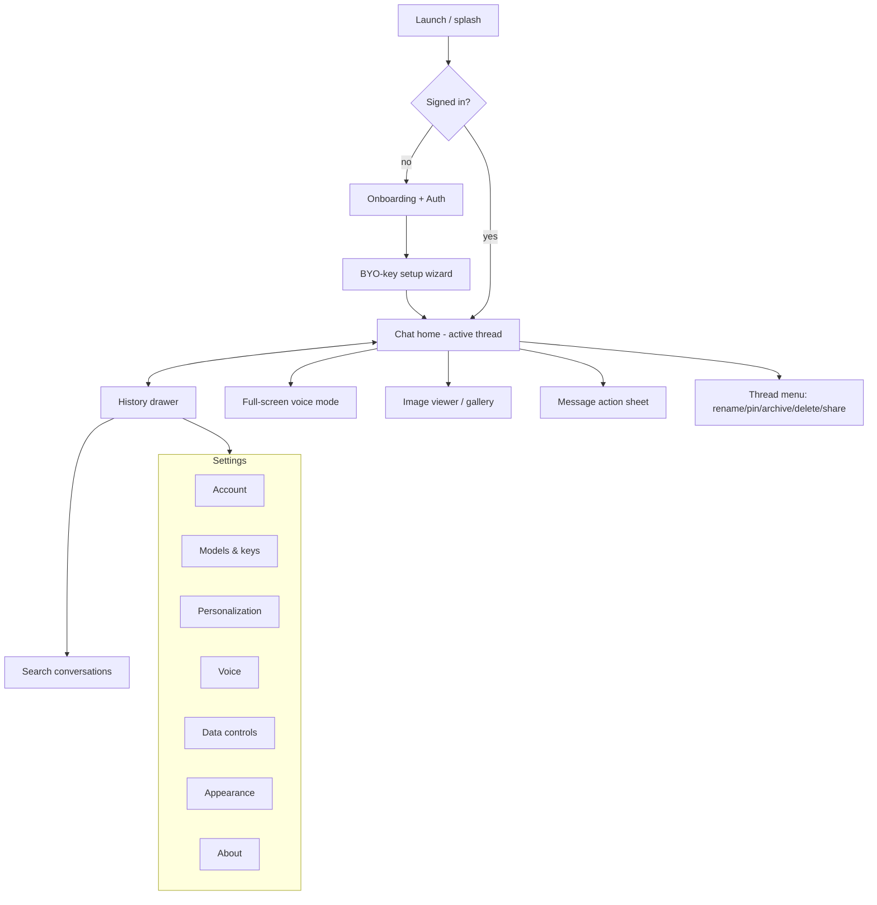

# 01 — Product & UX/UI Specification

This document specifies *what Watai is* from the user's point of view: its information
architecture, navigation model, every primary surface, the interaction grammar, states,
theming, accessibility, and responsive behavior. The reference experience is the
ChatGPT iOS app; we re-implement its *patterns* with original assets and our own design
tokens. We never copy proprietary logos, icons, illustrations, or copy strings.

Cross-references: [README.md](README.md) · [02-architecture.md](02-architecture.md) ·
[03-api-integration.md](03-api-integration.md) · [04-data-model.md](04-data-model.md).

---

## 1. Design principles

1. **Conversation is the product.** The chat thread is the home surface. Everything
   else is one gesture away and then gets out of the way.
2. **Calm by default.** Generous spacing, restrained color, motion that explains rather
   than decorates. No spinners where streaming text will do.
3. **Native feel on the web.** Momentum scrolling, edge-swipe drawer, large tap targets,
   safe-area awareness, no visible browser chrome when installed.
4. **Progressive disclosure.** Short, focused confirmations use sheets/modals; deep
   secondary workflows use full subviews with a back affordance; low-risk reference
   detail uses inline expanders.
5. **Trust through transparency.** The user always knows which model answered, where
   their keys live, what is stored, and how to export or delete it.
6. **Accessible and keyboard-complete.** Every action reachable by screen reader and
   keyboard; motion respects reduced-motion.

---

## 2. Information architecture



### 2.1 Surface inventory

| # | Surface | Type | Entry points |
| --- | --- | --- | --- |
| S1 | Splash / launch | Transient | App cold start |
| S2 | Onboarding & auth | Full screen | First run, signed-out |
| S3 | BYO-key setup wizard | Full screen / sheet | After first sign-in, or Settings → Models |
| S4 | Chat home (thread) | Primary | Default after auth |
| S5 | History drawer | Side drawer | Edge swipe, menu button |
| S6 | Search | Overlay in drawer | Drawer search field |
| S7 | Voice mode | Full screen | Composer voice button |
| S8 | Image viewer / gallery | Full screen modal | Tap a generated image |
| S9 | Message action sheet | Bottom sheet | Long-press / hover a message |
| S10 | Thread menu | Bottom sheet / popover | Thread title, drawer row context |
| S11 | Settings (hub + subpages) | Full screen stack | Drawer footer |
| S12 | New thread (empty state) | Primary variant | New chat button |
| S13 | Attachments picker | Sheet | Composer attach button |
| S14 | Error / offline states | Inline + banners | Network / API failures |

---

## 3. Navigation model

- **Two-level spatial model.** The History drawer slides over the chat from the left.
  The chat is always "behind" it. Closing the drawer returns to the active thread.
- **Modal stack.** Settings, Voice mode, and the Image viewer present *over* the chat
  as full-screen layers with an explicit back/close affordance. They do not replace the
  chat in history; dismissing returns to exactly where the user was.
- **Gestures (touch).**
  - Edge-swipe from left → open drawer. Swipe left on drawer → close.
  - Swipe down on a full-screen modal (Voice, Image viewer, Settings root) → dismiss.
  - Long-press a message → action sheet.
  - Pull down at top of thread → (optional) load older messages / nothing if at top.
- **Back semantics.** A single global back behavior: close top modal → close drawer →
  (web) browser back maps to the same stack so the hardware/browser back button is
  predictable. Deep links restore the stack.
- **Desktop.** The drawer becomes a persistent left sidebar at >= 1024 px. Modals become
  centered dialogs or right-side panels. Full keyboard navigation (see §13).

### 3.1 URL / routing map (PWA)

| Route | Surface | Notes |
| --- | --- | --- |
| `/` | Chat home (most recent or new thread) | |
| `/c/:threadId` | Specific thread | Deep-linkable, restores scroll |
| `/new` | New thread empty state | |
| `/voice/:threadId?` | Voice mode | Optional thread context |
| `/settings` | Settings hub | |
| `/settings/:section` | Settings subpage | `models`, `account`, etc. |
| `/auth/*` | Auth + redirect handling | Entra External ID callback |

GitHub Pages requires SPA fallback handling (404 → index) — see
[02-architecture.md](02-architecture.md) §hosting.

---

## 4. Global layout & chrome

```
+--------------------------------------------------+
|  [≡]      Model ▾  · Temporary        [＋] [⋯]   |  <- top app bar
+--------------------------------------------------+
|                                                  |
|   (scrolling message list)                       |
|                                                  |
|   ┌────────────────────────────────────────┐     |
|   |  assistant message, full width          |     |
|   └────────────────────────────────────────┘     |
|                        ┌───────────────────┐      |
|                        |  user message      |      |
|                        └───────────────────┘      |
|                                                  |
+--------------------------------------------------+
|  [＋]  message Watai…              [🎙] [▶/⤴]    |  <- composer
+--------------------------------------------------+
```

- **Top app bar:** menu (drawer), centered **model selector** with the active deployment
  label and an optional "Temporary chat" indicator, **new chat**, and an **overflow**
  menu (thread menu).
- **Message list:** vertically scrolling, newest at bottom, auto-stick to bottom while
  streaming unless the user has scrolled up (then show a "jump to latest" pill).
- **Composer:** attach (+), multiline auto-growing text field, dictation mic, and a
  context-morphing primary button: **voice-mode** glyph when empty, **send** when there
  is text, **stop** while a response streams.
- **Safe areas:** respect iOS notch/home-indicator insets and Android nav bars when
  installed.

---

## 5. Surface specifications

### 5.1 S1 — Splash / launch

- Brand wordmark centered on the themed background; no progress bar unless cold start
  exceeds ~600 ms, then a subtle indeterminate shimmer.
- Responsibilities: hydrate app shell, restore session token, restore last route,
  decrypt/validate BYO-key config presence. Route to S2 if signed out, else S4.

### 5.2 S2 — Onboarding & authentication

- **Welcome:** one-line value prop, primary "Get started", secondary "I already have an
  account".
- **Auth options:** email + passwordless code and/or social providers via Entra External
  ID. No password stored by us beyond the identity provider.
- **Account-optional path (D9):** "Continue without an account" → local-only mode; data
  lives in IndexedDB, no sync. Clearly labeled, reversible later by signing in (with a
  merge prompt).
- **First-run education:** 2–3 lightweight panes explaining chat, voice, and images.
  Skippable. Never blocks.

### 5.3 S3 — BYO-key setup wizard

The most important onboarding step. Goal: get a valid Azure OpenAI configuration in
under two minutes, with strong inline validation.

- **Fields (per [04-data-model.md](04-data-model.md) ApiConfig):**
  - Azure resource endpoint (e.g. `https://<resource>.openai.azure.com`).
  - API version.
  - Deployment name for **chat** (`gpt-5.4`).
  - Deployment name for **transcription** (`gpt-4o-transcribe`).
  - Deployment name for **image** (`gpt-image-2`).
  - Deployment name for **voice output** (TTS) — shown only if D4 resolves to TTS.
  - API key (masked, reveal toggle, paste-friendly).
- **Validation:** a "Test connection" action runs a minimal request against each
  configured deployment and reports per-model status (OK / unauthorized / not found /
  CORS blocked / rate-limited). See error taxonomy in
  [03-api-integration.md](03-api-integration.md) §errors.
- **Security copy:** explicit, plain-language statement that the key is stored only on
  this device and never sent to Watai's servers. Link to Data controls.
- **Optional passphrase (O5):** offer to encrypt the key at rest behind a passphrase
  (Web Crypto). If declined, store as-is with a clear note about device security.
- **Import/export:** allow importing a config JSON (without the key) and exporting a
  sanitized template to ease multi-device setup.

### 5.4 S4 — Chat home (active thread)

The home surface. Composed of the message list and composer described in §4, plus:

#### 5.4.1 Message rendering

Assistant and user messages render differently:

- **User messages:** right-aligned, contained "bubble", selectable text, attachments
  shown as thumbnails/chips above the text.
- **Assistant messages:** full-width, no bubble, rich content:
  - **Markdown:** headings, bold/italic, lists, blockquotes, links (open in new tab,
    `rel="noopener noreferrer"`), horizontal rules.
  - **Code blocks:** monospaced, syntax-highlighted, language label, **copy** button,
    soft-wrap toggle, horizontal scroll for long lines.
  - **Tables:** scrollable on narrow screens.
  - **Math:** inline `$…$` and block `$$…$$` rendered with KaTeX.
  - **Inline images:** generated images render as rounded cards; tap → Image viewer (S8).
  - **Streaming:** tokens append live with a caret; partial markdown is rendered
    progressively without layout thrash; code fences close gracefully mid-stream.
- **Message metadata:** timestamp on demand (tap to reveal), model badge when the active
  model differs from the thread default, and token/cost estimate in a debug/advanced
  mode.

#### 5.4.2 Message actions (S9)

Long-press (touch) or hover (desktop) reveals contextual actions:

| Action | Applies to | Behavior |
| --- | --- | --- |
| Copy | Any | Copy plain text / code. |
| Select text | Any | Native selection. |
| Regenerate | Last assistant msg | Re-run with same context; offer model/temperature override. |
| Edit & resend | User msg | Edit then fork the conversation from that point. |
| Read aloud | Assistant msg | TTS playback (if D4 = TTS). |
| Good / bad response | Assistant msg | Local feedback signal; optional note. |
| Share / export | Any / thread | Export message or thread (md / image / link if sharing enabled). |
| Delete | Any | Soft-delete with undo. |

Editing a user message **forks** the thread (creates a new branch from that point); the
prior branch remains accessible via a small branch switcher on the edited message
(post-v1 may simplify to linear replace — see decisions log).

#### 5.4.3 Composer behavior

- Auto-growing text area (max ~40% viewport height, then scrolls internally).
- **Attach (+):** opens picker (S13) — photo library, camera, files. Attachments become
  vision inputs to chat where supported (see [03-api-integration.md](03-api-integration.md)).
- **Dictation mic:** tap to open a recording bar (amplitude waveform + timer + Cancel/Accept);
  Accept transcribes via `gpt-4o-transcribe` and **inserts the text at the caret** without
  clobbering what's typed. Never auto-sends; Cancel restores the field. Distinct from Voice mode
  (S7). See [ui-design V-14](ui-design/05-screens-history-voice-images.md).
- **Primary button morphing:** voice-mode glyph (empty) → send (has text) → stop
  (streaming). Send is also bound to Enter on desktop (Shift+Enter = newline).
- **Drafts:** per-thread composer draft persisted locally; restored on return.
- **Temporary chat toggle:** start an ephemeral thread that is never persisted/synced;
  clearly badged; disappears on close.

#### 5.4.4 Empty state (S12 — new thread)

- Centered brand mark, a one-line greeting, and 3–6 **suggestion chips** (prompt
  starters) that are configurable and localized.
- Quick entries to **voice mode** and **image generation** ("Create an image…").
- The first sent message creates the thread, requests an auto-title (short summary), and
  transitions to the standard thread layout.

### 5.5 S5 — History drawer

- **Header:** account avatar + name, settings shortcut.
- **Search field** (→ S6).
- **New chat** button.
- **Conversation list grouped by recency:** Today, Yesterday, Previous 7 days, Previous
  30 days, then by month. Each row: title, last-activity time, and a leading pin glyph
  if pinned.
- **Pinned section** at top when any pins exist.
- **Row actions** (swipe / long-press → S10): pin/unpin, rename, archive, delete, share.
- **Archived** accessible via a footer entry; archived threads are hidden from the main
  list but searchable.
- **Footer:** Settings, and (advanced mode) a storage/usage summary.
- **Desktop:** persistent sidebar; collapsible to icons.

### 5.6 S6 — Search

- Full-text search over thread titles and message content (see indexing in
  [04-data-model.md](04-data-model.md)).
- Live results as you type, grouped by thread, with snippet highlighting.
- Tapping a result opens the thread scrolled to the matched message.
- Recent searches and quick filters (has images, voice, date range) — filters are
  post-v1 optional.

### 5.7 S7 — Voice mode (full screen)

Hands-free, continuous spoken conversation — the flagship "talk" experience, modeled on ChatGPT's
Voice mode. **Every turn runs through the same server-authoritative agentic run as text chat**
(`POST /runs`), so voice has full parity: memory, tools (web/code/files/image), skills, streaming,
sync, and persistence. See [ui-design V-15](ui-design/05-screens-history-voice-images.md) for the
full UX.

- **Visual:** a single amplitude-reactive orb reflecting state — listening, thinking, working
  (tool), and speaking — plus a live caption (default on for a11y).
- **Controls:** mute (gates the mic), end, switch to keyboard, captions toggle, voice settings.
- **Continuous loop (no taps):** VAD endpoints the user's speech → `gpt-4o-transcribe` → submit as a
  normal user message + **`POST /runs`** (memory + tools + skills, streamed over SignalR) → speak the
  reply **sentence-by-sentence** via TTS as it streams → auto-return to listening.
- **Barge-in:** speaking over the assistant immediately stops playback (<150 ms), cancels the
  in-flight run, and starts the next turn.
- **Persistence:** turns are real runs — written server-side, synced to all devices, and fed to
  memory extraction. No separate voice path.
- **Fallbacks:** mic denied → prime/permission; transcribe down → offer dictation/text; TTS down →
  keep the loop with silent text replies; offline/error → Retry/End.

> **D4 resolved:** v1 ships the **STT → agentic run → streaming TTS** loop (ChatGPT "standard
> voice"), which keeps full agentic parity. A native **Realtime** speech-to-speech path (lower
> latency, native barge-in) is a later enhancement, not a v1 blocker.

### 5.8 S8 — Image viewer / gallery

- **Inline → fullscreen:** tapping a generated image opens a zoomable, pannable viewer.
- **Actions:** save/download, share, copy, **regenerate**, **variations**, **edit**
  (prompt-based edit / inpainting if supported by `gpt-image-2`), and view the prompt +
  parameters used.
- **Per-conversation gallery:** a grid of all images generated in the thread; also a
  global gallery in Settings/Data (optional).
- **Provenance:** show prompt, size, and timestamp; allow "use as input" to feed an
  image back into a follow-up generation/edit.

### 5.9 S10 — Thread menu

Rename (inline editable title), pin/unpin, archive, **delete** (confirm + undo),
duplicate, export (markdown / JSON), and share (if link-sharing is enabled). Also a
"clear messages" option that keeps the thread but empties it (advanced).

### 5.10 S11 — Settings

A stacked hub with these sections:

| Section | Contents |
| --- | --- |
| **Account** | Identity, sign out, delete account, switch local/synced mode, devices. |
| **Models & keys** | Endpoint, API version, per-model deployment names, API key (masked), Test connection, default model params (temperature, max tokens, system prompt). |
| **Personalization** | Custom instructions ("about you" / "how to respond"), memory toggle and memory viewer/eraser, suggestion chips. |
| **Voice** | Voice selection, speaking rate, mic sensitivity (VAD endpoint), live-captions default, dictation auto-stop on silence. (Engine is STT→run→TTS in v1; Realtime is a future toggle.) |
| **Data controls** | Export all data, delete all data, history sync on/off, temporary-chat default, retention preference, where data is stored. |
| **Appearance** | Theme (system/light/dark), text size, message density, reduced motion override, language. |
| **About** | Version, changelog, licenses, privacy & security explainer, support links. |

### 5.11 S13 — Attachments picker

Photo library, take photo (camera), choose file. Show selected attachments as removable
chips in the composer. Validate type/size; warn when an attachment is not supported by
the active chat deployment's vision capability.

### 5.12 S14 — Error, offline, and edge states

A consistent taxonomy (see [03-api-integration.md](03-api-integration.md) for the API
mapping):

| State | Presentation | Recovery |
| --- | --- | --- |
| Offline | Top banner "You're offline"; history readable; composer disabled for AI. | Auto-restore on reconnect; queued sends optional. |
| Auth expired | Non-blocking prompt to re-authenticate. | Silent refresh, then re-auth sheet. |
| Key invalid / unauthorized | Inline error on send + link to Models settings. | Open Models settings; Test connection. |
| Model not found | Inline error naming the deployment. | Fix deployment name. |
| Rate limited (429) | Inline "slow down" with countdown from `Retry-After`. | Auto-retry with backoff. |
| Content filtered | Explain the response was blocked by policy. | Offer to edit prompt. |
| Server/5xx | Inline retry affordance. | Retry with backoff. |
| Sync conflict | Silent last-write-wins by default; advanced users see a note. | See [04-data-model.md](04-data-model.md). |

---

## 6. Interaction & motion

- **Streaming:** text appears token-by-token; the "stop" button is available throughout;
  stopping keeps the partial response and marks it interrupted.
- **Auto-scroll:** stick to bottom while streaming unless the user scrolled up; show a
  "jump to latest" pill otherwise.
- **Transitions:** drawer slides with spring easing; modals present with a brief
  scale+fade; respect `prefers-reduced-motion` by swapping to instant/opacity-only.
- **Feedback:** subtle haptic-equivalent cues where supported; optimistic UI for sends
  (message appears immediately, then reconciles).
- **Latency masking:** show the user's message instantly; show an assistant "typing"
  indicator only until the first token arrives, then switch to streaming text.

---

## 7. Visual design system (tokens)

A small, themeable token set drives the whole UI (full implementation in the codebase;
this is the contract):

- **Color roles:** background, surface, surface-elevated, border, text-primary,
  text-secondary, accent, accent-contrast, success, warning, danger, and a chat-specific
  set (user-bubble, assistant-surface, code-surface).
- **Typography scale:** display, title, body, callout, caption, code — mapped to dynamic
  type sizes; system font stack for native feel.
- **Spacing scale:** 4/8-based; consistent component padding and list rhythm.
- **Radii & elevation:** rounded bubbles/cards; soft, restrained shadows.
- **Motion tokens:** durations and easings, all reduced-motion aware.
- **Theming:** system/light/dark via CSS custom properties; no hard-coded colors in
  components.

> The visual language *evokes* the reference app's calm minimalism using original
> tokens. No proprietary assets are reproduced.

---

## 8. Theming & appearance

- System, Light, and Dark themes; live switch without reload.
- Text-size control (maps to typography scale) and message-density control.
- High-contrast and reduced-motion overrides independent of OS where possible.

---

## 9. Accessibility (WCAG 2.2 AA target)

- Full screen-reader semantics: messages as a log with proper roles; streaming uses
  polite live regions so assistive tech announces new content without spamming.
- All actions have accessible names; the morphing primary button announces its current
  function (voice / send / stop).
- Visible focus states; logical focus order; focus trapping in modals; restore focus on
  dismiss.
- Color contrast >= 4.5:1 for text; never rely on color alone (icons + labels).
- Respect `prefers-reduced-motion` and `prefers-color-scheme`.
- Voice mode provides live captions and a non-voice fallback.
- Target sizes >= 44×44 px; hit-slop on small glyph buttons.

---

## 10. Responsive behavior

| Breakpoint | Layout |
| --- | --- |
| < 600 px (phone) | Single column; drawer overlays; composer pinned to safe-area bottom. |
| 600–1024 px (tablet) | Wider message column with max-width; drawer overlays or pins based on orientation. |
| >= 1024 px (desktop) | Persistent sidebar; centered message column (max ~760 px); modals as dialogs/panels; full keyboard. |

Message column is width-capped for readability at all sizes; only the chrome expands.

---

## 11. Internationalization & content

- All UI strings externalized for localization; RTL layout support.
- Locale-aware dates, numbers, and the recency grouping in history.
- Markdown/code/math rendering is language-agnostic; transcription and chat language are
  user/auto-selected.

---

## 12. Offline & PWA behavior

- Installable with a web app manifest and maskable icons; standalone display.
- Service worker caches the app shell and previously loaded threads for offline reading.
- AI features require connectivity and clearly indicate when unavailable.
- Optional: queue a pending send while offline and dispatch on reconnect (post-v1).

---

## 13. Keyboard shortcuts (desktop)

| Shortcut | Action |
| --- | --- |
| Enter / Shift+Enter | Send / newline |
| Ctrl/Cmd + K | Search |
| Ctrl/Cmd + N | New chat |
| Ctrl/Cmd + / | Shortcut help |
| Esc | Close top modal / drawer / stop streaming |
| Ctrl/Cmd + B | Toggle sidebar |
| Up arrow (empty composer) | Edit last user message |
| Ctrl/Cmd + Shift + V | Start voice mode |

---

## 14. Acceptance criteria (product-level)

A build satisfies this spec when:

1. A user can sign in (or continue locally), configure BYO-key, and complete a streaming
   chat turn with markdown, code, and math rendering correct.
2. The history drawer lists, groups, searches, pins, renames, archives, and deletes
   threads, with deletes undoable.
3. Dictation inserts transcribed text into the composer; voice mode runs a full
   spoken loop (subject to D4) and writes turns back into the thread.
4. Image generation produces an inline image, opens in the viewer, and supports
   save/regenerate/variations.
5. Settings expose account, models/keys with Test connection, personalization, voice,
   data controls, appearance, and about.
6. Theming, accessibility (screen reader + keyboard), and responsive layouts pass the
   checks in §9–§10.
7. Offline mode lets a user read prior threads and clearly blocks AI actions.

Detailed, testable evals for each are enumerated in
[05-execution-plan.md](05-execution-plan.md).
