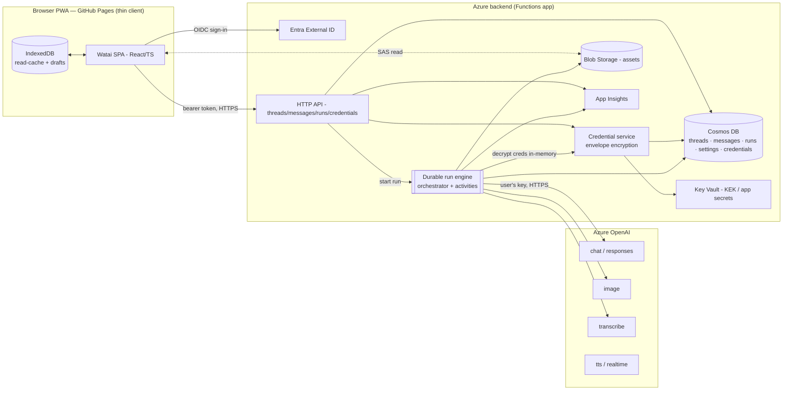

# 02 — Technical Architecture & Security (server-authoritative)

> **Direction change (2026).** Watai pivoted from a BYO-key, client-side app to a
> **server-authoritative** one. Credentials are stored **encrypted on the server** and
> synced across devices; **generation runs server-side** and completes independently of
> the client. The previous design is archived at
> [archive/02-architecture-v1-byo-client.md](archive/02-architecture-v1-byo-client.md).
> The detailed build + migration spec is
> [06-server-runs-and-migration.md](06-server-runs-and-migration.md).

Cross-references: [README.md](README.md) · [01-product-spec.md](01-product-spec.md) ·
[03-api-integration.md](03-api-integration.md) · [04-data-model.md](04-data-model.md) ·
[06-server-runs-and-migration.md](06-server-runs-and-migration.md).

---

## 1. The defining requirement

> Once a prompt is submitted, the response must be **generated and persisted by the
> server in the correct chat structure regardless of the client**. The user can lock the
> phone, background the app, close the tab, or switch networks, and on returning find the
> completed message in place.

A browser tab cannot satisfy this: long generations (notably image generation) are bound
to the page, and mobile OSes freeze/kill backgrounded or locked pages and their in-flight
`fetch`es. The only way to make generation client-independent is to run it on a process
the client does not own — **the server** — which in turn requires the server to hold the
Azure OpenAI (and Tavily) credentials. We therefore move credentials server-side, stored
**encrypted**, **never returned to any client**, and **synced** so any of a user's devices
can start runs.

---

## 2. System model

Watai is still two planes, but the trust boundary moved: **both planes are now
server-owned**, and the browser is a **thin client** that authenticates, submits prompts,
and renders state pulled from the server.

- **Generation plane (new, server-side).** A durable server worker owns the agent loop:
  it decrypts the user's credentials in memory, calls Azure OpenAI, executes tools, and
  writes the assistant message into the conversation store as it streams. It survives
  client disconnects.
- **Persistence plane (existing).** Threads, messages, assets, settings, invites, and now
  **encrypted credentials** and **run records** — all gated by the user's authenticated
  identity, partitioned per user in Cosmos.

The browser holds **no secrets** and performs **no generation** (one nuance: live voice
mode, §8). Its IndexedDB is now only an offline read-cache + draft store.



---

## 3. Components

### 3.1 Frontend (thin client) — unchanged hosting, reduced responsibility
- **Hosting:** still a static PWA on **GitHub Pages** (build → `docs/`). No server runtime
  on the client side; nothing about hosting changes.
- **Responsibilities now:** auth (Entra External ID), submit prompts (`POST …/runs`),
  render threads/messages pulled via the sync engine, show live run progress (poll or
  SSE), manage drafts/attachments, and the settings UI (which now writes credentials to
  the server, **write-only**).
- **Removed/retired:** `src/ai/*` generation code, the local key store
  (`src/data/secureStore.ts`), and the client `runStore` agent loop migrate server-side
  and are deleted from the client (see [06](06-server-runs-and-migration.md) §7). The
  exception is live voice (§8).

### 3.2 API compute — Azure Functions (Node 20, v4)
The existing HTTP API (threads, messages, settings, assets SAS, invites, me, thread-lock)
gains:
- `POST /threads/{id}/runs` — submit a prompt; persists the user message, creates a `Run`,
  and starts the durable orchestration. Returns `{ runId }` immediately.
- `GET /threads/{id}/runs/{runId}` and an optional `…/stream` (SSE) for live progress.
- `PUT/DELETE /credentials` and `GET /credentials/status` — write-only credential
  management (§4).

### 3.3 Durable run engine — Azure Durable Functions
The agent loop runs as a **Durable Functions orchestration** (checkpointed, survives host
restarts, supports long fan-out for tools and image generation). One orchestration per
run; activities wrap each side-effect (Azure OpenAI call, tool execution, Cosmos write,
Blob upload). The per-thread **run lock** (already built) becomes server-enforced here.
Full topology + state machine in [06](06-server-runs-and-migration.md) §3.

### 3.4 Credential service + Key Vault
Encrypts/decrypts the user's Azure OpenAI config+key and Tavily key using **envelope
encryption** (Key Vault KEK → per-record AES-GCM). Ciphertext lives in a Cosmos
`credentials` container; plaintext exists only transiently in the run worker's memory.
Detail + threat model in [06](06-server-runs-and-migration.md) §2.

### 3.5 Data stores
- **Cosmos DB** (serverless, partition `/userId`): `threads`, `messages`, `settings`,
  `invites`, **`runs`** (new), **`credentials`** (new, ciphertext only).
- **Blob Storage:** generated images + uploaded attachments (unchanged; written by the run
  worker now, read by the client via short-lived read SAS).
- **Key Vault:** the master key-encryption-key (KEK) + app secrets. Never exposes the KEK
  to the client.

---

## 4. Credentials: server-stored, synced, never returned

Principles (full spec in [06](06-server-runs-and-migration.md) §2):

1. **Write-only from the client.** `PUT /credentials` accepts the Azure OpenAI base URL,
   model/deployment names, and the raw key (over TLS). The key is **immediately encrypted**
   and the plaintext is never persisted, logged, or returned.
2. **Encrypted at rest (envelope).** AES-256-GCM with a per-record data key wrapped by a
   Key Vault KEK. Ciphertext + IV + tag + key-version in Cosmos.
3. **Read-back is metadata only.** `GET /credentials/status` returns
   `{ configured, baseUrl, models, keyHint: "…last4", tavilyConfigured }` — **never** the
   secret. The UI shows "configured" + a masked hint.
4. **Synced by identity.** Because credentials are server-side and per-user, every device
   the user signs into can start runs immediately — no re-entry, no local copy.
5. **Used only in the run worker.** Decryption happens inside the orchestration activity
   that needs it, for that user's own runs only; the value is zeroed after use and never
   crosses a process or log boundary.

---

## 5. Request lifecycle (send → generate → store → view)

```mermaid
sequenceDiagram
    participant U as Browser (any device)
    participant API as Functions API
    participant DF as Durable orchestration
    participant V as Credential service
    participant AO as Azure OpenAI
    participant DB as Cosmos / Blob

    U->>API: POST /threads/{id}/runs { text, attachments, tools }
    API->>DB: append user message; create Run(queued); acquire thread lock
    API->>DF: start orchestration(runId)
    API-->>U: 202 { runId }  (client may now close)
    DF->>V: decrypt credentials (in-memory)
    loop agent loop (checkpointed)
        DF->>AO: chat/responses/image call (user's key)
        AO-->>DF: tokens / tool calls / image bytes
        DF->>DB: upsert assistant message (incremental) + assets
    end
    DF->>DB: finalize message (complete|error); release lock; Run=done
    Note over U,DB: Later / on another device:
    U->>API: GET deltas (sync) — sees the finished message
```

The key property: **everything after the `202` is server-owned**. If the browser is gone,
the orchestration still runs to completion and Cosmos holds the result.

---

## 6. Live updates while the client is open

Source of truth is Cosmos; "live" is an optimization layered on top:

- **Baseline (MVP, consumption-plan friendly):** while a run is active for the open
  thread, the client polls `GET /threads/{id}/runs/{runId}` (or the message delta) every
  ~1 s and renders the evolving assistant message. Reconnect/replay is automatic because
  the state is in Cosmos.
- **Enhancement (optional):** a push channel for token-level smoothness — **Azure SignalR
  Service** or an SSE endpoint streaming from the orchestration's status. This is additive;
  the product is correct without it.

---

## 7. Hosting & deploy (unchanged shape)
- **Client:** static build to `docs/`, served by **GitHub Pages**; deploy on push to
  `master`.
- **Backend:** **Azure Functions** app (now hosting Durable Functions). Deploy via
  `func azure functionapp publish` (remote build). Key Vault, Cosmos, Blob, Entra, App
  Insights provisioned via Azure CLI/Bicep as before.

---

## 8. What stays on the client (the one nuance)
**Live voice / Realtime mode** is an inherently bidirectional, low-latency session between
the user's microphone/speakers and the model — it cannot be "fire and forget." It remains a
**client-held session**, but the credential never ships to the browser: the server mints a
**short-lived ephemeral key/token** (`POST /credentials/realtime-token`) scoped to the
realtime endpoint, and the client opens the realtime socket with that. Text and image
generation are fully server-authoritative; only the live-voice transport is client-side.

---

## 9. Security model (overview)

| Concern | Control |
| --- | --- |
| Secret at rest | Envelope encryption (Key Vault KEK + AES-256-GCM); ciphertext-only in Cosmos. |
| Secret in transit | TLS only; key sent once on `PUT /credentials`, never echoed back. |
| Secret exposure | Plaintext exists only in the run activity's memory; never logged, exported, or returned; redacted from errors/telemetry. |
| AuthN | Entra External ID bearer token on every API call (existing). |
| AuthZ / isolation | Cosmos partitioned by `/userId`; a run uses only its owner's credentials and data. |
| Abuse / quota | A compromised account can spend only **its own** Azure quota (its own key). Per-user run concurrency (thread lock) + run-rate limits cap damage. |
| Destructive tools | No interactive confirmation server-side → destructive tools (delete thread, change settings) are **disabled in autonomous runs** unless explicitly pre-authorized in the run request ([06](06-server-runs-and-migration.md) §4). |
| Untrusted output | Markdown sanitized; SVG/HTML previews sandboxed (already shipped). |

Threat model, key-rotation, and the destructive-tool policy are detailed in
[06-server-runs-and-migration.md](06-server-runs-and-migration.md) §2 and §4.

---

## 10. What this changes vs. v1 (delta summary)

| Aspect | v1 (archived) | Now |
| --- | --- | --- |
| Credentials | Browser only (IndexedDB) | Server, encrypted, synced; write-only to client |
| Generation | In the browser tab | Server-side Durable Functions |
| Survives client close | No | **Yes** |
| Client `src/ai/*` | Owns the agent loop | Ported to `api/`; client renders only |
| Backend role | Persistence only | Persistence **+ generation + credential vault** |
| Hosting | Pages + Functions | Pages + Functions (Durable) — unchanged shape |
| Live voice | Client, BYO key | Client session via server-minted ephemeral token |
