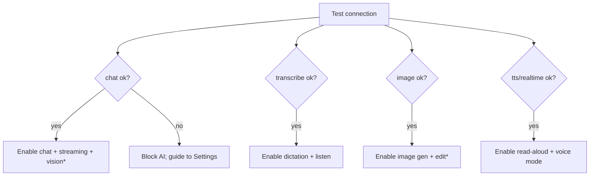

# 03 — Azure OpenAI API Integration

This document specifies how Watai talks to Azure OpenAI: shared HTTP conventions, the
chat model (`gpt-5.4`), transcription (`gpt-4o-transcribe`), image generation
(`gpt-image-2`), and the voice-output gap (TTS / Realtime). All model names are treated
as **deployment names** the user configures (D10), not hard-coded model strings.

> This spec is aligned to the user's real Azure endpoint (see
> [azure-api-detail/azure-api-detail.md](azure-api-detail/azure-api-detail.md)), which
> exposes the **OpenAI-compatible `/openai/v1` surface**: `Authorization: Bearer <key>`,
> the **model name in the request body** (not in the URL path), and **no `api-version`
> query parameter**. The base URL is **user-configurable and never hardcoded**. Where a
> capability is uncertain (image editing, realtime, streaming transcription), the app
> capability-detects and degrades gracefully.

Cross-references: [02-architecture.md](02-architecture.md) ·
[01-product-spec.md](01-product-spec.md) · [04-data-model.md](04-data-model.md).

---

## 1. Shared conventions

### 1.1 Endpoint shape

All requests target the user's configured base URL (the `/openai/v1` surface) and carry
the **model name in the body**. The base URL is provided by the user and never
hardcoded:

```
<base-url>/chat/completions          // e.g. https://<resource>.services.ai.azure.com/openai/v1/chat/completions
<base-url>/responses
<base-url>/audio/transcriptions
<base-url>/audio/speech              // voice output — pending D4
<base-url>/images/generations
<base-url>/images/edits
```

- `<base-url>` (e.g. `https://<resource>.services.ai.azure.com/openai/v1`) and the API
  key come from the user's BYO config (see [04-data-model.md](04-data-model.md)
  `ApiConfig`).
- The **model** (`gpt-5.4`, `gpt-4o-transcribe`, `gpt-image-2`, and a TTS model) is sent
  in the request body / form field — not in the URL path.

### 1.2 Authentication

- Header `Authorization: Bearer <user key>` (the `/openai/v1` surface uses bearer
  tokens, matching the OpenAI client convention). A Microsoft Entra token may be used
  instead for identity-based access (advanced); the default is the user's API key.
- The key is read from client storage at call time and never logged (see security in
  [02-architecture.md](02-architecture.md) §6).

### 1.3 Common headers

- `Authorization: Bearer <key>` on every request.
- `Content-Type: application/json` (or `multipart/form-data` for audio/image upload).

### 1.4 HTTP layer (client)

A single shared layer wraps every capability client:

- **AbortController** on every request; the composer "stop" aborts streams.
- **Timeouts** per capability (chat long/streamed; image longer; transcription bounded).
- **Retries** only for idempotent failures (network error, 5xx, 429) with exponential
  backoff + jitter, honoring `Retry-After`. Never auto-retry a non-idempotent mutation
  more than once without user intent.
- **Idempotency** via client request ids where supported.
- **No secret logging**; errors are normalized (see §6) before surfacing/telemetry.

```ts
// Illustrative interface — not final code.
interface AoaiClientConfig {
  baseUrl: string;           // user-provided, e.g. https://<resource>.services.ai.azure.com/openai/v1
  apiKey: () => string;      // lazy read from secure store; never cached in logs
  models: {
    chat: string;            // gpt-5.4
    transcribe: string;      // gpt-4o-transcribe
    image: string;           // gpt-image-2
    tts?: string;            // voice output — pending D4
  };
  baseUrlOverride?: string;  // injected when proxy fallback (Option B1) is active
}
```

---

## 2. Chat — `gpt-5.4`

Powers text conversations (and the text turn inside voice mode).

### 2.1 API surface choice

Both surfaces are available on the `/openai/v1` endpoint (confirmed in the API detail
file):

- **Chat Completions** (`<base-url>/chat/completions`) — simple message array; default.
- **Responses API** (`<base-url>/responses`) — newer, better for tool use, structured
  output, and multi-step state; uses an `input` field and returns `response.output[...]`.

**Decision:** abstract chat behind an internal `ChatClient` interface and start with
**Chat Completions** for breadth; allow switching to the Responses API via config when
its features are needed. Feature code never depends on the raw surface.

### 2.2 Request (Chat Completions shape)

```jsonc
POST <base-url>/chat/completions
Authorization: Bearer <key>
{
  "model": "gpt-5.4",
  "messages": [
    { "role": "system", "content": "<system / developer instructions>" },
    { "role": "user", "content": "<text>" }
    // vision: content may be an array of text + image_url parts
  ],
  "max_completion_tokens": 4096,
  "reasoning_effort": "medium",   // gpt-5.4 is a reasoning model: minimal | low | medium | high
  "stream": true,
  "tools": [ /* optional function/tool defs */ ],
  "response_format": { "type": "text" }   // or json_schema / json_object when needed
}
```

- **System/developer prompt:** assembled from app defaults + the user's custom
  instructions and memory (see [01-product-spec.md](01-product-spec.md) §5.10
  Personalization). Kept server-of-record on the client; sent each request.
- **Vision input:** when the user attaches images and the deployment supports vision,
  user content becomes a parts array (text + `image_url` with base64 data URLs or SAS
  URLs). If the deployment lacks vision, the composer warns and strips the attachment
  (see attachments in product spec §5.11).
- **Parameters:** `max_completion_tokens` and `reasoning_effort`
  (`minimal | low | medium | high`) are the primary controls for `gpt-5.4` (a reasoning
  model). `temperature` / `top_p` may be unsupported on reasoning models — the client
  capability-detects and only sends what the model accepts. Surfaced in Settings →
  Models as advanced defaults with per-message overrides on Regenerate.
- **Tools / JSON mode:** wired in the client for future features (e.g. structured image
  prompts); not user-exposed in v1 beyond internal use.

### 2.3 Streaming response

With `stream: true`, the response is server-sent events; each chunk carries an
incremental `delta` (token text and/or tool-call fragments), terminated by a final
done marker. The client:

1. Reads the `ReadableStream`, splits on SSE event boundaries.
2. Accumulates `delta.content` into the live message (UI §5.4.1).
3. Handles tool-call deltas if tools are enabled.
4. Captures `finish_reason` (stop / length / content_filter / tool_calls) and any usage
   totals provided at the end.
5. On abort, keeps the partial text and marks the message interrupted.

### 2.4 Context & token management

- **Context window:** track approximate token usage; when approaching the deployment's
  limit, apply a truncation/summarization strategy (drop oldest turns, or summarize
  older context into a compact system note). Strategy is configurable; default is
  oldest-first trimming with a preserved system prompt and the most recent N turns.
- **Token accounting:** maintain a running estimate per thread for the advanced
  usage/cost display; reconcile with server-reported usage when present.
- **Titles:** after the first user+assistant exchange, request a short title via a
  small, cheap chat call (or reuse the same deployment with a tight max_tokens).

### 2.5 Errors

Mapped via the shared taxonomy (§6): 401/403 → key/permission; 404 → deployment name;
429 → rate limit (+`Retry-After`); 400 content filter → policy; 5xx → retry.

---

## 3. Transcription — `gpt-4o-transcribe`

Powers composer **dictation** and the listening leg of **voice mode**.

### 3.1 Audio capture

- Capture with `MediaRecorder`; prefer a widely supported container/codec
  (e.g. WebM/Opus) and transcode/validate as needed for the API's accepted formats.
- Provide a live **waveform/amplitude** visualization (Web Audio `AnalyserNode`).
- **Voice activity detection (VAD):** detect silence to auto-stop dictation and to drive
  turn-taking in voice mode; expose sensitivity in Settings → Voice.
- **Push-to-talk vs continuous:** dictation = press-and-hold or tap-to-toggle;
  voice mode = continuous with VAD turn-taking.

### 3.2 Request

```
POST <base-url>/audio/transcriptions
Authorization: Bearer <key>
Content-Type: multipart/form-data

model=gpt-4o-transcribe         // model in the form body
file=<audio blob>
response_format=json            // or text; verbose/segments if supported
language=<optional ISO code>    // omit to auto-detect
prompt=<optional biasing text>  // domain terms, names, formatting hints
temperature=0                   // optional
```

- **Streaming/partial transcription:** if the configured version supports streaming
  transcription, surface interim text live for responsiveness; otherwise transcribe per
  utterance on stop. The client capability-detects and degrades.
- **Chunking:** for long dictation, segment audio on VAD boundaries and stitch results.

### 3.3 Response handling

- Insert final transcript at the composer caret (dictation), or feed it straight to the
  chat turn (voice mode).
- Preserve user edits; never overwrite text the user typed during transcription.
- Optionally retain the audio blob as a message attachment in Blob Storage (user/Data
  controls govern retention; temporary chats never persist audio).

### 3.4 Errors

Unsupported format → transcode/retry or clear message; 413 too large → chunk; 429 →
backoff; permission/key → Settings link.

---

## 4. Image generation — `gpt-image-2`

Powers inline image creation, the viewer, variations, and (if supported) edits.

### 4.1 Generate

```jsonc
POST <base-url>/images/generations
Authorization: Bearer <key>
{
  "model": "gpt-image-2",
  "prompt": "<text prompt>",
  "size": "1024x1024",          // and other supported sizes / aspect ratios
  "n": 1,                        // batch count (UI may cap)
  "output_format": "png",       // png | jpeg | webp
  "output_compression": 100      // 0–100 (for lossy formats)
}
// Response: { "data": [ { "b64_json": "<base64 image>" } ] }
```

- Triggered by an explicit "create an image" intent or a user request the chat layer
  routes to image generation (v1: explicit entry point + detected intent prompt).
- Size/quality/n exposed minimally in the generation UI; defaults are sensible.

### 4.2 Edit / variation / inpainting (capability-gated)

If `gpt-image-2` supports editing on the target version:

```
POST <base-url>/images/edits
Authorization: Bearer <key>
Content-Type: multipart/form-data
model=gpt-image-2
image=<source>            // and optional mask=<png with transparency> for inpainting
prompt=<edit instruction>
size=...
```

- **Variations:** regenerate from the same prompt/seed for alternates.
- **Edit / inpainting:** "use as input" from the viewer (product spec §5.8) supplies the
  source; a mask enables region edits if supported.
- The client capability-detects edit support and hides the affordance when unavailable.

### 4.3 Display & storage

- The generation endpoint returns `data[0].b64_json`; render it directly (data URL),
  then persist to Blob Storage (via SAS) for cross-device access, storing the prompt +
  parameters as provenance (data model §image).
- Discard the base64 from memory after upload to bound memory use.
- The viewer shows prompt/size/timestamp and supports save/share/regenerate/variations.

### 4.4 `response_format` decision

Prefer **`b64_json`** so the image is available immediately and we control persistence
(avoids dependence on short-lived URLs and cross-origin fetch quirks). Trade-off: larger
responses; mitigate by not retaining base64 in memory after upload.

### 4.5 Safety & moderation

- Generation may be refused or filtered by policy; surface a clear, non-judgmental
  message and let the user revise the prompt (product spec §5.14 content filtered).
- Respect any returned revised-prompt field for transparency.

---

## 5. Voice output (TTS / Realtime) — OPEN (D4)

The seed names a transcription model but **no** model for the assistant's *spoken*
reply. "Talk with AI" implies voice output. Two paths:

### 5.1 Path 1 — Text-to-speech (read-aloud + simple voice mode)

```jsonc
POST <base-url>/audio/speech
Authorization: Bearer <key>
{ "model": "<tts-model>", "input": "<assistant text>", "voice": "<voice id>", "response_format": "mp3" }
```

- Add a TTS deployment (e.g. a `gpt-4o-mini-tts`-class model). The chat reply text is
  synthesized and played; voice selection/speed in Settings → Voice.
- **Pros:** simple; reuses the existing STT→chat pipeline; good enough for read-aloud and
  a serviceable turn-based voice mode.
- **Cons:** higher end-to-end latency than realtime; barge-in/interruption is
  approximate (monitor mic and stop playback).

### 5.2 Path 2 — Realtime API (true full-duplex voice mode)

- A realtime, low-latency speech-to-speech session (WebRTC or WebSocket) for natural
  turn-taking and barge-in.
- **Pros:** best conversational feel; native interruption; lower perceived latency.
- **Cons:** more complex; needs ephemeral credentials/session minting (ideally a tiny
  backend endpoint to mint short-lived session tokens so the long-lived key isn't
  exposed to the realtime channel); additional cost and capability verification.

### 5.3 Recommendation

- **v1:** implement **Path 1 (TTS)** for read-aloud and a turn-based voice mode — lowest
  risk, fully covers the spoken-reply gap.
- **v1.x / evaluate:** prototype **Path 2 (Realtime)** behind a flag for the premium
  voice experience; promote if latency/quality and credential handling meet the bar
  (O3). If Realtime is adopted, the session-token minting endpoint is the only AI-plane
  reason to add backend involvement.

Until D4 is confirmed, the voice-mode UI (product spec §5.7) is fully specified and the
only blocker is choosing the output engine and (for Path 2) the deployment.

---

## 6. Unified error taxonomy

All capability clients normalize failures to a single shape consumed by the UI
(product spec §5.14):

| Normalized code | HTTP / cause | UI treatment | Retry? |
| --- | --- | --- | --- |
| `offline` | No network | Offline banner; gate AI actions. | On reconnect |
| `unauthorized` | 401 | "Check your API key" → Settings → Models. | No |
| `forbidden` | 403 | Permission/quota issue → Settings. | No |
| `deployment_not_found` | 404 | Name the missing deployment → fix in Settings. | No |
| `rate_limited` | 429 | Countdown from `Retry-After`. | Auto (backoff) |
| `content_filtered` | 400 policy | Explain block; offer prompt edit. | No |
| `bad_request` | 400 other | Developer-facing detail in advanced mode. | No |
| `server_error` | 5xx | Inline retry affordance. | Auto (backoff) |
| `timeout` | Client timeout | Retry affordance. | Auto (idempotent only) |
| `aborted` | User stop | Keep partial; no error UI. | n/a |
| `unsupported_capability` | Feature/version gap | Hide/disable affordance with note. | No |

The error object carries: `code`, a user-safe `message`, an optional `detail` (advanced
mode only), the offending `deployment`/`capability`, and `retryAfterMs` when applicable.
Secrets are never included.

---

## 7. Rate limiting, quotas, and cost

- Respect `429` + `Retry-After`; surface a calm countdown rather than hammering.
- Track per-capability usage locally for the advanced usage/cost view; reconcile with
  server-reported usage when present.
- Because each user pays for their own Azure usage (BYO-key), the app should make cost
  legible (token/image counts) and avoid wasteful retries.

---

## 8. Capability detection & graceful degradation

A startup/Settings "Test connection" runs minimal probes per deployment and records a
capability matrix (chat streaming, vision, transcription streaming, image edit, tts /
realtime). The UI reads this matrix to enable/disable affordances (vision attach,
image edit, voice-mode engine), so a user with a limited configuration still gets a
coherent experience.



`*` vision and image-edit affordances depend on the probed capability, not just
endpoint reachability.

---

## 9. Integration acceptance criteria

1. A configured chat deployment streams a markdown answer end-to-end in the browser,
   cancellable mid-stream with the partial preserved.
2. Dictation transcribes a spoken phrase into the composer; voice mode completes a full
   STT → chat → (TTS, pending D4) loop and writes turns back to the thread.
3. An image prompt returns an image that renders inline, persists to Blob, and opens in
   the viewer with provenance; variations work; edit works where supported.
4. Every failure path renders the correct normalized error with no key leakage.
5. The capability matrix correctly enables/disables vision, image-edit, and voice-output
   affordances per the probed configuration.
6. CORS + streaming are verified directly, or the proxy fallback (Option B1) is engaged
   per [02-architecture.md](02-architecture.md) §3.
