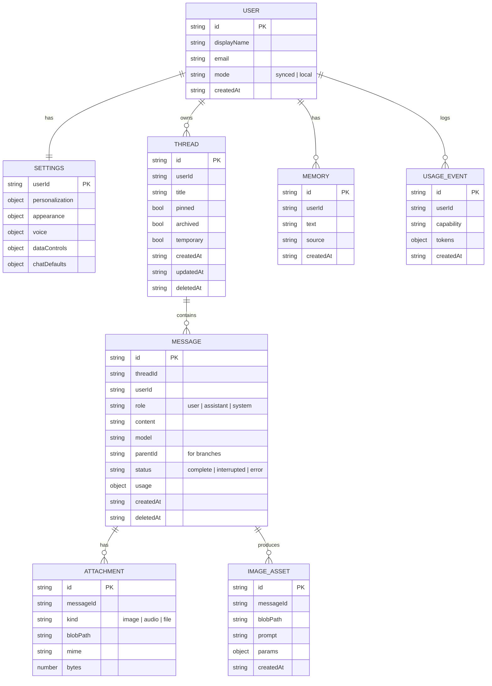
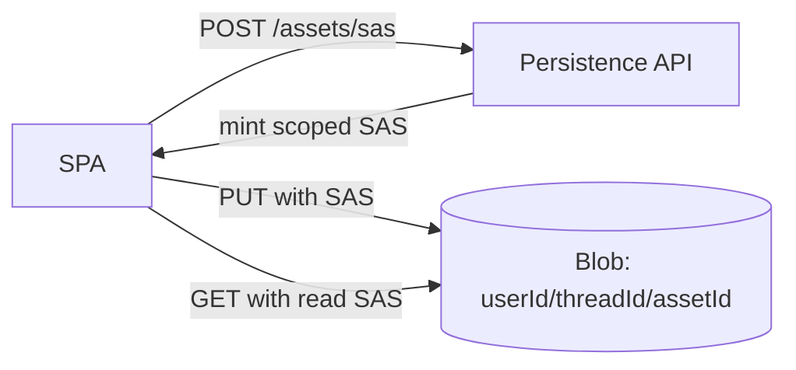
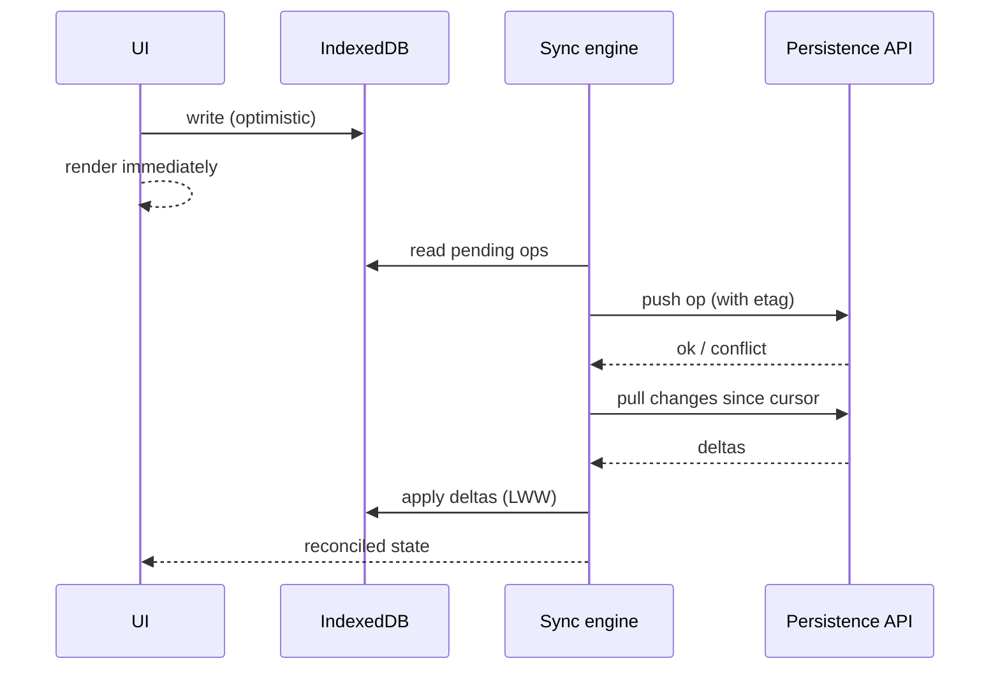
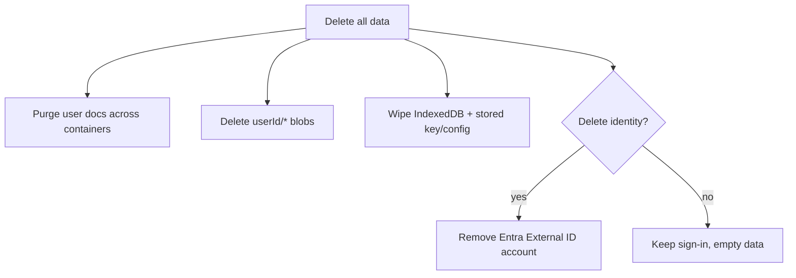

# 04 — Data Model & Storage

This document defines Watai's data: the entities, the Cosmos DB document schema, the
Blob Storage layout, the client-side cache, the sync strategy between device and cloud,
and the full data lifecycle (export, retention, deletion). It implements the persistence
plane from [02-architecture.md](02-architecture.md).

Cross-references: [02-architecture.md](02-architecture.md) ·
[01-product-spec.md](01-product-spec.md) · [03-api-integration.md](03-api-integration.md).

---

## 1. Entity overview



### 1.1 Entity notes

- **User** — created on first sign-in (synced) or generated locally (`local` mode, D9).
  In synced mode, `id` derives from the Entra External ID subject claim.
- **Settings** — one document per user; holds personalization (custom instructions),
  appearance, voice, data controls, and chat defaults (temperature, max tokens, system
  prompt). See product spec §5.10.
- **Thread** — a conversation; soft-deleted via `deletedAt`; `temporary` threads are
  never persisted to the cloud (local only, ephemeral).
- **Message** — a turn; `parentId` enables branching when a user edits-and-resends
  (product spec §5.4.2). `content` stores rendered text; large binary lives in Blob via
  Attachment/ImageAsset. `usage` holds token counts when known.
- **Attachment** — user-supplied inputs (images for vision, audio for transcription) or
  retained audio; the bytes live in Blob, the row holds metadata + path.
- **ImageAsset** — a generated image with its prompt and parameters (provenance for the
  viewer/gallery, product spec §5.8).
- **Memory** — optional long-term personalization facts (if memory is enabled);
  user-viewable and erasable (product spec §5.10 Personalization).
- **UsageEvent** — optional, privacy-preserving local/usage accounting; no content.

### 1.2 Critical privacy boundary

> The user's **Azure OpenAI API key is NOT an entity here.** It is never stored in
> Cosmos, Blob, Key Vault, or any server resource. It lives only in client storage
> (§4). This is the central invariant from [02-architecture.md](02-architecture.md) §6.

---

## 2. Cosmos DB schema

### 2.1 Account & strategy

- **API:** Cosmos DB for NoSQL, **serverless** (scales to zero, pay-per-request) to suit
  bursty personal usage and keep idle cost near zero.
- **Database:** `watai`.
- **Consistency:** Session consistency (good default for per-user read-your-writes).

### 2.2 Containers & partitioning

Partition strategy is **user-centric**: every container partitions by `userId` (or a
synthetic `pk` that begins with the user id), so all of a user's data colocates and
queries are single-partition and cheap. Threads can be large, so messages live in their
own container to keep thread documents small and lists fast.

| Container | Partition key | Document(s) | Notes |
| --- | --- | --- | --- |
| `users` | `/id` | User | One per user. |
| `settings` | `/userId` | Settings | One per user. |
| `threads` | `/userId` | Thread (metadata only) | Lists are single-partition per user. |
| `messages` | `/threadId` | Message, Attachment refs | Co-locate a thread's messages; thread fits one partition for typical sizes. |
| `assets` | `/userId` | ImageAsset metadata | Blob holds bytes; row holds provenance. |
| `memory` | `/userId` | Memory | Optional; small. |
| `usage` | `/userId` | UsageEvent | Optional; can TTL-expire. |

> Partitioning `messages` by `threadId` keeps a conversation's reads/writes in one
> logical partition (efficient append + scroll). A single, pathologically huge thread is
> bounded by Cosmos's logical-partition size limit; for v1 personal usage this is ample,
> and the execution plan notes archival/summarization as a post-v1 safeguard.

### 2.3 Indexing

- Default automatic indexing, **excluding** large free-text `content` from range
  indexes where not needed; include paths used by list/sort/filter (`updatedAt`,
  `pinned`, `archived`, `deletedAt`).
- For server-side search, either:
  - **Client-side index** (default): the SPA maintains a local full-text index over
    synced content (fast, private, no extra service), or
  - **Azure AI Search** (optional, post-v1) if cross-device server search at scale is
    needed.
  See product spec §5.6 and the search note in §6 below.

### 2.4 TTL & soft delete

- Soft delete uses `deletedAt`; a background job (or container TTL on a `_ttl` field set
  at delete time) purges soft-deleted documents after a grace window.
- `usage` and ephemeral docs may use container TTL to self-expire.

### 2.5 Document examples

```jsonc
// threads container — partition key /userId
{
  "id": "thr_01HZX...",
  "userId": "usr_abc",
  "title": "Trip planning",
  "pinned": false,
  "archived": false,
  "temporary": false,
  "messageCount": 12,
  "lastMessagePreview": "Here's a 3-day itinerary…",
  "createdAt": "2026-06-23T10:00:00Z",
  "updatedAt": "2026-06-23T10:12:00Z",
  "deletedAt": null,
  "_etag": "\"...\""        // used for optimistic concurrency
}
```

```jsonc
// messages container — partition key /threadId
{
  "id": "msg_01HZY...",
  "threadId": "thr_01HZX...",
  "userId": "usr_abc",
  "role": "assistant",
  "content": "Here's a 3-day itinerary…",
  "model": "gpt-5.4",
  "parentId": "msg_01HZX_user",
  "status": "complete",
  "attachments": [],
  "images": [ { "assetId": "img_01...", "blobPath": "usr_abc/thr_.../img_01.png" } ],
  "usage": { "promptTokens": 1320, "completionTokens": 280 },
  "createdAt": "2026-06-23T10:12:00Z",
  "deletedAt": null
}
```

---

## 3. Blob Storage layout

- **Account:** one Storage account; **private** containers only (no public access).
- **Container(s):** a single `media` container, or per-user containers; default is one
  `media` container with per-user path prefixes.
- **Path convention:** `{userId}/{threadId}/{assetId}.{ext}` for both generated images
  and retained audio/attachments.
- **Access:** the SPA never holds storage account keys. The persistence API mints
  **short-lived, least-privilege SAS** scoped to a specific blob/prefix for upload
  (write) or display (read) (`POST /assets/sas`, architecture §5.2).
- **Lifecycle:** lifecycle management rules can tier/expire old assets; deletion cascades
  with thread/message deletion (§7).
- **Content types:** images (`image/png`, etc.), audio (`audio/webm`/`mp3`); validated
  on upload; size-limited.



---

## 4. Client-side storage

The browser holds three categories of data; only the first is secret.

| Store | Mechanism | Contents | Secret? |
| --- | --- | --- | --- |
| **BYO key + ApiConfig** | IndexedDB (optionally Web Crypto-encrypted, O5) | Endpoint, api-version, deployment names, **API key** | **Yes** |
| **Offline cache** | IndexedDB | Synced threads/messages for offline reading; pending writes queue | No |
| **UI/session state** | localStorage / IndexedDB | Theme, last route, composer drafts, feature flags | No |

### 4.1 `ApiConfig` (client-only)

```ts
interface ApiConfig {
  endpoint: string;          // https://<resource>.openai.azure.com
  apiVersion: string;
  deployments: {
    chat: string;            // gpt-5.4
    transcribe: string;      // gpt-4o-transcribe
    image: string;           // gpt-image-2
    tts?: string;            // voice output — pending D4
  };
  // apiKey stored separately, ideally encrypted, never exported with config
}
```

- The **key is stored separately** from the rest of the config so the config can be
  exported/imported for multi-device setup **without** the secret (product spec §5.3).
- If at-rest encryption (O5) is enabled, the key is wrapped with an AES-GCM key derived
  from the user's passphrase; the passphrase is never stored.

### 4.2 Local-only mode (D9)

In account-optional mode, **all** entities (threads, messages, assets metadata) live in
IndexedDB and never sync. Assets are stored as blobs in IndexedDB rather than Azure
Blob. Signing in later offers a one-time **merge/upload** of local data.

---

## 5. Sync strategy

Synced mode keeps the device and Cosmos in agreement with an **optimistic, offline-first**
model.

### 5.1 Principles

1. **Local writes are instant.** Every create/edit/delete is applied to IndexedDB
   immediately and reflected in the UI (optimistic).
2. **Background reconciliation.** A sync engine pushes pending local mutations to the
   persistence API and pulls remote changes since a stored cursor.
3. **Single source of truth is the server** in synced mode; the local cache is a
   replica + write buffer.

### 5.2 Mechanics

- **Change tracking:** each mutation enqueues an operation (op log) with a client id and
  timestamp. Successful push dequeues it.
- **Pull cursor:** the API supports `GET /threads?since=<cursor>` style delta pulls
  (architecture §5.2). The client stores the latest cursor.
- **Concurrency:** Cosmos `_etag` enables optimistic concurrency on updates; the API
  rejects stale writes with a conflict the client reconciles.
- **Conflict resolution (O2):** default **last-write-wins** by `updatedAt` for thread
  metadata and message edits, because conversations are largely append-only and
  single-user-multi-device. Appends rarely conflict (new ids); metadata conflicts
  (rename/pin) resolve LWW. Advanced users may see a subtle note when a remote change
  overwrote a local one. True field-level merge is out of scope for v1.
- **Assets:** images/audio upload to Blob via SAS first; the message/asset row
  references the resulting `blobPath`. Upload retries are idempotent (stable asset id).

### 5.3 Failure & offline behavior

- Offline: reads served from cache; mutations queued; AI actions gated (product spec
  §5.14). On reconnect, the op log flushes in order with backoff.
- Partial failures: per-op retry; poison ops surface a non-blocking diagnostic in
  advanced mode rather than blocking the queue.



---

## 6. Search

- **Default (v1):** client-side full-text index built over synced content (titles +
  message text) in IndexedDB; instant, private, no extra Azure cost. Re-indexed
  incrementally as sync applies changes (product spec §5.6).
- **Optional (post-v1):** Azure AI Search for server-side, cross-device search at scale,
  if the client index becomes insufficient. Indexing would exclude secrets and respect
  deletions.

---

## 7. Data lifecycle

### 7.1 Retention (O4)

- User-controlled in Settings → Data controls: keep-forever (default) or auto-expire
  threads after a chosen age (drives a TTL/cleanup job).
- Temporary chats: never persisted; discarded on close.
- Audio attachments: retained only if the user opts in; otherwise discarded after
  transcription.

### 7.2 Export

- `POST /export` produces a complete archive (JSON of threads/messages/settings + image
  files or links). Local-only mode exports straight from IndexedDB. Matches product spec
  §5.10 Data controls.

### 7.3 Deletion (GDPR-style)

- **Single thread:** soft-delete (`deletedAt`) with undo; hard-purge after grace window,
  cascading to its messages, attachments, and blobs.
- **Delete all data:** `DELETE /me/data` cascades across `threads`, `messages`,
  `assets`, `memory`, `usage`, and deletes the user's Blob prefix; optionally deletes the
  account/identity. Local cache and stored key/config are wiped on the device too.
- **Sign out of device:** wipes the local key, config, and cache without touching cloud
  data.



---

## 8. Validation & integrity

- **Server-side schema validation** on every write (architecture §6.3); reject unknown
  fields and oversized payloads.
- **Ownership checks:** the API derives `userId` from the token and verifies every
  thread/message/asset belongs to that user (prevents IDOR).
- **Referential integrity:** messages reference existing threads; assets reference
  existing messages; orphan cleanup runs with deletion jobs.
- **Idempotency:** client-generated ids (UL/UUID) make retries safe for appends and
  uploads.

---

## 9. Data model acceptance criteria

1. A thread and its messages round-trip device → Cosmos → another device with correct
   ordering, titles, and metadata.
2. A generated image persists to Blob via scoped SAS and re-displays from another device
   with its prompt/provenance intact.
3. Offline edits queue locally and reconcile on reconnect with last-write-wins, no data
   loss on appends.
4. The BYO key never appears in any Cosmos document, Blob, log, or export.
5. "Delete all data" removes every Cosmos document, every blob under the user's prefix,
   and the local key/config/cache.
6. Local-only mode stores and retrieves full conversations with no network calls to the
   persistence plane, and can merge-upload on later sign-in.

Build sequencing and the evals that prove these are in
[05-execution-plan.md](05-execution-plan.md).
