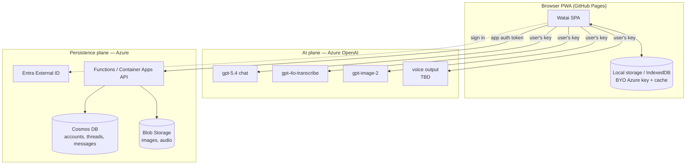

# Watai — Project Plan & Documentation

Watai is a web application for chatting and talking with AI, powered exclusively by
Azure OpenAI custom deployments. It mirrors the experience of the ChatGPT iOS app in
look, feel, information architecture, and interaction patterns, while running as an
installable progressive web app hosted on GitHub Pages.

This folder is the single source of truth for what we are building and how we will
build it. It elaborates the original [seed specification](seed-spec.md) into an
exhaustive, buildable plan.

---

## 1. Document map

| Doc | Purpose |
| --- | --- |
| [seed-spec.md](seed-spec.md) | The original seed. Immutable source of intent. |
| [README.md](README.md) | This file. Vision, scope, glossary, decisions, doc index. |
| [01-product-spec.md](01-product-spec.md) | Exhaustive product, UX, UI, IA, navigation, and screen-by-screen specification. |
| [02-architecture.md](02-architecture.md) | System architecture, hosting, Azure services, security, key management, IaC. |
| [03-api-integration.md](03-api-integration.md) | Azure OpenAI integration for chat, transcription, image generation, and voice output. |
| [04-data-model.md](04-data-model.md) | Entities, Cosmos DB schema, Blob layout, local cache, sync strategy, data lifecycle. |
| [05-execution-plan.md](05-execution-plan.md) | Phased roadmap, milestones, testing strategy, CI/CD, risks, decisions log, DoD. |

> Read the docs in order on first pass. After that, each doc is self-contained and
> cross-links the others where concerns overlap.

---

## 2. Vision

> A web app that feels indistinguishable from a first-party AI assistant on mobile —
> fast, calm, and conversational — but is fully owned by us, backed by our own Azure
> deployments, and free of vendor lock-in beyond Azure itself.

Watai gives a user three core capabilities, each backed by a dedicated Azure OpenAI
deployment:

1. **Chat** — streaming text conversations with a large language model (`gpt-5.4`).
2. **Talk** — speak to the assistant; speech is transcribed (`gpt-4o-transcribe`) and,
   optionally, the assistant talks back (voice output — see the
   [open decision on TTS](#7-key-decisions--open-questions)).
3. **Create images** — generate and edit images inline in a conversation
   (`gpt-image-2`).

The product bar is set by the ChatGPT iOS app. We match its information architecture,
navigation model, motion, and interaction grammar. We do **not** copy proprietary
assets (logos, icons, illustrations, copy strings); we re-implement the *patterns* with
original assets and our own visual tokens.

---

## 3. Goals and non-goals

### 3.1 Goals (v1)

- A mobile-first PWA that is installable and works offline for reading history.
- Pixel-calm, native-feeling chat UI with streaming responses and markdown rendering.
- Voice dictation into the composer, and a full-screen voice conversation mode.
- Inline image generation with a per-conversation gallery.
- Per-user accounts with chat history and images synced to Azure.
- Bring-your-own-key (BYO-key) model: each user supplies their own Azure OpenAI
  configuration, stored client-side.
- Infrastructure provisioned and operated through Azure CLI / Bicep automation.
- Light/dark theming, accessibility to WCAG 2.2 AA, and full keyboard support on desktop.

### 3.2 Non-goals (v1)

- No marketplace of custom assistants ("GPTs"), plugins, or third-party tool ecosystem.
- No multi-modal *video* input/output.
- No team/organization administration, billing, or seat management.
- No native iOS/Android app store builds (PWA only).
- No model fine-tuning or training UI.
- No real-time multi-user collaboration on a single thread.

These may return as post-v1 epics; see [05-execution-plan.md](05-execution-plan.md).

---

## 4. Personas

| Persona | Description | Primary needs |
| --- | --- | --- |
| **Personal power user** | Owns an Azure OpenAI resource, wants a polished private ChatGPT alternative. | Fast chat, voice, image gen, history sync, BYO-key. |
| **Tinkerer / developer** | Wants to point the app at their own deployments and experiment. | Configurable endpoints, model params, transparency, export. |
| **Privacy-conscious user** | Distrusts third-party hosting of secrets and content. | Local key storage, clear data controls, easy deletion/export. |

All three are reachable with one product because the architecture is BYO-key by
default. Persona-specific differences are mostly in Settings depth, not core flows.

---

## 5. High-level architecture (summary)

Watai is a **two-plane** system. The plane that talks to AI and the plane that stores
your data are intentionally separate, which keeps secrets on the client and keeps the
backend simple.

Full detail, including the direct-vs-proxy decision for the AI plane, is in
[02-architecture.md](02-architecture.md).

---

## 6. Success metrics

| Dimension | Target |
| --- | --- |
| Time to first token (chat) | < 1.5 s on broadband after send |
| App shell load (repeat visit, PWA) | < 1 s to interactive |
| Lighthouse PWA / Performance / A11y | >= 90 each |
| Voice dictation round-trip | < 2 s after stop for short utterances |
| Crash-free sessions | > 99.5% |
| History sync conflict rate | < 0.1% of writes |

These are validated continuously in CI and during the hardening phase (see
[05-execution-plan.md](05-execution-plan.md)).

---

## 7. Key decisions & open questions

The seed spec leaves several load-bearing questions implicit. Below are the decisions
we are proceeding with **by default**, each with rationale and the alternative. Items
marked **OPEN** materially change scope and should be confirmed.

| # | Topic | Default decision | Rationale | Status |
| --- | --- | --- | --- | --- |
| D1 | Tenancy | Multi-user app accounts + BYO Azure key per user. | Seed mentions "user account management" *and* "keys in local storage". | Assumed |
| D2 | AI key custody | Each user's Azure key lives only in their browser (local storage / IndexedDB). The backend never sees it. | Avoids a shared secret and central key-theft blast radius. | Assumed |
| D3 | AI call path | Browser calls Azure OpenAI **directly**; add a thin optional pass-through proxy only if CORS or streaming requires it. | Keeps backend simple; preserves BYO-key. | Assumed |
| D4 | Voice **output** (AI talking back) | **OPEN** — seed lists transcription but no TTS/realtime model. Default proposal: add a TTS deployment (e.g. `gpt-4o-mini-tts`) for read-aloud, and evaluate the Realtime API for true full-duplex voice mode. | "Talk with AI" implies voice out; the seed omits the model. | **OPEN** |
| D5 | Frontend stack | React + TypeScript + Vite, as an installable PWA. | Mature ecosystem for chat UIs, streaming, markdown, PWA tooling. | Assumed |
| D6 | Backend compute | Azure Functions (consumption) for the persistence API; revisit Container Apps if streaming proxy is needed. | Cheapest path to CRUD + auth-gated sync. | Assumed |
| D7 | Auth | Microsoft Entra External ID (formerly Azure AD B2C). | First-party, integrates with Azure, supports social + email. | Assumed |
| D8 | Persistence stores | Cosmos DB (serverless) for documents; Blob Storage for images/audio. | Low-ops, pay-per-use, scales to zero. | Assumed |
| D9 | Single-user "lite" mode | Provide a no-account local-only mode (history in IndexedDB) as a fallback. | Lets privacy users skip the backend entirely. | Assumed |
| D10 | Model identifiers | `gpt-5.4`, `gpt-4o-transcribe`, `gpt-image-2` are treated as **deployment names** the user configures, not hard-coded model strings. | Azure uses deployment names; future-proofs model swaps. | Assumed |

**Other open questions** (tracked in the decisions log in
[05-execution-plan.md](05-execution-plan.md)):

- O1: Custom domain for GitHub Pages, or default `*.github.io`? (Affects auth redirect URIs and CSP.)
- O2: Do we need cross-device real-time sync, or is last-write-wins on open acceptable?
- O3: Is the Realtime API in scope for v1 voice mode, or is dictation + read-aloud enough?
- O4: Retention policy and region for stored content (compliance/residency).
- O5: Whether to encrypt the BYO key at rest in the browser behind a user passphrase.

---

## 8. Glossary

| Term | Meaning |
| --- | --- |
| **BYO-key** | Bring-your-own-key. The user supplies their own Azure OpenAI credentials. |
| **AI plane** | The path from browser to Azure OpenAI deployments (chat, STT, image, TTS). |
| **Persistence plane** | The Azure backend that stores accounts, threads, messages, and assets. |
| **Thread / conversation** | An ordered sequence of messages with a title and metadata. |
| **Composer** | The message input bar (text, attachments, dictation, send). |
| **Voice mode** | Full-screen, hands-free spoken conversation surface. |
| **Dictation** | Speech-to-text into the composer (not full voice mode). |
| **Deployment name** | The Azure-specific alias for a model deployment, set by the user. |
| **IaC** | Infrastructure as Code (Bicep + Azure CLI automation). |
| **PWA** | Progressive Web App; installable, offline-capable web app. |
| **EDD** | Eval-driven development; see testing strategy in the execution plan. |

---

## 9. How to contribute to these docs

- The [seed spec](seed-spec.md) is immutable; it records original intent. Elaborations
  live in the numbered docs.
- Material decisions are recorded in the decisions log in
  [05-execution-plan.md](05-execution-plan.md) using a lightweight ADR format.
- Keep diagrams in Mermaid so they render in GitHub and VS Code without external tools.
- Prefer updating an existing doc over adding a new one; keep the document map above in sync.
