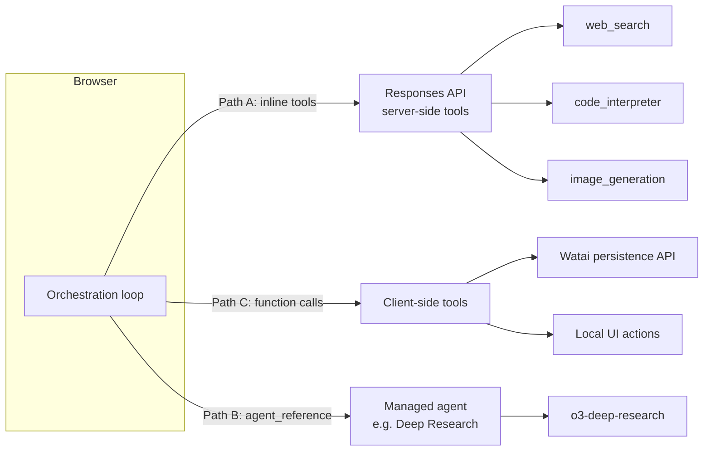
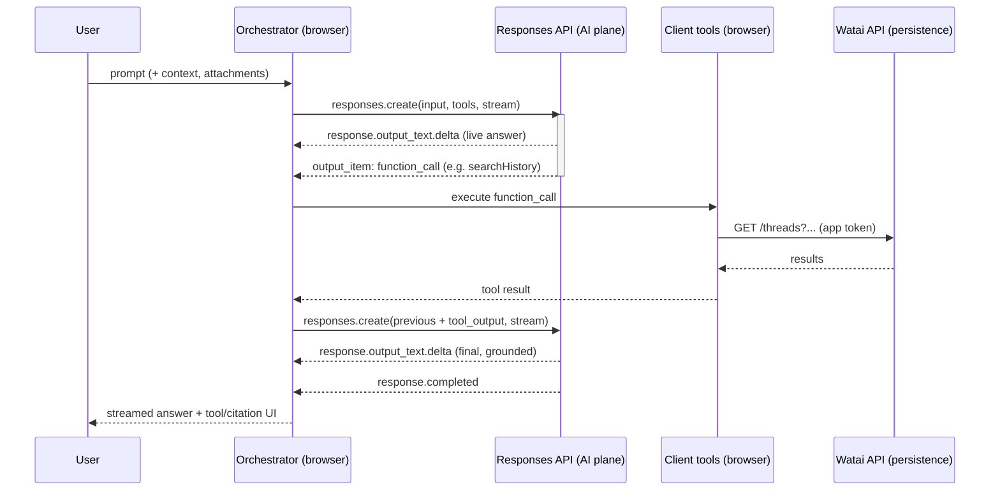

# 02 — Architecture & Adoption Paths

How Watai becomes agentic **without breaking its two-plane, BYO-key model**. This is the
load-bearing design document; the feature specs ([03](03-agentic-chat-and-tools.md)–[05](05-agentic-image-generation.md))
assume the decisions made here.

Cross-references: [../02-architecture.md](../02-architecture.md) (base architecture &
security invariants), [01-foundry-capabilities.md](01-foundry-capabilities.md) (what the
platform offers), [06-data-model-and-frontend.md](06-data-model-and-frontend.md) (the code
changes).

---

## 1. The invariant we must not break

From [../02-architecture.md](../02-architecture.md): Watai is **two-plane**.

- **AI plane** — the browser calls the user's AI endpoint **directly** with the user's
  **BYO key**. The key lives only in the browser (`secureStore`). It **never** touches the
  Watai backend.
- **Persistence plane** — the Watai Functions API stores threads/messages/settings/assets
  per authenticated user and **never sees the AI key**.

Every agentic feature below preserves this: **agentic model+tool calls go browser → AI
plane directly**; the persistence plane only ever stores results, exactly as today.

---

## 2. The core tension: API key vs. Foundry project (decision A7)

The agentic tools Watai wants split cleanly by **what they require of the endpoint**:

| Capability | Works on a plain **Azure OpenAI** endpoint + API key? | Needs a **Foundry project** (+ connections, Entra)? |
| --- | --- | --- |
| Chat / Responses with **function calling** (client-executed tools) | **Yes** | No |
| **Code Interpreter** | Yes (Responses built-in) | Recommended |
| **Web search** / grounding | No | **Yes** — needs Bing connection in a project |
| **Image generation tool** | Partial | **Yes** — `gpt-image-1` + orchestrator in same project |
| **File search** (vector store) | Partial | **Yes** (project-managed vector stores) |
| **MCP** tools | Via Responses | **Yes** for managed auth |
| **Deep Research** (`o3-deep-research`) | No | **Yes** — region-locked, project + Bing |

So there are two realistic user profiles, and Watai must serve both:

- **Profile 1 — "API-key user."** Brings an Azure OpenAI `/openai/v1` endpoint + key (what
  Watai supports today). Gets: classic chat, **function calling**, code interpreter, plain
  image generation. **No** web search / deep research / managed tools.
- **Profile 2 — "Foundry-project user."** Brings a **Foundry project endpoint** and signs in
  with Entra (or a project key) and has a **Bing connection** + the needed model
  deployments. Gets the **full** agentic suite.

### 2.1 Two sub-options for Profile 2 (the OPEN part of A7)

1. **True BYO project (recommended default).** The user configures their own Foundry
   project endpoint in Settings, plus the model deployment names and (for search) confirms a
   Bing connection exists. Watai stays a pure client; cost and data boundary are the user's.
   Preserves the privacy story perfectly. Cost to the user: they must provision a project.
2. **Watai-operated shared project.** Watai runs one Foundry project; users authenticate
   (the existing Entra External ID from the handoff) and call **Watai-published agents**.
   Lower setup burden, but Watai now pays/owns the AI plane and **partially breaks BYO-key**
   for those features. Heavier; defer.

**Default:** build for **(1) true BYO project**, detect capabilities, and degrade. Revisit
(2) only if onboarding friction proves too high. This keeps the invariant intact.

**Resolved (A7 → [08 §0 D2](08-implementation-plan.md)):** support **both** endpoint kinds,
capability-gated — the full suite on a Foundry project, and function calling + code
interpreter + plain image generation on a plain Azure OpenAI key.

---

## 3. Three adoption paths (and how they combine)

Watai uses **all three**, each for what it is best at. They are layers, not alternatives.



### Path A — Direct Responses API with inline tools (primary)

The browser calls `POST <endpoint>/openai/v1/responses` with a `tools` array. Server-side
tools (web search, code interpreter, image generation) execute **in the service**; results
stream back. No persistent agent resource required.

- **Pros:** smallest change; reuses the existing direct-call model and `secureStore` key;
  `/responses` already in `AiPath`.
- **Cons:** advanced tools need a Foundry project endpoint (Profile 2).
- **Used for:** web search chat, code interpreter, agentic image generation.

### Path B — Managed agent references (selective)

For capabilities that benefit from a **saved, versioned** definition or special models,
Watai (or the user) creates a **prompt agent** and invokes it by `agent_reference`.

- **Pros:** versioning, server-managed instructions, special models (deep research),
  shareable.
- **Cons:** requires provisioning + lifecycle; more moving parts.
- **Used for:** **Deep Research** (an `o3-deep-research` agent), optionally a shared
  image-orchestration agent.

### Path C — Client-side function calling (always available)

The model emits a `function_call`; the **browser** executes it and returns the result via
the tool-calling loop. This is the **only** path that lets the agent take **Watai-specific
actions** while keeping the user's data on the client/persistence plane.

- **Pros:** works on any endpoint (even plain Azure OpenAI); keeps private actions in the
  browser; no new backend.
- **Cons:** the browser must implement each tool and guard destructive ones.
- **Used for:** "search my history", "create/rename/summarize a thread", "save to memory",
  "set a reminder/setting", "export this chat" — i.e. tools backed by the **Watai
  persistence API** ([../04-data-model.md](../04-data-model.md)) and local UI.

---

## 4. The orchestration layer (the new core)

A new module — call it the **Agent Orchestrator** — owns the **tool-calling loop**. It is
the single place that turns a user turn into a sequence of model calls + tool executions +
a streamed answer.



Responsibilities:

1. Build the request (model, instructions from personalization, tool set for the mode,
   `tool_choice`, attachments, prior turns).
2. Stream and **demultiplex** events: text deltas vs. tool-call items vs. image results vs.
   citations.
3. For **server-side** tools: just surface progress (the service runs them).
4. For **client-side** function tools: execute, with **guardrails** (confirm destructive
   ops), then continue the run with the tool output.
5. Enforce **budget limits**: max tool calls, max wall-clock, max tokens; abort cleanly.
6. Persist the resulting `Message` (text + tool calls + citations + image refs) via `repo`.

It lives next to the existing clients in [../../src/ai/](../../src/ai/) and reuses
[../../src/ai/http.ts](../../src/ai/http.ts) (`aiFetch`, `parseSse`, `loadConfig`). See
[06-data-model-and-frontend.md](06-data-model-and-frontend.md) for the module layout.

---

## 5. Endpoint shapes & configuration

Watai's `ApiConfig` ([../../src/lib/types.ts](../../src/lib/types.ts)) gains the notion of an
**endpoint kind** and the extra deployment names tools need.

```jsonc
// Extended ApiConfig (see 06 for the exact TS)
{
  "baseUrl": "https://<resource>.services.ai.azure.com/openai/v1", // or a project endpoint
  "endpointKind": "aoai" | "foundry-project",   // detected, not guessed
  "projectEndpoint": "https://<resource>.services.ai.azure.com/api/projects/<project>",
  "models": {
    "chat": "gpt-5.4",
    "orchestrator": "gpt-4.1-mini",      // routes tools / expands image prompts
    "image": "gpt-image-1",              // image_generation tool deployment
    "deepResearch": "o3-deep-research",  // Profile 2 only
    "transcribe": "gpt-4o-transcribe",
    "tts": "gpt-4o-mini-tts"
  },
  "tools": { "webSearch": true, "codeInterpreter": true, "imageGeneration": true,
             "functionCalling": true, "mcpServers": [ /* {label,url,headers}*/ ] },
  "bingConnectionId": "…",               // required for web search (Profile 2)
  "consent": { "webSearchDataBoundary": false } // A8 gate
}
```

### 5.1 Capability detection (extends `capabilities.ts`)

[../../src/ai/capabilities.ts](../../src/ai/capabilities.ts) gains agentic probes that run
once on config save and cache the result:

- Is `/responses` available? (POST a trivial input, expect a `response` object.)
- Does an inline `tools: [{type:"web_search"}]` call succeed or 400 "tool not supported"?
- Does `tools: [{type:"image_generation"}]` + the header succeed?
- Is the endpoint a project endpoint (path contains `/api/projects/`)?

The result drives an extended `CapabilityMatrix` (`webSearch`, `codeInterpreter`,
`imageTool`, `deepResearch`, `functions`, `mcp`) which **gates the UI**: features the
endpoint can't do are hidden or shown as "needs a Foundry project", never thrown as opaque
errors.

---

## 6. Auth model per path

| Path / tool | Credential | Where it lives | Notes |
| --- | --- | --- | --- |
| Path A on AOAI endpoint | User **API key** | `secureStore` (browser) | Same as today. |
| Path A/B on Foundry project | **Entra token** (`https://ai.azure.com/.default`) or project key | Acquired via MSAL in browser (project key in `secureStore` as fallback) | Reuses the Entra External ID app from the handoff if Watai operates the project; otherwise the user's own project + their token. |
| Path C function → Watai API | **Watai app token** (Entra External ID) | Existing auth | Unchanged; this is the persistence plane. |
| MCP / OpenAPI tools | Tool-specific (key / Entra / OAuth OBO) | Per connection | Treat as secrets; never in prompts. |

The two token types stay **separate**: the AI-plane credential (key or Entra-for-AI) and the
persistence-plane app token. Neither crosses planes. This is the same separation Watai
already enforces.

---

## 7. Security additions

Beyond the existing invariants:

1. **Tool output is untrusted.** Web/file/MCP results can carry prompt-injection. The
   orchestrator never lets tool output trigger a **destructive client-side function** without
   explicit user confirmation. Client tools are **allow-listed** and **least-privilege**.
2. **Consent gate (A8).** Web search and deep research are disabled until the user accepts
   the **Bing cost + data-boundary** notice; the toggle persists in settings.
3. **No secret logging.** Tool args/results are summarized for the transcript; raw secrets
   and full payloads are never logged (extends the existing no-secret-logging rule).
4. **Budgets.** Hard caps on tool-call count, recursion depth, and wall-clock per turn to
   bound cost and stop runaway loops.
5. **Citation integrity.** Bing citations rendered verbatim per terms (see [03](03-agentic-chat-and-tools.md)).
6. **Capability gating** prevents calling tools the endpoint/region can't serve.

---

## 8. What changes vs. stays

| Area | Stays | Changes |
| --- | --- | --- |
| Two-plane separation | ✔ unchanged | — |
| BYO key in browser | ✔ unchanged | + optional Entra-for-AI on project endpoints |
| `aiFetch` / SSE plumbing | ✔ reused | + Responses event vocabulary |
| Classic chat/image/voice | ✔ still the fallback | gated behind capability flags |
| `Message` shape | core fields stay | + tool calls, citations, research, image provenance ([06](06-data-model-and-frontend.md)) |
| Persistence API | ✔ same contract | becomes a **function-calling target** (Path C) |
| Settings | ✔ same sections | + Tools section, consent, extra deployments |

---

## 9. Open questions routed to the roadmap

- **A7** — **Resolved** in [08 §0 D2](08-implementation-plan.md): support both endpoint
  kinds, capability-gated (BYO project for the full suite). Was: BYO vs. Watai-operated.
- **Cost UX** — how to show per-turn tool cost estimates to the user.
- **Realtime/voice agents** — whether voice mode gains tool use (deferred).
- **Hosted agent** — whether Watai ever ships a managed orchestrator (Path B as a product,
  not just for deep research).

These are tracked in [07-execution-roadmap.md](07-execution-roadmap.md) §Decisions.
