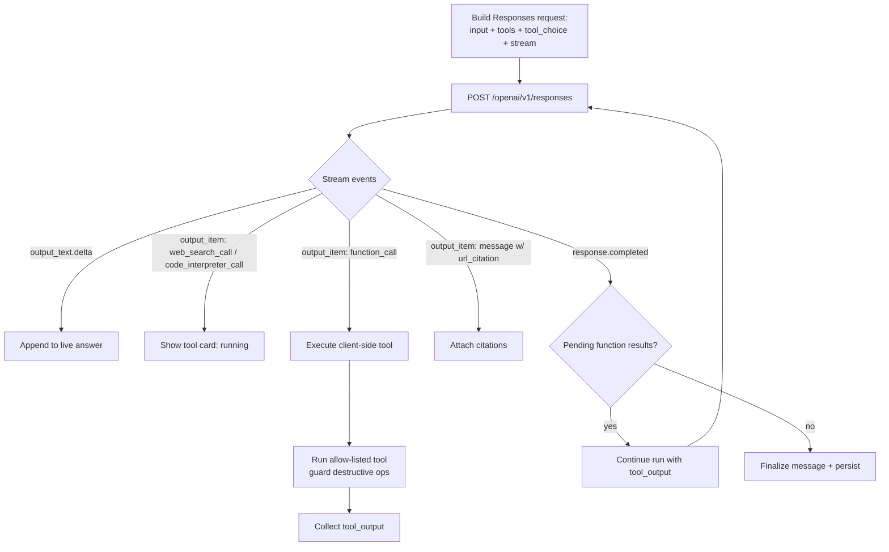

# 03 — Agentic Chat & Tool Calling

The chat experience that turns Watai from a single-shot responder into an assistant that
**searches, computes, calls APIs, and chains steps** — with every action visible and every
fact cited. This is the GPT-style core.

Cross-references: [02-architecture-and-adoption.md](02-architecture-and-adoption.md) (the
orchestration layer & paths), [01-foundry-capabilities.md](01-foundry-capabilities.md) §5
(web search), [06-data-model-and-frontend.md](06-data-model-and-frontend.md) (types & UI),
and the existing chat code in [../../src/features/chat/useChat.ts](../../src/features/chat/useChat.ts).

---

## 1. Experience goals

A user in an agentic thread can:

1. Ask a question about **current events / fresh facts** and get a grounded answer with
   **clickable citations** ("what shipped in the React 19 RC this week?").
2. Ask Watai to **compute / analyze** ("plot the growth if I invest 500/month at 7%") and
   get a chart/table produced by **Code Interpreter**.
3. Ask Watai to **act on their own data** ("find the thread where we discussed the Bicep
   error and summarize it") via **function calling** into the Watai persistence API.
4. Watch the assistant **think in steps** — search → read → compute → answer — with each
   step shown inline and collapsible, like ChatGPT's tool cards.
5. **Interrupt** at any point (the existing Stop affordance) and keep partial work.

---

## 2. The tool-calling loop

The orchestrator ([02](02-architecture-and-adoption.md) §4) runs this loop per user turn:



- **Server-side tools** (`web_search`, `code_interpreter`, `image_generation`) need no
  client work — the orchestrator just renders their `*_call` items as **tool cards** and
  keeps streaming.
- **Client-side `function_call` items** pause the textual answer, run in the browser, and
  the loop **re-invokes** the Responses API with the tool output appended (using the
  `conversation`/previous-response id so the model keeps context).
- A **budget** caps iterations (default: ≤ 6 tool calls, ≤ 60s wall-clock, ≤ N tokens). On
  breach the orchestrator stops and explains.

---

## 3. Request shapes

All requests are `POST <endpoint>/openai/v1/responses` with `Authorization: Bearer <token>`
and the **model in the body** (Watai's existing convention).

### 3.1 Web-search-grounded chat

```jsonc
{
  "model": "gpt-5.4",
  "input": [
    { "type": "message", "role": "system",
      "content": [{ "type": "input_text", "text": "<assembled system + personalization>" }] },
    { "type": "message", "role": "user",
      "content": [{ "type": "input_text", "text": "What changed in the EU AI Act this month?" }] }
  ],
  "tools": [
    { "type": "web_search",
      "user_location": { "type": "approximate", "country": "GB", "city": "London", "region": "London" },
      "search_context_size": "medium" }
  ],
  "tool_choice": "auto",
  "stream": true
}
```

### 3.2 Mixed server + client tools (web search + a Watai function)

```jsonc
{
  "model": "gpt-5.4",
  "input": [ /* … */ ],
  "tools": [
    { "type": "web_search" },
    { "type": "function",
      "name": "searchWataiHistory",
      "description": "Search the user's own Watai chat history.",
      "parameters": {
        "type": "object",
        "properties": { "query": { "type": "string" } },
        "required": ["query"]
      } }
  ],
  "tool_choice": "auto",
  "stream": true
}
```

When the model emits `function_call` for `searchWataiHistory`, the browser calls
`repo.search(query)` (which today hits the persistence API), then continues the run with the
`function_call_output`.

### 3.3 Code interpreter

```jsonc
{ "model": "gpt-5.4",
  "input": "Plot compound growth of 500/month at 7% for 20 years.",
  "tools": [ { "type": "code_interpreter" } ],
  "stream": true }
```

Watai renders the produced code (collapsible), any logs, and resulting images/files from the
`code_interpreter_call` item.

### 3.4 MCP (power users)

```jsonc
{ "model": "gpt-5.4", "input": "…",
  "tools": [ { "type": "mcp", "server_label": "github",
               "server_url": "https://api.githubcopilot.com/mcp",
               "require_approval": "always" } ] }
```

MCP servers are configured in Settings → Tools; `require_approval: "always"` makes the
orchestrator show a consent prompt before the first call.

---

## 4. Response handling & citations

- Text streams from `response.output_text.delta` into the live message (reusing the existing
  streaming render in [../../src/features/chat/useChat.ts](../../src/features/chat/useChat.ts)).
- On `response.output_item.done` where `item.type === "message"`, read
  `item.content[…].annotations`; for each `annotation.type === "url_citation"` capture
  `{ url, title, start_index, end_index }`.
- **Display obligation (Grounding with Bing):** render **both** the website citation links
  **and** the Bing search-query link, verbatim. Watai shows:
  - inline numbered superscripts at the cited text span, and
  - a **Sources** strip under the message listing title + domain, plus a "Searched the web"
    affordance linking to `https://www.bing.com/search?q=<query>`.
- `web_search_call` / `code_interpreter_call` / `function_call` items become **tool cards**
  with state (`running` → `done`/`error`), a one-line summary, and an expandable detail.

---

## 5. Client-side tool registry (Path C)

A small, **allow-listed** registry maps function names the model may call to browser
implementations. Initial set (all backed by existing `repo` / UI):

| Function | Backed by | Destructive? |
| --- | --- | --- |
| `searchWataiHistory(query)` | `repo.search` | no |
| `getThreadSummary(threadId)` | `repo.listMessages` + summarize | no |
| `createThread(title)` | `repo.createThread` | no |
| `addMemory(text)` | `repo.addMemory` | no |
| `updateSetting(path, value)` | `repo.saveSettings` | confirm |
| `deleteThread(threadId)` | `repo.deleteThread` | **confirm** |
| `exportThread(threadId)` | `repo.exportAll`-style | no |

Rules: destructive functions require an in-UI confirmation before execution; every function
validates its args (zod) at the boundary; unknown function names are rejected; results are
size-bounded before being returned to the model.

---

## 6. UI (matches the ChatGPT pattern, Watai tokens)

- **Mode toggle / tool chips** in the composer: a "Tools" affordance to enable Web search,
  Code, and attached MCP servers for the thread (respecting capability gating). No emoji;
  Fluent icons per [../../HANDOFF.md](../../HANDOFF.md) §11.
- **Tool cards** inline in the assistant message: collapsed by default with a status dot and
  label ("Searched the web · 5 sources", "Ran Python", "Looked up your history"); expandable
  to show query/code/args + brief result.
- **Citations:** numbered superscripts + a **Sources** row (favicon, title, domain). Clicking
  a source opens it in a new tab; clicking the search label opens the Bing query.
- **Thinking indicator:** a step ticker while tools run, replacing the plain "streaming…".
- **Stop** keeps partials and marks the message interrupted (existing behavior).
- **Errors** are explained per the taxonomy in [../../src/ai/errors.ts](../../src/ai/errors.ts),
  extended with tool-specific codes (`tool_unsupported`, `tool_unauthorized`,
  `web_search_disabled`, `budget_exceeded`).

---

## 7. Prompting

The system/developer message (assembled today in `useChat.ts` from app defaults +
personalization + memory) gains tool guidance, e.g.:

> "You can use tools. Prefer **web search** for anything time-sensitive or that you are not
> certain about, and **always cite** sources. Use **code** for math/data. Use the user's
> **history/memory** functions when they refer to their own past chats. Do not call
> destructive functions without explicit user intent. Keep tool use minimal and purposeful."

`tool_choice` is `auto` normally; `required` only for explicit "search the web for…" intents.

---

## 8. Backward compatibility & degradation

- If the endpoint lacks `/responses` (old AOAI), agentic mode is hidden and **classic chat
  via `/chat/completions` is used** (today's path) — unchanged.
- If `/responses` exists but `web_search` 400s (no project/Bing), the web-search chip is
  disabled with a tooltip ("Connect a Foundry project with Bing to enable web search"), and
  **function calling + code interpreter still work**.
- Function calling (Path C) works even on a plain AOAI endpoint, so Watai-data tools are
  available to the widest audience.

---

## 9. Acceptance criteria

1. A time-sensitive question returns a grounded answer with **≥ 1 visible url_citation** and
   a Bing query link.
2. A math/data question yields a **Code Interpreter** card with code + result.
3. "Find/summarize my thread about X" triggers a **function_call** to `searchWataiHistory`
   and the answer reflects real persisted data.
4. Tool cards show **running → done/error** states and are expandable.
5. Stop mid-run preserves partial text and tool state.
6. With tools off / unsupported endpoint, **classic chat is identical to today**.
7. The AI key never leaves the browser; function tools use the **separate** app token.
