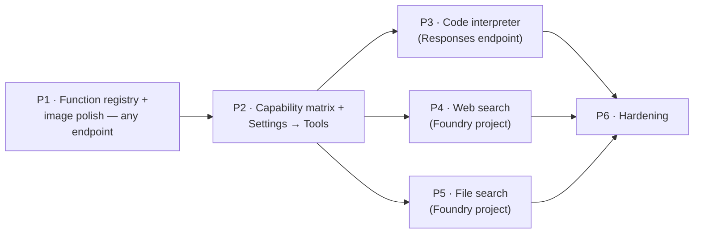

# 08 — Implementation Plan: Tools

A **build-ready** plan to add the five capabilities the product owner asked for —
**web search**, **code interpreter**, **file search**, **function calling**, and
**image generation** — to Watai. It is grounded in the existing specs
([01](01-foundry-capabilities.md)–[07](07-execution-roadmap.md)) and, crucially, in the
**code that already exists** in [../../src/ai/](../../src/ai/). Read this as the
file-by-file work order; the earlier docs are the rationale.

> This plan supersedes the ordering in [07-execution-roadmap.md](07-execution-roadmap.md)
> for these five features. Where they disagree, **this doc wins**.

---

## 0. Decisions locked for this iteration

These were confirmed with the product owner and constrain every section below.

| # | Decision | Consequence |
| --- | --- | --- |
| D1 | **Image generation keeps the plain Image API** (`/images/generations`) via the existing `generate_image` **function tool**. "gpt 2" is just the **configurable image deployment name** in `ApiConfig.models.image`. | No `image_generation` server tool, no `gpt-image` header, **no Foundry project required** for images. We *enhance* the existing flow (intent-aware prompt + params + provenance), we don't replace it. |
| D2 | **Support both endpoint kinds, capability-gated** (resolves the long-open **A7**). | Full suite (web search, file search) on a **Foundry project**; function calling + code interpreter + plain image gen on a **plain Azure OpenAI key**. Detect + degrade; never hard-error. |
| D3 | Deliver as **this doc** + concrete frontend, backend, provisioning, and file-search vector-store design, with a **phased rollout + acceptance criteria**. | Below. |
| D4 | **Privacy invariant preserved.** All tool/model/file calls go **browser → AI plane** with the BYO credential. Uploaded files for file search go to the **user's own AI project**, never to Watai's backend. | The persistence plane only ever stores **bounded** tool/citation metadata and **opaque IDs** (vector-store / file ids), never bytes or the AI key. |

### 0.1 Non-goals (this iteration)

Explicitly **out of scope** here, to keep the slice shippable. Each is either covered by
another doc or deferred:

- **Server-side `image_generation` tool** (streaming partials, edit/inpaint, `gpt-image`
  header) — deferred by **D1**; the future-state design lives in
  [05-agentic-image-generation.md](05-agentic-image-generation.md).
- **Deep Research** (`o3-deep-research`) — a separate epic in [04-deep-research.md](04-deep-research.md).
- **MCP / OpenAPI / Azure AI Search / Agent-to-Agent** custom tools — later ([01](01-foundry-capabilities.md) §4.2).
- **Computer Use / Browser Automation** — out of scope (risk), per [README §3.2](README.md).
- **Voice-mode tool use** — text-first first; deferred.
- **Image edit / inpaint** — depends on the server image tool, so deferred with it.

---

## 1. Current state — what already exists

A surprising amount of Phase 0/1 is already in the tree. The plan **extends** these files;
it does not recreate them.

| File | Status | What's there | What's missing for the 5 features |
| --- | --- | --- | --- |
| [../../src/ai/responses.ts](../../src/ai/responses.ts) | **Partial** | Typed Responses client; `streamResponses`; SSE→event normalizer for `created`, `text`, `functionCall`, `image` (gen + partials), `completed`, `error`. `ResponsesTool` union already names `web_search` & `code_interpreter`. | Event handling for `web_search_call`, `code_interpreter_call`, `file_search_call`; **`url_citation` / file-citation annotations**; `file_search` tool type + `vector_store_ids`; `web_search` params (`user_location`, `search_context_size`). |
| [../../src/ai/orchestrator.ts](../../src/ai/orchestrator.ts) | **Partial** | `runAgent` tool-calling loop; budget (`maxIterations = 6`); executes client `function_call`s; surfaces images; continues via `previous_response_id`. | Server-side **tool-card** events (search/code/file `running→done`); **citation** events; pass-through of server tools that need no client execution. |
| [../../src/ai/tools.ts](../../src/ai/tools.ts) | **Partial** | One client tool: `generate_image` → plain Image API; `CHAT_TOOLS`; `executeTool`. | History/threads/memory **function tools**; a **capability-aware tool assembler** that adds server tools (`web_search`, `code_interpreter`, `file_search`). |
| [../../src/ai/capabilities.ts](../../src/ai/capabilities.ts) | **Partial** | `probeResponses` + cached `agenticAvailable`. | `endpointKind` detection; probes for `web_search` / `code_interpreter` / `file_search`; extended `CapabilityMatrix`. |
| [../../src/features/chat/useChat.ts](../../src/features/chat/useChat.ts) | **Partial** | Switches to `runAgent` when `agenticAvailable`; renders text + `generate_image` placeholder/image. | Capability+settings-driven **tool selection**; render **tool cards** + **citations**; file-search attach. |
| [../../src/lib/types.ts](../../src/lib/types.ts) | **Needs additive fields** | Core `Message`, `ImageRef`, `ApiConfig`, `Settings`, `CapabilityMatrix`, `AiErrorCode`. | `Message.toolCalls/citations`; `ImageRef` provenance; `ApiConfig.endpointKind/projectEndpoint/tools/...`; `Settings.tools`; new `CapabilityMatrix` + `AiErrorCode` members (all **optional/additive**). |
| [../../src/ai/http.ts](../../src/ai/http.ts) | **Extend `AiPath`** | `aiFetch`, `parseSse`, `v1Url`, custom headers, `/responses`. | `'/files'`, `'/vector_stores'` paths for file-search upload/index. |
| [../../src/ai/errors.ts](../../src/ai/errors.ts) | **Extend map** | `normalizeHttpError`, `aiError`. | Tool error codes + messages (§11). |
| [../../api/src/domain/message.ts](../../api/src/domain/message.ts) | **Extend zod** | Strict `appendSchema` with `images`. | Optional, bounded `toolCalls` + `citations` (§10). |
| [../../src/ai/mockAi.ts](../../src/ai/mockAi.ts) | **Extend** | `mockStreamChat`. | A mock **agentic** stream that emits tool + citation events for offline tests/dev menu. |

**Implication:** Features **#4 function calling** and **#5 image generation** are ~70% done.
The new build is mostly **#1 web search**, **#2 code interpreter**, **#3 file search**, the
**capability gating** that lets all of it coexist on both endpoint kinds, and the **UI** for
tool cards + citations.

---

## 2. Feature → endpoint capability map

| Feature | Plain Azure OpenAI key | Foundry project | How it's gated |
| --- | --- | --- | --- |
| **Function calling** (Path C) | ✅ | ✅ | Needs `/responses`. `capabilities.responses`. |
| **Image generation** (plain Image API tool) | ✅ | ✅ | Needs `capabilities.image` (already probed). |
| **Code interpreter** | ✅ built-in (if `/responses`) | ✅ | `capabilities.codeInterpreter` probe. |
| **Web search** | ❌ (no Bing connection) | ✅ | `capabilities.webSearch` probe **and** `Settings.tools.webSearch` **and** consent (A8). |
| **File search** | ⚠️ only if the endpoint exposes vector stores | ✅ | `capabilities.fileSearch` probe **and** an indexed vector store. |

The orchestrator only ever offers the model tools the matrix marks available **and** the
user enabled; the composer hides/disables the rest with an explanatory tooltip.

---

## 3. Type changes (`src/lib/types.ts`)

All additive and optional, so existing local/synced data loads unchanged (back-compat
checklist in §13).

```ts
// ---- Tool activity & citations on a message ----
export type ToolKind =
  | 'function'
  | 'web_search'
  | 'code_interpreter'
  | 'file_search'
  | 'image';

export interface ToolCall {
  id: Id;
  kind: ToolKind;
  name?: string;                 // function/tool name
  status: 'running' | 'done' | 'error';
  summary?: string;              // one line, e.g. "Searched the web · 5 sources"
  argsPreview?: string;          // bounded, secret-free
  resultPreview?: string;        // bounded
  error?: AiError;
}

export interface Citation {
  url: string;
  title?: string;
  startIndex?: number;
  endIndex?: number;
  bingQueryUrl?: string;         // Grounding-with-Bing display obligation
  source?: 'web' | 'file';
  fileId?: string;               // file_search citations
  filename?: string;
}

export interface Message {
  // …existing fields…
  toolCalls?: ToolCall[];        // NEW
  citations?: Citation[];        // NEW
}

// ---- Image provenance (still plain Image API; D1) ----
export interface ImageRef {
  // …existing: id, localBlobKey, blobPath, prompt, size, outputFormat, createdAt…
  expandedPrompt?: string;       // NEW: model-written, intent-aware prompt
  model?: string;                // NEW: image deployment used ("gpt 2")
  sourceMessageIds?: Id[];       // NEW: context the agent used
  editOf?: Id | null;            // NEW: lineage (future inpaint)
}

// ---- Endpoint capability tiers + tool config ----
export type EndpointKind = 'aoai' | 'foundry-project';

export interface ApiConfig {
  baseUrl: string;
  endpointKind?: EndpointKind;          // NEW: detected, not guessed
  projectEndpoint?: string;             // NEW: .../api/projects/<project>
  models: {
    chat: string;
    transcribe: string;
    image: string;                      // "gpt 2" lives here (D1)
    tts?: string;
    orchestrator?: string;              // NEW: small model for prompt expansion (optional)
  };
  chatDefaults: { /* …unchanged… */ };
  tools?: {                             // NEW
    webSearch?: boolean;
    codeInterpreter?: boolean;
    fileSearch?: boolean;
    bingConnectionId?: string;          // project web-search connection (optional)
    vectorStoreId?: string;             // user-level knowledge base for file search
  };
  consent?: { webSearchDataBoundary?: boolean };  // NEW (A8 gate)
  keyEncrypted: boolean;
}

// ---- Settings: a Tools section ----
export interface Settings {
  // …existing…
  tools?: {
    agenticMode: boolean;        // master toggle (default true when supported)
    webSearch: boolean;
    codeInterpreter: boolean;
    fileSearch: boolean;
    imageAgent: boolean;         // intent-aware image expansion on/off
  };
}

// ---- Capability matrix (drives gating) ----
export interface CapabilityMatrix {
  // …existing: chat, chatStreaming, vision, transcribe, transcribeStreaming, image, imageEdit, tts…
  responses: boolean;            // NEW
  functions: boolean;            // NEW (== responses)
  codeInterpreter: boolean;      // NEW
  webSearch: boolean;            // NEW
  fileSearch: boolean;           // NEW
}

// ---- Error codes (see §11) ----
export type AiErrorCode =
  | /* …existing… */
  | 'tool_unsupported'
  | 'tool_unauthorized'
  | 'web_search_disabled'
  | 'file_search_unavailable'
  | 'budget_exceeded';
```

Update `DEFAULT_SETTINGS` to seed `tools: { agenticMode: true, webSearch: false,
codeInterpreter: true, fileSearch: false, imageAgent: true }` (search/file off until the
user opts in + consents).

---

## 4. Feature #4 — Function calling (Path C registry)

**Goal:** the model can act on the user's own Watai data and produce images. Extends the
existing single-tool `tools.ts` into a small, allow-listed registry.

### 4.1 Files

```
src/ai/tools/
  index.ts        # assembleTools(caps, settings) + executeTool(name,args); re-exports
  image.ts        # MOVE existing generateImageTool here (unchanged behavior)
  history.ts      # searchWataiHistory, getThreadSummary  (repo-backed, read-only)
  threads.ts      # createThread, deleteThread (confirm), exportThread
  memory.ts       # addMemory, updateSetting (confirm)
  serverTools.ts  # web_search / code_interpreter / file_search ResponsesTool builders
```

> The current `src/ai/tools.ts` becomes `src/ai/tools/index.ts` + `tools/image.ts`. Keep
> the public exports `CHAT_TOOLS` (now computed) and `executeTool` so `useChat.ts` needs
> only a one-line import change.

### 4.2 Registry shape

```ts
// src/ai/tools/index.ts
export interface ClientTool {
  def: ResponsesTool;                       // function schema sent to the model
  destructive?: boolean;                    // requires confirm before executing
  run: (args: Record<string, unknown>) => Promise<ToolResult>;
}

const CLIENT_TOOLS: Record<string, ClientTool> = {
  generate_image:     { def: generateImageTool, run: runGenerateImage },
  search_history:     { def: searchHistoryTool, run: runSearchHistory },
  get_thread_summary: { def: summaryTool,       run: runThreadSummary },
  create_thread:      { def: createThreadTool,  run: runCreateThread },
  add_memory:         { def: addMemoryTool,     run: runAddMemory },
  delete_thread:      { def: deleteThreadTool,  run: runDeleteThread, destructive: true },
  update_setting:     { def: updateSettingTool, run: runUpdateSetting, destructive: true },
};

/** Inputs beyond settings that gate the server tools. */
export interface ToolContext {
  webSearchConsent: boolean;   // ApiConfig.consent.webSearchDataBoundary (A8)
  vectorStoreIds: string[];    // user KB + any per-thread store
  userLocation?: { country?: string; city?: string; region?: string };
}

/** Build the tool list for a turn from capabilities + user settings + context. */
export function assembleTools(
  caps: CapabilityMatrix,
  s: Settings['tools'],
  ctx: ToolContext,
): ResponsesTool[] {
  const tools: ResponsesTool[] = [];
  // Client function tools (Path C) — available on any Responses endpoint.
  if (s?.imageAgent !== false) tools.push(generateImageTool);
  tools.push(searchHistoryTool, summaryTool, createThreadTool, addMemoryTool,
             deleteThreadTool, updateSettingTool);
  // Server tools — added only when the endpoint supports them AND the user enabled them.
  if (caps.codeInterpreter && s?.codeInterpreter) tools.push(codeInterpreterTool());
  if (caps.webSearch && s?.webSearch && ctx.webSearchConsent)
    tools.push(webSearchTool({ userLocation: ctx.userLocation }));
  if (caps.fileSearch && s?.fileSearch && ctx.vectorStoreIds.length)
    tools.push(fileSearchTool(ctx.vectorStoreIds));
  return tools;
}

export async function executeTool(name: string, args: Record<string, unknown>): Promise<ToolResult> {
  const tool = CLIENT_TOOLS[name];
  if (!tool) return { output: `Unknown tool: ${name}` };   // server tools never reach here
  return tool.run(args);
}
```

### 4.3 The function tools (repo-backed)

All are thin wrappers over the existing [../../src/data/repository.ts](../../src/data/repository.ts)
`repo`, which already hits the persistence plane with the **app token** (never the AI key).
Each validates args at the boundary and **bounds** the result string (≤ ~2 KB) before
returning it to the model.

| Function | Backed by | Destructive |
| --- | --- | --- |
| `search_history(query)` | `repo.search` | no |
| `get_thread_summary(threadId)` | `repo.listMessages` + truncation | no |
| `create_thread(title)` | `repo.createThread` | no |
| `add_memory(text)` | `repo.addMemory` | no |
| `update_setting(path, value)` | `repo.getSettings`+`saveSettings` | **confirm** |
| `delete_thread(threadId)` | `repo.deleteThread` | **confirm** |
| `generate_image(prompt,size)` | existing Image API client | no |

### 4.4 Destructive-action confirmation

The orchestrator must not auto-run a destructive tool from model/tool output (prompt-
injection guard, [02](02-architecture-and-adoption.md) §7). Add a `confirm` callback to
`runAgent`:

```ts
// orchestrator.ts addition
confirm?: (req: { name: string; args: Record<string, unknown> }) => Promise<boolean>;
```

When a `function_call` maps to a `destructive` tool, the orchestrator emits a
`{ type: 'tool', status: 'awaiting-confirm' }` event; `useChat` shows an inline confirm
chip; on accept it resolves `confirm` → `true` and execution proceeds, else it returns
`"User declined."` as the tool output.

### 4.5 Tests (TDD)

- `tools/history.test.ts`, `threads.test.ts`, `memory.test.ts`: each tool maps args→repo
  call, bounds output, rejects unknown/blank args; destructive tools refuse without
  confirm.
- `orchestrator.test.ts` (extend): a `delete_thread` call pauses for confirm; decline path
  returns declined output and the run continues.

**Acceptance:** "find/summarize my thread about X" calls `search_history`/`get_thread_summary`
and the answer reflects real persisted data; "delete that thread" requires a confirm tap;
the AI key never appears in any persistence call (assert in test).

---

## 5. Feature #5 — Image generation ("gpt 2", plain Image API)

**Goal (D1):** keep the working plain-Image-API path; make it **intent-aware**,
**configurable**, and **provenance-tracked**. No project needed.

### 5.1 Keep + enhance the function tool

`generate_image` already instructs the model to "read the conversation and write a
detailed, self-contained prompt" — that *is* the intent expansion, done by the chat model
in-loop, and it already works. Enhancements:

1. **Configurable model**: pass `config.models.image` (the user's "gpt 2") into
   `generateImage`, not a hard-coded deployment. (Already the case in
   [../../src/ai/image.ts](../../src/ai/image.ts) — verify it reads `config.models.image`.)
2. **Quality/size params**: add optional `quality` (`low|medium|high`) to the tool schema and
   the Image API body; default `medium` for in-chat speed.
3. **Provenance**: when persisting the `ImageRef` in `useChat`, also store
   `expandedPrompt` (the model-written prompt from the tool args), `model`, and
   `sourceMessageIds` (the turn ids in context). Optional `imageAgent` setting can prepend a
   one-line system nudge to write richer prompts.
4. **Standalone `/images` screen** ([../../src/features/images/ImagesView.tsx](../../src/features/images/ImagesView.tsx)):
   keep the literal box but add a **"Improve my prompt"** toggle that routes the literal text
   through a single chat call (orchestrator with only `generate_image`) so the same intent
   expansion is available outside chat. Show the expanded prompt for transparency.

### 5.2 Tests

- `tools/image.test.ts`: schema includes `size`+`quality`; `runGenerateImage` passes
  `config.models.image`, defaults size/quality, bounds output, returns the image b64.

**Acceptance:** "based on what we discussed, make an image of X" yields a context-aware
image; the expanded prompt is visible; works on a **plain Azure OpenAI key**; provenance is
persisted and shown in the viewer.

---

## 6. Feature #2 — Code interpreter (server tool)

**Goal:** the model runs Python in the service for math/data/charts; Watai renders a tool
card with code + output + any produced image. No client execution.

### 6.1 responses.ts

- Add `'code_interpreter'` handling in `normalizeResponsesEvent` for
  `response.output_item.done` where `item.type === 'code_interpreter_call'` (and the
  in-progress `response.code_interpreter_call.*` events if present), emitting a new event:

```ts
// new normalized events
| { type: 'serverTool'; kind: 'code_interpreter' | 'web_search' | 'file_search';
    callId: string; status: 'running' | 'done'; summary?: string }
```

- Code-produced images arrive as `image_generation_call`/file outputs inside the CI item;
  reuse the existing `image` event for any base64 the item carries.

### 6.2 Tool builder + gating

```ts
// tools/serverTools.ts
export const codeInterpreterTool = (): ResponsesTool => ({ type: 'code_interpreter' });
```

Added by `assembleTools` only when `caps.codeInterpreter && settings.tools.codeInterpreter`.

### 6.3 Orchestrator + UI

- `runAgent` passes `serverTool` events straight through as `{ type: 'tool', kind, status }`
  (no client execution, no extra round-trip).
- `Message.tsx` renders a **tool card**: "Ran Python", collapsible code + stdout + result
  image.

### 6.4 Capability probe

`probeCodeInterpreter(config)`: POST `/responses` with `tools:[{type:'code_interpreter'}]`,
trivial input, tiny `max_output_tokens`; `200` ⇒ true, `400 tool not supported` ⇒ false.

**Acceptance:** "plot compound growth of 500/month at 7% for 20 years" returns a code card
with the chart; disabled/absent on endpoints that 400 the probe.

---

## 7. Feature #1 — Web search (server tool, Foundry project)

**Goal:** grounded answers with **visible, clickable citations**, behind a **consent gate**.

### 7.1 responses.ts — citations

The hard part is **annotations**. On `response.output_item.done` where
`item.type === 'message'`, walk `item.content[].annotations`; for each
`annotation.type === 'url_citation'` emit:

```ts
| { type: 'citation'; citation: { url: string; title?: string;
      startIndex?: number; endIndex?: number } }
```

Also surface the `web_search_call` item as a `serverTool` event (§6.1). Capture the search
query (from the `web_search_call` item) to build the **Bing query link**
`https://www.bing.com/search?q=<query>` required by the display terms.

### 7.2 Tool builder

```ts
// tools/serverTools.ts
export const webSearchTool = (opts?: {
  userLocation?: { country?: string; city?: string; region?: string };
  contextSize?: 'low' | 'medium' | 'high';
}): ResponsesTool => ({
  type: 'web_search',
  ...(opts?.userLocation ? { user_location: { type: 'approximate', ...opts.userLocation } } : {}),
  search_context_size: opts?.contextSize ?? 'medium',
});
```

### 7.3 Capability probe + consent

- `probeWebSearch(config)`: POST `/responses` with `tools:[{type:'web_search'}]`,
  `tool_choice:'auto'`, trivial input; classify `200` vs `400/403`. Only meaningful when
  `endpointKind === 'foundry-project'`.
- **Consent (A8):** `assembleTools` adds `web_search` only when
  `caps.webSearch && settings.tools.webSearch && config.consent?.webSearchDataBoundary`.
  The composer chip, when first enabled, opens a **cost + data-boundary** dialog
  ([02](02-architecture-and-adoption.md) §7) that sets `consent.webSearchDataBoundary`.

### 7.4 UI (display obligation)

- Inline numbered superscripts at cited spans.
- A **Sources** strip under the message: favicon + title + domain, click → new tab.
- A "Searched the web" affordance linking to the **Bing query URL**, rendered verbatim per
  Grounding-with-Bing terms ([01](01-foundry-capabilities.md) §5).

**Acceptance:** "what changed in X this week?" returns an answer with ≥ 1 visible
`url_citation` + the Bing query link; on a plain key the chip is disabled with a tooltip
("Connect a Foundry project with a Bing connection").

---

## 8. Feature #3 — File search (server tool, vector stores)

**Goal:** "chat with my documents." Net-new. Uploaded bytes go to the **user's own AI
endpoint/project** (BYO), never to Watai's backend (D4). The persistence plane stores only
**opaque ids**.

### 8.1 Vector-store lifecycle (browser → AI plane)

```mermaid
flowchart TD
    A[User attaches a file] --> B[POST /openai/v1/files purpose=assistants]
    B --> C[file_id]
    C --> D{Vector store exists?}
    D -->|no| E[POST /openai/v1/vector_stores -> vector_store_id]
    D -->|yes| F[reuse stored id]
    E --> G[POST /openai/v1/vector_stores/:id/files file_id]
    F --> G
    G --> H[Poll file status until 'completed']
    H --> I[Persist vector_store_id + file_id meta via repo]
    I --> J[Chat turn: tools:[file_search vector_store_ids]]
```

Two scopes (both supported):

- **User knowledge base** — one default `vectorStoreId` stored in
  `ApiConfig.tools.vectorStoreId`, reused across threads.
- **Per-thread docs** — a `vectorStoreId` on the `Thread` (extend the thread record with an
  optional `vectorStoreId`), so attachments are scoped to that conversation.

### 8.2 Files

```
src/ai/fileSearch.ts        # uploadFile, createVectorStore, addFileToStore, pollIndex, listStoreFiles
src/ai/tools/serverTools.ts # fileSearchTool(vectorStoreIds)
```

```ts
// http.ts: extend AiPath
| '/files'
| '/vector_stores'
// Sub-paths like /vector_stores/:id/files are built via the `url` override in aiFetch.

// responses.ts: widen the tool type so no cast is needed
export interface ResponsesTool {
  type: 'function' | 'image_generation' | 'web_search' | 'code_interpreter' | 'file_search';
  // …existing optional fields (name, description, parameters)…
  vector_store_ids?: string[];
  user_location?: { type: 'approximate'; country?: string; city?: string; region?: string };
  search_context_size?: 'low' | 'medium' | 'high';
}

// tools/serverTools.ts — fully typed, no cast
export const fileSearchTool = (vectorStoreIds: string[]): ResponsesTool => ({
  type: 'file_search',
  vector_store_ids: vectorStoreIds,
});
```

> **`aiFetch` is POST-only today.** File search also needs **GET** (poll index status, list
> store files) and **DELETE** (remove a file/store). Add a `method?: 'GET' | 'POST' |
> 'DELETE'` field to `AiRequest`/`aiFetch` ([../../src/ai/http.ts](../../src/ai/http.ts)),
> **defaulting to `POST`** so every existing caller is unchanged, before building
> `fileSearch.ts`.

### 8.3 responses.ts — file citations

`file_search_call` items become `serverTool` events; message annotations of
`type === 'file_citation'` map to `Citation { source: 'file', fileId, filename }`. Render as
a **Sources** strip with the file name (no external link).

### 8.4 Capability probe

`probeFileSearch(config)`: only attempt on `foundry-project`; POST `/responses` with
`tools:[{type:'file_search', vector_store_ids:[]}]` trivial input; `200`/empty ⇒ supported,
`400/404` ⇒ false. (Don't create a real store to detect.)

### 8.5 UI

- Composer **Tools → Files**: an attach affordance that uploads → shows **indexing status**
  (uploading → indexing → ready) per file; ready files become searchable for the thread.
- Settings → Tools: manage the **user knowledge base** (list files, remove, clear store).
- File citations render under the answer (filename chips).

**Acceptance:** upload a PDF/markdown, ask a question answerable only from it, get an answer
with a **file citation**; bytes go to the user's AI endpoint (assert no file body in any
persistence-plane request); disabled with a tooltip on a plain key.

---

## 9. Capability detection (`src/ai/capabilities.ts`)

Replace the single cached boolean with a cached **matrix**.

```ts
export function endpointKind(config: ApiConfig): EndpointKind {
  return /\/api\/projects\//i.test(config.projectEndpoint ?? config.baseUrl)
    ? 'foundry-project' : 'aoai';
}

let matrixCache: CapabilityMatrix | null = null;
export function resetAgenticCache() { matrixCache = null; }

export async function detectCapabilities(config: ApiConfig): Promise<CapabilityMatrix> {
  if (matrixCache) return matrixCache;
  const responses = (await probeResponses(config)).ok;
  const kind = endpointKind(config);
  const [code, web, file] = responses
    ? await Promise.all([
        probeCodeInterpreter(config),
        kind === 'foundry-project' ? probeWebSearch(config) : Promise.resolve({ ok: false }),
        kind === 'foundry-project' ? probeFileSearch(config) : Promise.resolve({ ok: false }),
      ])
    : [{ ok: false }, { ok: false }, { ok: false }];
  matrixCache = {
    ...FULL_CAPABILITY,                 // chat/vision/image/etc. probed elsewhere
    responses, functions: responses,
    codeInterpreter: code.ok, webSearch: web.ok, fileSearch: file.ok,
  };
  return matrixCache;
}
```

Extend the existing `FULL_CAPABILITY` constant in
[../../src/ai/capabilities.ts](../../src/ai/capabilities.ts) with the five new fields
(default `false`) so it still satisfies the widened `CapabilityMatrix` and the spread above
type-checks.

Keep `agenticAvailable` as a thin wrapper (`(await detectCapabilities(config)).responses`)
so existing callers don't break. Probes are **cheap** (tiny `max_output_tokens`, body
cancelled) and run once per config; `resetAgenticCache()` is called on config save (already
wired) and from the Settings "Detect capabilities" button.

---

## 10. Orchestrator & Responses-client deltas (summary)

`responses.ts`:
- Extend `ResponsesTool['type']` with `'file_search'`; add typed `vector_store_ids`,
  `user_location`, `search_context_size`.
- Extend `RawEvent` + `normalizeResponsesEvent` for `web_search_call`,
  `code_interpreter_call`, `file_search_call` (→ `serverTool`) and message `annotations`
  (→ `citation`).

`orchestrator.ts`:
- Forward `serverTool` and `citation` events as `AgentEvent`s (`{type:'tool',kind,…}`,
  `{type:'citation',…}`).
- Add the `confirm` hook (§4.4) and an `awaiting-confirm` tool status.
- Budgets already exist (`maxIterations`); add an optional wall-clock guard
  (`Date.now()` check) for long server-tool runs.

---

## 11. Errors (`src/ai/errors.ts`)

Add codes (also in `types.ts`) and map them:

| Code | Trigger | User message | Action |
| --- | --- | --- | --- |
| `tool_unsupported` | server-tool 400 "not supported" | "This endpoint can't run that tool." | hide chip |
| `tool_unauthorized` | 403 on a tool | "Your endpoint isn't allowed to use that tool." | Settings link |
| `web_search_disabled` | web_search blocked/region | "Web search isn't available on this resource." | tooltip |
| `file_search_unavailable` | vector store/file_search 400/404 | "File search needs a Foundry project with vector stores." | tooltip |
| `budget_exceeded` | loop hit `maxIterations`/wall-clock | "Stopped after several tool steps." | offer "continue" |

Extend `normalizeHttpError` to detect these from status + body substrings (mirroring the
existing `content_filter` detection), without leaking raw payloads.

---

## 12. UI changes (`src/features`, `src/design`)

- **Composer** ([../../src/features/chat/Composer.tsx](../../src/features/chat/Composer.tsx)):
  a **Tools** menu with gated chips — Web search (consent on first enable), Code, Files
  (attach), Image. Disabled chips show a tooltip explaining the requirement. Fluent icons,
  no emoji (HANDOFF §11). Per-thread tool state lives in `useUi`.
- **Message** ([../../src/features/chat/Message.tsx](../../src/features/chat/Message.tsx)):
  render `toolCalls` as collapsible **tool cards** (status dot + one-line summary +
  expandable detail) and `citations` as inline superscripts + a **Sources** strip
  (web links + Bing query link; file chips). Reuse the existing assistant-actions styling.
- **Images** ([../../src/features/images/ImagesView.tsx](../../src/features/images/ImagesView.tsx)):
  the "Improve my prompt" toggle + visible expanded prompt (§5.1).
- **Design** ([../../src/design/components.css](../../src/design/components.css)): add
  `tool-card`, `citation-chip`/`sources` styles using existing tokens; a small step-ticker
  for "thinking in steps." No new icons beyond the Material set already loaded in
  [../../index.html](../../index.html) (add `travel_explore`/`search`, `code`, `description`
  ligatures to the `icon_names` list if a distinct tool glyph is wanted).

### 12.1 Settings → Tools (slots into the new master/detail IA)

Settings was just redesigned to a registry-driven master/detail layout. Add the Tools
section by editing [../../src/features/settings/Settings.tsx](../../src/features/settings/Settings.tsx):

1. Add to the `SECTIONS` record:
   ```ts
   tools: { id: 'tools', label: 'Tools', icon: 'sparkle',
            sub: 'Web search, code, files, and functions' },
   ```
2. Add `'tools'` to the **Assistant** group in `GROUPS`.
3. Add a `summaryFor` case (e.g. `"Web search off · Code on"`).
4. Add a `ToolsBody({ ctx })` component + a `case 'tools'` in `SectionBody`, with:
   - the **agentic mode** master switch and per-tool toggles (gated by the capability
     matrix; show "Needs a Foundry project" when off),
   - the **web-search consent** row (cost + data-boundary), 
   - the **endpoint kind** display + a **"Detect capabilities"** button (calls
     `resetAgenticCache()` + `detectCapabilities`),
   - the **file-search knowledge base** manager (list/remove/clear),
   - extra deployment names (`orchestrator`, `image` already in Models & keys).

---

## 13. Backend changes (`api/`)

Minimal, additive, **still never sees the AI key** (D4).

- **Message validator** ([../../api/src/domain/message.ts](../../api/src/domain/message.ts)):
  extend `appendSchema` with optional, **bounded** arrays:
  ```ts
  toolCalls: z.array(z.object({
    id: z.string().min(1).max(64),
    kind: z.enum(['function','web_search','code_interpreter','file_search','image']),
    name: z.string().max(100).optional(),
    status: z.enum(['running','done','error']),
    summary: z.string().max(400).optional(),
  }).strict()).max(32).optional(),
  citations: z.array(z.object({
    url: z.string().url().max(2048).optional(),
    title: z.string().max(400).optional(),
    source: z.enum(['web','file']).optional(),
    filename: z.string().max(256).optional(),
  }).strict()).max(64).optional(),
  ```
  Raw tool payloads/secrets are **never** stored — only these previews. Add tests in
  [../../api/src/domain/message.test.ts](../../api/src/domain/message.test.ts) (strict TDD,
  HANDOFF §11): accepts bounded tool/citation arrays, rejects over-long/extra keys.
- **Thread record** (optional, for per-thread file search): add an optional
  `vectorStoreId: z.string().max(128).optional()` to the thread update schema + the mapper
  in [../../src/data/cloud/types.ts](../../src/data/cloud/types.ts).
- **Assets/SAS path:** unchanged — generated images still flow through the existing
  SAS-minted blob path; only the new `ImageRef` provenance strings ride along.
- **No new secrets** server-side. Vector-store/file ids are opaque strings; MCP/tool
  credentials (if added later) live in the browser `secureStore`.

---

## 14. Provisioning

The **AI plane is the user's** (D2/D4), so `infra/main.bicep` stays **persistence-only**.
Provisioning the agentic tools is therefore a **user-facing checklist** surfaced in
Settings → Tools, plus an **optional** reference Bicep for users who want IaC.

### 14.1 BYO-project checklist (surfaced in Settings)

1. Create a **Foundry project** (West US / Norway East if Deep Research is added later).
2. Deploy models: **chat** (`gpt-5.4`), the **image** model (your "gpt 2"), and optionally an
   **orchestrator** (`gpt-4.1-mini`/`gpt-4o`). Web search/file search need no extra model.
3. For **web search**: create + connect a **Grounding with Bing Search** resource (paid/PAYG
   subscription) and note the connection.
4. For **file search**: nothing to pre-provision — vector stores are created on demand from
   the browser.
5. In Watai → Settings → Tools: paste the **project endpoint** + deployment names, click
   **Detect capabilities**, accept the **web data-boundary + cost** consent.

### 14.2 Optional reference Bicep (`infra/ai-project.bicep`, new, not wired to main)

A standalone module (kept **separate** from the persistence `main.bicep`) that a user can
deploy in **their own** subscription: `Microsoft.CognitiveServices/accounts` (kind `AIServices`),
a project, model deployments (chat + image), and a Bing connection. Document it as
"deploy in your subscription; Watai never deploys this for you." Re-verify resource
types/API versions against current docs (preview surface).

### 14.3 Plain-key users

No provisioning. They get function calling, code interpreter (if `/responses`), and image
generation. Web/file chips are disabled with explanatory tooltips.

---

## 15. Testing strategy

- **Frontend (vitest + jsdom), TDD:**
  - `responses.test.ts` (extend): citation annotations + `serverTool` events for
    web/code/file; `file_search` tool body shape.
  - `orchestrator.test.ts` (extend): server-tool pass-through, citation forwarding,
    destructive-confirm accept/decline, budget stop.
  - `tools/*.test.ts`: each function tool (args→repo, bounding, destructive guard);
    `assembleTools` gating per capability/setting matrix.
  - `capabilities.test.ts` (new): Profile-1 (aoai) vs Profile-2 (project) configs ⇒ correct
    matrix and gating; probes mocked via fetch.
  - `fileSearch.test.ts`: upload→create-store→add→poll happy path + error/timeout, all
    mocked.
- **Mock mode:** extend [../../src/ai/mockAi.ts](../../src/ai/mockAi.ts) with a fake agentic
  stream emitting text + a web-search card + a citation, so the dev menu and tests run
  offline.
- **Backend (vitest), strict TDD:** message-validator additions; thread `vectorStoreId` if
  added; offline + Cosmos integration mirroring existing adapters.
- **Manual e2e** (against a real project before each phase exits): web search citations,
  code chart, file-search answer; plus a plain-key run proving graceful degradation. Smoke
  the deployed API per HANDOFF §0.

---

## 16. Phased rollout

Each phase is a vertical slice, capability-gated, classic chat untouched. **P1 ships real
value on a plain Azure OpenAI key**; **P2** unblocks the gated tools; **P4/P5 require a
Foundry project** and degrade cleanly without one.



| Phase | Scope | Exit / acceptance |
| --- | --- | --- |
| **P1 — Function registry + image polish** (any endpoint) | §4 registry (history/threads/memory + destructive confirm), §5 image provenance/params, tool-card UI shell, `Message` types, backend validator. | History/memory tools work; destructive confirm; context-aware image with visible expanded prompt; tests green. |
| **P2 — Capability matrix + Settings → Tools** | §9 `detectCapabilities` + `endpointKind`; §12.1 Tools settings; composer Tools menu gating. | Matrix correct for both profiles; chips enable/disable with tooltips; "Detect capabilities" works. |
| **P3 — Code interpreter** (Responses endpoint) | §6 events + card + probe. | Math/data question returns a code card with chart; gated off when unsupported. |
| **P4 — Web search** (project) | §7 citations, consent, Sources strip + Bing link, probe. | Grounded answer with ≥1 citation + Bing query link; consent enforced; off on plain key. |
| **P5 — File search** (project) | §8 vector-store lifecycle, upload/index UI, file citations, KB manager. | Doc-grounded answer with a file citation; bytes only on the user's AI plane; off on plain key. |
| **P6 — Hardening** | budgets/wall-clock, cost surfacing, a11y for cards/citations, telemetry (no secret/prompt logging), docs + dev-menu coverage. | DoD (§17) met for every feature. |

---

## 17. Definition of done (every feature)

- Capability-gated with graceful degradation + a clear explanation when off.
- **Privacy tested:** AI key never sent to the Watai backend; file bytes only to the user's
  AI plane (assertions in tests).
- Tool actions visible/auditable in the transcript; citations rendered per Bing terms.
- Budgets + consent enforced; errors mapped to the taxonomy (§11), no secret leakage.
- Untrusted tool output never auto-triggers a destructive action without confirm.
- Unit tests green; backend additions TDD'd; acceptance criteria met.
- All new `Message`/`ImageRef`/`Settings`/`ApiConfig` fields optional ⇒ old data loads
  unchanged; `mockAi` still works offline; Conventional Commits; no emoji; Watai
  tokens/Fluent icons.

---

## 18. Re-verify before building (preview surface)

Pin and re-check against live Microsoft Learn docs at implementation time:
`web_search` / `code_interpreter` / `file_search` **tool names + params**, the
**vector-store + files** API shapes and paths, message **annotation** field names
(`url_citation` / `file_citation`, `start_index`/`end_index`), and the Grounding-with-Bing
**display + cost + data-boundary** terms. Feature-flag everything behind the capability
matrix so a preview change degrades instead of breaking.
