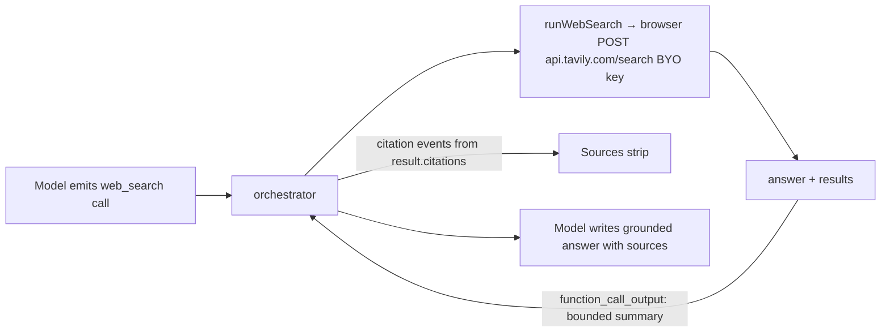

# 10 — Web search via Tavily (BYO, client-side, no Bing)

Grounded web search **without** Grounding-with-Bing (which is PAYG-only and was deferred in
[09](09-provisioning-and-enablement.md) §1). Implemented as a **client-side `function` tool**
backed by [Tavily](https://docs.tavily.com/welcome), so it works on **any** endpoint (plain
Azure OpenAI key or Foundry) and reuses the existing citations UI.

> Shipped. Supersedes the web-search rows in [08](08-implementation-plan.md) §7 (which assumed
> the Foundry `web_search` server tool + Bing). The Bing builder/probe remain in the tree but
> are no longer wired into tool assembly.

---

## 0. Decisions (confirmed with the product owner)

| # | Decision | Consequence |
| --- | --- | --- |
| W1 | **Tavily, not Bing.** | Works on any subscription; no Foundry project/connection. |
| W2 | **Client-side `function` tool** (Path C, like `generate_image`). | Browser runs the search; model gets results; no server tool, no proxy. |
| W3 | **Browser → `api.tavily.com` directly** (CORS verified). | BYO Tavily key stays in the browser; **never** sent to Watai's backend (privacy invariant D4). |
| W4 | **`basic` search depth** (1 credit), 5 results, `include_answer`, `include_favicon`. | Cheap, good-enough grounding for personal use. |
| W5 | **Info line, no consent dialog.** | "Web searches send your query to Tavily." |
| W6 | **Credit usage shown in Settings** via `GET /usage`. | `key.usage / key.limit`, with a refresh. |

### Why CORS matters (the deciding test)
A preflight from the GitHub Pages origin returns `200` with
`Access-Control-Allow-Origin: <origin>`, `…Allow-Methods: POST`,
`…Allow-Headers: authorization,content-type`. So the browser can call Tavily directly — the
same model as the BYO AI key. **No backend proxy** (which would have leaked the key server-side).

---

## 1. Tavily API (the bits we use)

- **Search:** `POST https://api.tavily.com/search`, `Authorization: Bearer tvly-…`
  - Body: `{ query, search_depth: 'basic', max_results: 5, include_answer: true, include_favicon: true, topic?, time_range? }`
  - Response: `{ query, answer?, results: [{ title, url, content, score, favicon? }], response_time }`
- **Usage:** `GET https://api.tavily.com/usage` → `{ key: { usage, limit, search_usage }, account: { current_plan, plan_usage, plan_limit, … } }`
- **Errors:** `401` bad/missing key · `429` rate limit · `432/433` plan/PAYG limit · `400` bad request (Tavily shape: `{ detail: { error } }`).
- **Cost:** 1 credit (basic/fast) or 2 (advanced) per search. Free tier available at <https://app.tavily.com>.

---

## 2. Architecture

The model calls the `web_search` **function** tool; the browser runs Tavily; the bounded text
summary (answer + numbered results) goes back to the model as the tool output, while the
result URLs/titles/favicons are forwarded as **citation** events to the existing Sources strip.

---

## 3. Files

| File | Role |
| --- | --- |
| [../../src/ai/tavily.ts](../../src/ai/tavily.ts) | `tavilySearch(query, opts, deps)` + `tavilyUsage(deps)`; Bearer auth from `secureStore`; maps 401/429/432/433 to `AiError`; 30s timeout. Injectable `fetch`/`getKey` for tests. |
| [../../src/ai/tools/webSearch.ts](../../src/ai/tools/webSearch.ts) | `webSearchTool` (function def: `query`, optional `topic`/`time_range`) + `runWebSearch` → calls Tavily, builds a bounded `output` and `citations[]`. |
| [../../src/ai/orchestrator.ts](../../src/ai/orchestrator.ts) | `ToolResult.citations?`; the execute loop **forwards** `result.citations` as `citation` events (mirrors `result.image`). |
| [../../src/ai/tools/index.ts](../../src/ai/tools/index.ts) | `web_search` in `CLIENT_TOOLS`; `assembleTools` adds it when `settings.tools.webSearch && ctx.tavilyConfigured`. `ToolContext.tavilyConfigured`. |
| [../../src/features/chat/useChat.ts](../../src/features/chat/useChat.ts) | Reads the Tavily key presence → `tavilyConfigured`; existing `agenticToolGuidance` nudges web-search use. |
| [../../src/data/secureStore.ts](../../src/data/secureStore.ts) | `getTavilyKey`/`saveTavilyKey` — local-only, never synced. |
| [../../src/features/settings/Settings.tsx](../../src/features/settings/Settings.tsx) | Web-search section: key field, enable toggle, get-a-key note + link, info line, **usage display + refresh**. The toggle is available when a key is set (no Foundry needed). |
| [../../src/lib/types.ts](../../src/lib/types.ts) / [responses.ts](../../src/ai/responses.ts) | `favicon?` on `Citation`/`ResponsesCitation`. |
| [../../src/features/chat/Message.tsx](../../src/features/chat/Message.tsx) | Source chips render the favicon. |

---

## 4. Privacy (D4 preserved)

- The Tavily key lives only in the browser `secureStore` (its own kv entry), exactly like the
  AI key. It is **never** put in `ApiConfig`, exports, telemetry, or any persistence-plane call.
- The search query goes **browser → Tavily** directly; Watai's backend never sees it.
- The persistence plane stores only the **bounded citation metadata** (url/title/favicon) that
  already rides on a message — no raw Tavily payloads.

---

## 5. Tests

- [tavily.test.ts](../../src/ai/tavily.test.ts) — Bearer + basic-depth body; result mapping; no-key/401/429 → typed errors; usage GET.
- [tools/webSearch.test.ts](../../src/ai/tools/webSearch.test.ts) — bounded `output` + `citations` (with favicons); topic/time-range passthrough; blank-query guard; failure returns friendly output.
- [orchestrator.test.ts](../../src/ai/orchestrator.test.ts) — a client tool returning `citations` emits citation events.
- [tools/index.test.ts](../../src/ai/tools/index.test.ts) — `web_search` added only when enabled **and** a key is configured; registered in `CLIENT_TOOLS`.

---

## 6. Enable it (user)

1. **Settings → Tools → Web search (Tavily)** → paste your `tvly-…` key → **Save**.
   (No key? <https://app.tavily.com> — free tier, copy the key from the dashboard.)
2. Toggle **Web search** on (it's available once a key is saved).
3. Ask something current ("what changed in X this week?") → grounded answer + a **Sources**
   strip; check credit usage under the key field.

Works on the plain key **and** the Foundry endpoint — web search is independent of the endpoint.
