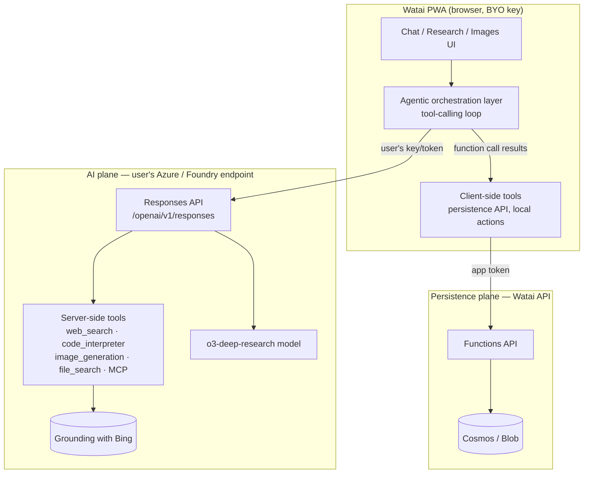

# Watai — Agentic Capabilities Spec

This folder specifies how Watai evolves from a set of **single-shot AI calls** (chat,
transcription, image generation, TTS) into an **agentic assistant** that can call tools,
search the web, run multi-step research, and generate images from an understanding of the
user's intent — matching the experience of a modern GPT-style chat product.

It is grounded in **Microsoft Foundry Agent Service** (the new Microsoft Foundry agents
platform) and the **Responses API**, and it is written to slot into Watai's existing
**two-plane, bring-your-own-key (BYO-key)** architecture documented in
[../README.md](../README.md) and [../02-architecture.md](../02-architecture.md).

> Source research: this spec was synthesized from the Microsoft Learn documentation for
> Foundry Agent Service (overview, tool catalog, web search, image generation, deep
> research, hosted-agent quickstart). Direct doc links are collected in
> [01-foundry-capabilities.md](01-foundry-capabilities.md) §10.

---

## 1. Why this exists

Today Watai can *talk*, *transcribe*, *draw*, and *speak*, but every call is a dead end:
the model answers from its own weights and the conversation history, and nothing else.
It cannot look anything up, run a calculation, browse, call an API, or chain several
steps together. The standalone image screen takes a literal prompt and returns a literal
image with **no understanding of the conversation** around it.

Modern GPT-style assistants are **agentic**: the model is given **tools**, decides when to
call them, and orchestrates **multiple steps** to complete a task. This spec defines how
Watai gains that behavior using Azure-native building blocks while preserving its privacy
posture (the user's key stays in the browser).

The two headline features the user asked for:

1. **Agentic chat with tools** — tool calling, **web search / grounding**, code execution,
   and multi-step **Deep Research** that produces a cited report.
2. **Agentic image generation** — instead of passing a raw prompt to `gpt-image`, an
   orchestrator reads the conversation context, **expands the prompt to match the user's
   intent**, generates the image, and supports iterative edits.

---

## 2. Document map

Read in order on a first pass. Each document is self-contained afterward and cross-links
the others.

| Doc | Purpose |
| --- | --- |
| [README.md](README.md) | This file. Motivation, scope, the big picture, decisions. |
| [01-foundry-capabilities.md](01-foundry-capabilities.md) | **Reference.** Everything Foundry Agent Service can do: agent types, the Responses API, the full tool catalog, deep research, models, regions, costs, security. |
| [02-architecture-and-adoption.md](02-architecture-and-adoption.md) | How Watai adopts agents. The BYO-key vs. Foundry-project tension and the three adoption paths (A direct Responses, B managed agents, C client-side functions). Endpoint shapes, auth, sequence diagrams. |
| [03-agentic-chat-and-tools.md](03-agentic-chat-and-tools.md) | The agentic chat experience: tool-calling loop, web search with citations, code interpreter, function calling, MCP. Request/response shapes and the ChatGPT-like UI. |
| [04-deep-research.md](04-deep-research.md) | The Deep Research feature: `o3-deep-research` + web search, scope clarification, progress streaming, the cited report, and provisioning. |
| [05-agentic-image-generation.md](05-agentic-image-generation.md) | The intent-aware image generation agent: context understanding, prompt expansion, the `image_generation` tool, streaming partial images, edit/inpaint, and the UI. |
| [06-data-model-and-frontend.md](06-data-model-and-frontend.md) | Concrete type, client-module, settings, and UI changes in `src/`. Capability detection. Persistence-plane impact. |
| [07-execution-roadmap.md](07-execution-roadmap.md) | Phased delivery plan, provisioning (Bicep / CLI), testing strategy, risks, cost controls, and a decisions log. |
| [08-implementation-plan.md](08-implementation-plan.md) | **Build-ready work order** for the five requested tools (web search, code interpreter, file search, function calling, image generation). File-by-file changes grounded in the current `src/ai/` code, backend + provisioning, and a phased rollout with acceptance criteria. |
| [09-provisioning-and-enablement.md](09-provisioning-and-enablement.md) | **CLI runbook** to make every tool *Available*: provisions the Azure AI Foundry account/project, model deployments, and the Bing connection (with [../../infra/foundry/provision.ps1](../../infra/foundry/provision.ps1)), then points Watai at the endpoint. Includes the PAYG/web-search caveat and verification per tool. |

---

## 3. Scope

### 3.1 In scope

- Adding an **agentic runtime layer** to Watai (a tool-calling orchestration loop) on top
  of the existing AI plane.
- **Web search / grounding** with inline citations in chat.
- **Deep Research** as a distinct, long-running task type with a cited report artifact.
- **Agentic image generation** that expands intent into prompts and supports edits.
- **Code Interpreter**, **function calling** (including calling Watai's own persistence
  API on behalf of the user), and **MCP** tool connections.
- The UI, data-model, settings, capability-detection, and provisioning changes required.

### 3.2 Out of scope (for this iteration)

- Computer Use and Browser Automation tools (preview; high risk; revisit later).
- Building Watai's own hosted multi-agent orchestrator as a product feature.
- Replacing the existing direct chat path — agentic mode is **additive** and
  capability-gated; classic chat remains the fallback.
- Voice-mode agent tool use (kept text-first initially; see roadmap).

---

## 4. The big picture

The **orchestration layer** is the new heart of the system. It calls the **Responses API**
(the single agentic entry point), receives **tool-call requests**, executes any
**client-side** tools (and lets the service execute **server-side** tools like web search),
feeds results back, and streams the final answer to the UI. See
[02-architecture-and-adoption.md](02-architecture-and-adoption.md) for the full picture.

---

## 5. Key insight: Watai is already 80% wired for this

The migration is smaller than it looks because the existing AI plane already speaks the
right protocol:

- The shared HTTP layer in [../../src/ai/http.ts](../../src/ai/http.ts) already declares
  **`/responses`** and **`/images/edits`** as valid `AiPath` values — they are defined but
  unused today.
- Auth is already `Authorization: Bearer <user key>` with the **model in the body** and
  **no `api-version`** — exactly what the Foundry `/openai/v1` surface expects.
- Streaming SSE parsing already exists (`parseSse`) and can be extended from
  `chat.completions` deltas to **Responses API events** (`response.output_text.delta`,
  `response.output_item.done`, etc.).
- Capability detection already exists in
  [../../src/ai/capabilities.ts](../../src/ai/capabilities.ts) and can be extended to probe
  for tool support and gate the agentic UI.

What is genuinely new is the **tool-calling loop**, the **tool result rendering**
(citations, code output, research steps, generated images), and the **provisioning** of
the server-side tools (Bing connection, deep-research model). Those are the substance of
the specs in this folder.

---

## 6. Key decisions (defaults)

These are the load-bearing choices the rest of the spec assumes. Each has rationale and
the alternative; items marked **OPEN** should be confirmed before building.

| # | Topic | Default decision | Rationale | Status |
| --- | --- | --- | --- | --- |
| A1 | Primary agentic surface | **Responses API** (`/openai/v1/responses`), called from the browser with the user's BYO key. | Single entry point for models + tools; reuses the existing direct-call, two-plane model; `/responses` is already in `AiPath`. | Assumed |
| A2 | Tool execution split | **Server-side tools** (web search, code interpreter, image gen, file search, MCP) run in the service; **client-side function tools** (e.g. Watai persistence API, local UI actions) run in the browser via the tool-calling loop. | Best of both: managed tools need no backend; private actions stay in the browser. | Assumed |
| A3 | Endpoint capability tiers | Detect whether the user's endpoint is a **plain Azure OpenAI** endpoint or a **Foundry project** endpoint, and **capability-gate** advanced tools accordingly. | Web search, image-gen tool, deep research need a Foundry project + connections; classic chat/image must keep working without them. | Assumed |
| A4 | Deep Research | Use the **`o3-deep-research` model + web search tool** (the standalone Deep Research tool is deprecated). Run it as an async task with a cited report artifact. | Microsoft's current guidance; standalone tool retires. | Assumed |
| A5 | Agentic image generation | A **prompt-expansion** step turns conversation context into a detailed prompt, then generates the image. **Shipping path ([08](08-implementation-plan.md) §0 D1): the plain Image API via the `generate_image` function tool** (works on any endpoint); the `image_generation` server tool (streaming/inpaint) is deferred. | Intent-aware images without requiring a Foundry project. | Revised → 08 D1 |
| A6 | Persistence of agent artifacts | Tool calls, citations, research steps, and image provenance are stored on the `Message` and synced like other content; raw tool payloads are summarized, not dumped. | Auditable, reproducible, but bounded in size. | Assumed |
| A7 | Where the Foundry project lives | Each BYO user brings their **own** project endpoint; Watai stays a pure client. **Resolved ([08](08-implementation-plan.md) §0 D2): support both endpoint kinds, capability-gated** — full suite on a project, function calling + code interpreter + plain image gen on a plain key. | Preserves the privacy invariant; serves both user profiles without Watai owning the AI plane. | Resolved → 08 D2 |
| A8 | Cost & data-boundary consent | Gate web search / deep research behind an explicit **consent + cost notice** (Bing grounding sends data outside the Azure compliance boundary and incurs cost). | Required by Grounding-with-Bing terms; protects the user. | Assumed |

Decision **A7** is now **resolved** in [08-implementation-plan.md](08-implementation-plan.md)
§0 (D2) — support both endpoint kinds, capability-gated; the underlying analysis is in
[02-architecture-and-adoption.md](02-architecture-and-adoption.md) §2.

---

## 7. Success criteria

| Dimension | Target |
| --- | --- |
| Agentic chat answers a "what happened this week in X" query | Returns a grounded answer with **visible, clickable citations**. |
| Tool transparency | Every tool call (search, code, function) is **visible** in the transcript with status and result. |
| Deep Research | Produces a structured, **cited** report for a non-trivial prompt, with live progress and a clarification step. |
| Agentic images | A vague request in context (e.g. "make a hero image for that") yields a **detailed, intent-aligned** image; edits work iteratively. |
| Backward compatibility | With a plain Azure OpenAI endpoint and tools off, **classic chat/image/voice still work** unchanged. |
| Privacy | The user's AI key still **never** reaches the Watai backend; agentic calls go browser → AI plane directly. |
| Graceful degradation | When a tool/endpoint is unavailable, the UI **explains** and falls back rather than erroring opaquely. |

---

## 8. Relationship to the existing Watai docs

This folder is a **net-new epic** layered on the v1 product. It does not contradict the
existing specs; it extends them:

- Product/UX foundation: [../01-product-spec.md](../01-product-spec.md)
- AI plane / HTTP conventions reused here: [../03-api-integration.md](../03-api-integration.md)
- Architecture & security invariants preserved here: [../02-architecture.md](../02-architecture.md)
- Data model extended in [06-data-model-and-frontend.md](06-data-model-and-frontend.md): [../04-data-model.md](../04-data-model.md)
- Roadmap dovetails with [../05-execution-plan.md](../05-execution-plan.md)

Where this spec and an older doc disagree about agentic behavior, **this folder wins** for
agentic features.
