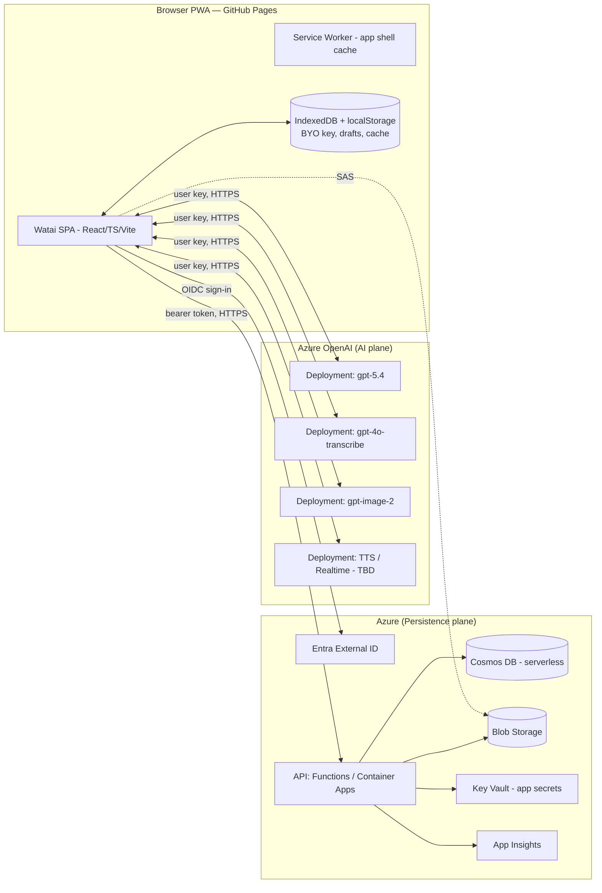
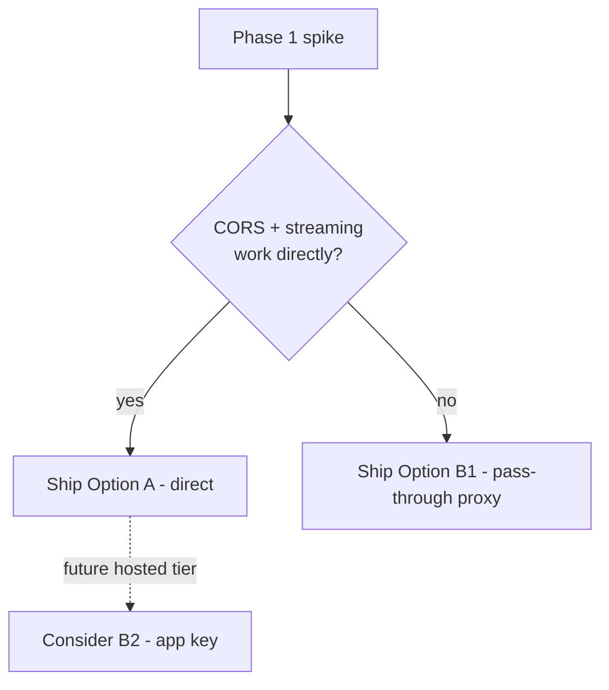
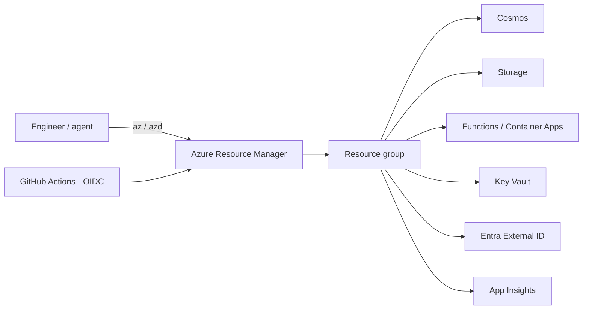

> **⚠ ARCHIVED (v1 — BYO-key, client-side generation).** This document describes the
> original two-plane architecture where the user's Azure OpenAI key lived only in the
> browser and **all generation ran client-side**. As of the 2026 direction change, Watai
> is **server-authoritative**: credentials are stored encrypted on the server and synced
> across devices, and generation runs server-side independently of the client. This file
> is kept for historical reference only. **See the current specs:**
> [02-architecture.md](../02-architecture.md) and
> [06-server-runs-and-migration.md](../06-server-runs-and-migration.md).

---

# 02 — Technical Architecture & Security

This document defines how Watai is built and operated: the two-plane system model, the
frontend, hosting on GitHub Pages, the Azure persistence backend, the AI call path
(direct vs proxy), security and key management, networking, observability, and
Infrastructure-as-Code via Azure CLI automation.

Cross-references: [README.md](README.md) · [01-product-spec.md](01-product-spec.md) ·
[03-api-integration.md](03-api-integration.md) · [04-data-model.md](04-data-model.md) ·
[05-execution-plan.md](05-execution-plan.md).

---

## 1. Architectural overview

Watai separates two concerns that have different trust models:

- **AI plane** — talking to Azure OpenAI deployments. Uses the **user's own** API key,
  which lives only in the browser. There is no shared secret to protect centrally.
- **Persistence plane** — accounts, conversation history, and image/audio assets. Uses
  the **app's** Azure backend, gated by the user's authenticated identity.

Keeping these separate means a compromise of the persistence backend cannot leak AI
keys (they are never there), and the AI path stays fast and simple (no backend hop
required for inference).



---

## 2. Frontend

### 2.1 Stack (D5)

| Concern | Choice | Rationale |
| --- | --- | --- |
| Language | TypeScript (strict) | Safety across streaming, data, and API code. |
| Framework | React 18+ | Mature ecosystem for chat UIs and streaming; large hiring pool. |
| Build/dev | Vite | Fast HMR, simple static output for GitHub Pages. |
| Routing | React Router (hash or history + SPA fallback) | See hosting caveats (§4). |
| State | Lightweight store (Zustand/Redux Toolkit) + React Query for server cache | Predictable async + cache/invalidation for sync. |
| Styling | CSS variables + a token layer (CSS Modules or a utility layer) | Drives theming from [01-product-spec.md](01-product-spec.md) §7. |
| Markdown | A vetted markdown renderer with sanitization | XSS-safe assistant output. |
| Code highlight | A syntax highlighter with lazy language loading | Performance. |
| Math | KaTeX | Inline/block math. |
| PWA | Workbox / vite-plugin-pwa | Manifest + service worker. |
| Audio | MediaRecorder + Web Audio API | Capture, VAD, visualizer. |
| Testing | Vitest + Testing Library + Playwright | Unit → E2E (see execution plan). |

> Framework choice is a recommendation, not a hard requirement. Svelte/SvelteKit
> (static adapter) is a viable alternative with smaller bundles; the architecture below
> is framework-agnostic.

### 2.2 Module structure (proposed)

```
src/
  app/            # shell, routing, providers, error boundaries
  features/
    chat/         # message list, composer, streaming, markdown
    voice/        # dictation + voice mode
    images/       # generation, viewer, gallery
    history/      # drawer, search
    settings/     # account, models/keys, personalization, data
    onboarding/   # auth + BYO-key wizard
  ai/             # Azure OpenAI clients (chat, stt, image, tts), streaming, retries
  data/           # local cache (IndexedDB), sync engine, repositories
  auth/           # Entra External ID integration, token handling
  design/         # tokens, primitives, theming
  lib/            # utils, crypto, telemetry, errors
  workers/        # service worker, audio worklet
```

### 2.3 Key client subsystems

- **AI clients** (`ai/`): one typed client per capability; all share an HTTP layer with
  `AbortController`, timeouts, retry/backoff, and streaming parsers. Detailed contracts
  in [03-api-integration.md](03-api-integration.md).
- **Sync engine** (`data/`): optimistic local writes to IndexedDB, background push/pull
  to the persistence API, reconciliation. See [04-data-model.md](04-data-model.md).
- **Crypto** (`lib/crypto`): optional Web Crypto wrapping of the BYO key behind a
  passphrase (O5); never logs secrets.
- **Telemetry** (`lib/telemetry`): privacy-preserving client events; no message content
  or keys ever leave the device via telemetry.

---

## 3. The AI call path: direct vs proxy (D3)

This is the most consequential architecture decision.

### 3.1 Option A — Direct browser → Azure OpenAI (default)

The browser sends requests straight to `https://<resource>.openai.azure.com/...` with
the user's `api-key`.

- **Pros:** simplest; lowest latency; backend never sees keys; scales for free; aligns
  with BYO-key.
- **Cons / risks:**
  - **CORS:** browser calls require the Azure OpenAI endpoint to permit the GitHub Pages
    origin. If CORS is not permitted for a given resource/region, direct calls fail and
    a proxy becomes mandatory. **This must be verified early** against a real resource
    (Phase 1 spike).
  - **Streaming:** must be validated end-to-end in the browser (fetch `ReadableStream`
    SSE parsing). Generally workable, but confirm with the target API version.
  - **Key exposure scope:** the key is the user's own and only visible to that user on
    their device and in their own network tab. Acceptable under the BYO-key model, but
    we still minimize exposure (no logging, optional at-rest encryption).

### 3.2 Option B — Thin pass-through proxy (fallback / opt-in)

A minimal Azure Function (or Container App for better streaming) forwards requests to
Azure OpenAI. Two sub-variants:

- **B1 — Pass-through user key:** the browser sends its own key to our proxy, which
  forwards it. Solves CORS; preserves BYO-key; but our infra transiently handles the
  user's key (must never log/store it).
- **B2 — App-held key:** the proxy holds a shared Azure key (in Key Vault) and gates by
  app auth + per-user quota. This abandons BYO-key for a hosted model; only adopt if the
  product pivots to "no key required". Higher security burden and cost ownership.

### 3.3 Decision

Proceed with **Option A (direct)** as the default. Build the AI HTTP layer behind an
interface so a proxy base URL can be injected without touching feature code. If the
Phase 1 CORS/streaming spike fails, switch to **B1** (pass-through) with a strict
no-log, no-store policy and a short request timeout. Reserve **B2** for a possible
future hosted tier (out of v1 scope).



---

## 4. Hosting on GitHub Pages

- **Static output only.** GitHub Pages serves the built SPA; there is no server runtime
  here (all dynamic work is on Azure or the AI plane).
- **SPA routing caveat:** GitHub Pages has no server-side rewrite. Use one of:
  - History routing + a `404.html` that boots the SPA (the common Pages SPA trick), or
  - Hash routing (`/#/c/:id`) to avoid deep-link 404s entirely.
  Decide in Phase 0; hash routing is the safest default, history routing is prettier.
- **Base path:** if hosted at `user.github.io/watai/`, configure the bundler `base` and
  router basename accordingly. A custom domain (O1) removes the subpath and simplifies
  auth redirect URIs and CSP.
- **Custom domain (O1):** recommended for cleaner auth callbacks and first-class PWA
  install; requires DNS + HTTPS (Pages provides certs).
- **Deploy:** GitHub Actions builds and publishes to Pages on push to `main` (see §10).

---

## 5. Azure persistence backend

### 5.1 Components

| Service | Role | Notes |
| --- | --- | --- |
| **Entra External ID** | User authentication (email passwordless + social). | OIDC/PKCE from the SPA; issues tokens for the API. |
| **API compute** | CRUD for threads/messages, asset SAS minting, search, sync. | **Functions (consumption)** default (D6); **Container Apps** if a streaming AI proxy is needed. |
| **Cosmos DB (serverless)** | Document store for accounts, threads, messages, settings. | Partitioned by user; see [04-data-model.md](04-data-model.md). |
| **Blob Storage** | Images and retained audio. | Per-user containers/prefixes; access via short-lived SAS. |
| **Key Vault** | App secrets (DB conn, signing, optional proxy key). | Never stores user BYO keys. |
| **Application Insights** | Backend logs, metrics, traces. | Scrubbed of content/PII. |
| **(Optional) API Management / Front Door** | Edge, throttling, WAF, custom domain for API. | Add if abuse control / custom API domain needed. |

### 5.2 API surface (persistence)

A small REST API, all endpoints requiring a valid bearer token; user identity derived
from the token (never trusted from the body):

| Method & path | Purpose |
| --- | --- |
| `GET /me` | Profile + settings. |
| `PUT /me/settings` | Update settings/personalization. |
| `GET /threads` | List threads (paged, since-cursor for sync). |
| `POST /threads` | Create thread. |
| `GET /threads/:id` | Thread + messages (paged). |
| `PATCH /threads/:id` | Rename/pin/archive/delete (soft). |
| `POST /threads/:id/messages` | Append message(s). |
| `PATCH /messages/:id` | Edit/soft-delete. |
| `POST /assets/sas` | Mint a scoped, short-lived SAS for upload/download. |
| `GET /search?q=` | Server-side search (or hand to client index). |
| `POST /export` | Generate a full data export. |
| `DELETE /me/data` | Delete all user data (GDPR). |

> The persistence API never proxies AI calls in the default design and never receives
> the user's Azure key.

---

## 6. Security

Security is treated as a first-class requirement, mapped to the OWASP Top 10.

### 6.1 BYO key custody (the central risk)

- **Storage:** the user's Azure OpenAI key is stored client-side. Default location:
  IndexedDB (origin-scoped) rather than `localStorage`, to avoid casual `localStorage`
  scraping and to support structured storage.
- **At-rest protection (O5):** offer optional encryption of the key with a user
  passphrase via Web Crypto (AES-GCM with a PBKDF2/Argon2-derived key). If declined,
  document that browser storage is only as safe as the device/profile.
- **Never transmitted to our servers** in the default (Option A) design. If the proxy
  fallback (B1) is used, the key is forwarded transiently and **never logged or
  persisted**; the proxy runs with content logging disabled and short timeouts.
- **No secrets in telemetry or error reports.** A scrubber strips anything key-shaped
  before any event leaves the device.
- **Reveal/rotate UX:** masked by default; easy to clear/rotate; "sign out of this
  device" wipes keys and cache.

### 6.2 Web app hardening

- **Content Security Policy:** restrict `connect-src` to the Azure OpenAI origin(s), the
  persistence API origin, and the auth origin; restrict `script-src`/`style-src`; no
  inline scripts. Tighten once origins are fixed (depends on O1).
- **XSS:** assistant markdown is sanitized before render; links get
  `rel="noopener noreferrer"` and `target="_blank"`; code is rendered as text, never
  `dangerouslySetInnerHTML` of unsanitized content.
- **Transport:** HTTPS everywhere; HSTS via Pages/custom domain.
- **Dependencies:** lockfiles, automated dependency audit (Dependabot), SCA in CI,
  minimal third-party scripts (ideally none beyond self-hosted libs).
- **CSRF:** the persistence API is token-bearer (no ambient cookies), which sidesteps
  classic CSRF; if cookies are ever used, add same-site + anti-CSRF tokens.
- **Clickjacking:** frame-ancestors `none`.

### 6.3 Backend hardening

- **AuthN/Z:** every endpoint validates the token signature, audience, issuer, and
  expiry; authorization derives user id from claims; object-level checks ensure a user
  can only touch their own threads/messages/assets (prevents IDOR / OWASP A01).
- **Input validation:** strict schema validation on all request bodies; reject unknown
  fields; size limits.
- **Secrets:** only in Key Vault; managed identity for service-to-service; no secrets in
  code or CI logs.
- **Rate limiting / abuse:** per-user quotas on writes and SAS minting; optional WAF via
  Front Door/APIM.
- **Storage access:** Blob access only via short-lived, least-privilege SAS scoped to
  the user's prefix; no public containers.
- **Logging:** structured logs scrubbed of content and PII; access logs retained per
  policy; alerting on anomalies.

### 6.4 Privacy & data controls

- Clear in-product explanation of what is stored where (chat content + images in Azure
  if synced; keys only on device).
- One-tap **export** and **delete all** (DELETE `/me/data` cascades Cosmos + Blob).
- Temporary chats are never persisted/synced.
- Data residency/region selection (O4) configured at provisioning time.

### 6.5 Threat model (abridged)

| Threat | Vector | Mitigation |
| --- | --- | --- |
| Key theft | Malicious script / XSS | Strict CSP, sanitization, no inline scripts, optional at-rest encryption, IndexedDB over localStorage. |
| Account data exposure (IDOR) | Guessing other users' ids | Token-derived identity + per-object ownership checks. |
| Proxy key leak (if B1) | Logging/persisting forwarded key | No-log policy, no persistence, short timeouts, code review gate. |
| Asset leak | Long-lived/public blob URLs | Private containers, short-lived scoped SAS. |
| Supply chain | Compromised dependency | Lockfiles, SCA, Dependabot, minimal deps, SRI where applicable. |
| Token theft | XSS / storage | Short-lived access tokens, refresh via PKCE, sanitization, CSP. |
| Phishing of Azure keys | Fake setup page | First-party domain, security copy, never ask for keys outside Settings. |

---

## 7. Networking, streaming, and resilience

- **Streaming:** chat uses server-sent events over `fetch` + `ReadableStream`; the parser
  tolerates partial chunks and closes code fences/markdown gracefully (UI behavior in
  [01-product-spec.md](01-product-spec.md) §5.4.1).
- **Cancellation:** every request carries an `AbortController`; the composer "stop"
  aborts the in-flight stream and keeps the partial result.
- **Timeouts & retries:** sensible per-capability timeouts; retry only idempotent
  failures (network, 5xx, 429) with exponential backoff + jitter, honoring
  `Retry-After`. Never silently retry a non-idempotent mutation.
- **Backpressure:** UI renders incrementally; large responses virtualized in the list.
- **Offline:** detect connectivity; gate AI actions; allow reading cached threads.

---

## 8. Observability & operations

- **Frontend:** privacy-preserving telemetry (route changes, feature usage counts,
  error types — never content/keys); optional client error reporting with scrubbing.
- **Backend:** App Insights traces/metrics/logs; dashboards for latency, error rate,
  Cosmos RU consumption, storage, and quota hits; alerts on SLO breaches.
- **Health:** `/health` endpoint; synthetic checks; deployment smoke tests in CI.
- **Cost monitoring:** budgets + alerts on Cosmos/Blob/Functions and (if proxy) compute.

---

## 9. Infrastructure as Code (Azure CLI automation)

Per the seed's "Azure CLI agent automation", all infrastructure is codified and
reproducible.

- **IaC tool:** Bicep modules orchestrated via the **Azure CLI** (`az deployment ...`)
  and optionally the **Azure Developer CLI** (`azd`) for one-command env bring-up.
- **Modules:** resource group, Entra External ID config, Cosmos DB (serverless),
  Storage account + containers, Function/Container App, Key Vault, App Insights,
  (optional) Front Door/APIM, role assignments (managed identity, least privilege).
- **Environments:** `dev` and `prod` parameter sets; isolated resource groups; no shared
  state.
- **Secrets:** generated/stored in Key Vault during provisioning; never echoed to logs.
- **Automation entry points:** scripted `az` commands (idempotent) and/or `azd up` /
  `azd provision`; documented teardown (`azd down` / `az group delete`) for cost control.
- **CI identity:** GitHub Actions authenticates to Azure via **OIDC federation** (no
  long-lived cloud credentials stored in GitHub).



---

## 10. CI/CD

| Pipeline | Trigger | Steps |
| --- | --- | --- |
| **Frontend** | Push to `main` / PR | Install → typecheck → lint → unit tests → build → (PR: preview) → deploy to GitHub Pages. |
| **E2E** | PR + nightly | Build → Playwright suite (mocked AI) → a11y + Lighthouse budgets → visual regression. |
| **Backend** | Changes under `infra/` or `api/` | Validate Bicep → deploy to `dev` → integration tests → promote to `prod` on tag. |
| **Security** | PR + scheduled | Dependency audit / SCA, secret scanning, CSP/headers check. |

Deployment gates: typecheck + lint + unit + E2E (mocked) must pass before Pages deploy;
infra changes require a successful `dev` apply before `prod`.

---

## 11. Environment & configuration matrix

| Setting | Dev | Prod |
| --- | --- | --- |
| Frontend host | Pages preview / local Vite | GitHub Pages (custom domain if O1) |
| Auth tenant | Dev Entra External ID | Prod Entra External ID |
| API base URL | Dev Functions | Prod Functions |
| Cosmos/Blob | Dev account | Prod account |
| AI plane | User BYO key (same in both) | User BYO key |
| Telemetry | Verbose, dev sink | Sampled, prod sink |

Build-time public config (non-secret) is injected via Vite env; secrets never ship to
the client.

---

## 12. Architecture acceptance criteria

1. A clean Azure subscription can be provisioned to a working `dev` environment via a
   single documented IaC command, and torn down cleanly.
2. The SPA builds to static assets and deploys to GitHub Pages with working deep links
   (no 404 on refresh).
3. A chat request streams directly to Azure OpenAI using a BYO key, with CORS and
   streaming verified; the proxy fallback is wired behind a config flag.
4. The persistence API enforces token-derived identity and per-object ownership (no
   IDOR), validated by tests.
5. CSP, sanitization, HTTPS, and secret-handling checks pass in CI.
6. CI authenticates to Azure via OIDC (no stored cloud credentials).

Phase-by-phase build sequencing for all of the above is in
[05-execution-plan.md](05-execution-plan.md).
