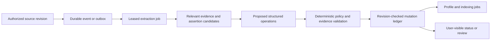
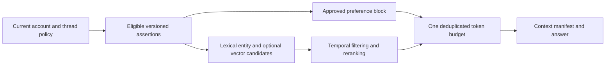

# Memory redesign: trustworthy before clever

**Decision proposal:** retain the current Azure/TypeScript architecture and
evolve toward **versioned evidence + accepted assertions + a small approved
profile + query-specific retrieval**. Ship a simpler explicit-memory mode first.
Do not adopt a temporal graph or autonomous memory agent as the initial fix.

This document synthesizes [the observed memory findings](02-memory-audit.md)
and [primary research M01-M12](research/memory-sources.md). It describes proposed
behavior, not code added by this audit.

## 1. Product goal and non-goals

The goal is not "remember more." It is:

> Remember the right things, use them only when allowed and helpful, explain
> where they came from, accept corrections predictably, and stop using them
> when asked.

A user should not need to understand embeddings, salience, taxonomy paths or
JSON replacement to manage personal memory.

Do not initially build global project knowledge, automatic emotion/personality
inference, speculative family profiles, unlimited history retention, a universal
entity graph, or self-modifying system instructions. Watai currently excludes
project-context memory from cross-thread serving; changing that is an explicit
product/permission decision, not a retrieval bug fix.

## 2. Why this choice follows from the evidence

| Option | What it solves | What it does not solve | Decision |
| --- | --- | --- | --- |
| Explicit saved items and tiny profile | Predictable correction, low surprise, low model cost | Incidental/relational long-term recall | Immediate baseline and fallback |
| Current design with a stronger extractor | Some extraction mistakes | Delivery loss, stale vectors, permission mismatch, deletion, UI races | Useful experiment later, not root fix |
| Whole-history prompting or repeated summaries | Fewer retrieval misses in some cases | Cost, irrelevant context, privacy scope, lost qualifiers in lossy rewriting | Evaluation control, not default |
| Evidence/assertion/profile hybrid | Traceable updates, temporal facts, selective context, controllable promotion | Still needs evaluation and careful migrations | Recommended destination |
| Temporal graph / linked agentic notes | Potential multi-hop/entity/time reasoning | Consent, safe deletion, transactional writes and UX are still required | Gated research option only |

LongMemEval and LoCoMo (M01/M02) demonstrate useful evaluation dimensions, not a
universal storage winner. Mem0 (M03) suggests retrieving relevant reconciliation
candidates rather than the newest few facts. Zep/Graphiti (M04/M05) motivate
provenance and distinct event/observation time, which do not require a graph
database. MemGPT/Letta (M06/M07) motivate explicit context tiers. A-Mem and ACE
(M08/M12) offer richer evolution, but increase derived-data obligations.

Lost in the Middle (M09) and ACE (M12) are not contradictory instructions to
delete or inject everything: **preserve necessary evidence separately from
selecting the evidence to show the model**. Their models/tasks differ, and
their numerical results are not forecasts for Watai.

## 3. Enforce one policy before every read and write

Replace ambiguous coupled booleans with an explicit effective policy. The
names below are illustrative API fields.

| Mode | Use saved memory | Learn from chat | User-visible meaning |
| --- | --- | --- | --- |
| Off | No | No | No cross-session personalization; stored items remain manageable |
| Saved only | Yes | No | Use approved saved items; do not automatically create/update them |
| Review learning | Yes | Propose only | Suggested items require acceptance before use |
| Automatic learning | Yes | Eligible low-risk changes only | Background promotion follows declared rules; corrections remain user-controlled |
| Temporary private run | No | No | No cross-session memory read/write; separate documented conversation/provider retention |

For new users, propose **Saved only** with an explicit invitation to enable
Review learning. This is a proposed behavior change, not silently applied by
the audit. Preserve stricter existing choices during migration. Never interpret
fresh-device defaults, a settings timeout or failed policy loading as consent.

Policy belongs to the authenticated account, not whichever browser last
backfilled defaults. Use an account policy revision/epoch and revisioned
field-level updates. Device-only choices such as microphone selection should
not overwrite account privacy policy.

Read eligibility should require owner, state, sensitivity, scope, validity and
current policy. Recheck at context assembly. Write eligibility must be checked
both when work is enqueued and immediately before committing a mutation.
Older jobs carry the policy epoch and cannot override a later revocation.

If policy cannot be established, continue the ordinary chat **without
cross-session memory**, with a truthful degraded status. Do not inject a broad
profile as a success-shaped fallback. A prompt already sent to an external
provider cannot be retroactively unsent; cancellation/retention disclosures
must acknowledge that boundary.

The existing supported API rejects temporary threads. Either temporarily disable
the misleading control, or design a real server-run retention/memory policy.
Merely forwarding a local `temporary` flag cannot repair that API mismatch.
M10/M11 show why independent read/write modes matter; their product-specific
retention periods and temporary-mode options are not imported into Watai.

## 4. Separate source evidence from assertions and projections

Recommended logical records:

| Record | Important fields | Authority |
| --- | --- | --- |
| MemoryPolicy | Owner, revision, epoch, read mode, learning mode, sensitivity rules | User/account policy service |
| Evidence | Owner-qualified thread/message ID, source revision, speaker, verified span, source time, retention class | Governed source references |
| Assertion | Owner, subject ID, predicate/value, qualifiers, scope, origin, state, revision, evidence IDs, validity interval | Revisioned memory service |
| Entity | Owner-scoped stable ID, aliases, relationship evidence, merge history | Conservative identity resolution |
| MemoryOperation | Deterministic key, expected revision, policy epoch, validated action, result/rejection reason | Mutation ledger |
| Projection | Profile/index version, assertion revisions, model/dimension/content hash, state | Rebuildable derived view |
| Exclusion/erasure record | Minimal replay barrier, affected lineage, policy revision, purge progress | Protected deletion authority |

An assertion such as "Alex was eight in March 2026" must retain its reported
time and subject, not become a timeless current age. Similarly, "used to live
in Pune" must not overwrite present residence or become a present-tense claim.
Store what the evidence supports; do not infer a birthday from approximate age.

Use state transitions such as `proposed -> accepted`, `accepted -> superseded`,
`accepted -> conflicted`, and `* -> excluded`. An outdated historical fact and
an excluded fact are different: the former may answer a permitted historical
question; the latter must not be served. Restoring a historical value is an
explicit new decision, not changing status while leaving invalidity flags.

Evidence should normally reference existing governed message content plus a
verified span rather than duplicating whole conversations. If the user chooses
to retain a memory after deleting its source, preserve the independently
approved assertion and mark source unavailability honestly; do not invent a
source quote. Sensitive raw copies have explicit retention and access rules.

Explicit saves and imports must still pass policy/validation. Neither
`confidence: 1` nor `sensitive: false` should be a default assertion of truth.
Model confidence is a feature for evaluation, not calibrated probability.
Unknown legacy origin/sensitivity remains unknown until reviewed.

## 5. Write path: durable proposals, validated mutations

There are two entry paths:

1. **Explicit save/correction/forget:** durable acknowledgement and immediate
   serving-state change. It must not depend on another chat happening later.
   Indexing can remain asynchronous if exact/lexical serving covers the saved
   record and the UI says it is indexing.
2. **Background learning:** commit a source event, enqueue recoverably, extract
   under budget, retrieve relevant existing assertions, validate evidence and
   policy, then propose/promote only allowed changes.

Do not grant free-form LLM output direct authority to invalidate existing facts.
Validate replacements before any destructive transition. Combine expected
revision, mutation and idempotency receipt atomically where the storage
partition permits. The in-batch candidate state must reflect earlier operations
so identical adds cannot create two assertions.

Cosmos transactions are scoped to a container and logical partition (B03).
Co-locate a per-user memory control/operation aggregate when that is the chosen
atomic boundary, or use a versioned head plus immutable prepared generations
and conditional publication. Do not draw a transaction across current messages,
runs, memory and jobs containers and assume it exists.

For source-to-job handoff, an outbox must share the source write's eligible
transaction boundary, or use a change-feed/reconciliation design with durable
checkpoints. A query followed by upsert is not unique job identity. Job leases,
fencing and terminal receipts are needed even if the queue itself is durable.

Keep expensive reconciliation off ordinary answer latency. Only invoke a deeper
model for measured ambiguity that cheap deterministic/semantic matching cannot
resolve. Record rejected-operation reasons, including unavailable evidence,
policy changes, stale revision and failed validation.

## 6. Read path: broad candidates, narrow justified context

Recommended sequence:

1. Authorize owner and effective policy before loading personal context.
2. Include only the explicitly approved small preference block with known
   attachment semantics; avoid automatically injecting every identity fact.
3. Retrieve from the whole eligible set using lexical/entity matching and
   optional vectors. Do not select newest 200 and call it whole-memory retrieval.
4. Check vector model, dimensions and content revision before comparison.
   A semantic edit makes old vectors ineligible until rebuilt.
5. Apply relevance, time, subject and scope before final top-k selection.
   A pin means an explicit preference for consideration, not universal relevance.
6. Deduplicate profile/retrieval items and enforce one combined context budget.
7. Emit a manifest for every supplied item, including profile-only context.
8. On timeout/provider failure, stop the expensive work and disclose degraded
   recall; use only policy-approved deterministic fallback, not all facts.

For small personal inventories, an exact in-process search behind existing
ports is acceptable. First eliminate silent windows and measure at 50/200/1,000
records. Use indexed queries or a vector service only when measured volume/RU/
latency warrants it. Pagination, tie handling and candidate completeness matter
before choosing ANN versus exact similarity.

Make the budget configurable and measured. An initial experiment might compare
400, 800 and 1,200 **total** memory-context tokens with a bounded retrieval time.
These are proposed test variants, not recommended universal defaults.
Do not carry forward a claimed 250 ms budget when the implementation waits
3,000 ms, or count the profile outside the budget.

## 7. Corrections, forgetting and restoration

Proposed semantics:

| Action | Immediate effect | Durable follow-through |
| --- | --- | --- |
| Stop using memory | No cross-session memory in newly assembled prompts | Policy epoch invalidates stale reads; saved inventory remains available |
| Stop learning | Saved use remains as selected; no new automatic commits | Pending/in-flight jobs fail commit-time epoch check |
| Correct | New accepted revision supersedes the mistaken assertion | Invalidate all dependent profile/vector versions; preserve governed audit history |
| Mark outdated | Historical validity ends without asserting erasure | Historical retrieval only when allowed and relevant |
| Forget | Assertion and derived copies immediately become ineligible | Minimal replay barrier; asynchronous payload/index/source-copy purge where applicable |
| Erase account data | Block new use/writes under account deletion policy | Durable inventory across chats, runs, memory, assets, provider state and disclosed backups |

A content hash alone cannot prevent semantic paraphrases from being relearned.
Use owner-scoped source-revision/lineage barriers for replay and a governed
assertion/predicate exclusion where the user's request requires it. An HMAC
fingerprint may reduce exposed text but remains pseudonymous/linkable data, not
anonymization. Define key rotation and retention for those markers.

New evidence related to an exclusion should not silently override it. Ask for
explicit reauthorization when appropriate, or leave a reviewable blocked
proposal. Do not preserve forgotten fact text indefinitely merely to match
future exclusions; minimize identifiers and disclose residual retention.

Every projection, delayed job, import, migration, rollback and backup restore
must consult current exclusion/policy state. Rollback can restore old code,
**not old consent**. Before serving restored databases, reapply deletion records
and rebuild or invalidate derived views. Original conversation/history, previous
replies and provider-held state need explicit user-visible scope; removing one
memory row is not global erasure.

## 8. Make the UI explain the actual system

Replace the structured taxonomy as the primary management screen with:

- **Saved:** all accepted items, searchable and paginated; simple text, origin,
  last change and scope. No item disappears because a regex cannot categorize it.
- **Suggestions:** proposed inferred changes with supporting source and
  Accept/Edit/Reject; explain whether rejecting prevents future proposals.
- **Activity:** successful/blocked/failed learning and indexing, with actionable
  reasons, not salience decimals.
- **Privacy:** independent use/learning controls, effective status, and deletion
  scope/progress.

Structured profile grouping can remain a secondary view if it is lossless.
Always provide an uncategorized path. The management view must label partial,
offline or stale data and continue pagination instead of silently claiming
100 rows is the complete inventory.

On replies, use **"Memory provided as context"**, not a causal assertion that
the model actually used every item. Include the approved profile as well as
retrieved assertions; show source, version, reason selected and controls to
correct/forget. Avoid dumping sensitive facts into the UI merely to prove a
trace; show detail only to the authorized user on demand.

Remove or disable destructive Raw JSON replacement until it operates on an
immutable revisioned snapshot with preview/commit semantics. Changing status
while editing must reconcile or discard the draft, never reinterpret it against
a different inventory. Advanced JSON is a diagnostic escape hatch, not the main
memory experience.

## 9. Proposed API contracts

| Operation | Contract |
| --- | --- |
| Read/update policy | Return revision/effective capabilities; require matching revision for updates; defaults do not overwrite existing user choices |
| Save/correct assertion | Return persisted assertion revision and indexing state; stale edits conflict rather than silently overwrite |
| List | Stable continuation semantics across equal timestamps, with explicit consistency snapshot/refresh behavior |
| Context disclosure | Complete authorized manifest across all channels; no confidential content in logs |
| Delete | Idempotent exclusion plus erasure-operation status; distinguish serving exclusion from physical cleanup |
| Import/export | Versioned portable format, validation and dry-run preview; preserve supported origin/status/temporal fields |
| Batch edit | Snapshot revision/digest and explicit operation list; no implicit deletion from paginated omissions |
| Rebuild | Return an actual persisted job ID or explicitly report unavailable; no fictional queued acknowledgement |

Prefer extending existing domain/ports/services. New infrastructure is not
required simply because these logical records exist.

## 10. Migration, rollout and exit criteria

1. Repair policy/ownership/unsafe-edit behavior before bulk backfills.
2. Inventory legacy records, source ownership, statuses, duplicate assertions,
   missing evidence and embedding versions using a dry run.
3. Preserve existing stricter consent. Migrate facts as verified, unverified or
   excluded according to evidence; do not label every legacy inference confirmed.
4. Add compatible versioned fields or shadow projections. Existing views remain
   readable during migration; do not duplicate private content unnecessarily.
5. Index accepted records independently of future chat learning. Never compare
   old/new-model vectors or rebuild from excluded sources.
6. Run synthetic shadow comparisons; shadow output does not enter user answers.
7. Offer the simple baseline and limited consenting hybrid beta with independent
   flags for learning promotion, retrieval and profile.
8. Promote only after policy gates, held-out usefulness and control-task results
   pass. Stop/rollback on any consent or deletion regression.

The centralized [evaluation specification](08-acceptance-and-evaluation.md)
supersedes the subsystem report's exploratory dataset sizing: use the 40-case
smoke set, separate development set and initial 240 held-out episodes there.
Dataset sizes remain planning choices, not statistical guarantees.

**Success means:** manual saves become predictably available; corrections
converge; forgetting survives replay/restore; no unknown-policy personalization;
all context is inspectable; relevant answers improve over no-memory and
profile-only controls without increased unsupported personalization; latency
and complete cost are acceptable to the owner.

Only after that should a graph/agentic-memory experiment be funded. It must
demonstrate additional relationship/temporal utility large enough to justify
extra inference, infrastructure, debugging and erasure obligations.
