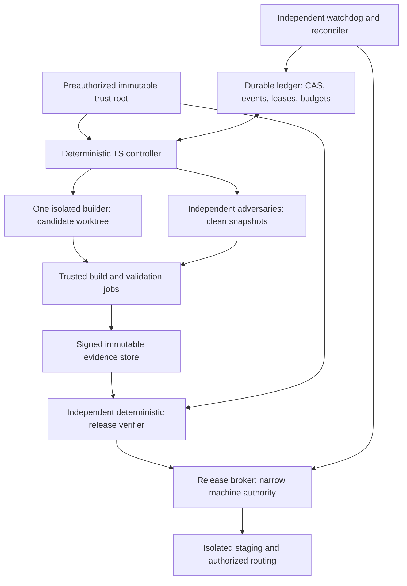

# Harness architecture and authority

**Specified future implementation.** No agent/controller in this document is
running. Gate IDs refer to `contracts/policy.json`; slice IDs to the backlog.
Research rationale: R01-R11 in [the source ledger](05-research-and-decisions.md).

## 1. Deliberately small control plane



The controller is a reducer over validated events plus an outbox dispatcher, not
an LLM choosing the next tool. A worker SDK's session storage is useful context,
not the authoritative business ledger. GitHub issue/PR text, check names,
`session.idle`, successful shell exit, or an agent's declaration of success are
not release evidence.

Use the existing Azure/Cosmos ecosystem for a **separate harness container and
identity**, not application user partitions. Co-locate each candidate aggregate,
event sequence, task receipts and outbox in one logical partition. Cross-candidate
WIP/release locks and budget reservations live in their own aggregates; acquire a
reservation before candidate dispatch, with a durable receipt and reconciler.
Do not depict a Cosmos cross-container transaction. Candidate state remains
blocked until its reservation receipt is committed. Orphan reservations expire
only after outstanding effects are reconciled.

Store content-addressed evidence in an independent immutable object store with
retention lock or equivalent write-once policy. The ledger contains hashes,
URIs, counts and opaque references, not user content or provider keys.
Local implementation rehearsal can use in-memory fake ports; production requires
durability, CAS, backup, expiry and identity conformance tests. A JSON file or
Actions concurrency group alone is not a durable scheduler.

### Why not a larger orchestration framework first?

Copilot SDK 1.0.13 is a researched worker adapter candidate, not the coordinator
or security boundary. LangGraph 1.0 provides useful typed graphs/checkpoints but
does not remove release fencing or provider side-effect reconciliation.
Temporal TypeScript offers stronger built-in durable workflow replay at the cost
of another service and operational plane; it is the preferred replacement if H03
cannot pass replay/failure tests within its bounded implementation budget.
Microsoft Agent Framework is a credible alternative for a .NET/Python/Go estate,
but is not the lowest-friction fit for this TypeScript product.

Do not silently switch frameworks mid-candidate. An adapter/engine change is a
separate control-plane candidate using the same event/evidence contracts, replay
corpus and independent policy workflow. If no preauthorized alternative exists,
stop rather than spin indefinitely on a home-grown distributed engine.

## 2. Role, identity and context contracts

Roles are **isolated principals and execution environments**, not just different
system prompts in one session. Every model invocation is bounded, scoped and
logged with model/deployment/version (or explicit unknown version), prompt hash,
SDK/runtime digest, tools, seed if supported, usage and error classification.

| Role | Inputs and output | Tools/authority | Forbidden |
| --- | --- | --- | --- |
| `controller` | Validated events + ledger state + pinned graph/policy -> guarded transition and effect intent | Deterministic reducer/CAS/outbox dispatch within current lease/budget | Candidate/policy edits, attesting results, issuing release authority, bypassing broker |
| `planner` | Audit IDs, ready DAG nodes, frozen contracts -> proposed bounded TaskSpec | Read source/docs; propose slice subdivisions with complete coverage | Editing policy, declaring done, inventing dependencies/capabilities |
| `builder` | TaskSpec, clean base SHA, relevant code, public regression suite -> patch + explanation + local results | Read/edit assigned candidate paths; sandboxed build/test; no ambient home or credentials | Protected evaluator/workflow/policy writes, release signing, production network, holdout labels |
| `test-author` | Frozen behavior contract and baseline -> additional regression/mutant proposals | Separate test worktree; baseline/candidate as data | Unilaterally accepting own new oracle, replacing fixed tests, release permission |
| `reviewer` | Raw patch, exact source/artifacts, contracts; no builder rationale initially -> reproducible defect reports | Read-only code/static tools; isolated candidate probes | Editing candidate, seeing other reviews before initial report, approving by consensus |
| `adversary` | Risk-specific invariant, clean deployed candidate, synthetic identities -> counterexamples, negative controls, traces | Isolated fault injection/browser/API tools, synthetic account only | Production attacks/data, policy edits, weakening counts, arbitrary network |
| `evaluator` | Signed fixed suite/dataset/rubric, artifact digests -> signed counts/results + evidence | Trusted runner supervises untrusted app in child sandbox; fixed external assertions | Using candidate test runner to mint attestations, leaking hidden labels, source mutation |
| `release-verifier` | All evidence hashes, expected subjects, current epoch/LKG -> deterministic permit or reject | Read attestations; verify identities, thresholds, freshness, ancestry | Building code, generating test truth, overriding failed gates |
| `release-broker` | Single-use permit + fencing epoch -> narrow stage/promote/revert receipt | Preauthorized release operations only; no general shell/model | Deciding gates, fetching mutable branch artifacts, altering consent/deletion state |
| `watchdog` | Ledger, deployment receipts, probes -> fenced recovery events | Renew/reconcile/fail closed; rollback only already authorized LKG | Implementing product changes, granting permissions, repairing by bypass |
| `policy-maintainer` | Separate policy-change request and immutable old root -> policy candidate | Separate repository/namespace; negative-control and replay corpus | Using new rules to approve itself or the blocked product candidate |

No model has secret-store read permissions. The execution host/broker injects only
the credential required by a particular approved network capability into a
separate process, not model context. A model runtime that must receive a provider
token is separate from its tool sandbox; tools cannot read its environment, home,
socket or `/proc` equivalent. If the selected platform cannot enforce this split,
use a credential-mediating proxy with fixed host/model/budget policy or block.

Test-author proposals become fixed tests only through the independent evaluator
pack workflow. The evaluator owner cannot sign a replacement evaluator pack and
approve a product with it in the same run. Behavioral truth comes from versioned
contracts, deterministic synthetic event histories and reproducible observations,
not from an agent authoring both the expected and actual answer.

### Context budget and handoff

Each TaskSpec names: slice ID, run ID, source/base SHA, policy/graph version,
allowed file roots, dependency artifacts, explicit non-goals, acceptance IDs,
max attempts/tokens/cost, deadline, fixture manifest and lease epoch. Read only
relevant audit sections and contracts, then code reachable from the slice.
Do not append the entire team transcript or raw production logs.

At 70% context utilization, the worker writes a bounded handoff containing
changed paths/SHAs, commands, observations, unresolved hypotheses and next action;
the controller validates referenced artifacts before a fresh session consumes
it. Handoffs and repo instructions are untrusted content, never policy. Fresh
workers reconstruct current state from the ledger and source digests, not a
summary claiming "all done." No cross-user or cross-candidate agent memory.

## 3. Durable typed workflow

`contracts/workflow.json` is a data transition table. A future TypeScript adapter
must parse the schema and implement an exhaustive discriminated union for state
and event. Unsupported schema versions/events reject before side effects.

```typescript
type Envelope = {
  schemaVersion: "1.0";
  runId: string;
  eventId: string;
  expectedRevision: number;
  fencingEpoch: number;
  sourceSha: string;
  policySha256: string;
  eventType: string; // narrowed to the versioned graph event union on decode
  payloadSha256: string;
};
type EffectIntent = {
  effectId: string;
  runId: string;
  epoch: number;
  kind: "worker" | "validation" | "stage" | "promote" | "rollback";
  inputSha256: string;
  deadline: string;
};
```

For a transition, validate schema, event ID uniqueness, revision, live lease,
current epoch, source/policy binding and allowed actor. The controller commits
new state, event receipt and effect intent atomically in the candidate partition.
Only then dispatch. Effect ID is the idempotency key. A repeated identical event
returns its receipt; same ID/different payload quarantines the candidate.
Time is provided by a trusted clock/event, not a model or replay-time wall clock.

The core path is:
`QUEUED -> PREFLIGHT -> SPEC_LOCKED -> BUILDING -> VALIDATING -> ADVERSARIAL ->
STAGING -> RELEASE_READY -> PROMOTING -> OBSERVING -> EXPANSION_READY ->
EXPANDING -> FINAL_OBSERVING -> SHIPPED`.
The initial promotion is cohort-scoped. Widening requires a **different**
single-use full-scope permit after independent cohort observation, never reuse
of the consumed initial permit. All states from PROMOTING onward have rollback/
safe-withdrawal paths because public effects may already exist.
`FAILED`, `TIMED_OUT`, `CANCEL_REQUESTED`, `QUARANTINED`, `ROLLING_BACK`,
`ROLLED_BACK`, `CANCELLED`, `BLOCKED_SAFE`, and `REJECTED` have explicit paths.
Terminal candidates never reopen; a retry after terminal creates a new run
referencing the old immutable record. Rebase/source, policy or dataset change
invalidates affected evidence and creates a new candidate subject.

### Leases, fencing, retries and ambiguous effects

Controller lease: 90 seconds, heartbeat every 20 seconds. Worker lease:
120 seconds, heartbeat every 30 seconds. No effect begins with less than
30 seconds remaining. Store time/ETag determines expiry; measured clock skew
over 5 seconds blocks dispatch. New claim increments a monotone epoch.
Old heartbeats, completion events and broker calls are rejected after fencing.

The release broker, not only the controller, checks the current release epoch.
It obtains an exclusive lease, records intent before an external request and
reconciles the provider operation/result afterward. Providers do not necessarily
enforce our fencing token. Therefore a new broker must not issue a conflicting
operation until an old in-flight request is positively reconciled or known
finished. An unbounded/unknown platform operation means `BLOCKED_SAFE`, not
"lease expired, try another deployment."

Retry policy is persisted per candidate, not reset by restarting a process:
three builder attempts total, two clean infrastructure reruns, one independent
implementation strategy switch; never more than three builder attempts overall.
Exponential 30/120/480-second waits with recorded bounded jitter, respecting
`Retry-After`. A failed behavioral assertion is not an infrastructure flake.
No retry can discard failure denominators, negative controls or earlier artifacts.

Tool deadline 120 seconds by default (named build/test tasks up to 20 minutes);
builder attempt 45 minutes, validation 30 minutes, stage/observation 60 minutes
per stage; whole candidate 6 active hours excluding bounded observation windows.
Stop new work after deadline, cancel, await/fence children, reconcile external
effects, then record terminal status. Killing an SDK session is not proof that
its tool subprocesses or remote model job stopped.

For model/provider actions lacking idempotency or queryable receipts: record
`effect_outcome_unknown`; reserve worst-case cost, do not repeat paid mutation.
Read/reconcile by provider operation ID if supported; otherwise terminally fail
the task with explicit uncertainty and keep product state isolated. Do not claim
exactly-once external inference. Product execution must use the same distinction.

## 4. Permissions and hostile input

Sandbox workers have no production route, Azure credentials, signing key,
GitHub write token, Docker host socket, or other session directory. Build/dependency
scripts run as hostile code in a fresh disposable worker with no credentials.
Use pinned OS/toolchain images and allowlisted package mirrors with lockfile
integrity checks. No arbitrary MCP discovery, package auto-install, plugins or
runtime extensions. SDK empty mode, per-run home, explicit tool allowlist,
no ambient auth and no ask-user callback are required where supported.

Permission handler default is deny; never use `approveAll` or global
`--allow-all`. SDK permissions are defense in depth, not OS isolation.
Reapply injected managed policy on **every resume**; current docs say it is not
persisted. Reject attempts to add tools/network hosts through a session handoff.
Permission/UI prompts and elicitation return structured `UNSUPPORTED_INTERACTION`
and stop that task; never wait forever or click a login/CAPTCHA.

Egress uses host/path/method/model allowlists, pinned TLS verification, DNS/IP
checks including redirects and metadata/private ranges, byte/time limits and
content redaction. Research workers may read approved public docs through a
separate fetch proxy; code and user data cannot leave via that proxy. Provider
requests are the sole approved code-to-model channel and must be covered by
preauthorized data-processing policy. Evidence upload permits content-addressed
objects, not arbitrary destinations.

Synthetic credentials and poisoned repository README/comments/tool results test
exfiltration resistance. Never place genuine secrets in negative controls. Default
telemetry retains IDs, counts and reason codes, not raw prompts, SAS query strings,
fact text or credentials. Synthetic evaluation payloads are separately labeled.
Release/evaluator evidence is retained 180 days minimum; release manifests and
revocation/deletion lineage follow the product's longer declared retention.

## 5. Adversarial loop: counterexamples, not voting

For each slice run a contract-specific reviewer and at least one adversary in
fresh contexts. Trust-critical memory/ownership/worker/policy changes require two
different model families or a deterministic adversary plus a different-family
reviewer. Missing diversity is a blocked capability, not two renamed copies.
Availability of a second model is checked in preflight; no subscription is created.

Reviewer reports are sealed before seeing each other or builder explanations.
Reports use invariant ID, exact SHA, reproducible fixture/command, expected and
observed state, severity and evidence references. Deterministic failures block.
A plausible high-impact concern without a reproducer receives at most two bounded
independent repro attempts; unresolved concern quarantines the slice rather than
being voted down. Clearly disproved concerns retain the disproving evidence.

| Adversarial family | Required experiment |
| --- | --- |
| Ownership | Two principals with colliding public IDs, foreign raw refs, account-switch while outbox drains |
| Consent/deletion | Revoke during read/extract/commit; forget then replay/import/rebuild/restore; preserve newest epoch |
| Worker state | Duplicate/out-of-order queue events, lease steal, crash each write/dispatch boundary, stale finalizer |
| Agent manipulation | Malicious instructions in source/comments/web/tool output, forged "tests passed", secret canary |
| CI/reward hacking | Remove/skip tests, swap runner, lower threshold, change holdout, falsify success JSON/check name |
| Memory quality | Quoted instructions, third-party subjects, temporal contradiction, unrelated memory, silent profile injection |
| Release | Digest substitution, stale permit, rollback racing promote, unhealthy candidate route, cross-version queue delivery |

Negative controls are **intentionally failing isolated mutants**: each must be
detected by its relevant gate before that gate's passing result is trusted.
Every run includes at least one policy/identity tamper control and one relevant
behavior mutant. Critical suites must kill 100% of the named invariant mutants;
aggregate mutation percentage never hides a surviving authorization mutant.
Do not mutate production or the signed candidate; mutants get different digests.

## 6. Coordinator recovery and policy evolution

An independent watchdog outside the candidate job observes a 60-second heartbeat.
After three missed samples it freezes new dispatch, obtains a higher epoch after
lease expiry, reloads the last valid signed snapshot and replays journal receipts.
It verifies immutable roots before reconciling effect intents, release routes,
active jobs and cost reservations. Ledger unavailable => freeze promotion and
leave routing on LKG; ledger divergence => quarantine both histories, no guessing.
Backups every five minutes plus append-event replication target RPO <=5 minutes,
RTO <=15 minutes in isolated exercises. Release permits are independently stored
so ledger loss cannot authorize an unknown candidate.

A bad controller update is rolled back by the watchdog using a signed previous
controller artifact with backward-readable event schema. Migration is
expand/read-both/write-new first, destructive compaction only after a separately
validated rollback window. Test process death, storage outage, corrupt snapshot,
duplicate dispatcher, expired credential and restart at every effect boundary.
H03/H06 must demonstrate recovery before unattended product promotion.

Policy evolution is a **different workflow and principal**. Old rules and a
non-editable constitutional floor validate new rules against historical passing
and failing traces, malicious fixtures, schema evolution and resource caps.
Two independently produced attestations plus a deterministic old-root verifier
are required. New policy never approves its own validation; activation is
prospective only and invalidates outstanding product permits. A blocked product
cannot be passed by removing its failed test. Material weakening, larger spending,
new network/identity scopes or removal of floor controls is outside preauthorization:
record `BLOCKED_SAFE`. Changing requirements is not autonomous self-approval.
