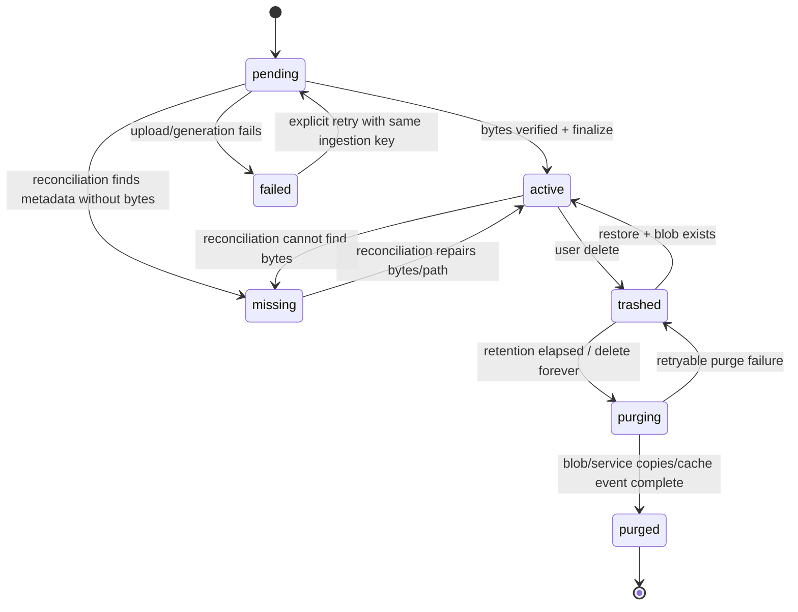

# Watai Library — Implementation-Ready Product, UX, and Architecture Specification

**Status:** Build contract

**Date:** 2026-07-19

**Parent proposal:** [library-proposal-spec.md](library-proposal-spec.md)

**Extends, does not replace:**

- [01-product-spec.md](01-product-spec.md)
- [02-architecture.md](02-architecture.md)
- [03-api-integration.md](03-api-integration.md)
- [04-data-model.md](04-data-model.md)
- [05-execution-plan.md](05-execution-plan.md)
- [ui-design/README.md](ui-design/README.md) and its token, component, interaction, responsive, and content contracts

---

## 0. How to use this specification

This document turns the approved Library proposal into an implementation contract. It is organized as a traceable chain:

```text
User need -> scenario -> user can -> task flow -> surface/component -> API/data contract -> acceptance/evaluation
```

IDs are stable and must appear in implementation pull requests and tests:

- `LN-*`: Library user need.
- `LS-*`: scenario.
- `LC-*`: “User can” capability.
- `LF-*`: task flow.
- `LV-*`: view/surface.
- `LP-*`: component/pattern.
- `LA-*`: API contract.
- `LD-*`: data/domain contract.
- `LE-*`: event/sync contract.
- `LAC-*`: acceptance criterion.
- `LSL-*`: implementation slice.

When this document conflicts with a generic existing UI rule, the Library-specific rule wins only for Library surfaces. Existing semantic tokens, primitives, app shell, authentication, repository patterns, SAS security, server-authoritative generation, and responsive behavior remain authoritative.

---

## 1. Locked decisions

These decisions close the proposal’s open questions for this implementation cycle.

| ID | Decision | Consequence |
| --- | --- | --- |
| D-L01 | Every eligible durable upload/output is automatically indexed in Library. | No Publish/Save step for normal chats. Temporary-thread content is excluded unless explicitly saved. |
| D-L02 | Library items are account-owned; chats reference them. | Deleting a chat preserves Library items by default. New blobs use account-level paths. |
| D-L03 | Application-level Recently deleted retention is 7 days. | Delete is reversible for 7 days; Delete forever purges immediately. Azure Blob soft delete remains optional infrastructure defense, not product state. |
| D-L04 | `/library` is canonical. `/images` redirects to `/library?kind=image`. | One catalog; image creation remains an action/subview within the image-filtered Library. |
| D-L05 | Phase 1 supports rename and star. User tags/folders are later. | Useful organization without prematurely designing collections. |
| D-L06 | Phase 1 preview: images, PDF, text/Markdown/code/JSON, CSV. XLSX/DOCX/PPTX/archive are metadata + download-first. | Dependencies and security remain bounded. |
| D-L07 | No product storage quota in this cycle. | Show actual usage and cost estimate; do not manufacture scarcity. |
| D-L08 | Copy prompt copies original user prompt. Copy recipe defaults to human-readable text and offers JSON from a menu. | Clear provenance and automation support. |
| D-L09 | Purging a source does not preserve hidden source bytes for descendants. | Descendants survive and show source tombstones. |
| D-L10 | Web-search image URLs do not enter Library automatically. | Only a durable “Use”/“Save to Library” attachment is indexed. |
| D-L11 | One physical blob per Library item in v1. Exact duplicate hashes are flagged, not physically deduplicated. | Deletion/refcount complexity is deferred. |
| D-L12 | No destructive Library migration runs automatically during deploy. | Migration is explicit, dry-run-first, resumable, and separately approved. |

---

## 2. Product definition

### 2.1 Definition

**Library** is the account-level catalog and lifecycle owner for durable content uploaded to or created by Watai. It provides discovery, type-appropriate inspection, provenance, reuse, download, source navigation, and storage management across threads and Image Studio.

### 2.2 Library item

A Library item is one durable logical content object with:

- one stable account-scoped ID;
- one current durable blob or a lifecycle tombstone;
- immutable origin and primary creation context;
- bounded historical metadata;
- optional generation/artifact lineage;
- zero or many message/thread references; and
- user-managed title/star state.

### 2.3 Eligible content

Included:

- persisted user-uploaded chat images, audio, and supported files;
- thread documents whose original bytes are persisted in Watai Blob Storage;
- generated chat images;
- Image Studio outputs/remixes;
- code-interpreter artifacts;
- direct Library uploads.

Excluded:

- `MessageRecord.webImages` external URLs until converted to a durable attachment;
- citations and web pages;
- transient dictation/TTS audio;
- memories;
- skill packages;
- model/container scratch files;
- temporary-thread items unless explicitly saved;
- failed generations with no durable bytes (these may have diagnostic records, but are not active Library items).

Legacy thread documents that exist only as Azure OpenAI file/vector IDs have no Watai-owned original
to download or migrate. The inventory classifies them as **service-only documents**. They do not
become active Library items until their original bytes are recovered/re-uploaded; the migration must
not pretend the Azure OpenAI derived copy is the canonical user file.

---

## 3. Actors and contexts

| Actor/context | Description | Library implications |
| --- | --- | --- |
| Signed-in owner | The only v1 Library principal. | Full read/write lifecycle for own `/userId` partition. |
| Temporary-thread user | Uses a non-durable conversation. | No automatic Library ingestion; explicit Save to Library required before expiry. |
| Offline client | Reads cached chat/history and may stage actions. | Can browse cached metadata/previews; destructive actions require connection. |
| Another signed-in device | Same account, independent cache. | SignalR/sync propagates lifecycle changes and cache eviction. |
| Background workers | Run/image/purge/reconcile workers. | Idempotent transitions; no user content in logs. |
| Source thread | Primary context where item originated. | May be archived/deleted without owning item lifetime. |
| Referencing thread | Reuses an existing item. | Stores `libraryItemId`, never gains deletion ownership. |

---

## 4. Exhaustive user needs

### Discovery and recognition

- **LN-001** Find an item without knowing the source thread.
- **LN-002** Find an item by filename/title.
- **LN-003** Find a generated image by prompt words.
- **LN-004** Find an item by source thread title.
- **LN-005** Find items by type/class.
- **LN-006** Distinguish uploaded from generated content.
- **LN-007** Narrow by date range and recency.
- **LN-008** Review largest or oldest items.
- **LN-009** Recognize images visually without opening each item.
- **LN-010** Recognize non-image items from readable metadata.
- **LN-011** See starred items quickly.
- **LN-012** Understand when no result exists and clear filters easily.

### Inspection

- **LN-013** Preview content in a format appropriate to its type.
- **LN-014** See file type, bytes, dimensions/pages/sheets where available.
- **LN-015** See current availability/lifecycle state.
- **LN-016** See original and user-renamed titles without losing original filename.
- **LN-017** See source context and creation time.
- **LN-018** Download original bytes reliably on desktop and iOS.
- **LN-019** Copy text/source content when supported.
- **LN-020** Refresh an expired preview URL without losing context.

### Provenance and reproduction

- **LN-021** See the original generation prompt.
- **LN-022** Distinguish original prompt from revised/model-expanded prompt.
- **LN-023** See model, output settings, and tool used.
- **LN-024** See every recorded reference/source item in order.
- **LN-025** See parent and derived outputs.
- **LN-026** Know when historical lineage is unavailable rather than inferred.
- **LN-027** Copy the original prompt.
- **LN-028** Copy a reproducible human-readable recipe.
- **LN-029** Copy the recipe as structured JSON.

### Reuse and continuation

- **LN-030** Add one or more items to the current composer.
- **LN-031** Start a new thread with an item staged, not auto-sent.
- **LN-032** Choose image reuse mode: analyze/attach versus generation reference.
- **LN-033** Reuse documents through the existing indexing/file pipeline.
- **LN-034** Remix an image while preserving stable reference IDs.
- **LN-035** Avoid re-uploading or physically duplicating bytes.
- **LN-036** Understand when a format is download-only and cannot be attached.
- **LN-037** Remove a staged Library item before sending.

### Context navigation

- **LN-038** Jump to the exact source message.
- **LN-039** Receive a clear result when the source conversation was deleted.
- **LN-040** Open an Image Studio-origin item in its creation workspace.
- **LN-041** Distinguish source context from later usage contexts.

### Organization

- **LN-042** Rename an item without changing its physical filename or history snapshot.
- **LN-043** Star/unstar an item.
- **LN-044** Sort by name, date, and size.
- **LN-045** Switch between mixed list and image gallery without losing filters.
- **LN-046** Retain query/filter state while opening and closing detail.

### Storage understanding and cleanup

- **LN-047** See active bytes, trash bytes, and item counts.
- **LN-048** See bytes by type, origin, and source thread.
- **LN-049** Understand estimated capacity cost and exclusions.
- **LN-050** See when usage was last reconciled.
- **LN-051** Review large/old items before deleting.
- **LN-052** Multi-select and batch delete/download.
- **LN-053** Understand affected chats and descendants before deletion.
- **LN-054** Move items to Recently deleted.
- **LN-055** Restore trashed items during the retention window.
- **LN-056** Permanently delete one, many, or all trashed items.
- **LN-057** Know exactly when capacity is reclaimed.
- **LN-058** Review exact duplicates without assuming they are physically deduplicated.
- **LN-059** See missing/orphaned state without a broken preview.

### Chat continuity and safety

- **LN-060** Keep chat history understandable after media deletion.
- **LN-061** Restore chat media automatically when a Library item is restored.
- **LN-062** Ensure purged items are absent from future model context.
- **LN-063** Preserve derived outputs when a source is deleted.
- **LN-064** Delete a thread while preserving its Library items by default.
- **LN-065** Optionally trash only items created by the deleted thread.
- **LN-066** Never trash an item merely reused by the deleted thread.
- **LN-067** Evict permanently deleted bytes from local device caches.

### Reliability, privacy, and accessibility

- **LN-068** Use the Library across devices with consistent state.
- **LN-069** Know temporary-thread content is not retained automatically.
- **LN-070** Use every workflow with touch, mouse, and keyboard.
- **LN-071** Use the Library at 320–2560px, portrait/landscape, and large text.
- **LN-072** Receive explicit loading, empty, offline, error, missing, and retry states.
- **LN-073** Avoid public URLs and secret leakage.
- **LN-074** Recover from partial ingestion, migration, or purge failures without duplicates.
- **LN-075** Understand that capacity estimate is not the final Azure bill.

---

## 5. Exhaustive scenarios

| ID | Scenario | Primary needs |
| --- | --- | --- |
| LS-001 | User remembers a generated image but not the chat. | 001, 003, 009 |
| LS-002 | User searches a known filename. | 002, 010 |
| LS-003 | User browses all generated PDFs from the last month. | 005–008 |
| LS-004 | User reviews starred work products. | 011, 043 |
| LS-005 | Search has no matches because filters conflict. | 012, 072 |
| LS-006 | User opens a generated image and inspects prompt/references. | 013–025 |
| LS-007 | Historical image lacks complete reference lineage. | 026 |
| LS-008 | User previews PDF pages. | 013, 018 |
| LS-009 | User previews/copies Markdown or code. | 013, 019 |
| LS-010 | User opens XLSX and receives deliberate download-first details. | 013, 036 |
| LS-011 | SAS expires while detail is open. | 020, 072 |
| LS-012 | User starts a new thread from one image. | 031, 032, 035 |
| LS-013 | User adds two old images and a PDF to current chat. | 030, 032, 033 |
| LS-014 | User remixes a generated image using its original references. | 024, 034 |
| LS-015 | User tries to attach a ZIP that is download-only. | 036 |
| LS-016 | User removes a staged Library item. | 037 |
| LS-017 | User jumps from item detail to source message. | 038 |
| LS-018 | Source thread has been deleted. | 039 |
| LS-019 | Item came from Image Studio. | 040 |
| LS-020 | Item has been reused in several threads. | 041 |
| LS-021 | User renames and stars a file. | 042, 043 |
| LS-022 | User switches gallery/list and returns from detail. | 045, 046 |
| LS-023 | User checks storage totals and cost estimate. | 047–050, 075 |
| LS-024 | User reviews largest files by thread. | 048, 051 |
| LS-025 | User batch-downloads selected items. | 052 |
| LS-026 | User deletes selected active items. | 053, 054 |
| LS-027 | User restores one trashed item. | 055, 061 |
| LS-028 | User permanently deletes trash. | 056, 057, 067 |
| LS-029 | User reviews duplicate hashes. | 058 |
| LS-030 | Metadata exists but blob is missing. | 059, 072, 074 |
| LS-031 | User opens a chat containing trashed media. | 060, 061 |
| LS-032 | User opens a chat containing purged media. | 060, 062 |
| LS-033 | Source image was purged; derivative remains. | 063 |
| LS-034 | User deletes a thread and keeps Library items. | 064 |
| LS-035 | User deletes a thread and trashes originated items. | 065, 066 |
| LS-036 | Same Library change arrives from another device. | 067, 068 |
| LS-037 | User uploads in a temporary thread. | 069 |
| LS-038 | User explicitly saves temporary content. | 069 |
| LS-039 | User browses Library offline. | 068, 072 |
| LS-040 | User attempts destructive action offline. | 072 |
| LS-041 | User navigates and selects via keyboard. | 070 |
| LS-042 | User operates on touch without hover. | 070, 071 |
| LS-043 | User uses large text/mobile landscape. | 071 |
| LS-044 | Ingestion retries after worker redelivery. | 074 |
| LS-045 | Migration dry run finds orphan/duplicate paths. | 074 |
| LS-046 | Purge deletes blob but event delivery is delayed. | 067, 068, 074 |
| LS-047 | External web image appears in chat but not Library until saved. | 030, 073 |
| LS-048 | User direct-uploads from Library. | 001, 030 |
| LS-049 | User clears all filters and reloads. | 012, 046 |
| LS-050 | Item generation/upload failed before durable bytes. | 015, 072 |

---

## 6. Exhaustive “User can” capabilities

### Browse/search/filter

- **LC-001** User can open Library from primary navigation.
- **LC-002** User can browse all active items.
- **LC-003** User can search name, original filename, prompt, revised prompt, and source-thread snapshot.
- **LC-004** User can filter by kind.
- **LC-005** User can filter by uploaded/generated origin.
- **LC-006** User can filter by source thread.
- **LC-007** User can filter by created date range.
- **LC-008** User can filter by starred.
- **LC-009** User can switch Active/Recently deleted.
- **LC-010** User can sort Newest, Oldest, Largest, and Name.
- **LC-011** User can clear one filter or all filters.
- **LC-012** User can paginate/infinite-scroll without duplicate items.
- **LC-013** User can refresh data without losing query state.

### View/inspect

- **LC-014** User can open item detail.
- **LC-015** User can view images full-screen and navigate filtered images.
- **LC-016** User can preview PDF pages.
- **LC-017** User can view/copy supported text formats.
- **LC-018** User can preview bounded CSV rows/columns.
- **LC-019** User can view metadata/download unsupported-preview formats.
- **LC-020** User can see item origin, size, MIME, dates, state, model/tool, and source.
- **LC-021** User can refresh expired preview access transparently.
- **LC-022** User can download one item.
- **LC-023** User can download selected items.

### Provenance

- **LC-024** User can copy original prompt.
- **LC-025** User can inspect revised prompt separately.
- **LC-026** User can copy human-readable recipe.
- **LC-027** User can copy JSON recipe.
- **LC-028** User can inspect ordered reference items.
- **LC-029** User can inspect parent/derived relationships.
- **LC-030** User can see partial-provenance labels.
- **LC-031** User can open an available reference item.
- **LC-032** User can see a tombstone for a deleted reference.

### Reuse/context

- **LC-033** User can add one/many compatible items to current composer.
- **LC-034** User can start a new chat with staged items.
- **LC-035** User can choose Analyze or Use as reference for images.
- **LC-036** User can remix an image.
- **LC-037** User can remove staged Library items.
- **LC-038** User can see and understand download-only items.
- **LC-039** User can save an eligible external web image into Library.
- **LC-040** User can upload directly into Library.

### Context navigation/organization

- **LC-041** User can show a chat-origin item in its exact source message.
- **LC-042** User can open a Studio-origin item in Image Studio context.
- **LC-043** User can see source-unavailable state.
- **LC-044** User can rename an item.
- **LC-045** User can star/unstar an item.
- **LC-046** User can switch list/gallery views while retaining filters/scroll.

### Selection/lifecycle/storage

- **LC-047** User can enter/exit selection mode.
- **LC-048** User can select all visible eligible items.
- **LC-049** User can see selected count/bytes.
- **LC-050** User can move selected active items to trash.
- **LC-051** User can restore one/many trashed items.
- **LC-052** User can permanently delete one/many trashed items.
- **LC-053** User can empty Recently deleted.
- **LC-054** User can see affected chats/descendants before deletion.
- **LC-055** User can view active/trash usage totals.
- **LC-056** User can view usage by kind/origin/thread.
- **LC-057** User can sort cleanup results by size/age.
- **LC-058** User can review exact-duplicate groups.
- **LC-059** User can see capacity estimate, rate/SKU/region timestamp, and exclusions.
- **LC-060** User can trigger storage reconciliation when stale (admin/maintenance action in v1).

### Thread/deletion continuity

- **LC-061** User can delete a thread while preserving Library items.
- **LC-062** User can delete a thread and trash only items created there.
- **LC-063** User can restore trashed chat media from a tombstone.
- **LC-064** User can copy prompt from a purged generated-image tombstone.
- **LC-065** User can understand that purged bytes cannot be restored.

### Accessibility/resilience

- **LC-066** User can perform all actions via touch.
- **LC-067** User can perform all actions via keyboard.
- **LC-068** User can browse cached metadata offline.
- **LC-069** User can retry recoverable load/download errors.
- **LC-070** User can distinguish pending/active/trashed/purging/purged/missing/failed states.

---

## 7. Traceability matrix

| Need group | Scenarios | User cans | Primary flows | Primary views |
| --- | --- | --- | --- | --- |
| Discovery | LS-001–005, 049 | LC-001–013 | LF-001–004 | LV-001, LV-002 |
| Inspection | LS-006–011 | LC-014–023 | LF-005–010 | LV-003–008 |
| Provenance | LS-006–007, 014, 033 | LC-024–032 | LF-011–013 | LV-004, LV-009 |
| Reuse | LS-012–016, 047–048 | LC-033–040 | LF-014–019 | LV-010, LV-011 |
| Context/organization | LS-017–022 | LC-041–046 | LF-020–023 | LV-003, LV-004 |
| Cleanup/storage | LS-023–030 | LC-047–060 | LF-024–031 | LV-012–015 |
| Chat continuity | LS-031–036 | LC-061–065 | LF-032–036 | LV-016, existing Chat/Thread confirm |
| Accessibility/resilience | LS-039–046, 050 | LC-066–070 | All + LF-037–040 | All |

Every implementation test must cite at least one `LN`, `LS`, `LC`, and `LAC` ID.

### 7.1 Scenario-level capability and flow coverage

| Scenario | Required user cans | Exercised flow(s) |
| --- | --- | --- |
| LS-001 | LC-001–004, LC-014 | LF-001, LF-002, LF-005 |
| LS-002 | LC-003, LC-014 | LF-002, LF-005 |
| LS-003 | LC-004–007, LC-010–012 | LF-002, LF-003 |
| LS-004 | LC-008, LC-014, LC-045 | LF-002, LF-005, LF-023 |
| LS-005 | LC-011, LC-069 | LF-002 |
| LS-006 | LC-014–015, LC-020, LC-024–032 | LF-005, LF-006, LF-011, LF-012 |
| LS-007 | LC-030 | LF-011, LF-012 |
| LS-008 | LC-016, LC-021–022 | LF-005, LF-007, LF-010 |
| LS-009 | LC-017, LC-019 | LF-005, LF-008 |
| LS-010 | LC-019, LC-022, LC-038 | LF-005, LF-010 |
| LS-011 | LC-021, LC-069 | LF-006–010 |
| LS-012 | LC-034–035, LC-037 | LF-014, LF-016 |
| LS-013 | LC-033, LC-035 | LF-015–017 |
| LS-014 | LC-028–032, LC-036 | LF-012, LF-013 |
| LS-015 | LC-038 | LF-018 |
| LS-016 | LC-037 | LF-014–016 |
| LS-017 | LC-041 | LF-020 |
| LS-018 | LC-043 | LF-020 |
| LS-019 | LC-042 | LF-021 |
| LS-020 | LC-020, LC-041 | LF-005, LF-020 |
| LS-021 | LC-044–045 | LF-022, LF-023 |
| LS-022 | LC-046 | LF-004, LF-005 |
| LS-023 | LC-055–060 | LF-024 |
| LS-024 | LC-056–057 | LF-025 |
| LS-025 | LC-047–049, LC-023 | LF-026, LF-027 |
| LS-026 | LC-047–050, LC-054 | LF-026, LF-028 |
| LS-027 | LC-051, LC-063 | LF-029, LF-032 |
| LS-028 | LC-052–053, LC-065 | LF-030, LF-031 |
| LS-029 | LC-058 | LF-025 |
| LS-030 | LC-070, LC-069 | LF-005, LF-038 |
| LS-031 | LC-063 | LF-032 |
| LS-032 | LC-064–065 | LF-033 |
| LS-033 | LC-029, LC-032 | LF-012, LF-033 |
| LS-034 | LC-061 | LF-034 |
| LS-035 | LC-062 | LF-035 |
| LS-036 | LC-068 | LF-036 |
| LS-037 | LC-070 | LF-019, LF-038 |
| LS-038 | LC-040 | LF-019 |
| LS-039 | LC-068–069 | LF-001, LF-005, LF-037 |
| LS-040 | LC-069 | LF-037 |
| LS-041 | LC-067 | LF-001–036 as applicable |
| LS-042 | LC-066 | LF-001–036 as applicable |
| LS-043 | LC-066–067 | LF-001–036 as applicable |
| LS-044 | LC-070 | LF-038 |
| LS-045 | LC-070 | LF-040 |
| LS-046 | LC-068, LC-070 | LF-036, LF-039 |
| LS-047 | LC-039 | LF-019 |
| LS-048 | LC-040 | LF-019 |
| LS-049 | LC-011, LC-013 | LF-002 |
| LS-050 | LC-070, LC-069 | LF-019, LF-038 |

---

## 8. Task flows

### LF-001 Open and browse Library

**Preconditions:** signed in/invited/configured.

1. Activate Library in sidebar/drawer.
2. Route to `/library`.
3. Render cached first page immediately when available.
4. Fetch active first page with default `sort=newest`.
5. Merge by item ID; preserve scroll unless query changed.
6. Show mixed dense list.

Alternates:

- Offline with cache: show Offline banner; browsing/detail for cached data remains available.
- Offline without cache: show offline empty/error state with Retry.
- Initial loading: skeleton rows, not a centered indefinite spinner.

### LF-002 Search/filter/sort

1. Focus search; type query.
2. Update local input immediately.
3. Debounce request 250ms.
4. Reset cursor, retain other filters.
5. Replace results only when latest request resolves; discard stale responses.
6. Announce result count politely.
7. URL query string mirrors filters (`q`, `kind`, `origin`, `sort`, `state`, `starred`).

Clear All removes filters, preserves current view mode, and returns to newest active items.

### LF-003 Infinite scroll

1. Sentinel enters viewport 300px before list end.
2. Request next cursor once.
3. Append unique IDs.
4. Preserve selection.
5. On error, show inline Retry row; keep loaded items.
6. When cursor absent, remove sentinel and show item count end marker only for filtered views.

### LF-004 Switch mixed/image views

- Selecting Images changes URL to `kind=image`, renders gallery, preserves query/origin/sort.
- Returning to All restores prior mixed-list scroll from route state.
- `/images` redirects with replace to `/library?kind=image`.

### LF-005 Open detail

1. Activate item row/tile.
2. Desktop expanded: navigate `/library/:id`; main detail occupies primary pane; sidebar persists.
3. Compact/medium: full-screen push route with back.
4. Fetch detail/fresh read SAS if not cached.
5. Render type viewer and metadata.
6. Browser Back restores exact list query/scroll/selection-exited state.

### LF-006 Preview image

1. Fit image inside available stage.
2. Show loading skeleton until decoded.
3. On 403, refresh item once and retry with new SAS.
4. On 404/410, fetch item state; render missing/purged view.
5. Fine pointer: wheel/pinch zoom if shared viewer supports it; coarse pointer: pinch/swipe.
6. Left/right navigates only filtered active image results.

### LF-007 Preview PDF

1. Fetch through read SAS.
2. Render first page then lazy-render visible pages.
3. Toolbar: page, zoom, download.
4. Failure falls back to metadata + Download; no blank iframe.
5. PDF scripts/forms are not executed.

### LF-008 View text/code/JSON/Markdown

- Fetch with bounded preview limit (v1: 1 MiB).
- Larger files show first bounded segment + “Preview truncated.”
- Plain text/code displayed as text, never executed.
- Markdown uses existing sanitized renderer; raw HTML disabled/sandboxed per existing policy.
- Copy copies source text.

### LF-009 Preview CSV

- Parse client-side from bounded bytes.
- Limit: first 200 rows and 50 columns.
- Show truncation counts.
- Horizontal scroll with sticky header.
- Malformed CSV falls back to text preview/download.

### LF-010 Download

1. Activate Download.
2. Fetch/refresh read SAS.
3. Resolve bytes to existing `saveFile()`.
4. iOS uses native share sheet; desktop/Android uses download.
5. On failure, toast with Retry; do not navigate to broken blob page.

### LF-011 Copy prompt/recipe

Prompt:

- Available only when original prompt exists.
- Copies original prompt exactly.

Human recipe:

```text
Prompt: …
Model: …
Size: …
Quality: …
Format: …
References:
- <title> (<libraryItemId>)
```

JSON recipe:

```json
{
  "schema": "watai.image-recipe.v1",
  "prompt": "…",
  "model": "…",
  "size": "…",
  "quality": "medium",
  "format": "png",
  "referenceItemIds": ["…"]
}
```

Missing historical fields are omitted and `provenanceComplete:false` is included in JSON.

### LF-012 Inspect reference lineage

1. Reference strip preserves generation order.
2. Active reference opens detail.
3. Trashed reference shows trash badge and can be opened/restored.
4. Purged/missing reference shows tombstone with retained name/type only.
5. Derived items query uses a bounded lineage endpoint/page; do not embed unbounded arrays.

### LF-013 Remix image

1. Activate Remix.
2. Open image creation subview with source/reference IDs selected.
3. Pre-fill original prompt/settings.
4. User edits prompt and reference set.
5. Submit creates server job; navigate back to image Library with queued tile.
6. New item persists complete reference IDs.

### LF-014 Use in new chat

1. Activate Use in new chat.
2. Create lazy new thread ID using existing `/new` pattern.
3. Carry staged Library selections in `useUi` transient state keyed by target thread.
4. Route `/c/:threadId`.
5. Composer displays Library chips.
6. User adds intent; nothing auto-sends.
7. On send, message refs store `libraryItemId`; bytes are not copied.

### LF-015 Add from Library in current chat

1. Composer + menu > Add from Library.
2. Compact: bottom sheet; expanded: centered/anchored picker dialog.
3. Default Recent, then Images/Documents, search.
4. Multi-select compatible items; show selected count.
5. Done stages selections and closes picker.
6. Cancel changes nothing.

### LF-016 Choose image reuse mode

For each image selection:

- Default when user opens picker from generic Attach: **Attach for analysis**.
- Default when launched by Remix/Use as reference: **Use as generation reference**.
- Mixed modes are represented explicitly in staged chip metadata.

### LF-017 Attach documents

- On send, server resolves Library blob to existing thread file/index workflow.
- UI shows indexing status.
- Original Library item remains unchanged.
- A thread file reference may be created without copying the Library blob; Azure OpenAI file upload is a derived service copy and tracked separately.

### LF-018 Handle incompatible reuse

- Download-only item action label is Download, not Use in chat.
- Picker hides incompatible items by default; “Show unavailable” reveals disabled rows with reason.
- Never let selection fail only after Done.

### LF-019 Direct Library upload

1. Upload button/file drop.
2. Validate supported MIME/size against §14 upload policy.
3. Images pass through existing normalization.
4. Create pending item + write SAS.
5. Upload bytes, finalize active record.
6. Show progress row/tile.
7. Retry resumes same ingestion key/item ID.

### LF-020 Show in chat

1. Verify `source.surface === chat` and thread/message IDs exist.
2. Navigate `/c/:threadId?focus=:messageId`.
3. Chat loads message history.
4. Scroll exact `[data-message-id]` into center.
5. Apply 2s focus highlight, reduced-motion-safe.
6. If missing/deleted, return to detail and show “Source conversation was deleted.”

### LF-021 Open in Image Studio

- For Studio-origin images, action opens image creation/detail context backed by same item.
- If old Studio record lacks a session concept, open image detail with creation controls, not a fake chat jump.

### LF-022 Rename

- Inline detail/list rename or menu dialog.
- Validate trim, 1–160 chars.
- Updates `userMetadata.title`; immutable `name` remains original filename.
- Optimistic UI with rollback/toast.

### LF-023 Star

- Toggle optimistic.
- Star available in row/tile/detail.
- Keyboard accessible and announced.

### LF-024 Open Storage

1. `/library/storage`.
2. Fetch aggregates and rate metadata.
3. Show active/trash bytes and count.
4. Show capacity-only estimate with SKU/region/rate timestamp/exclusions.
5. Show stale reconciliation warning when applicable.

### LF-025 Review largest/oldest/by thread

- Selecting a breakdown navigates to filtered cleanup list.
- Largest default sort descending bytes.
- Per-thread list includes originated bytes only, not reused refs.
- Each item shows bytes visibly.

### LF-026 Enter selection mode

- Desktop: checkbox appears on row hover/focus and always while selection active.
- Touch: long press item or Select button.
- Selection toolbar replaces normal toolbar.
- Esc/Back exits selection before navigating.

### LF-027 Batch download

- One item: direct download.
- Multiple items v1: sequential save prompts or server ZIP endpoint only if implemented in same slice.
- Implementation decision for this cycle: add server ZIP streaming endpoint for 2–50 items, max 250 MiB total; otherwise disable with reason.
- ZIP is transient and not stored in Library.

### LF-028 Move to Recently deleted

1. Request impact preview for selected IDs.
2. Dialog shows count, bytes, source chats, descendant count, purge date.
3. Confirm calls batch trash.
4. Items disappear from Active and appear in Recently deleted.
5. Message references render trashed tombstones after event/sync.
6. Blob remains; capacity is not reclaimed yet.

### LF-029 Restore

1. Active Restore from detail/selection/tombstone.
2. Transition trashed -> active if blob exists.
3. If blob missing, state becomes missing and restore reports failure.
4. All message refs return to normal on event/sync.

### LF-030 Delete forever

1. Only trashed items are eligible.
2. Confirmation says irreversible and exact bytes.
3. Transition trashed -> purging; UI disables repeated action.
4. Worker deletes blob, derived service copies where owned, and local-cache eviction event.
5. Transition purging -> purged with bounded tombstone.
6. Failure returns to trashed with error metadata/retry, never active.

### LF-031 Empty Recently deleted

- Load all trashed IDs via paginated server operation, not client-only visible page.
- Show total count/bytes.
- One confirmation.
- Enqueue bounded purge jobs; show progress summary.

### LF-032 Render trashed chat reference

- Replace media/file card with class-specific tombstone.
- Include Restore and View details when authorized/online.
- Retain filename/type/bytes and generated prompt snapshot.

### LF-033 Render purged/missing chat reference

- No fetch loop or broken ``.
- Show final tombstone.
- Generated image retains Copy prompt when snapshot exists.
- No Restore.

### LF-034 Delete thread, preserve items

- Default confirmation text explicitly states originated Library items will remain.
- Thread messages/references delete; Library records retain source snapshots and mark source context unavailable.
- Thread prefix cleanup deletes only legacy unindexed blobs during migration compatibility.

### LF-035 Delete thread and trash originated items

- Server computes items where origin is thread-owned and `source.threadId` matches.
- Reused items excluded.
- Confirmation includes count/bytes.
- Thread delete and trash requests are idempotent; partial failure is reported and recoverable.

### LF-036 Cross-device lifecycle update

- SignalR updates active open views.
- Sync on focus catches missed events.
- Purge event evicts `localBlobKey`/object URL cache.
- Currently open detail transitions to tombstone instead of crashing.

### LF-037 Offline behavior

Allowed offline:

- Browse cached metadata.
- Open cached preview bytes.
- Copy prompt/recipe.
- Stage cached Library items in composer draft.

Blocked/queued:

- Fresh download/SAS.
- Upload.
- Rename/star unless mutation queue explicitly supports Library.
- Trash/restore/purge.

V1 decision: destructive and metadata mutations require online; do not queue them invisibly.

### LF-038 Ingestion recovery

- Stable `ingestionKey` maps to one item.
- Redelivery sees active item and exits.
- Pending older than threshold is reconciled.
- Blob-only orphan with known ingestion evidence finalizes same item.
- Record-only active item with missing blob becomes missing.

### LF-039 Purge recovery

- Purge job idempotently deletes blob.
- Already-deleted blob is success.
- Metadata transition retries.
- Reconciler resolves stale purging records.

### LF-040 Migration dry run

- No writes/deletes.
- Produces counts/bytes by source/kind/path family.
- Lists missing, orphan, duplicate key/ID, partial lineage, temporary/unknown-source.
- Machine-readable JSON + human Markdown summary.
- Commit mode refuses to run unless dry-run gates pass and explicit confirmation/version match is supplied.

---

## 9. Information architecture

### 9.1 Route map

```text
Protected AppShell
├─ /library                         LV-001 Library browser
│  ├─ ?kind=image                   LV-002 Image gallery mode
│  ├─ ?state=trashed                LV-013 Recently deleted
│  └─ query/filter/sort URL state
├─ /library/:itemId                 LV-003–LV-009 Item detail by type
├─ /library/storage                 LV-012 Storage overview
├─ /library/storage/review          LV-014 Cleanup review
├─ /library/create/image            Image creation/remix subview
└─ /images                          replace redirect -> /library?kind=image

Overlay/picker
└─ LibraryPicker                    LV-010 current/new chat staging

Existing Chat
├─ message Library reference        normal card or LV-016 tombstone
└─ thread delete confirmation       extended choices
```

### 9.2 Primary navigation

Expanded sidebar order:

1. New chat.
2. Search.
3. Library.
4. Conversation history.
5. Settings footer.

Replace current Images row with Library. Library leading icon: existing `folder`/`photo_library` only if present; add Material Symbol `folder_open` to icon subset and map logical `library` if needed. Label is always visible when sidebar is expanded; collapsed mode uses tooltip/accessibility label.

Compact drawer uses the same `SidebarContent` single source of truth.

### 9.3 Navigation state

- Active Library navigation for any `/library*` path.
- List query is URL state.
- Detail back destination preserves list URL + scroll in `location.state`; direct detail links fall back `/library`.
- Browser history uses push for list -> detail, replace for filter changes with 250ms debounce after initial push, so Back does not traverse every keystroke.

---

## 10. Views and UI specification

### LV-001 Library browser, mixed list

**Purpose:** default operational catalog.

Desktop wireframe:

```text
┌─ existing sidebar ─┬──────────────────────────────────────────────────────────┐
│ Library selected   │ appbar: Library                         Upload  Storage  │
│                    ├──────────────────────────────────────────────────────────┤
│                    │ Search files, prompts, and chats…                       │
│                    │ [All] [Images] [PDFs] [Documents] [Data] [Other]        │
│                    │ Source [All ▾]  Sort [Newest ▾]       [Select]           │
│                    ├──────────────────────────────────────────────────────────┤
│                    │ □ icon/thumb  Title                  Date       Size  ⋯  │
│                    │   origin · source thread · type                        │
│                    │ ──────────────────────────────────────────────────────── │
│                    │ □ …                                                     │
└────────────────────┴──────────────────────────────────────────────────────────┘
```

Compact wireframe:

```text
┌────────────────────────────────────────┐
│ safe area                              │
│ ☰  Library                  Upload  ⋯  │
│ Search files, prompts, and chats…      │
│ All  Images  PDFs  Docs  More          │
│ [Source] [Sort] [Filters]              │
├────────────────────────────────────────┤
│ thumbnail  Title                   ⋯   │
│            origin · date · size        │
│                                        │
│ …                                      │
└────────────────────────────────────────┘
```

Layout:

- Full-height column within existing `.app__main`.
- App bar uses existing `ScreenBar` pattern but accepts trailing actions; no second nested card.
- Toolbar max width 1120px, fluid gutters `--space-3` compact / `--space-6` expanded.
- Mixed list max width 1120px; rows min 64px fine pointer / 72px coarse.
- Thumbnail 48px square, radius `--radius-sm`; type icon 20px when no thumbnail.
- Title `--text-body-size`, medium, one line ellipsis.
- Secondary metadata `--text-caption-size`, text-secondary, one line compact/two desktop.
- Size right-aligned, tabular numerals.
- Item overflow action always visible on coarse pointers; hover-revealed plus keyboard focus on fine pointers.

States:

- Loading: 8 skeleton rows preserving layout.
- Empty Library: title “Your Library is empty”; supporting copy; Upload and Start a chat actions. No giant marketing hero.
- Empty filtered: “No items match these filters”; Clear filters.
- Offline cached: persistent compact offline banner.
- Error with cache: keep cache + inline stale warning/retry.
- Error without cache: bounded error state/retry.
- Pagination loading/error/end.

### LV-002 Image gallery mode

- CSS responsive masonry-like aspect grid using stable aspect-ratio tracks, not nested cards.
- Columns: compact 2, medium 3, expanded 3–5 based on container min tile 180px.
- Gap `--space-3` compact / `--space-4` expanded.
- Tile is the image itself with 6–8px radius max; no decorative outer card.
- Bottom scrim appears only for prompt/title and remains readable.
- Coarse pointer: selection checkbox and overflow are always visible at top corners.
- Generated item badge is text/icon-neutral and not color-only.
- Failed/missing/trashed items are excluded from Active image gallery unless state filter requests them.

### LV-003 Common item detail shell

Expanded:

- Detail fills primary pane; app/sidebar persist.
- Two-column only when type benefits: preview flex 1, metadata rail 320px.
- At <1024, metadata follows preview in one scroll.
- App bar: Back, title, Download, Use in chat, More.
- No card around primary preview.

Common sections:

1. Preview.
2. Primary actions.
3. Details definition list.
4. Provenance/source.
5. Lineage, when available.
6. Destructive actions at bottom/More.

### LV-004 Image detail

- Full-bleed contained image stage; checkerboard only when actual alpha exists and theme tokens support it.
- Actions: Download, Use in chat, Remix, Copy prompt, More.
- Metadata rail: original prompt (expand/copy), model interpretation, model, size/dimensions, quality, format, created date, original source.
- References horizontal strip with role/order and state.
- Derived outputs compact gallery.
- Historical incomplete lineage: InlineAlert neutral, “Reference history is unavailable for this older image.”

### LV-005 PDF detail

- PDF viewer owns main stage.
- Toolbar stable height 48: previous/next page, page count, zoom out/in/reset, download.
- Mobile toolbar may horizontally scroll, but close/back and download remain visible.
- Metadata below/rail.
- No execution of embedded PDF JavaScript.

### LV-006 Text/code/Markdown/JSON detail

- Source/content tabs only when rendered and source forms both add value (Markdown).
- Copy button pinned to content toolbar, not overlaying text.
- Code uses existing syntax theme/mono token; line wrapping toggle.
- Search within preview is later unless browser find suffices.

### LV-007 CSV detail

- Metadata header + table tool surface.
- Sticky row/column headers where possible.
- 200-row/50-column bounded preview.
- Cell text truncates visually but title/accessible text exposes value.
- Download original.

### LV-008 Download-first detail

For XLSX, DOCX, PPTX, archive/binary:

- Large type icon, title, size, MIME, created/source.
- Explicit copy: “Preview isn’t available for this file type.”
- Download primary; Use in chat only if compatible.
- Never show a fake blank preview.

### LV-009 Provenance and lineage panel

Reusable section in details:

- Source surface chip: Chat / Image Studio / Library upload.
- Source title + timestamp.
- Show in chat/Open in Studio action as applicable.
- Tool/model.
- Parent/references/derived.
- Copy prompt/recipe.
- Deleted references render LP-009 tombstone tile.

### LV-010 Library picker

Compact:

- Modal bottom sheet reaching max 85dvh; safe areas.
- Header: Cancel, Add from Library, Done (count).
- Search field.
- Tabs Recent/Images/Files.
- Compatible results only; optional Show unavailable.
- Multi-select checkboxes.

Expanded:

- Centered dialog 720px wide, max 80dvh.
- Same component/data, denser rows/grid.

Accessibility:

- `role=dialog`, labelled title, focus trap, Escape closes.
- Focus returns to composer add button.
- Arrow/grid keyboard movement where relevant; Space toggles.

### LV-011 Image creation/remix

- Reuse existing Image Studio composer and settings, moved under Library route.
- In image-filtered Library, Create image action opens this subview.
- Remix banner/reference strip shows stable Library item IDs.
- On submit, queued items appear in image gallery and route returns to `/library?kind=image` unless user chooses Stay.

### LV-012 Storage overview

This is an operational dashboard, not card-heavy analytics.

```text
Storage
568.5 MB active        12.4 MB recently deleted
Estimated capacity: ~$0.01/month
Hot LRS · East US 2 · rate checked Jul 19
[Review storage]

By type        Images 520 MB  | Docs 44 MB | Other 4 MB
By origin      Uploaded …     | Generated …
Largest source chats
…
```

- Summary band, then unframed rows/bars.
- Cost line always says “Capacity estimate only. Operations, downloads, metadata, and taxes are separate.”
- Last reconciled and Refresh usage (admin/maintenance) action.
- If rate unavailable, show bytes without cost; never stale-hardcode silently.

### LV-013 Recently deleted

- Route is same browser with `state=trashed`.
- Banner: “Items are permanently deleted 7 days after removal.”
- Each row shows purge date.
- Actions Restore/Delete forever.
- Empty trash includes no celebratory illustration; concise state.
- Empty trash action absent.

### LV-014 Cleanup review

- Entered from Storage/Review.
- Preset segmented control: Largest / Oldest / By chat / Duplicates.
- Largest shows size descending.
- By chat grouped rows with total originated bytes; opening group filters items.
- Duplicates grouped by `contentHash`; no implied single shared physical blob.
- Selection toolbar displays selected bytes and Delete.

### LV-015 Delete impact dialog

Copy varies by action.

Trash:

```text
Move 8 items to Recently deleted?
24.8 MB across 3 source conversations.
2 generated items use these files as references and will remain available.
These items can be restored until Jul 26.
[Cancel] [Move to Recently deleted]
```

Permanent:

```text
Delete 8 items forever?
This cannot be undone. 24.8 MB will be reclaimed after deletion completes.
Source conversations will keep file placeholders.
[Cancel] [Delete forever]
```

- Destructive button only in permanent dialog.
- Default focus Cancel.
- Dialog uses shared Modal; full sheet compact, centered expanded.

### LV-016 Chat Library tombstones

Variants:

- image trashed;
- image purged/missing;
- uploaded file trashed/purged;
- generated artifact trashed/purged;
- reference tombstone in provenance strip.

Visual:

- Same placement footprint class as original card, but compact neutral surface.
- Type icon, retained title/name, state, purge date where applicable.
- Restore only for trashed/online.
- Copy prompt for generated-image snapshot after purge.
- No broken media element, retry spinner, or download.

---

## 11. Library component additions

All extend [ui-design/02-components.md](ui-design/02-components.md), use existing tokens, and must be added there during implementation.

### LP-001 LibraryToolbar

Props: query, kind, origin, sort, state, starred, selectionMode, counts, handlers.

- Composes TextField, tabs/chips, Select, Button/IconButton.
- Sticky below appbar on long lists with surface blur/hairline.
- Compact filters open LP-002.

### LP-002 LibraryFilterSheet

- Shared BottomSheet/Menu adaptive component.
- Sections Type, Source, Date, Size, Starred.
- Apply and Reset; changes are staged until Apply on compact, immediate on expanded menu only if reversible.

### LP-003 LibraryListRow

- Thumbnail/icon, title, metadata, size, state badges, checkbox, overflow.
- Native button/anchor semantics; nested actions stop propagation.
- Stable dimensions.

### LP-004 LibraryImageTile

- Image, selection control, overflow, prompt/title overlay, state badge.
- Uses actual image, never screenshot proxy.

### LP-005 LibrarySelectionBar

- Fixed/sticky at appbar location; count/bytes, Download, Delete, Close.
- Mobile bottom action bar is allowed only if it respects composer/safe-area and does not overlap content; Library has no composer, so bottom bar may be used.

### LP-006 ItemMetadata

- Semantic `<dl>`; compact wraps labels/values; copyable IDs hidden behind advanced details.

### LP-007 PromptPanel

- Original prompt, revised prompt, Copy prompt, Copy recipe menu.
- Expanded/collapsed text with accessible state.

### LP-008 ReferenceStrip

- Ordered item thumbnails/rows, role label, state, open action.
- Horizontal scroll with keyboard controls.

### LP-009 LibraryTombstone

Props: kind, state, title, bytes, purgeAfter, promptSnapshot, canRestore.

- Shared by chat, detail, references.

### LP-010 StorageSummary

- Bytes/count/cost/rate timestamp/exclusion copy.
- No one-note decorative cards.

### LP-011 UploadProgressItem

- Name, bytes, progress/status, Cancel/Retry.
- Pending item not selectable/reusable.

### LP-012 PreviewBoundary

- Handles loading, SAS refresh-once, missing, unsupported, and error fallback consistently.

---

## 12. Interaction, motion, accessibility

### 12.1 Keyboard map

| Context | Key | Action |
| --- | --- | --- |
| Library | `/` or Ctrl/Cmd+F | Focus Library search (do not override browser find inside preview) |
| Library | Ctrl/Cmd+A | Select all visible only when selection mode active and focus not in input |
| Library | Escape | Exit selection, close menu/sheet, then navigate back by priority |
| Row/tile | Enter | Open detail |
| Row/tile | Space | Toggle selection in selection mode |
| Image detail | Left/Right | Previous/next filtered image |
| Detail | Ctrl/Cmd+C | Browser normal; explicit buttons own prompt/content copy |
| Picker | Space | Toggle item |
| Picker | Enter | Activate focused action, not auto-submit chat |

### 12.2 Focus

- Route entry focuses `<h1>` or first meaningful heading using `tabIndex=-1`.
- Detail Back restores focus to originating row/tile when still loaded.
- Selection mode activation moves focus to selection bar heading/count.
- Dialog close restores trigger.
- Deleted item update while focused moves focus to tombstone action, not body.

### 12.3 Announcements

Polite live region:

- result count changed;
- item starred/renamed;
- selection count;
- moved to trash/restored;
- upload completed.

Assertive only for destructive failure or inaccessible item.

### 12.4 Touch/pointer

- Every action >=44px on coarse pointer.
- Long press enters selection, but Select button is always available.
- No hover-only actions.
- Image pinch/swipe inherits viewer behavior.
- Drag-and-drop direct upload only expanded/fine pointer; touch uses Upload picker.

### 12.5 Motion

- Route/detail transition: existing standard push/fade, `--motion-base`.
- Selection controls fade/slide <=`--motion-fast`.
- Trash removal animates collapse only after server acknowledgement; reduced motion is instant opacity.
- Restore inserts at sorted position with brief highlight, not scroll theft.
- No large decorative motion.

---

## 13. Content and copy contract

### Navigation and headings

- Library
- Storage
- Recently deleted
- Review storage
- Add from Library
- Create image

### Search/filter

- Search files, prompts, and chats…
- All
- Images
- PDFs
- Documents
- Spreadsheets
- Presentations
- Data
- Other
- Uploaded
- Generated
- Newest
- Oldest
- Largest
- Name
- Clear filters

### Empty/error

- Your Library is empty
- Files you upload and content Watai creates will appear here.
- No items match these filters
- Clear filters or try a different search.
- Library is unavailable offline
- Connect to load items that aren’t cached on this device.
- We couldn’t load your Library
- Retry

### Provenance

- Original prompt
- Model interpretation
- References
- Derived from
- Created in chat
- Created in Image Studio
- Uploaded to Library
- Reference history is unavailable for this older image.
- Source conversation was deleted.

### Lifecycle

- Move to Recently deleted
- Restore
- Delete forever
- Empty Recently deleted
- Permanently deleted
- File missing
- Restorable until {date}
- Deletion in progress…

### Storage

- {bytes} stored
- {bytes} recently deleted
- Estimated capacity: about {cost}/month
- Capacity estimate only. Operations, downloads, metadata, and taxes are separate.
- Last checked {relativeTime}

Strings must be added to the existing content inventory during implementation; do not hardcode duplicate variants across components.

### 13.1 Icon and visual asset inventory

Use Material Symbols through the existing logical `Icon` map; add missing ligatures to the subset in
`index.html`. Required logical icons:

| Logical name | Intended symbol | Use |
| --- | --- | --- |
| `library` | `folder_open` | Primary navigation/header |
| `upload` | existing `upload` | Direct upload |
| `storage` | `hard_drive` or existing `database` | Storage entry/summary |
| `star` / `star-filled` | `star` | Favorite state |
| `restore` | `restore_from_trash` | Restore action |
| `trash` | existing `delete` | Trash/purge |
| `file-pdf` | existing mapping | PDF rows/tombstones |
| `file-text` | existing mapping | Document/text rows |
| `file-csv` | existing mapping | Spreadsheet/data rows |
| `file-image` | existing mapping | Image placeholders/tombstones |
| `history/context` | `forum` or existing chat icon | Show in chat |
| `remix` | existing `auto_fix_high` | Image remix |
| `copy` | existing `content_copy` | Prompt/recipe/source copy |

No new bitmap illustration is required. Empty states use the Watai logo or a single semantic icon,
not decorative gradients, SVG illustrations, or nested cards. File thumbnails are generated from
real item content only.

---

## 14. Domain and data contracts

### LD-001 Library enums

```ts
export const LIBRARY_KINDS = [
  'image', 'pdf', 'document', 'spreadsheet', 'presentation',
  'data', 'audio', 'archive', 'code', 'text', 'other',
] as const;

export const LIBRARY_ORIGINS = [
  'chat_upload', 'library_upload', 'chat_generated_image',
  'studio_generated_image', 'code_artifact', 'thread_document',
] as const;

export const LIBRARY_STATES = [
  'pending', 'active', 'trashed', 'purging', 'purged', 'missing', 'failed',
] as const;
```

### LD-002 LibraryItemRecord

```ts
interface LibraryItemRecord {
  id: string;                 // deterministic from ingestionKey where possible
  userId: string;             // partition key
  ingestionKey: string;       // unique per user/source object
  state: LibraryState;
  kind: LibraryKind;
  origin: LibraryOrigin;

  name: string;               // immutable original filename/default generated name
  mime: string;
  bytes: number;
  blobPath?: string;          // active/trashed/purging only
  contentHash?: string;       // sha256:<hex>
  derivatives?: Array<{
    kind: 'thumbnail';
    blobPath: string;
    mime: 'image/jpeg' | 'image/webp';
    bytes: number;
    width: number;
    height: number;
  }>;

  createdAt: string;
  updatedAt: string;
  trashedAt?: string;
  purgeAfter?: string;
  purgedAt?: string;
  error?: { code: string; message: string } | null;

  source: {
    surface: 'chat' | 'image_studio' | 'library';
    threadId?: string;
    messageId?: string;
    runId?: string;
    toolCallId?: string;
    threadTitleSnapshot?: string;
    createdAt: string;
  };

  image?: {
    width?: number;
    height?: number;
    size?: string;
    format?: 'png' | 'jpeg' | 'webp';
    prompt?: string;
    revisedPrompt?: string;
    promptSnapshot?: string;
    model?: string;
    quality?: 'low' | 'medium' | 'high';
    referenceItemIds?: string[];       // ordered
    provenanceComplete: boolean;
  };

  artifact?: {
    sourceItemIds?: string[];          // ordered inputs when captured
    version?: number;
    provenanceComplete: boolean;
  };

  userMetadata?: {
    title?: string;
    starred?: boolean;
  };
}
```

Validation:

- Strict Zod object.
- `blobPath` required for active/trashed/purging; absent for purged/failed; missing may retain last path for diagnostics only if never returned to client.
- `purgeAfter` required for trashed.
- `purgedAt` required for purged.
- `bytes` nonnegative; immutable once active except reconciliation correction.
- Reference arrays max 32, unique, IDs max 64.
- Prompt max 8,000; revised prompt max 8,000; title max 160; name max 400.
- Client DTO omits `userId`, internal error details, diagnostic missing path, and Cosmos fields.

### LD-003 Message and thread references

Add optional `libraryItemId: string` to:

- `MessageAttachment` / client `Attachment`.
- `MessageImage` / client `ImageRef`.
- `MessageArtifact` / client artifact.
- `ThreadFileMeta` for durable original.

Add lifecycle snapshot to message DTO only when joining/expanding Library refs:

```ts
interface LibraryRefState {
  id: string;
  state: 'active' | 'trashed' | 'purging' | 'purged' | 'missing';
  purgeAfter?: string;
}
```

Do not duplicate full Library metadata into every message response. Existing bounded attachment/image/artifact fields remain historical snapshots.

### LD-004 Image lineage schema changes

Add ordered `referenceItemIds?: string[]` and `provenanceComplete: boolean` to:

- chat `MessageImage`;
- Image Studio `ImageGenRecord`;
- client mirrors.

Before generation execution, map semantic-router selected source image IDs to Library item IDs. During migration, historical items get `provenanceComplete:false` unless lineage can be proven from existing `sourceImageId`/records.

### LD-005 Artifact lineage schema changes

Add `sourceItemIds?: string[]`, `version?: number`, `provenanceComplete:boolean` to `MessageArtifact`. Capture from mounted input files and selected Library refs when available. Historical items default false.

### LD-006 StorageSummary

```ts
interface LibraryStorageSummary {
  activeBytes: number;        // primary + Library-owned derivative bytes
  trashedBytes: number;       // primary + Library-owned derivative bytes
  activeCount: number;
  trashedCount: number;
  byKind: Array<{ kind: LibraryKind; bytes: number; count: number }>;
  byOrigin: Array<{ origin: LibraryOrigin; bytes: number; count: number }>;
  largestSourceThreads: Array<{ threadId: string; title: string; bytes: number; count: number }>;
  duplicateGroups: number;
  estimate?: {
    monthlyCapacityCost: number;
    currency: string;
    ratePerGbMonth: number;
    region: string;
    sku: string;
    rateAsOf: string;
    exclusions: string[];
  };
  reconciledAt?: string;
}
```

Item rows display original `bytes`; storage summaries and deletion impact include original plus all
Library-owned derivatives. Purge deletes derivatives with the primary item.

### LD-010 Direct upload policy

V1 direct Library upload uses the current durable asset allowlist:

| Class | MIME/types | Per item max |
| --- | --- | --- |
| Images | PNG, JPEG, WebP, GIF; browser-readable HEIC/HEIF normalized to JPEG before upload | 20 MiB after normalization |
| Documents | PDF, plain text, Markdown, DOCX, PPTX | 25 MiB |
| Data | CSV, JSON, XLSX | 25 MiB |
| Audio | WebM, MPEG/MP3 | 25 MiB |
| Archive | ZIP | 25 MiB; download-only in composer v1 |

- Maximum 20 files per direct-upload selection.
- Maximum 100 MiB total accepted bytes per selection.
- Empty/unknown MIME is resolved from an allowed extension and then signature/decode validated where
  feasible; extension alone never authorizes an unsupported executable.
- SVG/HTML are not accepted as direct active previews in v1.
- These are Watai product limits, independent of upstream model-specific limits.

---

## 15. State machines and invariants

### LD-007 Item lifecycle



Forbidden:

- active -> purged directly;
- purged -> active;
- trashed without purgeAfter;
- active item with no durable blob;
- two items with same ingestionKey in one user partition.

### LD-008 Ownership invariants

- Only item owner `userId` can read/mutate.
- Source thread does not own item lifetime.
- Referencing thread never owns item lifetime.
- Deleting source does not delete descendants.
- Purging item never cascades to descendants.
- New active blobs live under `{userId}/library/{itemId}.{ext}`.

### LD-009 Context invariants

- Purged/missing items are excluded from model inputs.
- Trashed items are excluded from new model inputs unless restored first.
- Existing message snapshots remain renderable as tombstones.
- Temporary thread auto-ingestion is forbidden.

---

## 16. API contracts

All routes use existing protected `runRoute`, invited authorization, JWT-derived identity, stable error envelopes, and no user ID in request bodies.

### LA-001 List Library

`GET /library`

Query:

```ts
interface LibraryListQuery {
  q?: string;
  kind?: string;              // comma-separated enum
  origin?: 'uploaded' | 'generated' | LibraryOrigin;
  state?: 'active' | 'trashed';
  threadId?: string;
  starred?: 'true' | 'false';
  minBytes?: string;
  maxBytes?: string;
  createdAfter?: string;
  createdBefore?: string;
  sort?: 'newest' | 'oldest' | 'largest' | 'name';
  cursor?: string;
  limit?: string;             // 1..100, default 50
}
```

Response:

```ts
{ items: LibraryItemDTO[]; cursor?: string; totalApprox?: number }
```

Cursor encodes sort key + ID and is opaque. Query execution remains within `/userId` partition. Search fields are normalized bounded strings on record; avoid cross-container joins.

### LA-002 Get detail

`GET /library/{id}`

Returns item DTO plus fresh read SAS only for active/trashed item where preview/download is allowed. Trashed detail can preview during retention. Purged returns tombstone DTO, not 404, while record retained. Unknown ID returns not_found.

### LA-003 Patch metadata

`PATCH /library/{id}`

```json
{ "title": "optional string or null", "starred": true }
```

Strict; at least one property. Allowed active/trashed. ETag/updatedAt conflict policy: last write wins within owner partition for user metadata only.

### LA-004 Trash

`DELETE /library/{id}`

- Active -> trashed.
- Idempotent if already trashed.
- Purged/missing conflict with stable code.
- Response item DTO with purgeAfter.

### LA-005 Restore

`POST /library/{id}/restore`

- Trashed -> active after blob existence probe.
- Missing blob -> state missing, conflict response with item.

### LA-006 Permanent delete

`DELETE /library/{id}/permanent`

- Trashed only.
- Enqueues purge; returns `202 { item: purging }`.
- Already purging/purged is idempotent.

### LA-007 Impact preview

`POST /library/impact`

```json
{ "itemIds": ["..."] , "action": "trash" | "purge" }
```

Response:

```ts
{
  eligibleIds: string[];
  ineligible: Array<{ id: string; reason: string }>;
  itemCount: number;
  bytes: number;
  sourceThreadCount: number;
  descendantCount: number;
  purgeAfter?: string;
}
```

Max 500 IDs.

### LA-008 Batch action

`POST /library/batch`

```json
{ "itemIds": ["..."], "action": "trash" | "restore" | "purge" }
```

Returns per-item result; no all-or-nothing claim across items. Max 500. Purge enqueues jobs.

### LA-009 Storage summary

`GET /library/storage`

Returns LD-006. Aggregates active/trashed only. Cached 5 minutes per user; invalidated on item transition.

### LA-010 Direct upload reservation

`POST /library/uploads`

```json
{ "name": "...", "mime": "...", "bytes": 123, "contentHash": "sha256:..." }
```

Returns pending item + write SAS. Validate same allowlist/limits as chat. Client finalizes:

`POST /library/{id}/uploads/complete` with observed bytes/hash. Server verifies blob properties then active.

### LA-011 Batch download ZIP

`POST /library/downloads`

```json
{ "itemIds": ["..."] }
```

2–50 active/trashed items, max 250 MiB. Streams or returns short-lived generated ZIP URL. ZIP is transient, expires <=15 minutes, and is never indexed.

### LA-012 Lineage

`GET /library/{id}/lineage?direction=references|derived&cursor=&limit=50`

Returns bounded item summaries/tombstones.

### LA-013 Migration/reconcile admin commands

Admin-only routes or CLI, not normal UI:

- `POST /config/library/migration { mode:'dry-run'|'commit', checkpoint?, expectedReportHash? }`
- `GET /config/library/migration/{jobId}`
- `POST /config/library/reconcile { mode:'report'|'repair' }`

Commit requires a matching successful dry-run report hash and version.

### Error codes

Add stable codes:

- `library_item_missing`
- `library_item_trashed`
- `library_item_purged`
- `library_item_incompatible`
- `library_upload_invalid`
- `library_restore_missing_blob`
- `library_batch_too_large`
- `library_migration_gate_failed`

Never expose blob paths, SAS query strings, prompts in logs, or cross-user existence.

---

## 17. Server architecture additions

### 17.1 Files/modules

```text
api/src/domain/library.ts
api/src/ports/libraryStore.ts
api/src/adapters/cosmos/libraryStore.ts
api/src/application/libraryService.ts
api/src/application/libraryIngestionService.ts
api/src/application/libraryPurgeWorker.ts
api/src/application/libraryReconciler.ts
api/src/application/libraryDto.ts
api/src/http/libraryController.ts
api/src/adapters/azure/queueLibraryPurgeStarter.ts
api/src/functions/libraryPurgeWorker.ts
api/scripts/library-migrate.ts
```

Extend:

- `api/src/domain/message.ts`
- `api/src/ports/threadStore.ts`
- `api/src/ports/imageStore.ts`
- `api/src/application/runWorker.ts`
- `api/src/application/imageWorker.ts`
- `api/src/application/messageService.ts`
- `api/src/application/threadFilesService.ts`
- `api/src/composition.ts`
- `api/src/functions/api.ts`
- `infra/main.bicep`

### 17.2 LibraryStore port

```ts
interface LibraryStore {
  get(userId: string, id: string): Promise<LibraryItemRecord | null>;
  getByIngestionKey(userId: string, key: string): Promise<LibraryItemRecord | null>;
  put(record: LibraryItemRecord, etag?: string): Promise<LibraryItemRecord>;
  list(userId: string, query: LibraryListOptions): Promise<LibraryListResult>;
  aggregate(userId: string): Promise<LibraryStorageAggregate>;
}
```

Cosmos conventions:

- Container `library`, partition `/userId`.
- Strip `_rid/_self/_etag/_attachments/_ts` from returned domain object; expose ETag internally where transition CAS requires it.
- Cursor base64 JSON containing validated sort tuple.
- All queries include `c.userId = @userId` and state predicate.
- Ingestion key uniqueness cannot rely on Cosmos unique key after container creation unless declared at provisioning. Declare unique key path `/ingestionKey` in Bicep/container creation. Deterministic item ID remains secondary protection.

### 17.3 Ingestion

`LibraryIngestionService.ensurePending(input)`:

- deterministic ID derived from hash of userId + ingestionKey (or source stable ID with origin prefix);
- upsert pending if absent;
- return existing active/pending on redelivery;
- reject conflicting immutable metadata for same key.

`finalize(id, durable)`:

- probe blob properties;
- verify expected length/hash when supplied;
- set active once;
- emit SignalR event.

Integration ordering:

- Chat attachment: current client uploads thread blob before message sync. Migration phase changes client/server upload to Library reservation first, then message ref.
- Chat image/artifact worker: reserve item, write Library blob, finalize item, then append message snapshot/ref in same logical flow. Cross-container writes are not atomic; reconciliation handles crash windows.
- Image Studio worker: same flow, then update `ImageGenRecord.libraryItemId`.
- Thread document: Library item owns original blob; Azure OpenAI file/vector entry is a derived service copy and deletion policy is separate.

### 17.4 Purge worker

Queue payload `{userId,itemId,scheduledPurgeAt,attempt}`. On trash, enqueue with initial visibility
equal to the seven-day retention window (Azure Storage Queue supports the required delay); Delete
forever enqueues immediately. Restore does not need to remove the delayed message because the worker
re-reads state and no-ops unless the item is still eligible. Idempotent steps:

1. Load item; no-op if purged.
2. Require purging or eligible expired trash.
3. Delete primary blob via SAS/minter.
4. Delete owned derived service copy only when item record says it owns it; do not delete shared/reused refs.
5. Set purged, clear blobPath/hash if policy requires, retain bounded snapshot/provenance.
6. SignalR purge event.
7. Reconciliation handles metadata failure after blob deletion.

A low-frequency reconciliation timer may report overdue trash/purging records, but it is a recovery
mechanism, not the primary unbounded cross-partition scheduler.

### 17.5 Thread deletion

Replace unconditional ownership assumption:

- Existing `threadFilesService.cleanup` still removes thread vector store and Azure OpenAI file entries.
- Existing thread prefix blob cleanup only removes legacy/unindexed paths during migration.
- Library-owned paths are outside prefix.
- Default delete does not mutate Library records.
- Optional trash-originated invokes LibraryService using immutable origin/source criteria.
- `messageStore.deleteByThread` remains after Library source snapshots are ensured.

### 17.6 Reconciliation

Report classes:

- active record + blob exists (healthy);
- active/trashed + blob missing;
- pending stale + blob exists;
- pending stale + no blob;
- purging + blob exists/missing;
- known source metadata without Library record;
- Library blob without record;
- known non-Library blob (skills/transient);
- duplicate ingestion key/ID/hash.

Repair actions are explicit by class; unidentified blobs are report-only.

---

## 18. Frontend architecture additions

### 18.1 Files/modules

```text
src/features/library/LibraryView.tsx
src/features/library/LibraryDetail.tsx
src/features/library/LibraryPicker.tsx
src/features/library/StorageView.tsx
src/features/library/CleanupReview.tsx
src/features/library/libraryStore.ts
src/features/library/libraryRoutes.ts
src/features/library/components/LibraryToolbar.tsx
src/features/library/components/LibraryListRow.tsx
src/features/library/components/LibraryImageTile.tsx
src/features/library/components/LibrarySelectionBar.tsx
src/features/library/components/PromptPanel.tsx
src/features/library/components/ReferenceStrip.tsx
src/features/library/components/LibraryTombstone.tsx
src/features/library/components/StorageSummary.tsx
src/features/library/components/previews/*
src/features/library/library.css
```

Extend:

- `src/app/App.tsx`: routes/redirect.
- `src/app/AppShell.tsx`: replace Images navigation with Library.
- `src/state/store.ts`: staged Library selections + detail return focus, not server catalog data.
- `src/data/cloud/types.ts`: DTOs.
- `src/data/cloud/apiClient.ts`: LA methods.
- `src/data/cloud/realtime.ts`: Library event targets.
- `src/features/chat/Composer.tsx`: Add from Library trigger/chips.
- `src/features/chat/useChat.ts`: convert staged refs to message/library contracts.
- `src/features/chat/Attachments.tsx`: tombstones/details action.
- `src/features/chat/ThreadFilesPane.tsx`: View in Library, Library ref states.
- `src/features/images/*`: creation subview and catalog convergence.
- `src/design/icons.tsx` + `index.html` icon subset only if required icon absent.

### 18.2 State ownership

`libraryStore` (feature Zustand or equivalent) owns:

```ts
interface LibraryState {
  pagesByQuery: Record<string, { ids: string[]; cursor?: string; status: LoadState }>;
  itemsById: Record<string, LibraryItemDTO>;
  query: LibraryQuery;
  selectedIds: Set<string>;
  storage?: LibraryStorageSummary;
  detailStatus: Record<string, LoadState>;
}
```

Rules:

- Server is authoritative.
- Query is URL-authoritative; store caches pages/items.
- Do not persist SAS URLs to IndexedDB.
- Optional cached Library metadata in IndexedDB uses DTO without URL and follows user/session clearing.
- Selection is not persisted across route reload.
- Composer staging belongs in `useUi`, keyed by thread ID, and contains ID + mode + display snapshot only.

### 18.3 API client

Add typed methods matching LA-001–012. Existing `request<T>` handles auth/error. Download remains via detail DTO/SAS + `saveFile`.

### 18.4 Realtime

Subscribe globally after sign-in, same as thread/memory:

- `library` target payload discriminated union.
- Apply item update to cache.
- Remove/reinsert IDs based on active query predicates.
- Purge evicts local blob through repository API; revoke object URLs.
- Storage event invalidates summary.

Poll/sync fallback:

- Library page refresh on focus if last fetch >30s.
- Detail fetch on open.
- No 4s global polling for stable items.

### 18.5 Repository/cache extension

Add:

```ts
removeCachedAsset(assetId: string): Promise<void>;
getCachedAssetUrl(assetId: string): Promise<string | null>;
```

Purge event must call remove. Thread/message sync must not resurrect purged local blobs.

---

## 19. Infrastructure additions

### 19.1 Cosmos

New container:

```bicep
{ name: 'library', partitionKey: '/userId', uniqueKeys: [['/ingestionKey']] }
```

Because current Bicep app settings are full replacement and have known drift, reconcile all live settings before deployment. For the current environment, create the container surgically first if needed, then keep Bicep aligned.

### 19.2 Queue

`library-purge-jobs`, created idempotently by starter. Poison handling follows existing queue policy. Timer trigger enqueues expired trash in bounded batches.

### 19.3 Blob

Reuse `media`; new prefix `{userId}/library/`. No public access. Existing LRS/Hot remains. Do not enable storage lifecycle deletion by prefix until application trash/purge migration is complete.

### 19.4 Dependencies

Phase 1 proposed additions:

- `pdfjs-dist` for PDF preview, dynamically imported only on PDF detail.
- A lightweight CSV parser only if current parser is insufficient; prefer a small proven parser over ad hoc parsing.

No SheetJS/mammoth/PPT renderer in Phase 1.

---

## 20. Performance budgets

| Operation | Budget/behavior |
| --- | --- |
| Cached Library shell | First paint <100ms after route render |
| First API page warm | p50 <500ms, p95 <1500ms excluding Function cold start |
| Search input response | Local echo <16ms; network debounce 250ms |
| List scroll | No layout shifts; lazy images; virtualize after measured need (>500 loaded rows) |
| Image thumbnail | Request suitable derivative later; v1 lazy original may be costly and must be instrumented |
| Detail metadata | p50 <500ms warm |
| Storage summary | cached 5 min; p95 <2s warm |
| Impact preview | p95 <2s for 500 IDs |
| SignalR update | UI apply <100ms after receipt |
| Migration | Background/admin only; no user hot-path work |

Thumbnail risk: using full original images for a 180px grid can dominate egress. Phase 1 must either generate thumbnails during ingestion or explicitly gate image Library launch on acceptable measured transfer. Recommended: add 512px JPEG/WebP thumbnail blob (`thumbnailBlobPath`) for images, generated once server-side or at upload normalization, and use original only in detail/download.

Locked for implementation: generate a maximum-512px WebP/JPEG thumbnail derivative for every active
image. Record it in `derivatives[]`; gallery/list uses it, detail/download uses the original. If
thumbnail generation fails, the item can become active but the gallery uses a neutral placeholder
and enqueues a derivative retry; it does not download the full original into the grid by default.

---

## 21. Security and privacy

- JWT identity is sole user ID source.
- Every store query is `/userId` partition scoped.
- SAS: single blob/op, short-lived; write grants only for pending owner item.
- Validate file MIME, extension, bytes/signature where feasible; reuse current mobile normalization.
- Preview sanitization: no active HTML execution; PDF JS disabled; Markdown sanitized; archives never extracted client-side.
- Content hashes are private metadata and never exposed unless needed for duplicate UI.
- No prompt/file content in logs; IDs/action/count/latency only.
- Migration reports containing names/paths are private admin artifacts and must not be committed.
- Permanent delete clears primary bytes and local caches; backup retention is documented separately.
- Temporary thread content is not auto-ingested.
- No sharing/collaboration/public URLs in this cycle.

---

## 22. Observability

Structured telemetry without content:

- `library.list`: latency, filters count, result count, cursor, cache hit.
- `library.detail`: latency, kind, state, SAS refresh.
- `library.ingest`: origin, kind, bytes bucket, transition, latency, retry, result.
- `library.lifecycle`: trash/restore/purge, count, bytes bucket, result.
- `library.reconcile`: class counts, bytes, duration.
- `library.reuse`: kind, mode, target new/current thread.
- `library.context_jump`: source available/missing.

Metrics:

- active/trash/missing/pending counts;
- active/trash/orphan bytes;
- pending/purging age;
- ingestion duplicate suppression;
- preview/download failures by kind/platform;
- restore success;
- migration gate status.

Alerts:

- pending or purging >1h;
- missing/orphan bytes increase;
- purge failure rate >5%;
- cross-user authorization failure (security event);
- Library list p95 regression.

---

## 23. Implementation slices

### LSL-00 Contract and fixtures

- Domain schemas/DTOs only.
- Representative fixtures for every origin/kind/state/provenance completeness.
- No production wiring.

Gate: validators, transition table, DTO redaction tests.

### LSL-01 Inventory dry-run

- Read-only scanner over production metadata/blob listing.
- JSON + Markdown report, gitignored.
- No writes.

Gate: M0 classifications and zero destructive calls.

### LSL-02 Library index/store/API read path

- Container + store + projection/backfill to legacy paths.
- List/get/storage read-only APIs.
- No deletion/new path migration.

Gate: all eligible existing source records appear once; webImages/skills/temp excluded.

### LSL-03 Read-only frontend

- Sidebar/route/browser/image gallery/detail/download/context navigation.
- Existing `/images` redirect.
- No reuse/delete.

Gate: LV-001–009 browser tests, mobile/desktop/a11y.

### LSL-04 Provenance capture

- Persist image reference arrays and artifact source IDs for all new outputs.
- Copy prompt/recipe; lineage API.

Gate: multi-turn/multi-reference semantic invariants.

### LSL-05 Reuse and direct upload

- Picker, staging, new/current thread flows.
- Pending/finalize upload.
- Account-level new-write blob paths for direct uploads.

Gate: no physical byte duplicate on chat reuse; incompatible items gated early.

### LSL-06 Convert all new writes

- Chat attachments/images/artifacts/thread originals/Image Studio write Library paths and refs.
- Reconciliation handles crash windows.

Gate: thread deletion cannot delete any new Library blob.

### LSL-07 Migrate legacy bytes

- Explicit dry-run approval + resumable commit.
- Copy/hash/patch/delete old path.

Gate: report parity, no unknown deletion, replay idempotency.

### LSL-08 Tombstone read path

- All chat/file/image renderers support states.
- No lifecycle mutations yet.

Gate: screenshot/hit-test/DOM state for every tombstone class.

### LSL-09 Trash/restore

- Lifecycle APIs/events/UI; 7-day retention metadata.
- Thread delete preserve/trash choice.

Gate: restore across devices and chat refs.

### LSL-10 Purge and cache eviction

- Queue worker/timer, permanent delete, empty trash, local eviction.

Gate: blob gone, tombstone remains, model context excludes, no cache resurrection.

### LSL-11 Cleanup/storage review

- Storage view, impact, selection, batch ZIP, duplicates.

Gate: aggregate parity and honest cost copy.

### LSL-12 Rich previews and polish

- PDF/text/CSV previews, thumbnail optimization, performance/a11y pass.

Gate: budgets and cross-platform matrix.

No slice may combine LSL-07 migration with first-time deletion enablement.

---

## 24. Test and evaluation plan

### Domain

- Strict schemas and bounds.
- Every allowed/forbidden lifecycle transition.
- Origin/source validation.
- DTO redaction.
- Deterministic ingestion ID/key.

### Store

- Partition isolation.
- Every query/filter/sort/cursor combination.
- Cursor stability with same sort values.
- Aggregate correctness.
- ETag transition conflicts.

### Services/workers

- Ingestion redelivery and crash windows.
- Blob succeeds/metadata fails and inverse.
- Purge idempotency/already missing blob.
- Restore missing blob.
- Thread delete preserve/trash and reuse exclusion.
- Temporary thread exclusion.
- Web image exclusion.
- Reference/derived survival.

### API/auth

- Cross-user IDs always not_found/forbidden without existence leakage.
- Strict query/body.
- Batch limits.
- SAS only for eligible states.
- Stable errors.

### Migration

- Dry run has zero writes.
- Both path families.
- Duplicate IDs/keys/hashes.
- Missing/orphan/skills/temporary classifications.
- Resume checkpoint/replay.
- Copy/hash verification before delete.
- Gate failure blocks commit.

### Frontend unit/integration

- URL query serialization.
- Stale search response discard.
- Cache merge/dedupe.
- Selection across pages.
- Event predicate insertion/removal.
- Picker compatibility/modes.
- Prompt/recipe formatting.
- Local cache eviction.

### Browser EDD

Use real owned app instance and agenda-free capture per repository EDD rules.

Viewports:

- 390×844 iOS/coarse.
- 600×900 medium.
- 905×900 transition.
- 1280×900 expanded.
- 1600×1000 wide.
- Portrait/landscape and large text.

Must prove:

- visible, hit-testable controls;
- no overlap with safe areas/appbar;
- list/gallery/detail transformations;
- filters/selection/picker;
- source jump exact target;
- all tombstones;
- upload/reuse/delete flows;
- keyboard/focus/announcements;
- preview failure fallback;
- no broken media after lifecycle events.

Capture semantic values: item IDs/states/bytes/origin/reference IDs, not only screenshots.

### Production smoke

- Read-only index counts match migration report.
- Download on iOS/desktop.
- SignalR event + sync fallback.
- One controlled trash/restore after lifecycle slice.
- One controlled purge after backup/restore verification.
- App Insights latency/error dashboards.

---

## 25. Acceptance criteria

### Catalog and IA

- **LAC-001** Library is reachable from shared sidebar/drawer and active state is correct.
- **LAC-002** `/images` redirects to `/library?kind=image` without losing existing deep-link intent.
- **LAC-003** Every eligible existing item appears exactly once after read-only backfill.
- **LAC-004** Web image URLs, skills, transient audio, scratch files, and temporary-thread items are absent.
- **LAC-005** Mixed list and image gallery use correct type-specific composition.

### Discovery

- **LAC-006** Search fields and all filters/sorts return correct partition-scoped results.
- **LAC-007** Cursor paging produces no duplicate/missing IDs under stable data.
- **LAC-008** Query/filter state survives detail navigation and reload via URL.
- **LAC-009** Empty/loading/offline/error/pagination states are complete.

### Detail/provenance

- **LAC-010** Every type uses specified preview or deliberate download-first fallback.
- **LAC-011** Expired SAS refreshes once; missing state stops fetch loops.
- **LAC-012** Copy prompt uses original prompt.
- **LAC-013** Recipe formats are correct and disclose incomplete provenance.
- **LAC-014** Ordered references/derived items include active/trash/purge tombstones.
- **LAC-015** Source action is correct by source surface.

### Reuse

- **LAC-016** Use in new chat stages without sending.
- **LAC-017** Add from Library supports compatible multi-select and image modes.
- **LAC-018** Reuse does not duplicate primary Blob bytes.
- **LAC-019** Unsupported items are gated before selection completion.
- **LAC-020** New generated outputs persist reference Library IDs.

### Lifecycle/chat continuity

- **LAC-021** Trash is reversible for exactly configured 7-day window.
- **LAC-022** Restore updates every open/cached message reference.
- **LAC-023** Purge is irreversible, idempotent, evicts local cache, and retains bounded tombstone.
- **LAC-024** No purged/trashed/missing item enters new model context.
- **LAC-025** Descendants survive source purge.
- **LAC-026** Thread delete preserves items by default.
- **LAC-027** Optional thread delete trashes only originated, never reused, items.
- **LAC-028** No chat renderer shows broken media/endless loading after deletion.

### Storage

- **LAC-029** Active/trash aggregates equal record sums.
- **LAC-030** Cost estimate labels capacity-only and includes rate metadata/exclusions.
- **LAC-031** Largest/oldest/by-thread/duplicate review is correct.
- **LAC-032** Impact preview count/bytes/chats/descendants matches selected items.
- **LAC-033** Batch actions report per-item partial failures.

### Reliability/security/accessibility

- **LAC-034** Ingestion/purge/migration replay produces no duplicate logical items.
- **LAC-035** Migration commit cannot run when gates fail.
- **LAC-036** Cross-user access does not reveal item existence.
- **LAC-037** No SAS/blob paths/prompts in telemetry.
- **LAC-038** All controls meet touch, keyboard, focus, ARIA, contrast, and reduced-motion contracts.
- **LAC-039** Correct layout at all required viewports/input capabilities.
- **LAC-040** Performance budgets are met or documented gate blocks release.

---

## 26. Definition of done

Library is complete only when:

1. All implementation slices required for the selected release milestone are green independently.
2. Proposal and this spec are updated for any approved decision change.
3. Domain/API/client types are generated/mirrored without contract drift.
4. Full frontend/backend tests and builds pass.
5. Browser EDD evidence covers every shipped view/state/task flow.
6. Migration dry-run report is reviewed before commit mode.
7. Destructive lifecycle is disabled until tombstone and restore evidence is approved.
8. Production smoke and telemetry are healthy.
9. Documentation map, UI surface index, architecture, data model, API, content, and icon inventory reference the shipped Library surfaces.
10. Git is clean, commits are scoped, and frontend/backend deployments are verified.
