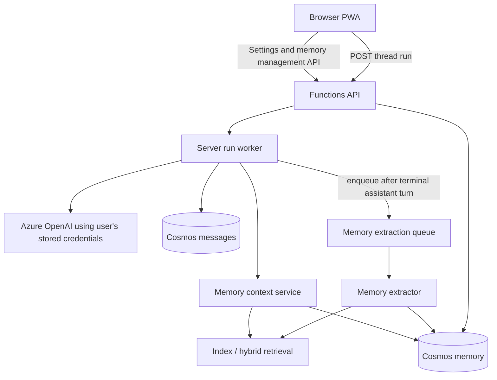

# 02 — Watai Memory Spec

This document specifies the product behavior, architecture, data model, retrieval path, extraction path, API surface, UI, and privacy rules for Watai long-term memory.

Cross-references: [../02-architecture.md](../02-architecture.md), [../04-data-model.md](../04-data-model.md), [../06-server-runs-and-migration.md](../06-server-runs-and-migration.md), [01-research-and-benchmarks.md](01-research-and-benchmarks.md).

## 1. Problem Statement

Watai currently has a memory toggle and local `MemoryItem` storage, but the server-run architecture means the browser is no longer the agent. If generation runs on the server, memory retrieval and memory writing must be server-owned too.

The goal is to let Watai build useful continuity across conversations without making every new response read the user's entire chat history.

## 2. Product Goals

A user should be able to:

1. Ask Watai to remember durable facts and preferences.
2. Let Watai automatically learn useful context from normal conversations when memory is enabled.
3. See what Watai remembers in a Memory page.
4. See which memories influenced a specific answer.
5. Correct, suppress, delete, import, export, pause, reset, and rebuild memory.
6. Use Temporary Chat without reading existing memory or writing new memory.
7. Sign in on another device and get the same memory-backed behavior.

## 3. Non-Goals For The First Implementation

- Team/organization shared memory.
- External connectors such as Gmail or calendar memory ingestion.
- Full knowledge graph UI.
- Fine-tuning or model-weight personalization.
- Storing raw full chat history as memory records. Messages already exist as messages.
- Autonomous modification of destructive settings without user intent.

## 4. Memory Types

Watai should treat memory as a layered system:

| Layer | Scope | Lifetime | Source | Use |
| --- | --- | --- | --- | --- |
| Custom instructions | User | Until edited | User-authored Settings | Always eligible when enabled. |
| Memory summary | User | Continuously updated | Synthesis of active memories | Compact review surface and prompt context. |
| Atomic memories | User | Until invalidated/deleted | Manual commands or extraction jobs | Precise facts/preferences with source links. |
| Thread summaries | Thread | Until thread deletion/retention expiry | Background summarization | Episodic recall for past work. |
| Session working memory | Run/thread | Run or task lifetime | Tool outputs/intermediate state | Not long-term; do not store as user memory. |

## 5. High-Level Architecture



### 5.1 Read Path

1. User sends a prompt.
2. API accepts the server run.
3. Run worker loads settings and checks:
   - memory enabled,
   - thread is not temporary,
   - run request does not opt out of memory.
4. Memory context service builds a bounded `MemoryContextBlock` using:
   - custom instructions,
   - memory summary,
   - top atomic memories,
   - relevant thread summaries,
   - source refs for transparency.
5. Prompt assembly injects the memory context block before the latest conversation messages.
6. The assistant response stores `memoryRefs` so the UI can show sources.

### 5.2 Write Path

1. Assistant message reaches a terminal state: `complete`, `interrupted`, or `error`.
2. If memory is enabled, the thread is not temporary, and enough useful signal exists, the worker enqueues a `memory.extract` job.
3. The extraction worker reads the relevant turn window and existing memory context.
4. It asks the configured model to produce strict JSON memory candidates.
5. The memory service validates, redacts, classifies, deduplicates, and stores additive records.
6. Summary refresh runs when enough memory changed or when the user requests refresh.

Manual commands such as "remember that..." and "forget that..." should take effect immediately through the memory service, but still avoid blocking normal answer generation more than necessary.

## 6. Data Model

### 6.1 Cosmos Containers

| Container | Partition key | Purpose |
| --- | --- | --- |
| `memory` | `/userId` | Atomic memories, summaries, source refs, suppression records. |
| `memoryJobs` | `/userId` | Optional durable queue/job records if Storage Queue visibility alone is insufficient. |

For the first build, `memory` can hold multiple document kinds. If query volume grows, split summaries and usage logs later.

### 6.2 `MemoryRecord`

```ts
type MemoryKind =
  | 'fact'
  | 'preference'
  | 'instruction'
  | 'work_style'
  | 'project_context'
  | 'thread_summary'
  | 'avoidance';

type MemoryStatus = 'active' | 'suppressed' | 'invalidated' | 'deleted';

interface MemoryRecord {
  id: string;
  userId: string;
  kind: MemoryKind;
  status: MemoryStatus;
  text: string;
  normalizedText?: string;
  summary?: string;
  entities?: string[];
  topics?: string[];
  sourceRefs: MemorySourceRef[];
  confidence: number;
  salience: number;
  pinned: boolean;
  sensitive: boolean;
  validAt?: string;
  invalidAt?: string;
  createdAt: string;
  updatedAt: string;
  lastUsedAt?: string;
  useCount: number;
  supersedes?: string[];
  supersededBy?: string;
  embedding?: number[];
  embeddingModel?: string;
  deletedAt?: string;
}
```

### 6.3 `MemorySourceRef`

```ts
interface MemorySourceRef {
  type: 'message' | 'thread' | 'manual' | 'import' | 'settings' | 'system';
  threadId?: string;
  messageId?: string;
  runId?: string;
  quote?: string;
  createdAt: string;
}
```

Rules:

- Source refs are required for automatically extracted memories.
- Manual memories may use `type: 'manual'` without a message id.
- Source quotes must be short and bounded.
- If a source message/thread is deleted, memories derived only from that source must be invalidated or deleted according to the user's deletion mode.

### 6.4 `MemorySummaryRecord`

```ts
interface MemorySummaryRecord {
  id: 'memory-summary';
  userId: string;
  kind: 'summary';
  text: string;
  sourceMemoryIds: string[];
  updatedAt: string;
  version: number;
}
```

The memory summary is reviewable and editable, but it is not the only source of truth. The atomic records preserve source traceability and deletion behavior.

### 6.5 `MemoryContextBlock`

```ts
interface MemoryContextBlock {
  summary?: string;
  instructions: string[];
  memories: Array<{
    id: string;
    kind: MemoryKind;
    text: string;
    validAt?: string;
    invalidAt?: string;
    score: number;
  }>;
  threadSummaries: Array<{
    threadId: string;
    title?: string;
    summary: string;
    score: number;
  }>;
  sourceRefs: Array<{
    memoryId: string;
    threadId?: string;
    messageId?: string;
  }>;
  tokenEstimate: number;
}
```

Prompt format:

```text
Relevant long-term memory. Use this only when it helps answer the user. Do not mention it unless relevant.

User summary:
...

Durable preferences and facts:
- [mem_...] User prefers concise implementation plans.
- [mem_...] User is working on Watai server-authoritative runs. (valid: 2026-06-20 - present)

Relevant prior work:
- [thr_...] Server-run migration moved generation to Azure Functions.
```

## 7. Retrieval Strategy

### 7.1 First Release

For initial Watai scale, the simplest reliable path is:

1. Query active, non-sensitive, non-suppressed user memories from Cosmos with caps.
2. Score with lexical match, entity overlap, recency, salience, and explicit pinned status.
3. Include the memory summary by default when memory is enabled.
4. Include up to 8 atomic memories and up to 3 thread summaries.
5. Keep the memory context block under a configurable token budget, default 1,200 tokens.

This avoids adding Azure AI Search before the product behavior is validated.

### 7.2 Hybrid Retrieval Upgrade

After the MVP passes evals, add vector and hybrid search:

- Store embeddings on memory records if the user has configured an embedding deployment.
- Add entity extraction during memory write.
- Fuse scores from semantic similarity, keyword/BM25, entity overlap, salience, recency, and pinning.
- Consider Azure AI Search if memory grows beyond what a single-user Cosmos query can efficiently handle.

The final scoring shape should be explicit and testable:

```text
score = semantic * 0.35
      + lexical * 0.20
      + entity * 0.20
      + salience * 0.15
      + recency * 0.05
      + pinned * 0.05
```

Weights are defaults, not doctrine. Evals decide.

## 8. Extraction Strategy

### 8.1 Candidate Categories

Extract only durable, useful context:

- stable user preferences,
- recurring work style,
- ongoing project context,
- durable facts the user asks Watai to remember,
- assistant-confirmed actions that matter later,
- corrections to prior memories,
- "do not mention/use" preferences.

Do not extract:

- secrets, API keys, access tokens, credentials,
- hidden chain-of-thought,
- one-off temporary requests,
- medical/legal/financial sensitive details unless the user explicitly asks to remember them and the sensitivity classifier permits it,
- content from temporary chats,
- raw tool outputs unless summarized into a durable fact.

### 8.2 Extraction Prompt Contract

The extractor must output strict JSON:

```jsonc
{
  "memories": [
    {
      "operation": "add" | "suppress" | "invalidate",
      "kind": "fact" | "preference" | "instruction" | "work_style" | "project_context" | "avoidance",
      "text": "User prefers...",
      "entities": ["Watai"],
      "topics": ["architecture"],
      "confidence": 0.0,
      "salience": 0.0,
      "validAt": "2026-06-27T00:00:00.000Z",
      "supersedes": ["mem_..."],
      "sourceMessageIds": ["msg_..."]
    }
  ]
}
```

The service, not the model, owns final validation and storage.

### 8.3 Additive Memory

Prefer adding new records and invalidating older ones over overwriting. Example:

- Old: "User is using client-side generation."
- New: "User migrated Watai to server-authoritative generation."

The old record should become `invalidated` with `invalidAt`, and the new record should reference it in `supersedes`.

## 9. API Surface

All endpoints are auth-gated and derive `userId` from the token.

| Method | Route | Purpose |
| --- | --- | --- |
| `GET` | `/api/memory` | List active/suppressed memories with filters and pagination. |
| `POST` | `/api/memory` | Add a manual memory. |
| `PATCH` | `/api/memory/{memoryId}` | Edit text, status, salience, pinned, or suppression state. |
| `DELETE` | `/api/memory/{memoryId}` | Delete a memory so it is no longer retrievable. |
| `GET` | `/api/memory/summary` | Read the current memory summary. |
| `PUT` | `/api/memory/summary` | User-edited summary update. |
| `POST` | `/api/memory/query` | Internal/admin/debug query preview for Settings; not used by model directly. |
| `POST` | `/api/memory/rebuild` | Rebuild memory from eligible chat history. |
| `POST` | `/api/memory/export` | Export memory JSON. |
| `POST` | `/api/memory/import` | Import memory JSON after user confirmation. |
| `DELETE` | `/api/memory` | Reset all memory records for the user. |

Server-run internal services can call the application layer directly rather than loop through HTTP.

## 10. UI Surface

Settings > Personalization should become a full memory management area:

- Memory master toggle.
- Reference saved memories toggle.
- Reference chat history/thread summaries toggle.
- Pause memory action.
- Reset memory action.
- Memory summary editor with last-updated time.
- Searchable memory list with kind, source, last used, and status.
- Memory detail view showing source thread/message, edit/delete/suppress controls.
- Import/export actions.
- Rebuild from chat history action.

Chat response UI should show a compact **Memory used** affordance when memory refs exist. Opening it shows:

- memory text used,
- source thread/message when available,
- correction action,
- suppress action,
- delete action.

## 11. Privacy And Safety Rules

- Memory is off for temporary chats.
- Memory must not store credentials or raw secret values.
- Sensitive categories require explicit user intent and conservative classification.
- Deleted memories are excluded from retrieval immediately.
- Suppressed memories are retained for audit/user review but excluded from prompt context.
- Data export includes memory records and summaries.
- Delete-all-data cascades through memory records and memory-derived summaries.
- Shared chats must not expose hidden memory source panels unless intentionally included in an authenticated export.

## 12. Prompt Assembly Rules

Prompt assembly order for server runs:

1. System/developer instructions.
2. Safety/tool policy.
3. User-authored custom instructions.
4. Memory context block.
5. Recent thread messages.
6. Current user message and attachments.

Memory instructions to the model:

- Use memory only if relevant.
- Do not reveal memory ids to the user.
- If a memory conflicts with the current message, trust the current message and allow the memory subsystem to update later.
- Do not infer sensitive facts beyond what is provided.

## 13. Open Decisions

| ID | Decision | Default |
| --- | --- | --- |
| M1 | Embedding deployment requirement | Optional. Start lexical/entity; add embeddings when configured. |
| M2 | Azure AI Search vs Cosmos-only retrieval | Cosmos-only MVP; Azure AI Search after evals show scale need. |
| M3 | Memory source retention after source deletion | Delete or invalidate memory if all source refs are deleted. |
| M4 | Sensitive memory handling | Block by default unless user explicitly says to remember and classifier allows. |
| M5 | Project-scoped memory | Defer until Watai has projects/spaces; keep schema scope-ready. |
