# 09 — Background Memory Extraction System

This document is the implementation contract for Watai's automatic memory learning loop. Manual memory is useful, but it is not the product goal. Watai must continuously learn durable preferences, facts, work style, project context, corrections, and completed-work context from normal usage without slowing response generation.

Cross-references: [02-watai-memory-spec.md](02-watai-memory-spec.md), [04-evaluation-and-governance.md](04-evaluation-and-governance.md), [06-api-and-schema-contracts.md](06-api-and-schema-contracts.md), [07-retrieval-and-extraction-algorithms.md](07-retrieval-and-extraction-algorithms.md), [08-build-slices-and-acceptance.md](08-build-slices-and-acceptance.md).

## 1. Research Synthesis

The relevant production and research patterns converge on the same architecture: ingest conversational events continuously, extract durable memories asynchronously, keep memory records source-linked and time-aware, then retrieve a compact context block on the hot path.

### 1.1 Mem0

Mem0's add-memory flow accepts user/assistant messages, uses an LLM to extract key facts, decisions, and preferences, stores memories additively, and retrieves ranked memories later. Its docs distinguish conversation, session, user, and organizational memory layers. Its managed platform also exposes asynchronous memory operations where add/search requests need not block the agent.

Design takeaways for Watai:

- Add messages/turns to memory processing whenever the agent learns something useful.
- Use LLM inference for extraction by default; raw transcript storage is a different mode and creates duplicate/noisy memory risk.
- Keep long-lived user memory distinct from current turn context and session/task memory.
- Treat add/update/delete/search as governed operations with metadata and visibility, not as hidden prompt stuffing.

### 1.2 Zep

Zep ingests messages into a user-level graph, not just a thread. Its docs recommend adding chat history on every turn, including both human and AI messages in creation order. Assistant messages can be used to contextualize user messages while optionally being ignored as graph facts. Zep facts are temporal: new data can invalidate an old fact while preserving history through valid/invalid date ranges. Retrieval returns a compact Context Block containing user summary and relevant facts.

Design takeaways for Watai:

- Process every eligible turn, not only explicit "remember" commands.
- Use timestamps from the original messages because temporal validity matters.
- Preserve invalidated history, but exclude it from current retrieval.
- Use recent raw messages alongside retrieved long-term memory because background ingestion may lag.
- Build a user-level memory layer that can retrieve across threads.

### 1.3 Generative Agents

The Generative Agents architecture stores observations, periodically reflects over them into higher-level memories, and retrieves relevant memories for behavior. It shows that observation, reflection, and retrieval are separate components; collapsing them into the response hot path makes behavior brittle and slow.

Design takeaways for Watai:

- Separate observation capture, reflection/extraction, and retrieval.
- Promote many small observations into fewer durable memories and summaries.
- Reflection should be scheduled and bounded, not run synchronously in every prompt.

### 1.4 MemGPT / Letta-Style Hierarchical Memory

MemGPT frames long-running assistants as systems with memory tiers: fast context, archival memory, and explicit movement between tiers. The important principle is control over what enters the model context, not unlimited transcript recall.

Design takeaways for Watai:

- Current thread history is working memory; extracted records are long-term memory.
- The model should not see all stored memory. It should see a small selected block.
- Memory writes are controlled operations with validation, not arbitrary model self-editing.

## 2. Product Requirement

Watai must run an active, asynchronous memory learner for every eligible user prompt and completed response.

Requirements:

- Every non-temporary synced user turn receives at least one LLM extraction decision when automatic extraction is enabled, either in the command lane, the turn lane, or both.
- Extraction must never delay send-to-first-token or response completion.
- LLM judgment is required for automatic memory creation/update/suppression/invalidation.
- The service, not the LLM, owns storage decisions after strict validation.
- Memory writes must be source-linked to messages or threads.
- Secrets, one-off requests, temporary-chat data, hidden chain-of-thought, and unsafe sensitive details must be rejected.
- Contradictions must invalidate old memories rather than overwrite them silently.
- The system must be observable without logging memory text or raw prompts.
- Failures in memory extraction must never fail the user response.

Non-goals for the first automatic extraction release:

- Full graph database or custom ontology.
- Embeddings as a hard dependency.
- Perfect long-range summarization.
- Client-side extraction.
- Showing every rejected candidate in the UI.

Critical review constraints:

- Do not rely on regex-only "remember" detection. Regex may choose which lane is urgent, but an LLM must make the durable update/no-update decision for eligible turns.
- Do not make extraction dependent on the frontend being open. The worker must run from server-side message/run persistence.
- Do not enqueue content-bearing queue messages. Queue payloads carry ids only; the worker rehydrates content from stores.
- Do not let the learner write faster than users can govern it. Every stored memory remains visible, suppressible, and deletable.

## 3. Architecture

```mermaid
flowchart LR
  UserPrompt[User message saved] --> CommandEnqueue[Optional immediate memory-command job]
  AssistantComplete[Assistant message complete] --> TurnEnqueue[Turn extraction job]
  CommandEnqueue --> Queue[(memory-jobs queue)]
  TurnEnqueue --> Queue
  Queue --> Worker[memoryWorker]
  Worker --> Window[Load bounded turn window]
  Worker --> Candidates[Load relevant existing memories]
  Window --> Extractor[LLM extractor]
  Candidates --> Extractor
  Extractor --> Validate[Strict schema + safety validation]
  Validate --> Apply[MemoryExtractionService apply decisions]
  Apply --> Store[(Cosmos memory container)]
  Store --> Retrieve[MemoryContextService]
  Retrieve --> RunPrompt[Future server-run prompt]
```



The hot path does only retrieval. Extraction is a separate queue-triggered worker.

Hot path:

1. User sends prompt.
2. Server run starts immediately.
3. `MemoryContextService.buildForRun()` retrieves existing active memory within budget.
4. Run worker generates the assistant response.

Background path:

1. User prompt and completed assistant response enqueue memory jobs.
2. Queue worker loads the bounded turn window.
3. LLM extractor decides whether memory should change.
4. Service validates, dedupes, invalidates, and writes memory records.
5. Future runs retrieve the new memory.

## 4. Two-Lane Extraction

### 4.1 Immediate Command Lane

Triggered shortly after the user message is saved, without waiting for the assistant response.

Purpose:

- Explicit commands such as "remember that...", "forget that...", "never mention...", "don't use that again", or "correction: ..." should take effect quickly.
- User prompts that look like direct memory-control instructions still go through LLM extraction; deterministic pattern matching may prioritize the lane but must not be the final decision-maker.
- The assistant response still does not wait for this lane.

Input window:

- Current user message.
- Previous assistant message, if any.
- Previous two user/assistant pairs for pronoun/context resolution.
- Top matching existing memories for possible suppress/invalidate operations.

Allowed operations:

- `add` for explicit remember/correction commands.
- `suppress` for "do not use/mention" commands.
- `invalidate` for explicit corrections.
- `ignore` for no durable command.

This lane should be fast and conservative. If it is unsure, it returns `ignore` and the turn lane can decide later. The command lane is allowed to be selectively enqueued by a cheap prefilter only when the turn lane will still run after completion. If there may be no terminal assistant response, such as explicit remember/forget in a sync-only append path, enqueue command lane unconditionally for that user message.

### 4.2 Turn Reflection Lane

Triggered after a terminal assistant message with status `complete`.

Purpose:

- Learn durable preferences and facts implied by the full exchange.
- Capture assistant-confirmed completed work.
- Detect corrections and contradictions with older memories.
- Avoid storing one-off requests that were only relevant to the just-completed turn.

Input window:

- Latest user message.
- Latest assistant response.
- Previous two user/assistant pairs.
- Thread metadata: `threadId`, title, temporary flag, timestamps.
- Selected existing memory candidates: active plus possibly invalidated memories relevant to the same entity/topic.
- Memory settings: enabled/paused/reference history flags.

Allowed operations:

- `add`
- `merge`
- `invalidate`
- `suppress`
- `ignore`

This lane is the default active learner for normal usage.

Coverage rule:

- A completed eligible user/assistant turn must have exactly one turn-lane LLM decision unless a job with the same assistant-message dedupe key already completed or was ignored.
- A user message with explicit memory-control language must have a command-lane LLM decision even if the assistant response later fails.
- If both lanes run, command-lane writes are visible to the turn lane as existing candidates so the turn lane can merge or ignore rather than duplicate.

## 5. Queue And Job Model

Queue name: `memory-jobs` unless overridden by `MEMORY_QUEUE`.

Queue payload must contain identifiers only, never raw prompt text:

```ts
export interface MemoryJobMessage {
  jobId: string;
  userId: string;
  threadId: string;
  kind: 'command' | 'turn' | 'rebuild';
}
```

Persisted job record:

```ts
export interface MemoryExtractionJobRecord {
  id: string;
  userId: string;
  threadId: string;
  kind: 'command' | 'turn' | 'rebuild';
  status: 'queued' | 'running' | 'completed' | 'ignored' | 'failed';
  userMessageId?: string;
  assistantMessageId?: string;
  runId?: string;
  dedupeKey: string;
  attempts: number;
  operationCounts?: {
    add: number;
    merge: number;
    invalidate: number;
    suppress: number;
    ignore: number;
  };
  acceptedCount?: number;
  rejectedCount?: number;
  lastErrorCode?: string;
  lastErrorMessage?: string;
  createdAt: string;
  updatedAt: string;
  completedAt?: string;
}
```

Storage:

- Use a dedicated Cosmos container `memoryJobs` with partition key `/userId` for job records.
- Add the container to Bicep and create it surgically in the deployed dev resource group before code that writes jobs is deployed.
- The queue remains Azure Storage Queue `memory-jobs`; Storage Queue invisibility/retry is the execution mechanism, Cosmos job records are the idempotency/audit mechanism.
- Do not store job records in the `memory` container unless `MemoryStore` first gains explicit `docType = 'memory'` filtering for all list/get paths.

Dedupe keys:

- Command lane: `memory-command:{userMessageId}`.
- Turn lane: `memory-turn:{assistantMessageId}`.
- Rebuild: `memory-rebuild:{userId}:{startedAt}`.

Rules:

- Enqueue is best-effort and must not throw out of run/message completion.
- If a job with the same dedupe key exists in `queued`, `running`, `completed`, or `ignored`, do not create another.
- If a job with the same dedupe key is `failed`, enqueue may reuse the same job id and increment attempts, or create a replacement with `replacesJobId`; either path must remain idempotent.
- Failed jobs may retry through Storage Queue retry policy, but the service must remain idempotent.
- Poison messages are observable and can be replayed by job id.
- Worker must load the job record by `jobId` and verify `userId`, `threadId`, and referenced message ownership before reading content.

Job state transitions:

```text
queued -> running -> completed
queued -> running -> ignored
queued -> running -> failed
failed -> queued (manual replay or retry policy)
```

`ignored` means the worker successfully made a decision and chose no memory writes. `failed` means extraction infrastructure failed before a valid decision was applied.

## 6. Trigger Points

### 6.1 Server Run Submission

When `RunService.submit()` stores the user message and creates the run, it should enqueue a command-lane memory job if:

- user memory is enabled and not paused,
- thread is not temporary,
- user message has non-empty text,
- no job exists for that user message.

This catches explicit remember/forget/correction prompts while the assistant response is generated.

If a cheap prefilter is used, it may only decide whether the command lane is urgent. It must not prevent the turn lane from later considering the completed turn.

### 6.2 Server Run Worker Completion

When `processRun()` finalizes an assistant message as `complete`, it should enqueue a turn-lane memory job if:

- user memory is enabled and not paused,
- thread is not temporary,
- assistant message has status `complete`,
- there is at least one user message in the recent window,
- no job exists for that assistant message.

Do not enqueue for `error` or `interrupted` unless a future workflow has a durable completed action despite interruption.

### 6.3 Message Append Endpoint

Some clients may still sync messages through `POST /threads/{threadId}/messages`.

Rules:

- For a newly appended complete assistant message, enqueue a turn-lane job using the same assistant-message dedupe rule.
- For a newly appended user message, enqueue a command-lane job when the message contains explicit memory-control language or when the append path cannot guarantee a later server-run completion job.
- Never enqueue from messages belonging to temporary threads.
- Never enqueue when the append is an idempotent retry of an existing message.

### 6.4 Rebuild

`POST /api/memory/rebuild` creates rebuild jobs that scan eligible historical threads in bounded batches. Rebuild must use the same extraction service and validation gates as live jobs.

## 7. LLM Extractor Contract

The extractor is an AI adapter, not an application service. It turns a bounded input window into proposed operations. It does not write storage.

Backend file: `api/src/ai/memoryExtractor.ts`.

Input:

```ts
export interface MemoryExtractionInput {
  mode: 'command' | 'turn' | 'rebuild';
  now: string;
  userId: string;
  threadId: string;
  threadTitle?: string;
  messages: Array<{
    id: string;
    role: 'user' | 'assistant';
    content: string;
    createdAt: string;
  }>;
  existingMemories: Array<{
    id: string;
    kind: MemoryKind;
    status: MemoryStatus;
    text: string;
    entities?: string[];
    topics?: string[];
    validAt?: string;
    invalidAt?: string;
  }>;
}
```

Output JSON schema:

```ts
export interface MemoryExtractionOutput {
  operations: Array<
    | {
        op: 'add';
        kind: Exclude<MemoryKind, 'thread_summary' | 'entity'>;
        text: string;
        entities?: string[];
        topics?: string[];
        confidence: number;
        salience: number;
        validAt?: string;
        sourceMessageIds: string[];
        supersedes?: string[];
        reason: string;
      }
    | {
        op: 'merge';
        memoryId: string;
        text?: string;
        entities?: string[];
        topics?: string[];
        confidence?: number;
        salience?: number;
        sourceMessageIds: string[];
        reason: string;
      }
    | {
        op: 'invalidate';
        memoryId: string;
        replacementText?: string;
        sourceMessageIds: string[];
        reason: string;
      }
    | {
        op: 'suppress';
        memoryId: string;
        sourceMessageIds: string[];
        reason: string;
      }
    | {
        op: 'ignore';
        reason: string;
      }
  >;
}
```

System prompt requirements:

```text
You extract durable memories for Watai.
Store only facts, preferences, instructions, work style, project context, avoidances, procedures, or completed-work context that will be useful in future conversations.
Do not store secrets, credentials, one-off requests, private third-party details, hidden reasoning, or guesses about emotions.
Prefer concise source-linked memories.
Current user corrections can invalidate older memories.
Return strict JSON only.
```

Extractor model choice:

- Use the user's saved chat model and credentials for MVP, because the app already has user-owned AI billing and deployment configuration.
- If credentials are unavailable, mark job `failed` with `lastErrorCode = 'credentials_missing'`; do not fall back to a hidden platform key.
- Later, support `MEMORY_EXTRACTOR_MODEL` when the user's endpoint has multiple model deployments.

Model data-boundary disclosure:

- Extraction sends the bounded turn window to the user's configured model endpoint, just like server-run generation.
- The UI must make clear that automatic learning uses the configured AI endpoint to decide what to remember.
- If the user disables server-side credentials or sync, automatic extraction is unavailable; manual local memory can still exist.

## 8. Service Validation Gates

The application service must reject or ignore model proposals that fail any gate.

Hard rejection gates:

- Unknown JSON fields or unsupported operation.
- Source message ids missing or not owned by the user/thread/job window.
- Source message came from a temporary thread.
- Candidate text is empty or over 2,000 chars.
- Candidate contains secret-like values.
- Candidate has `confidence < 0.65` unless it is explicit command-lane remember.
- Candidate is an unsupported sensitive category.
- Candidate is about a private third party and not clearly non-sensitive project context.
- Candidate is a one-off instruction for the current response only.

Soft downgrade gates:

- Low salience but valid durable fact: store as `background` only if confidence is high and it supports project continuity.
- Assistant-generated fact: require the assistant message to be terminal `complete` and the fact to represent completed work or a durable decision.
- Ambiguous correction: mark old memory `background` or keep both only if invalidation is not justified.

The service may return `ignored` with structured reasons. Ignored candidates are not shown in normal UI but can be counted in telemetry/evals.

Deterministic prevalidation before the LLM:

- Skip LLM extraction for empty/whitespace messages, temporary threads, disabled/paused memory, or missing credentials.
- Reject or redact obvious secret-like source content before constructing the extractor prompt when possible.
- Do not skip ordinary eligible prompts simply because they lack memory keywords; the turn-lane LLM is responsible for returning `ignore`.

## 9. Apply Semantics

### 9.1 Add

Create a `MemoryRecord` with:

- `status = 'active'`
- `sourceRefs` for all validated source messages
- `confidence` and `salience` from the extractor after clamping to 0-1
- `visibility = 'normal'` unless salience is high or command lane explicitly says remember
- `sourceHash = sha256(normalizedText + kind + sortedEntities)`

### 9.2 Merge

Merge only when the target memory is owned by the user and active/suppressed/background as appropriate.

Rules:

- Add new source refs up to the source-ref cap.
- Update `confidence = max(old, new)`.
- Update `salience = max(old, new)`.
- If text changes materially, preserve old text in audit/job details and update `updatedAt`.
- Never merge into `deleted` records.

### 9.3 Invalidate

Set old record:

- `status = 'invalidated'`
- `invalidAt = now`
- `supersededBy = newMemoryId` when a replacement is created

Create replacement when the extractor provided a replacement or an `add` operation supersedes the old memory.

### 9.4 Suppress

Set:

- `status = 'suppressed'`
- `updatedAt = now`

Suppression is used for "do not mention/use this". It is not deletion; the user can restore it from Hidden.

### 9.5 Delete

Automatic extraction should not hard-delete memory. Deletion remains a user action or delete-all-data operation.

## 10. Deduplication And Contradiction

Before writing an `add`:

1. Compute source hash.
2. Search active memories for same hash.
3. Search active memories with overlapping entities/topics.
4. If same hash exists, merge source refs and score fields.
5. If overlapping entity/topic but incompatible value, require extractor `supersedes` or correction language in the source window before invalidating.
6. If neither duplicate nor contradiction, add new record.

Contradiction examples:

- Old: "Watai generation runs client-side."
- New: "Watai generation is server-authoritative."
- Old: "User prefers verbose plans."
- New: "User prefers concise implementation plans."
- Old: "Deploy target is rg-old-demo."
- New: "Deploy target is rg-watai-dev."

One-off examples to reject:

- "For this reply, be poetic."
- "Use a pirate voice in this answer."
- "Make this paragraph shorter."
- "Search the web now."

## 11. Turn Window Construction

Do not send full thread history to the extractor.

Default window:

- latest user message, max 4,096 chars,
- latest assistant message, max 4,096 chars,
- previous two user/assistant pairs, max 1,500 chars each,
- existing memory candidates, max 20 records,
- memory source refs by id only,
- thread title and timestamps.

Ordering:

- Preserve original message chronology by `orderAt ?? createdAt`.
- Include role labels and timestamps in the extractor input so the model can distinguish old facts from newer corrections.
- Never include hidden chain-of-thought, tool raw arguments, credentials, or full code-interpreter outputs. Summaries/tool result previews may be included only when needed to understand completed work.

Existing memory candidates are selected by:

- memories used in the just-completed response,
- lexical match on current user message,
- same entities/topics when available,
- top-of-mind memories,
- invalidated memories only when their entities/topics match possible corrections.

## 12. Settings And User Controls

Memory settings should evolve from the compatibility boolean to:

```ts
export interface MemorySettings {
  enabled: boolean;
  paused: boolean;
  referenceSaved: boolean;
  referenceHistory: boolean;
  autoExtract: boolean;
}
```

Extraction eligibility:

- `enabled && autoExtract && !paused`
- `referenceHistory` controls automatic extraction from chat history.
- `referenceSaved` controls retrieval of stored memories.
- Manual memory create remains available when `enabled` is true, even if `autoExtract` is false.

Required UX states:

- Memory on and learning.
- Memory paused: retrieval may continue only if `referenceSaved` is true, but extraction stops.
- Auto learning off: manual memory still works, automatic extraction stops.
- Temporary chat: show memory unavailable for this chat.

Settings migration:

- If `personalization.memory` is absent, derive `enabled` and `referenceSaved` from `memoryEnabled`; derive `paused = false`.
- Existing users default `referenceHistory = false` and `autoExtract = false` until the upgraded Memory settings copy has been shown or product explicitly decides the old toggle covered automatic learning.
- Turning `memoryEnabled` off must set `memory.enabled = false` for new settings writes.
- Existing users should not silently start automatic extraction until the app has displayed the upgraded Memory settings copy at least once, unless product explicitly decides that the existing Memory toggle covered automatic learning.

Recommended default for first rollout:

- Existing `memoryEnabled = true` users: `enabled = true`, `referenceSaved = true`, `referenceHistory = false`, `autoExtract = false` until the user sees the upgraded setting.
- New users: `enabled = true`, `referenceSaved = true`, `referenceHistory = true`, `autoExtract = true` if onboarding explains memory.

## 13. Observability

Events must be content-free:

```jsonc
{
  "event": "memory_extraction_completed",
  "userHash": "...",
  "threadId": "thr_...",
  "jobId": "memjob_...",
  "kind": "turn",
  "operationCounts": { "add": 1, "merge": 0, "invalidate": 1, "suppress": 0, "ignore": 2 },
  "candidateCount": 4,
  "acceptedCount": 2,
  "rejectedCount": 2,
  "latencyMs": 1840,
  "model": "gpt-5.4"
}
```

Do not log:

- memory text,
- source quotes,
- raw prompts,
- extractor raw JSON when it contains memory text,
- credentials,
- embeddings.

## 14. Failure Handling

- Queue retry handles transient LLM/network failures.
- Validation failures complete the job as `ignored` or `completed` with rejected candidates; they should not retry.
- Missing credentials fail the job without affecting the user response.
- Store conflicts rerun dedupe/apply once, then retry through queue if still conflicting.
- Poison messages are safe to replay because apply is idempotent by dedupe key and source hash.

Backpressure and cost controls:

- Per user, process at most one memory job concurrently.
- Coalesce queued turn jobs for the same thread when a newer assistant message supersedes an older unprocessed turn, unless the older turn contains explicit memory-control language.
- Cap extractor calls per user per day; over-cap jobs become `ignored` with `lastErrorCode = 'quota_exceeded'` and can be replayed manually.
- Rebuild jobs must be batch-limited and lower priority than live command/turn jobs.
- Extraction completion SLO for live jobs: p50 <= 30 seconds, p95 <= 3 minutes after assistant completion under normal queue health.

## 15. Implementation Files

Backend domain:

- `api/src/domain/memoryExtraction.ts`
- extraction output Zod schema,
- job message/job record schema,
- `parseMemoryExtractionOutput`, `parseMemoryJobMessage`.

Backend ports:

- `api/src/ports/memoryJobStore.ts`
- `api/src/ports/memoryQueue.ts`

Backend adapters:

- `api/src/adapters/memory/memoryJobStore.ts`
- `api/src/adapters/cosmos/memoryJobStore.ts`
- `api/src/adapters/azure/queueMemoryStarter.ts`

Infrastructure:

- `infra/main.bicep` adds `memoryJobs` Cosmos container and any optional `MEMORY_QUEUE` app setting.
- Because Function App app settings are full replacement in Bicep, reconcile existing live settings before any full deployment.
- For dev, create `memoryJobs` surgically before deploying code that writes job records.

AI adapter:

- `api/src/ai/memoryExtractor.ts`

Application:

- `api/src/application/memoryExtractionService.ts`
- uses `MemoryStore`, `MessageStore`, `ThreadStore`, `SettingsService`, `CredentialService`, extractor adapter, clock.

Functions:

- `api/src/functions/memoryWorker.ts`
- `api/src/index.ts` imports worker registration.

Integration points:

- `RunService.submit()` enqueues command-lane jobs.
- `processRun()` enqueues turn-lane jobs after final complete assistant message.
- `MessageService.append()` enqueues command-lane jobs for eligible user messages and turn-lane jobs for synced complete assistant messages.
- `MemoryService.delete()` and thread deletion paths must be respected by retrieval and extraction candidate loading.

## 16. Test Plan

Domain tests:

- extraction JSON rejects unknown fields,
- source ids required for automatic operations,
- low confidence rejected,
- secret-like text rejected,
- unsupported kinds rejected.

Queue tests:

- encode/decode job message,
- invalid queue payload fails safely,
- duplicate dedupe key does not enqueue twice,
- queue starter creates queue if needed.
- worker loads job record by id and rejects mismatched user/thread/message ownership.

Service tests:

- explicit remember command creates memory without blocking run,
- every eligible completed turn reaches an LLM extraction decision,
- normal durable preference creates memory after assistant complete,
- one-off prompt is ignored,
- secret prompt is rejected,
- temporary thread enqueues nothing and writes nothing,
- correction invalidates old memory and stores replacement,
- assistant-confirmed completed work can be stored,
- deleted/suppressed target cannot be merged into,
- job replay is idempotent.

Run-worker tests:

- response completes even when enqueue fails,
- complete assistant response enqueues turn job,
- user message persistence enqueues or schedules command-lane decision for explicit memory-control language,
- error/interrupted response does not enqueue,
- memory extraction is not awaited before final response.

End-to-end evals:

- preference recall,
- explicit remember,
- contradiction update,
- temporary exclusion,
- deletion/suppression leakage,
- sensitive data rejection,
- over-insertion rejection,
- assistant-generated fact.

## 17. Acceptance Criteria

- Every eligible completed server-run turn creates or dedupes a memory extraction job.
- Every eligible completed server-run turn has an LLM extraction decision recorded as `completed` or `ignored` unless extraction infrastructure failed.
- Explicit remember/forget/correction prompts create command-lane jobs immediately after user message persistence.
- Extraction never runs on the generation hot path and never blocks first token or final message persistence.
- Worker uses an LLM extractor with strict JSON output.
- Service validates all model proposals before storage.
- Temporary chats never read or write memory.
- Secret-like values never appear in memory records, summaries, prompt context, logs, or telemetry.
- One-off requests are ignored in evals.
- Corrections invalidate outdated active memories.
- Response-level `memoryRefs` continue to show only memories actually used for the response, not newly extracted memories from after the response.
- Newly extracted memories are available to future runs after the worker completes.
- Live extraction p95 completion is <= 3 minutes under normal queue health.
- Manual test can prove: say a preference in one normal chat, wait for extraction completion, ask in another chat, and see the preference used with Memory Used disclosure.