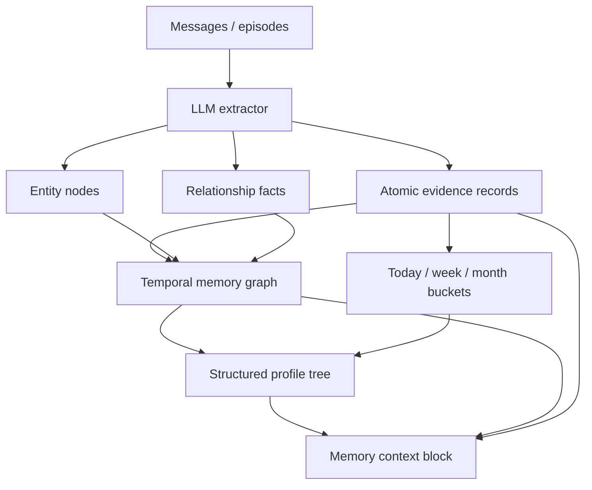

# 10 — Structured Hierarchical Memory Architecture

This document revises Watai's memory direction from a flat list of remembered statements into a structured, temporal, relational memory system. Atomic memories remain useful as evidence and retrieval units, but they should not be the user's primary mental model or the system's only representation.

Cross-references: [02-watai-memory-spec.md](02-watai-memory-spec.md), [06-api-and-schema-contracts.md](06-api-and-schema-contracts.md), [07-retrieval-and-extraction-algorithms.md](07-retrieval-and-extraction-algorithms.md), [09-background-extraction-system.md](09-background-extraction-system.md).

## 1. The Critique

Flat memories like `User has a dog named Chopper inspired by One Piece` are only half of a memory system. They preserve an extracted fact, but they lose structure:

- Chopper is a **pet**, not just a phrase.
- Chopper is related to the **user** through `HAS_PET`.
- Chopper is related to **One Piece** through `INSPIRED_BY`.
- One Piece may be an **interest/fandom** that can relate to future image prompts, captions, stories, gifts, or jokes.
- The fact has evidence, confidence, time, and deletion semantics.

A scalable memory system needs both:

- **Evidence units:** source-linked facts/events with confidence and validity.
- **Structured projections:** hierarchical profile and graph views synthesized from the evidence.

The current flat memory list is acceptable as an evidence layer. It is not the final product model.

## 2. Research Synthesis

### 2.1 Zep / Graphiti Pattern

Zep's architecture is closest to the target: a temporal user graph with entities, facts, episodes, observations, thread summaries, and a user summary. Facts live as time-scoped relationships between entities and can be invalidated when newer data contradicts them.

Relevant lessons:

- Store **entities** for meaningful nouns: user, spouse, child, pet, project, repository, tool, organization, location, interest.
- Store **relationships** between entities: `HAS_PET`, `PREFERS`, `WORKS_ON`, `USES_TOOL`, `INSPIRED_BY`.
- Use `validAt` and `invalidAt`; do not erase old facts when the user corrects them.
- Retrieve a compact context block from graph/profile, not a dump of raw memories.

### 2.2 Mem0 Pattern

Mem0 separates conversation, session, user, and organizational memory, and promotes useful details from messages into longer-lived layers.

Relevant lessons:

- Short-term memory and long-term memory should not share one flat bucket.
- User memory is durable; session/run memory can expire.
- Metadata and scope matter as much as text.

### 2.3 Generative Agents Pattern

Generative Agents stores observations and then reflects over them into higher-level summaries/patterns.

Relevant lessons:

- Not every observation becomes permanent profile.
- Daily/weekly/monthly reflection is valuable for recent context.
- Higher-level memory should be synthesized from evidence, not hand-waved.

### 2.4 MemGPT / Letta Pattern

MemGPT frames memory as tiers of fast context and archival context, with controlled movement between them.

Relevant lessons:

- The prompt should get a curated working set.
- Long-term memory should be compact and structured.
- The model should not self-edit memory arbitrarily; memory writes are validated operations.

## 3. Recommended Architecture

Use a **hybrid profile tree + typed temporal graph + atomic evidence** model.



Storage views:

1. **Atomic memory records**: source-linked evidence, confidence, validity, deletion semantics.
2. **Memory graph records**: entities and typed relationships.
3. **Structured profile documents**: compact tree projections for human review and prompt context.
4. **Temporal bucket records**: today/week/month summaries and open loops.

The profile tree is a derived view over evidence and graph records. It is not a free-floating source of truth.

## 4. Memory Tiers

| Tier | Scope | Lifetime | Purpose |
| --- | --- | --- | --- |
| Working memory | Run/thread | Current run/task | Current messages, tool outputs, draft constraints. |
| Today memory | User/day | 24-48 hours | Immediate continuity and current tasks. |
| Week memory | User/week | 7-14 days | Active project state, current goals, open loops. |
| Month memory | User/month | 30-60 days | Medium-term themes and recent decisions. |
| Long-term profile | User | Until changed/deleted | Durable user profile, family, pets, preferences, projects, avoidances. |
| Evidence archive | User | Retention policy | Source-linked facts/events used to rebuild profile/graph. |

Promotion rules:

- One-off details stay in today/week buckets and expire.
- Repeated or explicitly confirmed details promote to long-term.
- Completed durable project decisions can promote to project context.
- Corrections invalidate older graph edges/facts.

## 5. Structured Profile Tree

The profile tree is the human-readable shape the user expects to inspect.

Example:

```jsonc
{
  "schemaVersion": 1,
  "userId": "user_...",
  "updatedAt": "2026-06-28T00:00:00.000Z",
  "profile": {
    "user": {
      "details": {
        "name": {
          "value": null,
          "confidence": 0,
          "sourceMemoryIds": []
        }
      },
      "family": {
        "spouse": [],
        "children": [],
        "pets": [
          {
            "entityId": "entity_pet_chopper",
            "name": "Chopper",
            "species": "dog",
            "inspiredBy": ["One Piece", "Tony Tony Chopper"],
            "sourceMemoryIds": ["mem_..."]
          }
        ]
      },
      "preferences": {
        "communication": [],
        "engineering": [],
        "design": [],
        "tools": []
      },
      "interests": {
        "media": ["One Piece"],
        "hobbies": []
      }
    },
    "work": {
      "projects": [],
      "repositories": [],
      "deployments": [],
      "currentFocus": []
    },
    "avoidances": []
  }
}
```

Rules:

- Missing branches are allowed. The tree is always incomplete.
- Every non-empty value must link to source memory ids or graph ids.
- User edits to the tree create or update source-linked records; they do not silently mutate unsupported state.
- Unknown branches go under `custom` only after validation.
- The UI should default to this structured tree, with the flat evidence list as a secondary view.

## 6. Entity And Relationship Graph

The profile tree is ergonomic, but relational recall needs a graph underneath.

### 6.1 Entity Record

```ts
interface MemoryEntityRecord {
  id: string;
  userId: string;
  type:
    | 'user'
    | 'person'
    | 'pet'
    | 'project'
    | 'repo'
    | 'tool'
    | 'organization'
    | 'location'
    | 'interest'
    | 'concept'
    | 'custom';
  name: string;
  aliases?: string[];
  summary?: string;
  status: 'active' | 'merged' | 'deleted';
  sourceMemoryIds: string[];
  createdAt: string;
  updatedAt: string;
}
```

### 6.2 Relationship Record

```ts
interface MemoryRelationshipRecord {
  id: string;
  userId: string;
  subjectEntityId: string;
  predicate:
    | 'HAS_PET'
    | 'HAS_FAMILY_MEMBER'
    | 'PREFERS'
    | 'AVOIDS'
    | 'WORKS_ON'
    | 'USES_TOOL'
    | 'DEPLOYS_TO'
    | 'INTERESTED_IN'
    | 'INSPIRED_BY'
    | 'CUSTOM';
  objectEntityId?: string;
  objectValue?: string;
  factText: string;
  status: 'active' | 'invalidated' | 'suppressed' | 'deleted';
  confidence: number;
  salience: number;
  validAt?: string;
  invalidAt?: string;
  sourceMemoryIds: string[];
  createdAt: string;
  updatedAt: string;
}
```

### 6.3 Chopper Example

```jsonc
{
  "entities": [
    { "id": "entity_user_self", "type": "user", "name": "User" },
    { "id": "entity_pet_chopper", "type": "pet", "name": "Chopper" },
    { "id": "entity_interest_one_piece", "type": "interest", "name": "One Piece" }
  ],
  "relationships": [
    {
      "subjectEntityId": "entity_user_self",
      "predicate": "HAS_PET",
      "objectEntityId": "entity_pet_chopper",
      "factText": "User has a dog named Chopper."
    },
    {
      "subjectEntityId": "entity_pet_chopper",
      "predicate": "INSPIRED_BY",
      "objectEntityId": "entity_interest_one_piece",
      "factText": "Chopper's name is inspired by One Piece."
    }
  ]
}
```

This lets Watai answer "what's my dog's name?", "make a One Piece caption for my dog", and "what pets do I have?" from the same connected memory.

## 7. Temporal Buckets

Temporal buckets keep short-term context without polluting long-term profile.

```ts
interface MemoryTemporalBucketRecord {
  id: string;
  userId: string;
  scope: 'day' | 'week' | 'month';
  periodStart: string;
  periodEnd: string;
  summary: string;
  activeEntities: string[];
  activeProjects: string[];
  openLoops: Array<{
    text: string;
    sourceThreadId?: string;
    sourceMessageId?: string;
  }>;
  decisions: Array<{
    text: string;
    sourceMemoryIds: string[];
  }>;
  sourceThreadIds: string[];
  sourceMemoryIds: string[];
  updatedAt: string;
}
```

Retrieval use:

- Today bucket: immediate active tasks.
- Week bucket: current project/sprint context.
- Month bucket: recent project themes.
- Long-term profile: durable facts and preferences.

## 8. Extraction Contract Upgrade

The extractor should eventually output both atomic operations and structured operations.

```ts
interface StructuredMemoryExtractionOutput {
  operations: MemoryExtractionOperation[];
  entities?: Array<{
    op: 'upsert' | 'merge' | 'delete';
    entityId?: string;
    type: MemoryEntityRecord['type'];
    name: string;
    aliases?: string[];
    sourceMessageIds: string[];
  }>;
  relationships?: Array<{
    op: 'upsert' | 'invalidate' | 'suppress';
    relationshipId?: string;
    subject: { entityId?: string; name?: string; type?: MemoryEntityRecord['type'] };
    predicate: MemoryRelationshipRecord['predicate'];
    object?: { entityId?: string; name?: string; type?: MemoryEntityRecord['type']; value?: string };
    factText: string;
    confidence: number;
    salience: number;
    sourceMessageIds: string[];
  }>;
  profilePatch?: Array<{
    path: string;
    op: 'set' | 'append' | 'remove';
    value?: unknown;
    sourceMessageIds: string[];
  }>;
}
```

The service validates graph/profile writes. The LLM proposes; the service owns storage.

## 9. Storage Strategy

Recommended containers:

| Container | Partition key | Purpose |
| --- | --- | --- |
| `memory` | `/userId` | Atomic facts/events, manual records, summaries. |
| `memoryGraph` | `/userId` | Entity and relationship records. |
| `memoryProfiles` | `/userId` | Current structured profile tree and profile versions. |
| `memoryTemporal` | `/userId` | Day/week/month buckets. |
| `memoryJobs` | `/userId` | Extraction job status and idempotency. |

MVP may store graph/profile/temporal records in `memory` with `docType`, but only if every list/query path filters `docType`. Dedicated containers are safer once this phase starts.

## 10. Retrieval Strategy

Retrieval should use multiple sources:

1. **Profile prefilter:** decide relevant branches such as pets, family, work, preferences, projects.
2. **Graph traversal:** if query mentions Chopper, retrieve Chopper, HAS_PET, INSPIRED_BY, and One Piece.
3. **Atomic facts:** retrieve exact evidence for source refs and confidence.
4. **Temporal buckets:** include day/week/month only for recent/current work questions.
5. **Prompt assembly:** render compact context, not a raw JSON dump.

Example context:

```text
Relevant memory context. Use only if relevant.

User profile:
- Pet: Chopper, a dog. Name inspired by One Piece.

Relevant relationships:
- User HAS_PET Chopper. Source: mem_...
- Chopper INSPIRED_BY One Piece. Source: mem_...
```

## 11. UI Strategy

Memory settings should have two modes:

### 11.1 Structured View

Tree view:

- User
  - Details
  - Family
    - Spouse
    - Children
    - Pets
  - Preferences
  - Interests
- Work
  - Projects
  - Repositories
  - Deployments
  - Current focus
- Avoidances

Each row shows confidence/source count and opens a detail pane.

### 11.2 Evidence View

Flat atomic memory list for audit/debug:

- source message,
- status,
- confidence,
- suppress/delete/correct.

Users should normally live in Structured View. Evidence View is for repair and trust.

## 12. Migration From Current System

Current implementation has atomic records. Keep them as evidence.

Migration path:

1. Add graph/profile/temporal schemas and stores.
2. Extend extraction output to propose entities, relationships, and profile patches.
3. Write atomic memory first, then graph/profile projections.
4. Add a profile builder that can rebuild profile from atomic memories and graph edges.
5. Update retrieval to query profile/graph before atomic fallback.
6. Update Settings UI to show Structured and Evidence tabs.

## 13. Acceptance Criteria

- The Chopper prompt creates a pet entity, One Piece interest entity, and relationships connecting them.
- The Memory UI shows Chopper under `User > Family > Pets` rather than only as a flat sentence.
- Retrieval for "my dog" and "Chopper" finds the same structured profile node.
- Retrieval for "One Piece" can find the Chopper relationship when relevant.
- Today/week/month buckets update without promoting one-off details to long-term.
- Deleting a profile item suppresses or deletes the underlying evidence and graph edges so retrieval stops using it.
- Rebuild can reconstruct the profile tree from atomic evidence.
- Hot-path retrieval remains bounded and degrades to empty context if structured lookup is slow.

## 14. Recommendation

Watai should evolve toward a Zep-like temporal user graph plus a human-readable profile tree. The tree gives users and prompts compact structure; the graph preserves relationships; atomic records preserve evidence and deletion semantics; temporal buckets preserve short-term continuity without over-promoting everything to long-term memory.

The current flat memory list is a starting evidence layer, not the destination.