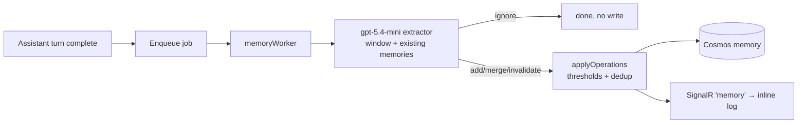
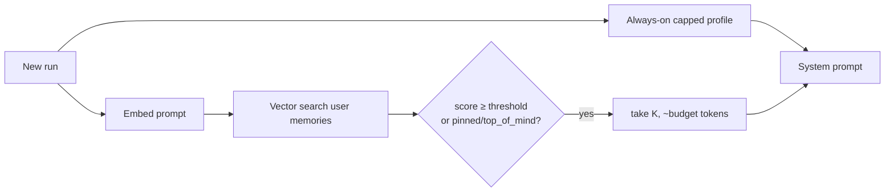

# 11 — Decoupled Memory Architecture: Decisions, Research, and Azure Implementation

> **Status:** Proposed / partially in build. Captures the architecture decisions taken in the
> 2026‑06 working sessions, the research behind them, a critique, and the Azure‑specific plan.
>
> **Relationship to other docs:** Builds on [01-research-and-benchmarks.md](01-research-and-benchmarks.md),
> [02-watai-memory-spec.md](02-watai-memory-spec.md), [09-background-extraction-system.md](09-background-extraction-system.md),
> and [10-structured-hierarchical-memory.md](10-structured-hierarchical-memory.md). It **supersedes the
> regex‑gate + lexical‑retrieval MVP** described in [07-retrieval-and-extraction-algorithms.md](07-retrieval-and-extraction-algorithms.md)
> for the decision/retrieval layers. The mini‑vs‑full model evidence is in
> [pipeline-probe-report.md](pipeline-probe-report.md); the as‑built flow is in [pipeline-flow.md](pipeline-flow.md).

---

## 1. The problem framing

Every turn poses **two independent decisions**:

1. **Write decision** — *Is there anything in this prompt worth saving to long‑term memory?* (extract / ignore)
2. **Read decision** — *Do I need to pull something from long‑term memory to answer this prompt well?* (retrieve / ignore)

Today **both decisions are hard‑coded regexes**:

- Write gate: `hasExtractionSignal()` in [api/src/application/memoryExtractionService.ts](../../api/src/application/memoryExtractionService.ts).
- Read gate: `shouldConsiderMemory()` in [api/src/application/memoryContextService.ts](../../api/src/application/memoryContextService.ts), followed by **lexical** (keyword‑overlap) scoring — embeddings are stored on the record but never used.

This is brittle. A real session exposed it: the user said *"I got a dog also."* then *"His name is Chopper, inspired by One Piece. He's a Lhasa Apso."* Neither string contains a gate keyword (`my dog`, `i have`, …), so **nothing reached the extractor and the dog was never saved**. The [probe](pipeline-probe-report.md) quantified the same weakness: regex decision accuracy **14/23 (61%)** vs an LLM classifier **20/23 (87%)**.

The decisions below replace both regexes with **mechanisms, not gates**.

---

## 2. Decisions (ADR)

### ADR‑1 — Remove both regex gates
- **Context:** Keyword regexes miss paraphrase/multi‑turn personal detail and are unmaintainable whack‑a‑mole.
- **Decision:** Delete `hasExtractionSignal` and `shouldConsiderMemory` as *gates*. Replace each with a mechanism whose own output is the decision (below).
- **Consequence:** No brittle pre‑filter; eagerness for personal detail; slightly more model calls (mitigated by tiering + background execution).

### ADR‑2 — Write = the mini extractor *is* the decision **and** the extraction, in one background call
- **Context:** The extractor already returns `ignore` when nothing is memory‑worthy, or `add/merge/invalidate` operations when something is. That output **is** the write decision.
- **Decision:** Run the **`gpt-5.4-mini` extractor** directly (no pre‑gate). `ignore` ⇒ don't write; operations ⇒ write. Keep it **off the chat hot path** (the result never affects the reply), and collapse to a **single post‑reply "turn" lane** so it is **one mini call per exchange** (the command lane is dropped; full‑exchange context is strictly better than user‑message‑only).
- **Consequence:** One cheap background call decides + extracts with full context; the duplicate "Memory updated" notice (command + turn both firing) disappears at the source; cost is one mini call per assistant turn.

### ADR‑3 — Read = always‑on capped profile **+** embedding RAG; the retrieve decision is a similarity threshold
- **Context:** Identity facts (name, family, pets, key preferences) are relevant to almost every turn and must never be "forgotten"; specific/episodic memories are a long tail best fetched on relevance. Lexical match cannot do semantic recall ("pup" ↛ "dog Chopper").
- **Decision:** (a) Render a **bounded (~≤600 token) structured profile** — already computed by `buildMemoryProfile` ([api/src/domain/memoryProfile.ts](../../api/src/domain/memoryProfile.ts)) — into **every** system prompt, no gate. (b) For the tail, **embed the prompt and vector‑search** the memories; include top‑K above a similarity threshold. The **threshold is the retrieve decision** (nothing above ⇒ nothing added).
- **Consequence:** Core facts are always in scope (zero read decision, zero embedding call for them); the tail is semantic, not keyword; the brittle read gate and lexical scorer are removed.

### ADR‑4 — Model tiers stay explicit
- **Decision:** `MEMORY_MODEL = gpt-5.4-mini` (routine extraction/decision), `MEMORY_DEEP_MODEL = gpt-5.4` (rebuilds, merges, conflict resolution), plus an **embeddings deployment** (`text-embedding-3-small`, 1536‑dim) for retrieval. Resolution precedence already implemented in [memoryModelService.ts](../../api/src/application/memoryModelService.ts).
- **Consequence:** Frequent work is cheap; only heavy reconciliation uses the expensive model; retrieval uses a purpose‑built embedding model.

### ADR‑5 — Memory never blocks or corrupts the reply
- **Decision:** **Writes** are always background (queue worker). **Reads** are on the hot path but **bounded** (≤250 ms budget) and **fail‑open to empty** — a memory failure can never delay or garble the answer. We explicitly **reject folding the write decision into the streamed chat call** (format risk on the primary surface; worse context; loses the mini cost win — see §5).
- **Consequence:** Chat latency/reliability is decoupled from memory entirely.

### ADR‑6 — Keep the server‑authoritative, Cosmos‑backed, encrypted foundation
- **Decision:** No change to: server‑owned run path, Cosmos `memory` container (partition `/userId`), Azure Functions + Storage Queue worker, Key Vault‑wrapped credential vault, and the `sensitive`/`visibility` governance flags.

---

## 3. Target pipelines

**Write (background, one mini call per turn):**

**Read (hot path, bounded, no gate):**

The only "decisions" left are emergent: the extractor's `ignore`, and the retrieval threshold.

---

## 4. How comparable systems do it (research)

| System | Extraction / write | Storage | Retrieval / read | Update & conflict | Notes |
|--|--|--|--|--|--|
| **MemGPT / Letta** (Packer et al. 2023, [arXiv:2310.08560](https://arxiv.org/abs/2310.08560)) | LLM **self‑edits** memory via function/tool calls ("OS for LLMs": main vs external context, paging) | Tiered: in‑context core + external recall/archival store | Agent **pages in** archival memory via tool calls; interrupts manage control flow | Self‑editing; reflection over multi‑session chat | Decision is *agent‑driven* (the model decides to read/write via tools) — powerful but couples memory to the agent loop and adds latency. |
| **Mem0** ([docs.mem0.ai](https://docs.mem0.ai/core-concepts/memory-types)) | LLM **extracts** facts on `add`; promotes by `user_id`/`run_id`/metadata | Layered: conversation → session → user → org; factual/episodic/semantic; vector (+ optional graph/KV) | `search` ranks **user → session → raw history**; vector similarity | Explicit `add/search/**update**/delete`; LLM reconciles duplicates/contradictions on write | Closest to our model. Warns: memory is retrievable by design — **encrypt/redact PII**. |
| **Generative Agents** (Park et al. 2023, [arXiv:2304.03442](https://arxiv.org/abs/2304.03442)) | Append observations to a **memory stream** | Flat time‑stamped stream | Retrieval score = **recency** (exp decay) · **importance** (LLM‑scored 1–10) · **relevance** (embedding cosine) | **Reflection**: periodically synthesize higher‑level memories | The canonical retrieval‑scoring recipe; our lexical scorer is a weak approximation of it. |
| **ChatGPT memory** (OpenAI, product) | Background **salient‑fact** extraction; user‑visible | Per‑user profile of facts | Relevant facts **always injected** into the system prompt | User edits/deletes; "reference saved memories" toggle | Validates the **always‑on profile** stance for identity facts. |
| **Zep / Graphiti** | Extract entities/relations into a **temporal knowledge graph** | Bi‑temporal graph (facts with valid/invalid time) | Graph + vector hybrid; time‑aware | Edges invalidated, not overwritten (matches our `invalidate`) | Strong on temporal correctness; heavier infra. |
| **Classic RAG** | n/a (no extraction; raw docs) | Chunk + embed in a vector store | Always vector‑search top‑K; optional rerank | n/a | Our **read** path is RAG over *memories* (not docs); no read gate, threshold decides. |

**What the research agrees on:** (1) the write decision is best made *by a model with context*, not keywords; (2) retrieval is **semantic + scored** (recency/importance/relevance), not keyword; (3) a small **always‑present profile** for identity beats retrieving identity every turn; (4) updates **invalidate** rather than silently overwrite; (5) memory is **retrievable ⇒ govern PII**.

---

## 5. Critique of our approach

**Strengths**
- **No brittle gates** — fixes the class of bug that lost the dog.
- **Correct hot‑path split** — writes background, reads bounded/fail‑open; the reply can never be delayed or corrupted by memory.
- **Cost‑aware tiering** — mini for the frequent path, full only for heavy reconciliation; embeddings for retrieval (benchmarked: mini held decision accuracy and 100% strict‑JSON in the [probe](pipeline-probe-report.md)).
- **Always‑on profile** matches the strongest production pattern (ChatGPT) for identity facts and ships with **zero embedding infra**.

**Weaknesses / risks**
- **Ungated extraction cost.** Without the regex pre‑filter, the mini extractor runs every eligible turn (even chit‑chat). Acceptable (mini is cheap, background), but it's a real RU/token increase versus today. Mitigation: a *cheap, non‑keyword* guard only (skip empty/one‑word turns, dedupe identical consecutive content), not a semantic gate.
- **Conflict resolution is still shallow.** `applyOperations` dedups by `sourceHash` and supports `merge`/`invalidate`, but contradiction handling ("favorite color blue → teal") leans on the extractor proposing the right op. This is the job of the **deep tier** (ADR‑4) and is currently underused — see Improvements.
- **Always‑on profile = bounded but non‑zero tokens every turn**, and **derived** (must be rebuilt as memories change). Needs a cap + cache + invalidation, and must **respect `sensitive`/`visibility`** so private facts aren't injected universally.
- **Threshold tuning.** The retrieve "decision" becomes a similarity cutoff — too low pollutes prompts, too high misses. Needs eval fixtures (see [04-evaluation-and-governance.md](04-evaluation-and-governance.md)).
- **Embedding staleness / model lock‑in.** Embeddings are model‑specific; changing the embedding model requires re‑embedding all memories. Store `embeddingModel` (already in schema) and plan a backfill path.
- **Small‑N retrieval is overkill‑prone.** Most users have tens of memories; a heavyweight vector index adds ops cost for little benefit at that scale (see Azure §7).

---

## 6. Improvements to adopt (from the research)

1. **Generative‑Agents retrieval score.** Rank retrieved memories by `α·relevance(cosine) + β·importance(salience) + γ·recency(exp‑decay)` instead of pure cosine or pure lexical. We already store `salience`, `updatedAt`, `visibility` — wire them into the ranker.
2. **Real reconciliation on the deep tier.** On write, when a candidate overlaps an existing memory, run a **`gpt-5.4` reconcile** step (the probe's "storage" stage) to choose add vs merge vs invalidate‑and‑replace — this is where contradiction handling belongs, and it runs rarely (only on overlap), so the expensive model is justified.
3. **Reflection / episodic summaries.** Periodically summarize a thread/session into an episodic memory (Generative Agents reflection; Mem0 episodic) instead of stuffing raw history.
4. **Hybrid retrieval.** Combine vector with a cheap keyword/entity filter (Azure AI Search hybrid, or Cosmos `VectorDistance` + `WHERE CONTAINS`) so exact tokens (names, IDs) aren't lost by pure semantics.
5. **Profile cache + invalidation.** Cache the rendered profile per user; rebuild on memory write (the `memory` SignalR event is the natural trigger).
6. **PII governance** (Mem0's warning). Never auto‑inject `sensitive` memories into the always‑on profile; keep them retrieval‑only and clearly flagged.

---

## 7. Azure implementation

We are **all‑in on Azure** (Azure OpenAI via AI Foundry, Cosmos DB, Functions, Storage Queue, Key Vault, SignalR). The plan maps cleanly onto services we already run.

### 7.1 Models (Azure OpenAI / AI Foundry)
| Role | Deployment | Notes |
|--|--|--|
| Chat reply | `gpt-5.4` | User‑facing; untouched by memory. |
| Write decision + extraction | `gpt-5.4-mini` (`MEMORY_MODEL`) | One background call/turn. |
| Deep reconciliation / rebuild | `gpt-5.4` (`MEMORY_DEEP_MODEL`) | Rare; on overlap/conflict + manual rebuild. |
| Retrieval embeddings | `text-embedding-3-small` (1536‑dim) | Cheap, fast; `‑large` (3072) if recall demands. Supports dimension reduction if we want smaller vectors. |

Embedding is generated **at write** (store the vector on the record — `embedding`/`embeddingModel` fields already exist) and **at query** (embed the prompt). One embedding call per turn on the read path, comfortably inside the 250 ms budget and far cheaper than a chat/decision call.

### 7.2 Storage + retrieval — three options, ranked for *our* scale
Per‑user memory counts are realistically **tens to low‑hundreds**. That changes the calculus.

**Option A (recommended start) — in‑process cosine over the user's memories.**
- We already `list` a user's active memories (partitioned by `/userId`). Embed prompt, compute cosine in Node, take top‑K above threshold. **Zero new infra**, no index, no RU surprises. At N ≤ a few hundred this is microseconds.
- Limitation: doesn't scale to thousands/user — but we're far from that, and we can swap the ranker without changing the contract.

**Option B — Cosmos DB for NoSQL integrated vector search** ([Microsoft Learn](https://learn.microsoft.com/en-us/azure/cosmos-db/nosql/vector-search)).
- Colocate vectors with the memory documents (no second store). Enable the `EnableNoSQLVectorSearch` capability; add a **container vector policy** (`path`, `dataType: float32`, `dimensions: 1536`, `distanceFunction: cosine`); query with `VectorDistance()` + `ORDER BY` + **`TOP K`**, combined with `WHERE c.userId = @uid AND c.status = 'active'` and the `/userId` partition key.
- **Index‑type caveats that fit us:** `quantizedFlat`/`diskANN` need **≥1,000 vectors** to index — below that Cosmos does a **full scan** anyway (perfect for our small N). `quantizedFlat` is recommended for ≤50k vectors; `diskANN` for >50k. `flat` is exact but capped at **505 dims** (too small for 1536). **Not supported on shared‑throughput accounts.** `float16` halves storage at minor accuracy cost.
- Verdict: the right home **once memory grows** or we want server‑side ranking — minimal added cost since it's the DB we already run.

**Option C — Azure AI Search** ([Microsoft Learn](https://learn.microsoft.com/en-us/azure/search/vector-search-overview)).
- Best‑in‑class **hybrid** (vector + keyword in parallel, merged) + **semantic ranker** + **integrated vectorization** (indexer calls Azure OpenAI embeddings) + filters. Vector search is "no extra charge" on all tiers (embeddings billed separately).
- Verdict: **overkill at our scale** and a whole extra service to provision/secure/sync from Cosmos. Reach for it only if we need first‑class hybrid/semantic ranking across large corpora.

**Recommendation:** ship **Option A** now (it unblocks semantic recall with no infra), migrate to **Option B (Cosmos vector)** when a user's memory count or ranking needs justify it. Treat **Option C** as a later, scale‑driven choice.

### 7.3 Background execution
Unchanged and ideal: the **memoryWorker** Azure Function on a **Storage Queue** already runs extraction off the hot path. The single‑lane write (ADR‑2) is a small change to the enqueue logic, not the infra.

### 7.4 Security / governance
- Credentials stay in the **Key Vault‑wrapped vault**; reads/writes server‑side only.
- Honor `sensitive` (never auto‑inject) and `visibility` (`top_of_mind`/`normal`/`background`) in both the profile and retrieval — aligns with Mem0's explicit "encrypt/redact PII, memory is retrievable" guidance.
- Infra app settings (`MEMORY_MODEL`, `MEMORY_DEEP_MODEL`, embeddings deployment) live in `infra/main.bicep` and are applied **surgically** (`az functionapp config appsettings set`) to avoid the full‑replacement wipe trap.

---

## 8. Comparison: today vs target

| Dimension | Today (as‑built) | Target (this doc) |
|--|--|--|
| Write decision | Regex `hasExtractionSignal` (14/23) | Mini extractor's `ignore` (no gate) |
| Write lanes | Command **and** turn (duplicate notices) | Single post‑reply turn lane |
| Write model | mini | mini (decision+extraction in one call) |
| Read decision | Regex `shouldConsiderMemory` | Always‑on profile (no decision) + similarity threshold for tail |
| Read ranking | Lexical keyword overlap | Embedding cosine, then recency·importance·relevance |
| Identity facts | Retrieved (or missed) | Always present (capped profile) |
| Conflict handling | Extractor‑proposed, shallow | Deep‑tier reconcile on overlap |
| Hot path | Reads bounded; writes background | Same (preserved) |
| Infra | Cosmos + queue, lexical | + embeddings; in‑proc cosine → Cosmos vector |

---

## 9. Phased rollout

- **Phase 1 — no embeddings (ships now).** Drop both regex gates; mini extractor = background write decision+extraction on a single lane; inject the **capped always‑on profile** into the system prompt. *Directly fixes "it doesn't know my dog" and removes the brittle gates.*
- **Phase 2 — semantic read.** Generate embeddings at write + query; **in‑process cosine** retrieval (Option A) with a tuned threshold, replacing lexical; wire the recency·importance·relevance ranker.
- **Phase 3 — depth & scale.** Deep‑tier reconciliation on overlap; reflection/episodic summaries; migrate retrieval to **Cosmos vector** (Option B) if scale warrants; revisit Azure AI Search only for hybrid/large‑corpus needs.

---

## 10. Open questions

1. Exact **profile token cap** and what to include vs. retrieve (identity always; preferences mostly; project context maybe).
2. **Threshold + ranker weights** — need eval fixtures and the probe harness extended to retrieval.
3. **Re‑embedding/backfill** strategy when the embedding model changes.
4. Whether the **command lane** should survive for explicit *"remember X"* immediacy, or whether one post‑reply lane is enough (current lean: one lane).
5. **Cost ceiling** for ungated mini extraction at high message volume — add the cheap non‑semantic guard if needed.

---

## References
- MemGPT: *LLMs as Operating Systems* — Packer et al., 2023, [arXiv:2310.08560](https://arxiv.org/abs/2310.08560).
- Generative Agents — Park et al., 2023, [arXiv:2304.03442](https://arxiv.org/abs/2304.03442).
- Mem0 — Memory Types & Operations, [docs.mem0.ai](https://docs.mem0.ai/core-concepts/memory-types).
- Azure Cosmos DB for NoSQL — Integrated Vector Store, [Microsoft Learn](https://learn.microsoft.com/en-us/azure/cosmos-db/nosql/vector-search).
- Azure AI Search — Vector Search Overview, [Microsoft Learn](https://learn.microsoft.com/en-us/azure/search/vector-search-overview).
- Internal: [pipeline-probe-report.md](pipeline-probe-report.md), [pipeline-flow.md](pipeline-flow.md), [01-research-and-benchmarks.md](01-research-and-benchmarks.md), [07-retrieval-and-extraction-algorithms.md](07-retrieval-and-extraction-algorithms.md), [09-background-extraction-system.md](09-background-extraction-system.md), [10-structured-hierarchical-memory.md](10-structured-hierarchical-memory.md).
