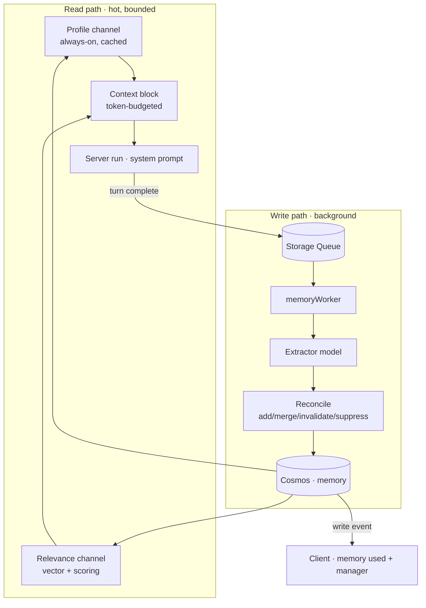
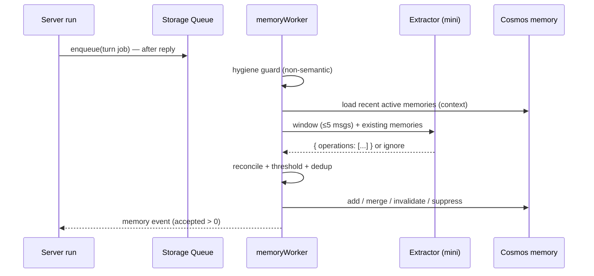
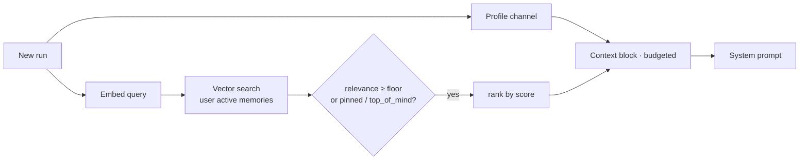

# Watai Memory Architecture

Memory in Watai is a **governed, server-owned serving layer**. It gives each model run the
narrowest useful slice of durable knowledge about the user — their identity, preferences,
working style, project context, and past work — without slowing the conversation or polluting
prompts with stale history. It is a serving system, not a passive log.

The architecture rests on one idea:

> **Every decision is a mechanism, not a gate.** Whether to remember something is the output of
> the extractor. Whether to recall something is the output of a similarity score. How a memory is
> structured is the output of its typed fields. Nothing in the memory path is decided by
> hand-maintained keyword rules.

---

## 1. Principles

1. **Two decisions, both emergent.**
   - *Write:* whether a turn contains something worth saving is decided by the extractor model's
     own output (`ignore` vs. operations).
   - *Read:* whether a stored memory is needed for the current turn is decided by a relevance score
     clearing a floor.
2. **Structure from types, not prose.** A record's place in the user profile is derived from its
   typed `kind`, `entities`, and `route`, never by re-parsing its text.
3. **Writes never touch the chat hot path.** Extraction runs in the background after the reply.
   A memory failure can never delay, block, or corrupt a response.
4. **Reads are bounded and fail-open.** Retrieval runs within a fixed latency budget and returns
   empty on timeout or error.
5. **Identity is always present; the tail is retrieved.** Durable identity-level facts are injected
   on every run via a compact profile; specific and episodic memories are fetched on relevance.
6. **Temporal correctness.** New information that contradicts old information invalidates it; facts
   are superseded, never silently overwritten.
7. **Server-authoritative.** All memory reads and writes happen server-side in the run path; the
   client only renders and issues user controls.
8. **Governed by default.** Secret-like values are rejected at the schema boundary; sensitive
   memories are never auto-injected; the user can inspect, edit, suppress, delete, pause, export,
   and rebuild everything.

---

## 2. System overview

The store is the single source of truth. The profile channel and relevance channel are two
**derived views** of it; the capture path is the only writer.

---

## 3. The memory record

A memory is one atomic, source-linked, typed record. Contract:
[api/src/domain/memory.ts](../../api/src/domain/memory.ts).

| Group | Fields | Role |
| --- | --- | --- |
| Identity | `id`, `userId` | Partition key is `userId`. |
| Content | `text`, `normalizedText`, `summary`, `entities[]`, `topics[]` | The statement and its normalized/indexable forms. |
| Classification | `kind`, `route` | Type and structured placement in the profile tree. |
| Scoring | `confidence`, `salience` | Drive write thresholds and read ranking. |
| Serving | `visibility` (`normal`/`top_of_mind`/`background`), `pinned` | Bias toward or away from injection. |
| Governance | `sensitive` | Sensitive memories are retrieval-only, never in the profile. |
| Lifecycle | `status` (`active`/`suppressed`/`invalidated`/`deleted`), `validAt`, `invalidAt`, `supersedes[]`, `supersededBy` | Temporal validity and supersession. |
| Provenance | `sourceRefs[]` (`sourceHash`) | Every memory links to the messages it came from; hash powers dedup. |
| Retrieval | `embedding[]`, `embeddingModel` | Vector and the model that produced it. |
| Usage | `useCount`, `lastUsedAt`, `createdAt`, `updatedAt` | Recency and feedback signals. |

**Kinds and serving policy.** A record's `kind` determines which channel serves it.

| Kind | Channel | Notes |
| --- | --- | --- |
| `fact` | Profile (identity) + relevance | Names, family, pets, location — always-on when durable. |
| `preference` | Profile (compact) + relevance | Stable likes/dislikes. |
| `instruction` | Profile (always-on) | Standing directives; always in scope. |
| `avoidance` | Profile (always-on) | Things to never do; always respected. |
| `work_style` | Profile (compact) | How the user likes to work. |
| `project_context` | Profile (current focus) + relevance | Active work surfaces in the profile; detail is retrieved. |
| `entity` | Structuring + relevance | Supports profile assembly and tail recall. |
| `procedure` | Relevance only | Fetched when the task matches. |
| `thread_summary` | Relevance only | Episodic memory of past work. |

---

## 4. Capture (write path)

Capture is fully asynchronous. When an assistant turn completes, the run enqueues a single job to
the Storage Queue; the `memoryWorker` Azure Function drains it. There is **one lane** — the
completed exchange — because the full user+assistant window is the richest context for deciding
what to remember.

**1 — Eligibility & hygiene.** The job is skipped if memory is disabled/paused for the user, the
thread is temporary/deleted, or the window is empty/trivial/duplicate. This guard is purely
mechanical hygiene (presence, not meaning); it never judges whether content is memory-worthy.

**2 — Extraction is the write decision.** The worker passes the recent window plus the user's
current active memories to the extractor model
([api/src/ai/memoryExtractor.ts](../../api/src/ai/memoryExtractor.ts)). The extractor returns
strict JSON: either a single `ignore` operation (nothing to save) or a list of operations. That
output **is** the decision — there is no pre-filter.

The extractor emits flat, typed operations:

- `add` — a new memory with `kind`, `text`, `entities`, `confidence`, `salience`,
  `sourceMessageIds`, and an optional `route` (its place in the profile tree).
- `merge` — fold a new detail into an existing memory by `memoryId`, supplying the full updated text.
- `invalidate` — mark an existing memory no longer true (contradiction/replacement).
- `suppress` — hide an existing memory.
- `ignore` — store nothing.

Because existing memories are in context, the extractor reconciles in place: a new detail about a
known entity becomes a `merge`, a contradiction becomes an `invalidate`, and only genuinely new
information becomes an `add`.

**3 — Reconcile & persist.** The worker applies operations deterministically
([api/src/application/memoryExtractionService.ts](../../api/src/application/memoryExtractionService.ts)):

- **Confidence/salience thresholds** gate `add` so low-signal noise is dropped.
- **`sourceHash` dedup** collapses a repeated fact into a `merge` (unioned sources, max confidence,
  max salience) instead of a duplicate.
- **Supersession** links replacing facts via `supersedes`/`supersededBy` and invalidates the old
  record; nothing is destructively overwritten.
- **Visibility** is assigned from salience (high → `top_of_mind`, low → `background`).

**4 — Structuring.** A record's location in the profile tree comes from its typed `route`
(layer / profile path / entity / relationship / temporal) and `kind`, set at write time. Profile
assembly reads these structured fields; it does not parse memory prose.

**5 — Embedding.** On persist, the worker computes the record's embedding and stores it with
`embeddingModel`. This makes the record retrievable the moment it is saved.

**Model tiers** ([api/src/application/memoryModelService.ts](../../api/src/application/memoryModelService.ts)):

| Tier | Use | Model |
| --- | --- | --- |
| Routine | Per-turn extraction + reconcile | `MEMORY_MODEL` (mini) |
| Deep | Rebuilds, imports, bulk reconciliation | `MEMORY_DEEP_MODEL` (full) |
| Embedding | Vectors for retrieval | embeddings deployment |

Resolution precedence: admin override → environment → user's chat model. Users never choose these.

---

## 5. Serve (read path)

Retrieval runs on the hot path before generation, within a fixed latency budget, and assembles a
token-budgeted context block from two channels
([api/src/application/memoryContextService.ts](../../api/src/application/memoryContextService.ts)).

### Channel A — Profile (always-on)

A compact, structured profile is injected on **every** run, with no decision. It is **derived**
from the user's records via their typed fields ([api/src/domain/memoryProfile.ts](../../api/src/domain/memoryProfile.ts)),
**cached** per user, and **invalidated** by the capture write event. It carries identity facts,
standing instructions, avoidances, durable preferences, and current project focus — bounded to a
fixed token cap. Sensitive records are excluded from this channel.

### Channel B — Relevance (retrieved tail)

For specific and episodic memories, the query is embedded and matched against the user's active
records by vector similarity. **The retrieve decision is the relevance floor:** a record must clear
a minimum cosine similarity to be a candidate (pinned/`top_of_mind` records bypass the floor).
Survivors are ranked by a composite score, and the top few are taken within the token budget.

### Assembly

The selected memories and instructions are rendered into a short, labeled block and prepended to
the run's system prompt. Each injected memory is **source-linked** so the client can show exactly
what influenced the response. If retrieval exceeds its budget or fails, the block is empty and the
run proceeds normally.

---

## 6. Retrieval scoring

Candidates that clear the relevance floor are ranked by:

$$
\text{score} = w_r \cdot \text{relevance} + w_i \cdot \text{importance} + w_t \cdot \text{recency}
$$

- **relevance** — cosine similarity between the query embedding and the memory embedding (the
  retrieve decision is `relevance ≥ θ`).
- **importance** — the memory's `salience`, blended with `confidence`.
- **recency** — exponential decay over time since `updatedAt`/`lastUsedAt`; near-constant for
  durable identity facts, meaningful for episodic memories.

`pinned` and `top_of_mind` records bypass the floor; `background` and `suppressed` records are
demoted or excluded. Weights and the floor are configuration, tuned against evaluation fixtures.

---

## 7. Storage & retrieval substrate (Azure)

Memory lives in **Azure Cosmos DB for NoSQL**, container `memory`, partitioned by `/userId`. Each
document carries its own embedding, so vectors are colocated with the data they describe — no
separate vector store to provision or keep in sync.

Retrieval is accessed through a single interface so the substrate is swappable without touching the
serve logic:

- **In-process cosine** over a user's active records is the default mechanism. Per-user memory sets
  are small, so an exact in-memory scan is fast and needs no index.
- **Cosmos integrated vector search** (`VectorDistance()` with a container vector policy, filtered
  by `userId` and `status`, `TOP K`) is the drop-in for larger per-user sets, keeping vectors and
  records together in the database already in use.

Both implementations satisfy the same `retrieve(userId, queryEmbedding, k)` contract; the serve
path is identical either way.

**Embedding lifecycle.** Embeddings are produced by an Azure OpenAI embeddings deployment at write
time (stored with `embeddingModel`) and for the query at read time. The `embeddingModel` stamp
allows detecting and backfilling records when the embedding model changes.

**Background substrate.** Capture runs on an Azure Functions queue trigger (`memoryWorker`) fed by
an Azure Storage Queue. Credentials are wrapped in Key Vault and resolved server-side only.

---

## 8. Governance & privacy

- **Secrets are rejected at the boundary.** Memory text that contains secret-like values fails
  schema validation and is never stored.
- **Sensitive is retrieval-only.** `sensitive` memories are never placed in the always-on profile;
  they surface only through explicit relevance retrieval, clearly flagged.
- **Visibility tiers.** `top_of_mind` biases toward injection; `background` biases away; `normal` is
  default. `suppressed` and `invalidated` records are excluded from serving.
- **User control.** The user can inspect, edit, suppress, delete, pause extraction, pause
  reference, export, and rebuild memory. A rebuild replays sources through the deep tier.
- **Attribution.** Every served memory is source-linked and shown to the user for the response it
  influenced.

---

## 9. Observability

- Each capture job is a durable record with operation counts (`add`/`merge`/`invalidate`/
  `suppress`/`ignore`), accepted/rejected tallies, and error state.
- On accepted writes, a `memory` event is pushed to the client, which invalidates the profile cache
  and updates the memory manager.
- Each run records the memory block it used (ids, scores, token estimate) for inspection and
  evaluation.

---

## 10. Interfaces

| Concern | Contract | File |
| --- | --- | --- |
| Record schema & types | `MemoryRecord`, kinds, statuses, visibility | [api/src/domain/memory.ts](../../api/src/domain/memory.ts) |
| Profile view | `MemoryProfileView`, profile builder | [api/src/domain/memoryProfile.ts](../../api/src/domain/memoryProfile.ts) |
| Extraction | extractor operation contract | [api/src/ai/memoryExtractor.ts](../../api/src/ai/memoryExtractor.ts) |
| Capture & reconcile | worker apply semantics | [api/src/application/memoryExtractionService.ts](../../api/src/application/memoryExtractionService.ts) |
| Serve | context block assembly | [api/src/application/memoryContextService.ts](../../api/src/application/memoryContextService.ts) |
| Model tiers | routine / deep / embedding | [api/src/application/memoryModelService.ts](../../api/src/application/memoryModelService.ts) |
| Persistence | store port + Cosmos adapter | [api/src/ports/memoryStore.ts](../../api/src/ports/memoryStore.ts) |
