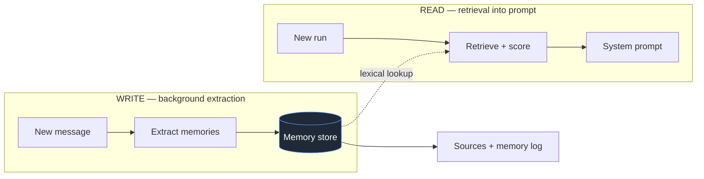
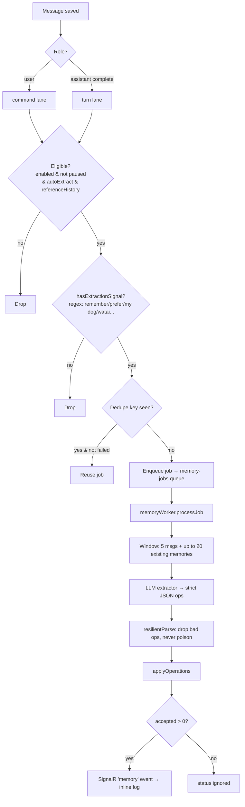
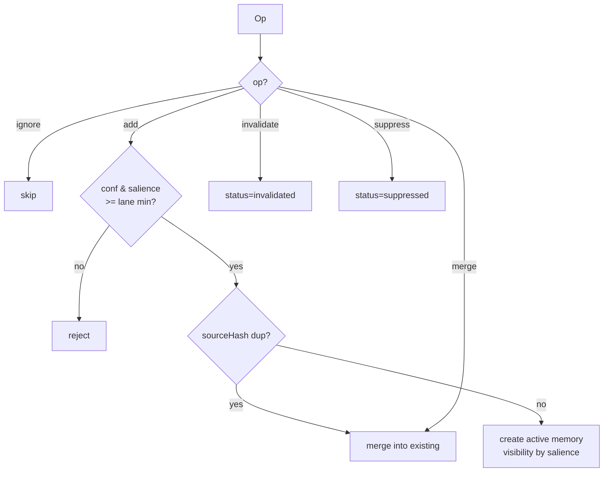
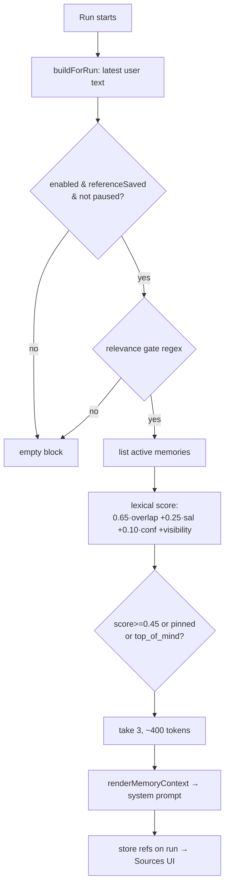
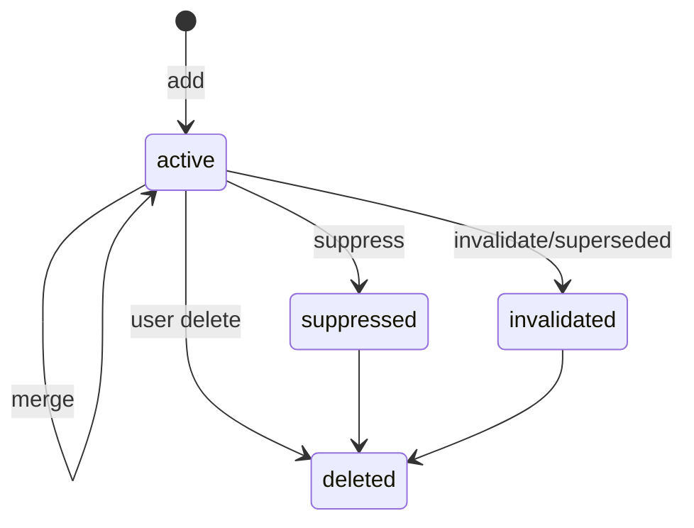

# Memory System — Pipeline Flow (as built)

A flowchart-led walkthrough of how Watai's memory system works **today**, derived from the
shipping code (not the spec). Use it to review behaviour and give feedback. File references point
at the live implementation.

- Storage / record shape: [memory.ts](../../api/src/domain/memory.ts)
- Write (extraction): [memoryExtractionService.ts](../../api/src/application/memoryExtractionService.ts), [memoryExtractor.ts](../../api/src/ai/memoryExtractor.ts), [memoryWorker.ts](../../api/src/functions/memoryWorker.ts)
- Read (retrieval): [memoryContextService.ts](../../api/src/application/memoryContextService.ts), [runWorker.ts](../../api/src/application/runWorker.ts)
- Models: [memoryModelService.ts](../../api/src/application/memoryModelService.ts)

---

## 1. Big picture

Two independent pipelines plus an admin-tuned model tier.

---

## 2. Write pipeline (extraction)

Triggered after each message; runs async on a storage queue so chat latency is untouched.

Gates live in [eligible()](../../api/src/application/memoryExtractionService.ts) and
`hasExtractionSignal`; window is the last 5 messages around the target.

### 2a. Operation apply + thresholds

Lane minimums: command conf ≥0.65 / sal ≥0.40; turn conf ≥0.82 / sal ≥0.65
([applyOperations](../../api/src/application/memoryExtractionService.ts)).

---

## 3. Read pipeline (retrieval)

Budgeted at 250 ms inside the run; failure falls back to empty (never blocks chat).

---

## 4. Memory status lifecycle

## 5. Model tiers

Routine (command/turn) vs deep (rebuild). Precedence: admin override → env → chat model
([memoryModelService.ts](../../api/src/application/memoryModelService.ts)).

## 6. Built but not wired

- `embedding` stored; retrieval is **lexical only** (no vector search).
- `route` / structured profile stored; unused in retrieval.
- `threadSummaries` always empty.
- Heavy reliance on hardcoded keyword regexes for gates.
