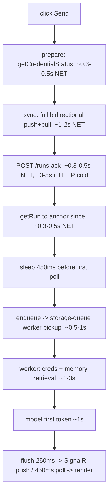

# TTFT fix plan — close the ~7s gap between model and browser

Status: PLAN v2 (measurement-led). Baseline: [ttft-browser-bench.md](ttft-browser-bench.md).

## 0. Critique of v1 → what changed in v2

Weaknesses in the first draft, and the fixes folded into this version:
- **Only measured the client half.** The bench's `fetch` hook sees client round-trips but not the
  server stages (queue pickup, memory, model). v2 adds **server-side timing** (run-record
  `queued→started→firstToken` stamps + a `Server-Timing` response header) so we split client vs server.
- **No test-pollution story.** Re-running the browser bench creates throwaway chats. v2 makes the
  harness **capture created thread ids and delete them** (`DELETE /threads/{id}`) at the end.
- **Sync-removal correctness gap.** Dropping the pre-submit sync breaks **brand-new threads** (the
  submit 404s if the thread isn't on the server). v2 specifies a **targeted thread-create** for new
  threads + skip-for-existing, with idempotency notes.
- **No risk register / rollback, and the riskiest change sat mid-plan.** v2 adds a risk register, a
  test-target decision (deploy-to-prod vs local), and moves **inline execution (Phase 3) last**,
  behind a flag.
- **Quick wins weren't isolated for safe shipping.** v2 separates low-risk, independently-deployable
  client wins (Phase 1) from anything touching the server.

## 1. Problem

Real, in-browser **TTFT is ~8s median (p95 up to ~20s)**, while the model itself returns a first token
in **~1s** ([ttft-audit-report.md](ttft-audit-report.md)). So **~7s is system/orchestration overhead**,
not the model — and it's a consistent floor across warm reps, so it's pipeline cost, not a one-off cold
start. The cold-start work (worker always-ready) was necessary but does **not** address this; this is the
bigger, real target.

| Prompt | TTFT median | TTFT p95 |
|--|--|--|
| "Hi" | 9.2s | 20.6s |
| Capital of France | 8.5s | 17.2s |
| DNS in 3 sentences | 8.1s | 18.4s |
| TS debounce | 8.1s | 8.3s |

## 2. The critical path (from code), send → first token

Sources: [useChat.ts send](../src/features/chat/useChat.ts#L153), [runStore startServerRun](../src/features/chat/runStore.ts#L60),
[serverRun runOnServer](../src/features/chat/serverRun.ts#L60), [runService.submit](../api/src/application/runService.ts#L37),
[runWorker](../api/src/application/runWorker.ts#L654).

### Confirmed facts that unlock fixes
- **`POST /runs` already appends the user message** (idempotent on `clientMessageId`) and creates the run
  ([runService.ts](../api/src/application/runService.ts#L46)). It only needs the **thread** to already exist
  (`requireOwnThread` 404s otherwise). ⇒ the pre-submit **full `sync()` is redundant for existing threads**.
- **`prepare()` blocks submit** on a network `getCredentialStatus()` to resolve the tool set
  ([useChat.ts](../src/features/chat/useChat.ts#L22)). Capabilities rarely change ⇒ cacheable / worker-resolvable.
- **`getRun()` after submit** exists only to anchor the poll `since` window — the client-time fallback
  (`now − 30s`) already works ([serverRun.ts](../src/features/chat/serverRun.ts#L74)) ⇒ removable round-trip.
- **SignalR `negotiate`** and every HTTP call hit the front door, which we left at **`http=0` always-ready**
  ⇒ the first call after idle cold-starts (~3-5s); this is the likely source of the 17-20s p95 spikes.

## 3. Root causes, ranked

1. **Serial client round-trips before the server even starts** (~2-3s): `getCredentialStatus` + full `sync` + `getRun`, each a separate request.
2. **HTTP front-door cold start** on submit + negotiate (`http=0`) — drives the p95 spikes.
3. **Storage-queue hop** (~0.5-1s even warm): enqueue → separate worker polls (`maxPollingInterval` 1s).
4. **Memory retrieval on the worker path** (~1-3s) with known redundant Cosmos reads (double settings read + a 200-record profile `list` every run — [ttft-audit-report.md](ttft-audit-report.md#L131)).
5. **450ms initial poll sleep** + poll cadence (minor; SignalR usually beats it once connected).

## 4. Fix strategy (phased, measurement-led)

### Phase 0 — Instrument the breakdown (do this first; don't guess)
- Upgrade [scripts/ttft-bench.mjs](../scripts/ttft-bench.mjs): **reload once after `addInitScript`** so the
  `fetch` hook installs before app code (today it misses → `POST /runs = 0`); time `getCredentialStatus`,
  `sync`, `submitRun`, `getRun`, `negotiate`, and first `message`/poll; detect SignalR-vs-poll path; add a
  **"wait for a NEW assistant group"** guard (fixes the 66ms artifact); **capture + delete the throwaway
  threads** it creates (`DELETE /threads/{id}` with the bearer token sniffed from a live request).
- **Server-side timing (the missing half):** stamp the run record with `queuedAt / startedAt /
  firstTokenAt` (already partly present) and emit a `Server-Timing` header from `POST /runs`, so the bench
  can subtract server time from wall-clock and isolate the client round-trips.
- Add temporary client `performance.mark`s around prepare/sync/submit/first-token (behind a flag).
- Re-run to get a per-stage table. **Acceptance:** we can attribute the ~7s to stages within ±0.5s.

### Phase 1 — Client quick wins (no server change, low risk) — biggest, cheapest
- **Skip the pre-submit full `sync()`** when the thread already exists server-side; for a brand-new thread
  do a **targeted thread-create** (one small write) instead of a full bidirectional sync.
- **Drop the post-submit `getRun()`** — anchor `since` from the submit ack / client time.
- **Take `getCredentialStatus` off the critical path** — cache capabilities (TTL) so `prepare()` resolves
  instantly; refresh in the background.
- **Read immediately** instead of sleeping 450ms before the first poll.
- Expected: removes ~2-3s of serial latency. Deploy, re-measure.

### Phase 2 — Infra: warm the front door
- Set **`alwaysReadyHttp = 1`** (the change already costed at +~$21/mo → ~$42/mo total). Kills the
  front-door cold start on submit + SignalR negotiate ⇒ removes the 17-20s p95 spikes and first-prompt
  penalty. One-line bicepparam + `az functionapp scale config always-ready set`.

### Phase 3 — Architecture: drop the queue hop (Option B from the audit)
- Run `processRun` **inline in the `POST /runs` handler** and stream via SignalR, instead of enqueue →
  separate queue-worker. Removes ~0.5-1s queue latency and the warm-worker dependency. Larger change
  (client-supplied runId for Stop, cooperative cancel on disconnect) — do with live validation.

### Phase 4 — Memory retrieval trims (worker path)
- Pass the **already-loaded settings** into `buildForRun` (drop the duplicate Cosmos read).
- **Bound/cache** the always-on profile `list(200)` so it isn't a fresh 200-record read every turn; fold it
  into the retrieval query. Expected ~0.5-1s off the worker path.

## 5. Expected impact

| After | TTFT median (target) |
|--|--|
| Today | ~8s |
| Phase 1 (client round-trips) | ~5-6s |
| Phase 2 (front door warm) | ~5s, p95 collapses toward median |
| Phase 3 (no queue hop) | ~3-4s |
| Phase 4 (memory trims) | **~2-3s** |

## 6. Validation & rollback
- Re-run the browser bench after **each** phase (same prompts ×5, warm + one cold sample). Keep the per-stage breakdown.
- **Acceptance:** TTFT median ≤ ~3s, p95 < ~5s, no regression in correctness/streaming.
- Each phase is independently revertable (client phases via deploy revert; Phase 2 via bicepparam; Phase 3 behind a flag).

## 7. Open decisions
1. Approve **Phase 2 cost** (~$21/mo more for `http=1`)?
2. Phase 3 (inline execution) is the biggest change — do it, or stop after Phases 1+2+4 if we've hit ~3s?
3. Keep temporary client `performance.mark` instrumentation in prod (gated) or strip after measuring?

## 8. Risk register & test strategy

| Risk | Likelihood | Impact | Mitigation |
|--|--|--|--|
| Client send-path change breaks chat (idempotency, since-window, new-thread create) | Med | High | Keep `runOnServer` unit tests green; update them to the new contract; canary one prompt before the full bench; revert deploy on any error row. |
| Skipping pre-submit sync 404s a brand-new thread | Med | High | Targeted `createThread` (client id, idempotent — treat 409 as success) for new threads; skip only when the thread is known server-side. |
| Stale cached capabilities request an unsupported tool | Low | Low | Short TTL (≤5 min) + background refresh; `web_search`/`generate_image` always safe; only `code_interpreter`/`file_search` gated. |
| Deploying perf changes to prod (browser bench targets prod) | Med | Med | Run `vitest` first; deploy; canary; if regression, `git revert` + redeploy (frontend is static `docs/`). |
| Benchmark litters history | High | Low | Harness deletes its threads via `DELETE /threads/{id}` at the end. |

**Test target:** the browser bench runs against **prod** (`prabinpebam.github.io/watai/`) where the session
lives, so each client phase must be **built + deployed to `docs/`** before benching. Local-dev testing
(`localhost:5173`) is possible but needs a CIAM redirect-URI + a fresh login, so prod-with-revert is the
working path. Always re-bench warm + one cold sample, and **clean up** afterward.

## 9. Definition of done
- TTFT **median ≤ ~3s**, **p95 < ~5s** in the browser bench, across the 4-prompt set ×5.
- Per-stage breakdown shows no single client round-trip > ~0.5s on the critical path.
- No correctness/streaming regression; `vitest` green; throwaway threads cleaned up each run.
