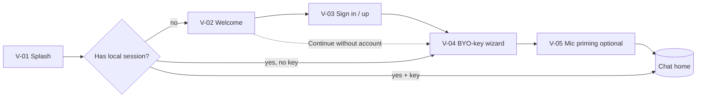

# 03 — Screens: Onboarding & Settings

Build-ready specs for onboarding (V-01–V-05) and Settings (V-19–V-26). Each screen lists
**purpose**, **wireframe**, **layout & measurements**, **components**
([02-components.md](02-components.md)), **states**, **responsive behavior**, **copy**
([07-content-and-assets.md](07-content-and-assets.md)), and **acceptance**. Tokens from
[01-design-tokens.md](01-design-tokens.md).

In the frontend-first build, auth is **stubbed** to a local session and the BYO-key
wizard is **fully real** (it calls the user's `/openai/v1` endpoint to validate).

---

## Onboarding flow



---

## V-01 — Splash / launch

- **Purpose:** brand moment while the shell hydrates and routes.
- **Wireframe:**

```
┌──────────────────────────┐
│                          │
│                          │
│          ◆ Watai          │   ← wordmark, centered
│                          │
│        (shimmer)          │   ← only if >600ms
│                          │
└──────────────────────────┘
```

- **Layout:** full-bleed `--color-bg`; wordmark `display` centered both axes; optional
  indeterminate shimmer 24px below appears only after 600ms.
- **Components:** brand mark; Spinner/shimmer.
- **States:** `booting` (default), `slow` (>600ms → shimmer), `error` (hydration failed →
  ErrorState with Reload).
- **Behavior:** hydrate shell, restore theme + session + last route + key presence; then
  route per the flow diagram. Min visible time 300ms to avoid a flash.
- **Responsive:** identical all breakpoints.
- **Acceptance:** routes correctly for all three branches; respects theme on first paint
  (no flash of wrong theme).

---

## V-02 — Welcome

- **Purpose:** one-screen value prop + entry to auth or local mode.
- **Wireframe:**

```
┌──────────────────────────┐
│  safe top                │
│        ◆ Watai            │
│                          │
│   Chat, talk, and create │   ← display
│   with your own AI.      │
│                          │
│   • Streaming chat        │   ← 3 value bullets w/ icons
│   • Voice in and out      │
│   • Image generation      │
│                          │
│  ┌────────────────────┐   │
│  │   Get started      │   │   ← primary, lg, full-width
│  └────────────────────┘   │
│   I already have an acct  │   ← text button
│   Continue without acct   │   ← text button (local mode)
│  safe bottom             │
└──────────────────────────┘
```

- **Layout:** content max-width 480 centered; 24px side gutters; bullets list with
  `--icon-24` accent glyphs; button stack pinned with 16px gaps above bottom safe area.
- **Components:** Button (primary lg, text ×2), icon list.
- **States:** static; buttons have standard states.
- **Behavior:** Get started → V-03 (sign up); "I already have…" → V-03 (sign in);
  "Continue without account" → ConfirmDialog (explains local-only) → V-04.
- **Responsive:** expanded centers the same 480 column; optional right-side decorative
  panel ≥1024 (non-essential, may omit).
- **Acceptance:** all three paths navigate; local-mode choice is clearly explained and
  reversible later.

---

## V-03 — Sign in / Sign up

- **Purpose:** authenticate (stubbed locally in frontend-first; real Entra later).
- **Wireframe:**

```
┌──────────────────────────┐
│  ←            Sign in     │   ← AppBar back + title-3
│                          │
│   Email                  │   ← label
│  ┌────────────────────┐   │
│  │ you@example.com    │   │   ← TextField (email)
│  └────────────────────┘   │
│  ┌────────────────────┐   │
│  │   Continue         │   │   ← primary lg
│  └────────────────────┘   │
│   ──────  or  ──────      │   ← labeled divider
│  ┌────────────────────┐   │
│  │  Continue with …   │   │   ← social buttons (outline)
│  └────────────────────┘   │
│   By continuing you agree │   ← caption + links
└──────────────────────────┘
```

- **Layout:** single column, 24px gutters, 16px field rhythm; primary CTA full-width;
  social buttons stacked outline; legal caption at bottom.
- **Components:** AppBar (back), TextField (email, `inputMode=email`), Button (primary +
  outline social), Divider (labeled), links.
- **States:** `default`, `validating` (CTA loading), `error` (invalid email inline; auth
  failure → InlineAlert above the form), `passwordless-sent` (swap to a code-entry view:
  6-digit input, resend timer).
- **Behavior (frontend-first):** any valid-format email + Continue creates a **local
  session** and proceeds to V-04; social buttons do the same. Real OIDC/PKCE swaps in
  later behind the same screen.
- **Responsive:** expanded = centered 400 card with `--elevation-3`.
- **Acceptance:** validation works; success advances to BYO-key; the screen is fully
  keyboard operable; errors announced.

---

## V-04 — BYO-key setup wizard (critical)

- **Purpose:** capture and **validate** the user's Azure `/openai/v1` configuration. This
  is what makes the frontend-only build fully functional.
- **Structure:** a 3-step wizard with a progress indicator; can also open as a single
  scrollable form from Settings → Models.

```
Step 1 Endpoint → Step 2 Models → Step 3 Test & finish
```

- **Wireframe (Step 1):**

```
┌──────────────────────────┐
│  ←     Connect your AI    │   ← AppBar back + title-3
│  ●──○──○                  │   ← step dots (1 of 3)
│                          │
│  Base URL                │
│  ┌────────────────────┐   │
│  │ https://….../openai/v1│ │   ← TextField (url), paste-friendly
│  └────────────────────┘   │
│  Your key stays on this   │   ← helper (security copy)
│  device. Never sent to us.│
│                          │
│  API key                 │
│  ┌──────────────── 👁 ──┐ │   ← TextField password + reveal
│  │ ••••••••••••••••••  │  │
│  └────────────────────┘   │
│  ┌────────────────────┐   │
│  │   Continue         │   │   ← primary lg
│  └────────────────────┘   │
└──────────────────────────┘
```

- **Step 1 — Endpoint & key:**
  - `Base URL` TextField (`type=url`, `inputMode=url`), placeholder shows the
    `…/openai/v1` shape; **never prefilled/hardcoded**; validates it is https and
    well-formed.
  - `API key` TextField (`type=password`, reveal toggle, paste affordance).
  - Security helper text (exact string in [07](07-content-and-assets.md)).
  - Optional "Encrypt key with a passphrase" Switch (O5) → if on, reveals a passphrase
    field; explains that the passphrase is required on each launch.
- **Step 2 — Model names:** four TextFields with sensible defaults shown as placeholders:
  `chat = gpt-5.4`, `transcribe = gpt-4o-transcribe`, `image = gpt-image-2`,
  `voice/TTS = (optional)`. Each has a short helper. An "Advanced" disclosure exposes
  `reasoning_effort` default (Select: minimal/low/medium/high) and `max_completion_tokens`.
- **Step 3 — Test & finish:** a **Test connection** action runs one minimal probe per
  configured model and shows a per-model result list:

```
  Chat (gpt-5.4)            ✓ Connected
  Transcribe (gpt-4o-…)     ✓ Connected
  Image (gpt-image-2)       ⏳ Testing…
  Voice (optional)          — Skipped
  ───────────────────────────────────
  ┌────────────────────┐
  │   Start using Watai │   ← primary, enabled when chat passes
  └────────────────────┘
```

- **Probe details:** chat = 1-token completion; transcribe = capability ping (HEAD/OPTIONS
  or a tiny sample); image = `n=1` smallest size or a dry validation; mapped to the error
  taxonomy in [../03-api-integration.md](../03-api-integration.md) §6 (`unauthorized`,
  `deployment_not_found`/model-not-found, `rate_limited`, `offline`, CORS-blocked).
- **Per-model status chip:** `idle` (—), `testing` (Spinner), `ok` (✓ success),
  `failed` (✗ danger + reason + "Fix"), `skipped`.
- **States:** `incomplete` (Continue disabled until required fields valid),
  `testing`, `partial-success` (chat ok, others failed → allow finish with a warning
  banner that voice/image are unavailable until fixed), `all-ok`, `cors-blocked` (special
  InlineAlert explaining the direct-call limitation + link to docs/proxy note).
- **Behavior:** on finish, persist `ApiConfig` (key stored separately, optionally
  encrypted) to IndexedDB; set capability matrix from probe results
  ([../03-api-integration.md](../03-api-integration.md) §8); route to V-05 or Chat.
- **Security:** key is masked, never logged, never placed in URL; reveal is momentary;
  copy reassures local-only storage.
- **Responsive:** compact = full-screen steps; expanded = centered 560 dialog with the
  same steps; Settings entry = single long form (no step dots).
- **Acceptance:** entering a real endpoint+key and tapping Test shows accurate per-model
  status; finishing enables the matching features; invalid key shows `unauthorized` with
  a Fix path; nothing is hardcoded.

---

## V-05 — Permissions priming (microphone)

- **Purpose:** explain why mic access is needed **before** the browser prompt (raises
  grant rate); shown the first time voice/dictation is used, or optionally at end of
  onboarding.
- **Wireframe:** centered EmptyState-style: mic glyph, `title-2` "Talk to Watai", `body`
  explanation, primary "Enable microphone" (triggers the real `getUserMedia` prompt),
  text "Not now".
- **States:** `priming`, `requesting` (browser prompt open), `granted` (toast + proceed),
  `denied` (InlineAlert with OS-settings guidance + text fallback), `unavailable`
  (no device → explain).
- **Behavior:** "Enable" calls `getUserMedia({audio})`; result updates a stored permission
  state; denial routes back gracefully and disables voice affordances with a tooltip.
- **Acceptance:** prompt only fires after the priming CTA; denial degrades cleanly.

---

## Settings

Settings is a **stacked navigation** (compact: full-screen push views; expanded: a
two-pane master/detail dialog or a routed `/settings/:section`). The hub lists sections;
each pushes a subpage.

### V-19 — Settings hub

- **Wireframe:**

```
┌──────────────────────────┐
│  ←            Settings    │   ← AppBar back + title-3
│  ┌──────────────────────┐ │
│  │ ◎  Alex                │ │  ← Account row (avatar + name + email)
│  │    you@example.com   ›│ │
│  └──────────────────────┘ │
│  ── GENERAL ──            │   ← SectionHeader
│  ⚙  Models & keys       › │   ← ListRow nav
│  ✦  Personalization     › │
│  🎙 Voice                › │
│  ── DATA ──               │
│  ▤  Data controls        ›│
│  ── APP ──                │
│  ◐  Appearance           ›│
│  ⓘ  About                ›│
│  ────────────────────     │
│  Sign out                 │   ← destructive text row
└──────────────────────────┘
```

- **Components:** AppBar (back), ListRow (Account = avatar variant; others = nav),
  SectionHeader, destructive ListRow (Sign out → ConfirmDialog).
- **States:** Account row shows `local` badge when in account-optional mode (label
  "Local").
- **Responsive:** expanded = left list (280) + right detail pane; selecting a row renders
  its subpage in the right pane (no push animation).
- **Acceptance:** every row navigates; Sign out confirms and clears local session/key.

### V-20 — Account

- **Contents:** profile header (avatar lg, name, email/identity); rows: Edit profile
  (name, avatar), Mode (Local ⇄ Synced — in frontend-first, Synced is disabled with
  "Coming soon"), Devices (stub), Sign out, **Delete account** (destructive →
  ConfirmDialog requiring typed confirmation).
- **States:** `local` (synced controls disabled w/ explainer), `synced` (later).
- **Acceptance:** edits persist locally; delete clears all local data after confirm.

### V-21 — Models & keys

- **Purpose:** the persistent home of the BYO-key config (same fields as V-04, as a
  single form) plus chat defaults.
- **Contents (grouped):**
  - **Connection:** Base URL, API key (masked + reveal + Replace), key-encryption Switch
    (O5).
  - **Models:** chat / transcribe / image / TTS model-name fields, each with a per-model
    **Test** button + status chip.
  - **Chat defaults:** `reasoning_effort` Select, `max_completion_tokens` stepper, system-
    prompt Textarea (advanced), streaming toggle (debug).
  - **Capabilities:** read-only matrix from last probe (vision, image-edit, transcription-
    streaming, TTS) with a "Re-test all" Button.
- **States:** `saved` (toast on change), `testing`, per-field `error` (e.g., bad URL),
  `unauthorized` banner if the active key failed on last real call.
- **Security:** key never shown by default; "Replace key" clears then accepts a new value;
  changing the key re-runs probes.
- **Acceptance:** editing endpoint/models updates live AI behavior; Test reflects real
  results; nothing hardcoded.

### V-22 — Personalization

- **Contents:** Custom instructions — two Textareas ("What should Watai know about you?",
  "How should Watai respond?") with character counters; **Memory** Switch (enable/disable),
  a "Manage memory" row → list of remembered items (ListRows) each deletable, and "Clear
  all memory" (destructive); Suggestion chips toggle (show/hide starters on empty state).
- **States:** `saved` toast; empty memory → EmptyState.
- **Behavior:** custom instructions feed the system prompt
  ([../03-api-integration.md](../03-api-integration.md) §2.2); stored locally.
- **Acceptance:** instructions persist and visibly affect responses; memory items can be
  viewed and removed.

### V-23 — Voice

- **Contents:** Voice output engine SegmentedControl (Read-aloud (TTS) / Realtime
  (if available) — Realtime disabled with "Experimental" until D4); Voice picker (Select,
  preview ▶ each); Speech rate Slider; VAD sensitivity Slider; "Auto-send on silence"
  Switch; "Show captions" Switch; mic device Select (if multiple).
- **States:** `tts-unconfigured` (engine controls disabled + link to Models to set a TTS
  model); preview `playing`.
- **Acceptance:** changing rate/voice affects read-aloud + voice mode; settings persist.

### V-24 — Data controls

- **Contents:** History sync Switch (disabled "Coming soon" in frontend-first);
  Temporary-chat default Switch; Retention Select (Keep forever / 30 / 90 days);
  **Export all data** Button (downloads JSON + images zip from IndexedDB);
  **Delete all data** (destructive → ConfirmDialog with typed confirm); "Where your data
  lives" explainer (local now; Azure later); per-type storage usage readout (threads,
  images, audio sizes).
- **States:** `exporting` (progress), `deleting` (progress + final toast), `empty`.
- **Acceptance:** export produces a valid archive; delete wipes IndexedDB + stored key and
  returns to Welcome.

### V-25 — Appearance

- **Contents:** Theme SegmentedControl (System / Light / Dark) — applies instantly; Text
  size SegmentedControl (S / M / L / XL → root multiplier 0.9–1.25); Message density
  SegmentedControl (Comfortable / Compact); "Reduce motion" Switch (overrides OS);
  Language Select (scaffolded). A **live preview** card (a sample user+assistant exchange)
  updates as settings change.
- **States:** instant apply; preview reflects all changes.
- **Acceptance:** theme/size/density/motion changes apply app-wide immediately and persist.

### V-26 — About

- **Contents:** app icon + name + version + build; What's new (changelog link/sheet);
  Privacy & security explainer (how keys are stored, what leaves the device);
  Open-source licenses (sheet/list); Support/contact links; "Made with Azure OpenAI"
  attribution (text only). No external account required.
- **Acceptance:** all links/sheets open; version string present.

---

## Settings — cross-cutting

- Every change auto-saves locally with a subtle "Saved" Toast (no Save buttons except
  destructive/confirm flows).
- Destructive actions always use ConfirmDialog (C6); irreversible ones (delete account /
  all data) require typed confirmation.
- Expanded layout uses master/detail; compact uses push navigation with AppBar back.
- All rows reach 44px min height; all controls keyboard operable; section headers use the
  `label` type.
