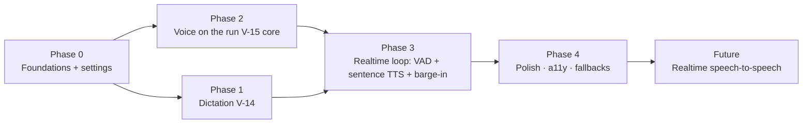

# Voice — Implementation / Execution Plan

Turns the rewritten voice spec into a buildable, PR-sized plan. The spec is the contract:
[ui-design V-14 (Dictation) + V-15 (Voice mode)](ui-design/05-screens-history-voice-images.md),
[product spec S7](01-product-spec.md#57-s7--voice-mode-full-screen), and the
[API-integration voice rows](03-api-integration.md). Testing follows the EDD strategy in
[05-execution-plan.md §6](05-execution-plan.md) — every slice ships a check that proves the *product
claim*, not just that code runs.

**The one load-bearing decision:** voice mode is **not** a separate model path. Each spoken turn is a
normal **server-authoritative agentic run** (`POST /threads/:id/runs`) driven through the *existing
run store* (`useRuns`), so voice inherits memory, tools, skills, streaming, sync, and persistence for
free. The old `cloudApi.chatComplete` (`/ai/chat`) path is removed from voice.

---

## 1. Current code facts (2026-06-30)

What exists today (from the voice audit):

- **Backend proxy** [`aiProxyService`](../api/src/application/aiProxyService.ts): `/ai/transcribe`
  (real `gpt-4o-transcribe`), `/ai/speech` (TTS, mp3, `voice` param, **no `speed`**), `/ai/chat`
  (non-streaming). Vault creds, nothing persisted, unit-tested.
- **Voice mode** [`VoiceMode.tsx`](../src/features/voice/VoiceMode.tsx): tap-to-talk →
  transcribe → **`/ai/chat` (non-streaming, no tools/memory/skills)** → TTS. Orb is CSS-state only
  (not amplitude-reactive). Persists turns with **local** `repo.appendMessage` (not a synced run).
- **Dictation** [`Composer.tsx` `toggleDictation`](../src/features/chat/Composer.tsx): record →
  transcribe → **append to end** of the field (not caret-safe). No waveform.
- **Read aloud** [`Message.tsx`](../src/features/chat/Message.tsx): `synthesizeSpeech` → play.
- **Audio lib** [`audio.ts`](../src/lib/audio.ts): `startRecording()` (MediaRecorder + an
  `AnalyserNode`) and `readLevel(analyser)`. No VAD, no waveform component.
- **Settings model** [`src/lib/types.ts`](../src/lib/types.ts): `voice: { engine: 'tts' | 'realtime';
  voiceId?; rate; vad; autoSend; captions }` already typed. **UI exposes only autoSend / captions /
  rate, and none of them are wired** (rate not applied to TTS; captions always on; autoSend ignored).
- **Run path** the voice loop should ride: `useRuns.startServerRun(threadId, body, prepare)`
  ([`runStore.ts`](../src/features/chat/runStore.ts)) → `runOnServer`
  ([`serverRun.ts`](../src/features/chat/serverRun.ts)); the in-flight assistant text streams into
  `runs[threadId].message.content`; `cloudApi.cancelRun(threadId, runId)` stops it.
- **Run body** [`SubmitRunBody`](../src/data/cloud/types.ts): `{ text?, clientMessageId?, model?,
  tools?, allowDestructive? }` — identical to what text chat submits.

Gap summary: dictation isn't caret-safe; voice mode is a second-class pipeline with no real-time
loop (no VAD, barge-in, streaming, or amplitude orb); the Voice settings are inert.

---

## 2. Guiding principles

1. **Ride the run store; never fork the pipeline.** Voice mode subscribes to the same `useRuns` run
   it submits, reads the streaming text, and speaks it. No `/ai/chat` in voice. This is what makes
   voice equal to text chat (memory/tools/skills) with almost no new server code.
2. **Thin vertical slices.** Each phase ships an end-to-end usable increment. Dictation polish ships
   before any voice-mode rework.
3. **EDD per slice.** Unit tests for pure logic (sentence splitter, VAD endpointing, caret splice);
   a real-browser CDP probe (pattern: [`scripts/memory-tool-probe.mjs`](../scripts/memory-tool-probe.mjs))
   for the live loop, barge-in latency, and run-parity.
4. **Reuse, don't reinvent.** WaveformVisualizer, VAD, sentence splitter, and the TTS audio queue are
   shared primitives used by both dictation and voice mode.
5. **No dead controls.** A setting ships only when it actually changes behavior.

---

## 3. Target architecture

```mermaid
flowchart TD
  subgraph Voice mode
    MIC[Mic capture + VAD] -->|end-of-speech| TR[POST /ai/transcribe]
    TR -->|text| SR[useRuns.startServerRun → POST /runs]
    SR -->|streams text into runs[t].message| Q[Sentence splitter]
    Q -->|each sentence| TTSQ[TTS queue → POST /ai/speech]
    TTSQ --> SPK[Audio playback]
    SPK -->|drained + run complete| MIC
    MIC -.->|speech during speaking| BARGE[Barge-in: stop audio + cancelRun]
    BARGE --> MIC
  end
  SR --> WORKER[(Run worker: memory + tools + skills)]
  WORKER -->|SignalR snapshots| SR
```

Dictation is the same capture + transcribe primitives, minus the run/TTS — it just splices the
transcript into the composer.

Shared primitives (new, in `src/lib/` or `src/features/voice/`):

- `WaveformVisualizer` (B14) — canvas/SVG bars driven by `readLevel(analyser)`.
- `vad.ts` — energy-based voice-activity detector over the analyser: emits `speechstart` /
  `speechend` using an adaptive threshold scaled by `settings.voice.vad` (mic sensitivity).
- `sentences.ts` — incremental splitter: given growing text, yields newly-completed sentences.
- `ttsQueue.ts` — serial TTS player: `enqueue(text)` synthesizes via `cloudApi.synthesizeSpeech`
  ({ input, voice: voiceId, rate }) and plays clips back-to-back; `stop()` clears + halts < 50 ms.

### 3.1 The hard parts — audio-loop realities (make-or-break, not polish)

These decide whether voice feels world-class or broken. They gate Phase 3 and are spiked in Phase 0.

- **Acoustic echo / self-barge-in (the #1 bug).** TTS through speakers is picked up by the mic, which
  a naive VAD reads as the user talking → false endpoint / false barge-in. Layered mitigations:
  (1) `getUserMedia({ audio: { echoCancellation: true, noiseSuppression: true, autoGainControl: true } })`;
  (2) **reference-gated VAD** — during `speaking`, raise the barge-in threshold / subtract known TTS
  output energy, so only sustained mic energy above playback counts as an interrupt; (3) recommend
  headphones in-session; (4) **half-duplex fallback** — if echo can't be tamed on a device, pause the
  mic during playback (lose barge-in, keep the loop). *Acceptance: with speakers, the assistant's own
  voice never starts a turn.*
- **VAD: build vs buy (spike first).** Energy + adaptive threshold is jittery in real rooms. Evaluate
  **Silero VAD via `@ricky0123/vad-web`** (ONNX/WASM, runs in a worklet) vs the energy detector on real
  devices; keep the `vad.ts` interface (`speechstart`/`speechend`) stable so the engine is swappable.
  `settings.voice.vad` maps to endpoint aggressiveness / trailing-silence.
- **Interim transcript is not free.** `/audio/transcriptions` is **batch** (whole clip → text), so the
  spec's "live interim transcript" during `listening` is **not deliverable in v1** — v1 shows
  "Listening…" + the amplitude orb, and the user line appears after endpoint. Real partials need
  streaming transcription or Realtime (future). *(Reconciles Spec V-15 `listening` caption.)*
- **TTS latency + gapless playback.** Each sentence is a full `/audio/speech` round-trip + mp3 decode.
  To approach the target and avoid clicks: **prefetch** the next sentence while the current plays;
  decode to an AudioBuffer and **schedule on one Web Audio AudioContext** for gapless back-to-back;
  coalesce one-word fragments. Realistic warm budget: endpoint→transcribe ~0.5–0.9 s, +first token
  ~0.5 s, +sentence boundary, +TTS round-trip ~0.3–0.6 s ⇒ **~1.5–2.2 s to first spoken word**; treat
  ≤1.5 s as the stretch goal and **measure** (telemetry, §8).
- **Markdown → speech.** The streamed reply is markdown. A `speakableText()` normalizer runs before
  TTS: emphasis/links → their text, **drop code blocks** ("shared a snippet" or skip), linearize
  lists, skip tables/images (they land in the thread). Never read raw markup. Unit-tested.
- **Browser/codec matrix.** MediaRecorder emits `audio/webm;opus` on Chromium but **`audio/mp4`/AAC on
  Safari/iOS** — choose a supported mime at runtime and ensure `/ai/transcribe` accepts it. iOS suspends
  mic/AudioContext in the background; the AudioContext must be **unlocked by the entry gesture** and
  resumed on focus.

### 3.2 Run-store integration contract (voice ⇄ `useRuns`)

Riding the run store is the right call, but voice must respect its lifecycle:

- **Submit:** one turn = `startServerRun(threadId, { text, clientMessageId, model, tools }, prepare)`.
  Honor the **one-run-per-thread** guard — never submit while `isRunning(threadId)`; a premature
  endpoint is ignored/queued.
- **Read streaming text:** subscribe to `runs[threadId].message.content`; diff it through the sentence
  splitter → `speakableText()` → `ttsQueue`.
- **Completion:** the store **clears the overlay** on finish. Voice detects completion via
  `isRunning(threadId)` → false and **captures the final text before it clears**, flushes the last
  sentence, then returns to `listening`.
- **Barge-in mid-stream:** `cancelRun(threadId, runId)` + `ttsQueue.stop()`; the partial assistant
  message persists as `interrupted` (existing behavior) — correct and visible on exit.
- **Shared UI side-effects:** `startServerRun` also drives `useUi.setStream`, realtime, and the
  memory-notice toast. In voice, suppress chat-only chrome (no chat toast over the orb); surface the
  "memory updated" signal as a subtle caption note instead.
- **Tool turns:** while the run is using a tool, enter `working` + show the chip and **don't** start
  TTS until prose resumes; speak a short filler only if a tool exceeds ~2.5 s ("One sec — searching…").
  Image results are announced briefly ("I made an image — it's in the chat"), never described
  byte-by-byte. Tool wait is bounded by the run's own timeout; on timeout → `error`.

---

## 4. Phased roadmap



---

### Phase 0 — Foundations & shared primitives

**Goal:** the audio building blocks and the Voice settings are real and wired, so Phases 1–3 just
compose them.

**Slice 0 — Spike (the one device-dependent gate; runs in parallel with Phase 1).** The defaults are
already decided (§10), so this *validates and tunes* rather than discovers. On real devices (desktop +
one mobile), confirm: (1) **VAD** — `@ricky0123/vad-web` (Silero) endpoints cleanly; fall back to the
energy detector if model load/perf is unacceptable; (2) **echo** — with `echoCancellation` +
reference-gating, the assistant's own speech does not false-trigger over speakers (else flip that
device to half-duplex); (3) **barge-in** — Web Audio scheduling stops playback < 150 ms. **Exit
criteria:** VAD engine confirmed, an echo result per device class, a measured barge-in number, and a
throwaway orb prototype — recorded back into §10. If any fails, the documented fallback (energy VAD /
half-duplex) ships instead; the loop is never blocked.

**Backend** [`aiProxyService.ts`](../api/src/application/aiProxyService.ts):
- `speak()` accepts and forwards `speed` (Azure OpenAI `/audio/speech` supports `speed` 0.25–4.0) and
  keeps `voice`. Extend `SpeakInput` → `{ input; voice?; speed? }`. Clamp speed; default 1.0.

**Frontend:**
- [`apiClient.ts`](../src/data/cloud/apiClient.ts): `synthesizeSpeech({ input, voice?, speed? })`.
- New primitives: `WaveformVisualizer`, `lib/vad.ts`, `lib/sentences.ts`, `lib/ttsQueue.ts` (above).
- Extend `audio.ts`: expose a continuous-capture mode (don't stop on first clip) + the analyser for
  VAD; keep the existing one-shot `startRecording` for dictation.
- **Wire Settings → Voice** [`Settings.tsx` `VoiceBody`](../src/features/settings/Settings.tsx):
  add **Voice** (named-voice `voiceId` dropdown: alloy/echo/fable/onyx/nova/shimmer…), keep **Speaking
  rate**, add **Mic sensitivity** (`vad`), keep **Live captions**, relabel **Auto-send** → **Auto-stop
  on silence (dictation)**. Plumb `voiceId` + `rate` into *every* TTS call (`ttsQueue`, voice mode,
  and `Message` read-aloud).

**Acceptance (EDD):**
- Unit: `sentences.ts` yields complete sentences only, no dupes, handles streaming chunks +
  abbreviations; `vad.ts` fires `speechend` after the configured trailing silence; `ttsQueue.stop()`
  halts and clears.
- Unit/integration: `/ai/speech` request includes `speed` + `voice`; settings persist and the chosen
  voice/rate reach the request (assert on the captured body).
- No dead control: each Voice setting changes an observable output.

---

### Phase 1 — Dictation (V-14) · ships first

**Goal:** ChatGPT-parity dictation: recording bar, caret-safe insertion, never auto-sends.

**Frontend** [`Composer.tsx`](../src/features/chat/Composer.tsx):
- Replace `toggleDictation`’s append with a **recording-bar** UI that overlays the input row:
  amplitude `WaveformVisualizer` + elapsed timer + **Cancel** + **Accept**.
- **Caret-safe insert:** capture `textarea.selectionStart/End` before recording; on Accept, splice the
  transcript into the field at that caret (with sensible spacing), preserving text on both sides;
  restore focus + caret after the inserted text. Never replace the whole value.
- **Cancel** restores the prior value untouched. **Never auto-sends.**
- **Optional auto-stop:** if `settings.voice.autoSend` (auto-stop on silence) is on, the VAD
  `speechend` ends capture like Accept; default off → manual.
- State machine per spec: `idle → requesting → recording → transcribing → inserted` (+ `denied`,
  `error`). Reduced motion → static level meter. Bar is an ARIA live region.

**Acceptance (EDD):**
- Unit (Testing Library): typing "going to next", placing the caret mid-text, then accepting a
  transcript inserts at the caret without clobbering either side; Cancel restores; **send is never
  called**; denied/error paths render.
- Browser probe: real `gpt-4o-transcribe` round-trip inserts editable text; the composer never
  auto-submits.

---

### Phase 2 — Voice mode on the agentic run (V-15 core)

**Goal:** replace the `/ai/chat` brain with the real run, so voice gets memory + tools + skills +
streaming + sync — still tap-to-talk for now (real-time loop is Phase 3).

**Frontend** [`VoiceMode.tsx`](../src/features/voice/VoiceMode.tsx):
- Delete `think()`’s `cloudApi.chatComplete` + the local `repo.appendMessage` persistence.
- On a finished user transcript: build a `SubmitRunBody` (`{ text, clientMessageId, model, tools }`,
  reusing the composer’s `serverRunTools`/model resolution) and call
  `useRuns.getState().startServerRun(threadId, body, prepare)` — the **same** entry text chat uses.
  Lazily create the thread first (as the composer does) so a voice-only session persists.
- Subscribe to `useRuns(s => s.runs[threadId])`: render `message.content` as the live caption and feed
  it to the **`ttsQueue`** via the sentence splitter (speak as it streams).
- Remove `cloudApi.chatComplete` from voice (keep it only where onboarding still uses it).

**Acceptance (EDD):**
- Browser probe (extend `memory-tool-probe`): a voice turn that needs the web triggers `web_search`
  (tool parity); a self-referential turn surfaces memory; the turn appears as **real synced messages**
  in the thread (and is eligible for memory extraction) — proving it went through `POST /runs`, not
  `/ai/chat`.
- The reply is spoken and shown as a caption; exiting voice leaves the conversation in the thread.

---

### Phase 3 — Real-time loop: VAD + sentence-streamed TTS + barge-in (V-15 UX)

**Goal:** the “feels alive” hands-free loop — no taps, low latency, interruptible.

**Frontend** [`VoiceMode.tsx`](../src/features/voice/VoiceMode.tsx) + primitives:
- **Continuous capture + VAD endpointing:** open the mic once per session; `vad.ts` auto-submits on
  `speechend` (sensitivity from `settings.voice.vad`). Orb is **amplitude-reactive** (`readLevel`).
  Orb-tap remains a manual endpoint / push-to-talk for noisy rooms.
- **Sentence-streamed TTS:** drive the `ttsQueue` from the streaming run text (through
  `speakableText()`) so speech starts ~1 sentence after first token (don’t wait for the full reply),
  with prefetch + Web Audio gapless scheduling (§3.1).
- **Barge-in:** a lightweight VAD monitor stays active during `speaking`; on `speechstart` →
  `ttsQueue.stop()` (< 150 ms), drop queued sentences, `cloudApi.cancelRun(threadId, runId)`, return
  to `listening`. **Reference-gate** it against the TTS output so the assistant doesn’t interrupt
  itself (§3.1). This is the headline acceptance gate.
- **Mute really gates the mic** (suspend VAD/endpointing; orb dims). **`working` state** + tool chip +
  filler/announce strategy per the run-store contract (§3.2).
- Full state machine (connecting/listening/thinking/working/speaking/muted/error/ended).

**Acceptance (EDD):**
- Unit: VAD loop transitions hands-free (listen→endpoint→submit→speak→listen) on simulated
  amplitude; barge-in path calls `ttsQueue.stop()` + `cancelRun` and returns to `listening`.
- Browser probe: a full hands-free turn with **no taps**; speaking over the assistant stops audio
  **< 150 ms** and starts a new turn; mute halts endpointing; measure end-of-speech → first spoken
  word (target ≤ ~1.5 s warm).

---

### Phase 4 — Polish, accessibility & fallbacks

**Goal:** ship-quality edges.

- **Captions toggle (CC)** wired to `settings.voice.captions` (default) + in-session toggle; **Keyboard**
  exits to the thread with the composer focused; **End** persists + exits.
- **Fallbacks:** `mic-denied` → explain + permission priming (V-05, first use); `transcribe-unavailable`
  → offer dictation/text; `tts-unavailable` → keep the loop with silent text replies; `offline`/run
  error → ErrorState (Retry/End); a failed run settles the orb to `error` with the partial transcript.
- **Reduced motion** for orb + waveform. ARIA: caption live region; controls labeled/reachable.
- **Entry affordance:** composer empty-state primary morphs to the voice-mode glyph (spec §S7); keep
  the header entry too.
- Latency instrumentation (dev-gated marks) for the targets above.

**Acceptance (EDD):** each fallback path renders the specified surface; reduced-motion verified;
keyboard-only operation of dictation + voice controls; captions on/off honored.

---

### Future — Realtime (Advanced Voice)

Native speech-to-speech via the Realtime API (server-minted ephemeral token, client socket) for lower
latency + native barge-in. Deferred; the Phase 0–4 STT→run→TTS loop is the v1 deliverable and already
matches ChatGPT’s standard voice with full agentic parity.

---

## 5. Settings → Voice (final shape)

| Control | Field | Applies to |
| --- | --- | --- |
| Voice | `voice.voiceId` | all TTS (voice mode reply, read-aloud) |
| Speaking rate | `voice.rate` | all TTS |
| Mic sensitivity | `voice.vad` | voice-mode VAD endpoint + dictation auto-stop |
| Live captions | `voice.captions` | voice-mode caption default |
| Auto-stop on silence (dictation) | `voice.autoSend` | dictation only |

`voice.engine` stays `'tts'` for v1 (Realtime is the future toggle).

---

## 6. Testing strategy

Voice is hard to test because it is **mic-in / audio-out**. The strategy is to make the audio
**deterministic** and test the loop in layers.

**Layer 1 — Pure logic (Vitest, in CI, no hardware).**
- `sentences.ts` — streaming chunks, abbreviations ("e.g."), decimals, code fences, no dupes.
- `speakableText()` — markdown → spoken text (emphasis/links → text; drop code/tables/images).
- `vad.ts` — feed synthetic amplitude/PCM frame sequences (speech→silence); assert
  `speechstart`/`speechend` timing at each `vad` sensitivity; no `speechend` mid-speech.
- `ttsQueue` — enqueue/stop/order with a mocked `Audio`/`AudioContext`; `stop()` < 50 ms.
- caret splice (Testing Library) — insert mid-text without clobbering; Cancel restores; **send never
  called**.
- settings→request plumbing — chosen `voiceId`/`rate` reach the `/ai/speech` body.

**Layer 2 — Deterministic audio loop (real browser, local/nightly).** Drive a real Chromium with a
**fake audio device** so "the user speaking" is a fixture WAV:
`--use-fake-device-for-media-stream --use-file-for-fake-audio-capture=fixtures/voice/<utterance>.wav`.
Extend the CDP probe pattern ([`memory-tool-probe.mjs`](../scripts/memory-tool-probe.mjs)). Assert
**semantic invariants**, not rendering:
- **Run parity** — a "current info" utterance fires `web_search`; a self-referential one uses memory;
  the turn appears as **real synced messages** (proves `POST /runs`, not `/ai/chat`).
- **Hands-free** — a turn completes with **no synthetic taps** (VAD endpointed the fixture).
- **Spoken output** — intercept `/ai/speech`: TTS requested per sentence; caption matches the reply.
- Probe-created threads are deleted at the end (as the other probes do).

**Layer 3 — Barge-in latency harness (real browser).** The make-or-break number. With the assistant
`speaking`, inject a second fake-audio "interrupt" clip; measure onset → **audio silence** (assert
**< 150 ms**) and → `cancelRun` sent. Run across the candidate VAD engine + Web Audio scheduling.

**Layer 4 — Echo / self-trigger guard (real browser).** Route TTS output into the fake-capture path
and assert the assistant's own speech does **not** endpoint or barge-in (echoCancellation +
reference-gating on). Regression test for the #1 bug.

**Telemetry as oracle.** The probe reads in-page telemetry marks (§8) and asserts budgets
(endpoint→first-spoken-word; barge-in→silence), writing a sibling JSON like the TTFT bench so
regressions are visible run-over-run.

**Manual device matrix (pre-ship).** Chrome/desktop, Safari/iOS, Android/Chrome: permission flow,
echo with speakers, codec, AudioContext unlock, background/lock — what fake-audio CI can't fully cover.

**Fixtures.** `fixtures/voice/*.wav` (tiny, checked in): a known-text utterance, a current-info
utterance (web tool), a self-referential utterance (memory), a short "interrupt" clip.

---

## 7. Risk register

| Risk | L | I | Mitigation |
| --- | --- | --- | --- |
| **Acoustic echo** → assistant interrupts itself / false turns | High | High | echoCancellation + reference-gated VAD; headphones; half-duplex fallback; Layer-4 guard test |
| Browser VAD jittery (cuts off / runs on) | High | High | Silero-web (spiked) or adaptive energy; trailing-silence from `vad`; orb-tap manual endpoint |
| Barge-in > 150 ms | Med | High | Web Audio scheduling + prefetch; `ttsQueue.stop()` halts current source; Layer-3 harness gate |
| Markdown read aloud verbatim | Med | Med | `speakableText()` normalizer; unit-tested; drop code/tables |
| Sentence-streamed TTS choppy | Med | Med | Buffer ≥ 1 sentence; coalesce fragments; gapless scheduling |
| Run store double-fires (one-run-per-thread) | Med | Med | Respect `isRunning` guard; submit only on endpoint; cancel before re-listen |
| Safari/iOS codec + AudioContext unlock | Med | Med | Runtime mime selection; gesture-unlock + resume on focus; manual matrix |
| Transcribe latency hurts turn time | Med | Med | Cap clip length; warm path; (streaming STT later) |
| Per-turn/session cost (TTS×sentences + run) | Med | Low | Coalesce TTS; session guardrails (§8) |
| Interim transcript expectation unmet | Low | Low | v1 = "Listening…" post-endpoint; documented; Realtime later |

---

## 8. Telemetry, rollout & cost

- **Telemetry (gated, non-content):** per turn — `transcribeMs`, `runTtftMs`, `firstSpokenWordMs`,
  `toolTurn` (kind), `bargeIns`, `vadFalseTriggers`, `ttsSentences`, `errorKind`; per session — turns,
  duration, end reason. Drives VAD/latency tuning and is the test oracle. **No audio, no transcript
  text** in telemetry.
- **Feature flag + kill switch:** ship voice-mode-v2 behind a flag (reuse the capability/settings
  plumbing). Dictation polish (Phase 1) is low-risk and ships unflagged. Keep the old tap-to-talk path
  reachable until Phase 3 is validated — the flag is the rollback.
- **Cost envelope:** a voice turn = transcription + a full agentic run (memory + maybe tools) +
  per-sentence TTS; per-sentence TTS multiplies `/audio/speech` calls. Coalesce short sentences and cap
  a single reply's spoken length; add soft **session guardrails** (max turn length, max session
  duration). No new persisted audio (raw mic is in-memory only; the "retained audio attachment" stays
  out of scope).
- **Privacy:** mic capture is in-memory; nothing leaves the device except the clip sent to
  `/ai/transcribe` (same trust boundary as today). First-use priming explains mic use.

---

## 9. Definition of done

- Dictation: recording bar with amplitude waveform + timer; **caret-safe insertion**; Cancel restores;
  **never auto-sends**; permission/denial/error handled.
- Voice mode: **continuous VAD loop, no taps**; every turn is a real `POST /runs` (verified
  memory + tool parity); **sentence-streamed TTS**; **barge-in stops speech < 150 ms** and starts a
  new turn; **mute truly gates the mic**; captions + keyboard + end work.
- **Echo/self-trigger guarded** (the assistant's own speech never starts a turn); **markdown never
  read aloud**; **Safari/iOS codec + AudioContext unlock** verified; per-turn **telemetry** emitted;
  voice-mode-v2 **behind a flag** with a working kill switch.
- Every Settings → Voice control changes observable behavior (no dead controls).
- Turns persist + sync as normal messages and feed memory extraction (no separate voice path).
- `vitest` green (both projects); the voice browser probe + **barge-in latency harness** pass;
  reduced-motion + fallback paths handled.

---

## 10. Resolved decisions (was “open”)

These were the gap between “a good plan” and “implementation-ready.” All are now decided with a
fallback, so no choice is deferred onto the critical path; Slice 0 validates the device-dependent ones.

| # | Decision | Choice | Fallback / notes |
| --- | --- | --- | --- |
| D1 | **VAD engine** | `@ricky0123/vad-web` (Silero ONNX, MIT), **lazy-loaded on voice-mode entry** so it never bloats the main bundle or dictation | Energy detector (`readLevel`) behind the same `vad.ts` `speechstart`/`speechend` interface if the model is too heavy on a device |
| D2 | **Duplex / echo** | Ship **full-duplex** with `echoCancellation` + `noiseSuppression` + `autoGainControl` and reference-gated barge-in; recommend headphones | **Half-duplex** per-session (mic paused during playback + “tap to interrupt”) when the runtime false-trigger rate is high; never *require* headphones |
| D3 | **Feature flag** | `voiceModeV2` boolean in the `useUi` store (off by default), flipped on after Slice 3 validation; **dictation ships unflagged** | The flag is the kill switch; the existing tap-to-talk voice mode stays reachable until then |
| D4 | **TTS voices** | The six OpenAI voices — `alloy` (default), `echo`, `fable`, `onyx`, `nova`, `shimmer` — in the Settings dropdown | From `voice.voiceId`; unknown id → `alloy` |
| D5 | **Interim transcript** | **Cut for v1** (batch `/audio/transcriptions`): show “Listening…” + the amplitude orb; the user line appears post-endpoint | Real partials need streaming STT / Realtime (Future); spec V-15 synced to match |
| D6 | **VoiceOrb (B15) contract** | `<VoiceOrb state level />` — `state ∈ {connecting,listening,thinking,working,speaking,muted,error}`, `level` 0..1 from `readLevel`; per-state motion (bloom/sweep/pulse) from existing motion tokens | **Reduced-motion → static disc + state label.** Visual polish is a design task, but the prop/state contract is fixed so the component is buildable now |

## 11. Definition of ready (DoR)

Implementation-ready when every box is checked:

- [x] Target behavior unambiguous — spec V-14/V-15 + per-phase state machines.
- [x] Architecture decided + integration points **verified to exist** (run store, `SubmitRunBody`,
      `aiProxyService`, settings model) — §1.
- [x] Make-or-break audio realities named with mitigations — §3.1.
- [x] Run-store lifecycle contract specified — §3.2.
- [x] All open decisions resolved with fallbacks — §10.
- [x] Spec ↔ plan consistent (interim transcript reconciled) — D5.
- [x] Sliced into PR-sized, sequenced increments with acceptance — §Phases.
- [x] Testing strategy concrete + deterministic (fake-audio, latency harness, echo guard) — §6.
- [x] Non-functionals covered — telemetry / flag / cost / privacy (§8), a11y + fallbacks (Phase 4).
- [x] The **one device-dependent unknown is a defined first slice** (Slice 0: VAD/echo/barge-in) with
      decided defaults + fallbacks (§10), so it gates only Phase 3 — never the start.

**Bottom line: ready to build.** Phase 0 + Phase 1 (dictation) start now; Slice 0 validates the
voice-mode assumptions in parallel; Phase 3 begins once Slice 0 reports its numbers. Nothing is blocked
on an undecided choice.
