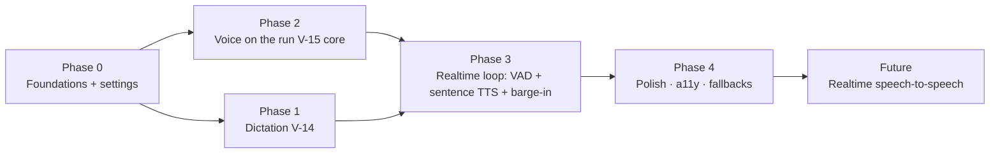

# Voice — Implementation / Execution Plan

Turns the rewritten voice spec into a buildable, PR-sized plan. The spec is the contract:
[ui-design V-14 (Dictation) + V-15 (Voice mode)](ui-design/05-screens-history-voice-images.md),
[product spec S7](01-product-spec.md#57-s7--voice-mode-full-screen), and the
[API-integration voice rows](03-api-integration.md). Testing follows the EDD strategy in
[05-execution-plan.md §6](05-execution-plan.md) — every slice ships a check that proves the *product
claim*, not just that code runs.

**The one load-bearing decision:** voice mode is **not** a separate model path. Each spoken turn is a
normal **server-authoritative agentic run** (`POST /threads/:id/runs`) driven through the *existing
run store* (`useRuns`), so voice inherits memory, tools, skills, streaming, sync, and persistence for
free. The old `cloudApi.chatComplete` (`/ai/chat`) path is removed from voice.

---

## 1. Current code facts (2026-06-30)

What exists today (from the voice audit):

- **Backend proxy** [`aiProxyService`](../api/src/application/aiProxyService.ts): `/ai/transcribe`
  (real `gpt-4o-transcribe`), `/ai/speech` (TTS, mp3, `voice` param, **no `speed`**), `/ai/chat`
  (non-streaming). Vault creds, nothing persisted, unit-tested.
- **Voice mode** [`VoiceMode.tsx`](../src/features/voice/VoiceMode.tsx): tap-to-talk →
  transcribe → **`/ai/chat` (non-streaming, no tools/memory/skills)** → TTS. Orb is CSS-state only
  (not amplitude-reactive). Persists turns with **local** `repo.appendMessage` (not a synced run).
- **Dictation** [`Composer.tsx` `toggleDictation`](../src/features/chat/Composer.tsx): record →
  transcribe → **append to end** of the field (not caret-safe). No waveform.
- **Read aloud** [`Message.tsx`](../src/features/chat/Message.tsx): `synthesizeSpeech` → play.
- **Audio lib** [`audio.ts`](../src/lib/audio.ts): `startRecording()` (MediaRecorder + an
  `AnalyserNode`) and `readLevel(analyser)`. No VAD, no waveform component.
- **Settings model** [`src/lib/types.ts`](../src/lib/types.ts): `voice: { engine: 'tts' | 'realtime';
  voiceId?; rate; vad; autoSend; captions }` already typed. **UI exposes only autoSend / captions /
  rate, and none of them are wired** (rate not applied to TTS; captions always on; autoSend ignored).
- **Run path** the voice loop should ride: `useRuns.startServerRun(threadId, body, prepare)`
  ([`runStore.ts`](../src/features/chat/runStore.ts)) → `runOnServer`
  ([`serverRun.ts`](../src/features/chat/serverRun.ts)); the in-flight assistant text streams into
  `runs[threadId].message.content`; `cloudApi.cancelRun(threadId, runId)` stops it.
- **Run body** [`SubmitRunBody`](../src/data/cloud/types.ts): `{ text?, clientMessageId?, model?,
  tools?, allowDestructive? }` — identical to what text chat submits.

Gap summary: dictation isn't caret-safe; voice mode is a second-class pipeline with no real-time
loop (no VAD, barge-in, streaming, or amplitude orb); the Voice settings are inert.

---

## 2. Guiding principles

1. **Ride the run store; never fork the pipeline.** Voice mode subscribes to the same `useRuns` run
   it submits, reads the streaming text, and speaks it. No `/ai/chat` in voice. This is what makes
   voice equal to text chat (memory/tools/skills) with almost no new server code.
2. **Thin vertical slices.** Each phase ships an end-to-end usable increment. Dictation polish ships
   before any voice-mode rework.
3. **EDD per slice.** Unit tests for pure logic (sentence splitter, VAD endpointing, caret splice);
   a real-browser CDP probe (pattern: [`scripts/memory-tool-probe.mjs`](../scripts/memory-tool-probe.mjs))
   for the live loop, barge-in latency, and run-parity.
4. **Reuse, don't reinvent.** WaveformVisualizer, VAD, sentence splitter, and the TTS audio queue are
   shared primitives used by both dictation and voice mode.
5. **No dead controls.** A setting ships only when it actually changes behavior.

---

## 3. Target architecture

```mermaid
flowchart TD
  subgraph Voice mode
    MIC[Mic capture + VAD] -->|end-of-speech| TR[POST /ai/transcribe]
    TR -->|text| SR[useRuns.startServerRun → POST /runs]
    SR -->|streams text into runs[t].message| Q[Sentence splitter]
    Q -->|each sentence| TTSQ[TTS queue → POST /ai/speech]
    TTSQ --> SPK[Audio playback]
    SPK -->|drained + run complete| MIC
    MIC -.->|speech during speaking| BARGE[Barge-in: stop audio + cancelRun]
    BARGE --> MIC
  end
  SR --> WORKER[(Run worker: memory + tools + skills)]
  WORKER -->|SignalR snapshots| SR
```

Dictation is the same capture + transcribe primitives, minus the run/TTS — it just splices the
transcript into the composer.

Shared primitives (new, in `src/lib/` or `src/features/voice/`):

- `WaveformVisualizer` (B14) — canvas/SVG bars driven by `readLevel(analyser)`.
- `vad.ts` — energy-based voice-activity detector over the analyser: emits `speechstart` /
  `speechend` using an adaptive threshold scaled by `settings.voice.vad` (mic sensitivity).
- `sentences.ts` — incremental splitter: given growing text, yields newly-completed sentences.
- `ttsQueue.ts` — serial TTS player: `enqueue(text)` synthesizes via `cloudApi.synthesizeSpeech`
  ({ input, voice: voiceId, rate }) and plays clips back-to-back; `stop()` clears + halts < 50 ms.

---

## 4. Phased roadmap



---

### Phase 0 — Foundations & shared primitives

**Goal:** the audio building blocks and the Voice settings are real and wired, so Phases 1–3 just
compose them.

**Backend** [`aiProxyService.ts`](../api/src/application/aiProxyService.ts):
- `speak()` accepts and forwards `speed` (Azure OpenAI `/audio/speech` supports `speed` 0.25–4.0) and
  keeps `voice`. Extend `SpeakInput` → `{ input; voice?; speed? }`. Clamp speed; default 1.0.

**Frontend:**
- [`apiClient.ts`](../src/data/cloud/apiClient.ts): `synthesizeSpeech({ input, voice?, speed? })`.
- New primitives: `WaveformVisualizer`, `lib/vad.ts`, `lib/sentences.ts`, `lib/ttsQueue.ts` (above).
- Extend `audio.ts`: expose a continuous-capture mode (don't stop on first clip) + the analyser for
  VAD; keep the existing one-shot `startRecording` for dictation.
- **Wire Settings → Voice** [`Settings.tsx` `VoiceBody`](../src/features/settings/Settings.tsx):
  add **Voice** (named-voice `voiceId` dropdown: alloy/echo/fable/onyx/nova/shimmer…), keep **Speaking
  rate**, add **Mic sensitivity** (`vad`), keep **Live captions**, relabel **Auto-send** → **Auto-stop
  on silence (dictation)**. Plumb `voiceId` + `rate` into *every* TTS call (`ttsQueue`, voice mode,
  and `Message` read-aloud).

**Acceptance (EDD):**
- Unit: `sentences.ts` yields complete sentences only, no dupes, handles streaming chunks +
  abbreviations; `vad.ts` fires `speechend` after the configured trailing silence; `ttsQueue.stop()`
  halts and clears.
- Unit/integration: `/ai/speech` request includes `speed` + `voice`; settings persist and the chosen
  voice/rate reach the request (assert on the captured body).
- No dead control: each Voice setting changes an observable output.

---

### Phase 1 — Dictation (V-14) · ships first

**Goal:** ChatGPT-parity dictation: recording bar, caret-safe insertion, never auto-sends.

**Frontend** [`Composer.tsx`](../src/features/chat/Composer.tsx):
- Replace `toggleDictation`’s append with a **recording-bar** UI that overlays the input row:
  amplitude `WaveformVisualizer` + elapsed timer + **Cancel** + **Accept**.
- **Caret-safe insert:** capture `textarea.selectionStart/End` before recording; on Accept, splice the
  transcript into the field at that caret (with sensible spacing), preserving text on both sides;
  restore focus + caret after the inserted text. Never replace the whole value.
- **Cancel** restores the prior value untouched. **Never auto-sends.**
- **Optional auto-stop:** if `settings.voice.autoSend` (auto-stop on silence) is on, the VAD
  `speechend` ends capture like Accept; default off → manual.
- State machine per spec: `idle → requesting → recording → transcribing → inserted` (+ `denied`,
  `error`). Reduced motion → static level meter. Bar is an ARIA live region.

**Acceptance (EDD):**
- Unit (Testing Library): typing "going to next", placing the caret mid-text, then accepting a
  transcript inserts at the caret without clobbering either side; Cancel restores; **send is never
  called**; denied/error paths render.
- Browser probe: real `gpt-4o-transcribe` round-trip inserts editable text; the composer never
  auto-submits.

---

### Phase 2 — Voice mode on the agentic run (V-15 core)

**Goal:** replace the `/ai/chat` brain with the real run, so voice gets memory + tools + skills +
streaming + sync — still tap-to-talk for now (real-time loop is Phase 3).

**Frontend** [`VoiceMode.tsx`](../src/features/voice/VoiceMode.tsx):
- Delete `think()`’s `cloudApi.chatComplete` + the local `repo.appendMessage` persistence.
- On a finished user transcript: build a `SubmitRunBody` (`{ text, clientMessageId, model, tools }`,
  reusing the composer’s `serverRunTools`/model resolution) and call
  `useRuns.getState().startServerRun(threadId, body, prepare)` — the **same** entry text chat uses.
  Lazily create the thread first (as the composer does) so a voice-only session persists.
- Subscribe to `useRuns(s => s.runs[threadId])`: render `message.content` as the live caption and feed
  it to the **`ttsQueue`** via the sentence splitter (speak as it streams).
- Remove `cloudApi.chatComplete` from voice (keep it only where onboarding still uses it).

**Acceptance (EDD):**
- Browser probe (extend `memory-tool-probe`): a voice turn that needs the web triggers `web_search`
  (tool parity); a self-referential turn surfaces memory; the turn appears as **real synced messages**
  in the thread (and is eligible for memory extraction) — proving it went through `POST /runs`, not
  `/ai/chat`.
- The reply is spoken and shown as a caption; exiting voice leaves the conversation in the thread.

---

### Phase 3 — Real-time loop: VAD + sentence-streamed TTS + barge-in (V-15 UX)

**Goal:** the “feels alive” hands-free loop — no taps, low latency, interruptible.

**Frontend** [`VoiceMode.tsx`](../src/features/voice/VoiceMode.tsx) + primitives:
- **Continuous capture + VAD endpointing:** open the mic once per session; `vad.ts` auto-submits on
  `speechend` (sensitivity from `settings.voice.vad`). Orb is **amplitude-reactive** (`readLevel`).
  Orb-tap remains a manual endpoint / push-to-talk for noisy rooms.
- **Sentence-streamed TTS:** drive the `ttsQueue` from the streaming run text so speech starts ~1
  sentence after first token (don’t wait for the full reply).
- **Barge-in:** a lightweight VAD monitor stays active during `speaking`; on `speechstart` →
  `ttsQueue.stop()` (< 150 ms), drop queued sentences, `cloudApi.cancelRun(threadId, runId)`, return
  to `listening`. This is the headline acceptance gate.
- **Mute really gates the mic** (suspend VAD/endpointing; orb dims). **`working` state** + tool chip
  while the run uses a tool.
- Full state machine (connecting/listening/thinking/working/speaking/muted/error/ended).

**Acceptance (EDD):**
- Unit: VAD loop transitions hands-free (listen→endpoint→submit→speak→listen) on simulated
  amplitude; barge-in path calls `ttsQueue.stop()` + `cancelRun` and returns to `listening`.
- Browser probe: a full hands-free turn with **no taps**; speaking over the assistant stops audio
  **< 150 ms** and starts a new turn; mute halts endpointing; measure end-of-speech → first spoken
  word (target ≤ ~1.5 s warm).

---

### Phase 4 — Polish, accessibility & fallbacks

**Goal:** ship-quality edges.

- **Captions toggle (CC)** wired to `settings.voice.captions` (default) + in-session toggle; **Keyboard**
  exits to the thread with the composer focused; **End** persists + exits.
- **Fallbacks:** `mic-denied` → explain + permission priming (V-05, first use); `transcribe-unavailable`
  → offer dictation/text; `tts-unavailable` → keep the loop with silent text replies; `offline`/run
  error → ErrorState (Retry/End); a failed run settles the orb to `error` with the partial transcript.
- **Reduced motion** for orb + waveform. ARIA: caption live region; controls labeled/reachable.
- **Entry affordance:** composer empty-state primary morphs to the voice-mode glyph (spec §S7); keep
  the header entry too.
- Latency instrumentation (dev-gated marks) for the targets above.

**Acceptance (EDD):** each fallback path renders the specified surface; reduced-motion verified;
keyboard-only operation of dictation + voice controls; captions on/off honored.

---

### Future — Realtime (Advanced Voice)

Native speech-to-speech via the Realtime API (server-minted ephemeral token, client socket) for lower
latency + native barge-in. Deferred; the Phase 0–4 STT→run→TTS loop is the v1 deliverable and already
matches ChatGPT’s standard voice with full agentic parity.

---

## 5. Settings → Voice (final shape)

| Control | Field | Applies to |
| --- | --- | --- |
| Voice | `voice.voiceId` | all TTS (voice mode reply, read-aloud) |
| Speaking rate | `voice.rate` | all TTS |
| Mic sensitivity | `voice.vad` | voice-mode VAD endpoint + dictation auto-stop |
| Live captions | `voice.captions` | voice-mode caption default |
| Auto-stop on silence (dictation) | `voice.autoSend` | dictation only |

`voice.engine` stays `'tts'` for v1 (Realtime is the future toggle).

---

## 6. Validation strategy (EDD)

- **Pure logic → unit (Vitest):** sentence splitter, VAD endpointing, caret splice, TTS-queue
  stop/clear, settings→request plumbing.
- **Live loop → real-browser CDP probe** (pattern of [`scripts/ttft-bench.mjs`](../scripts/ttft-bench.mjs)
  / [`memory-tool-probe.mjs`](../scripts/memory-tool-probe.mjs)): hands-free turn with no taps;
  tool + memory parity (proves `POST /runs`); barge-in latency; caret-safe dictation; threads cleaned
  up after the probe.
- **Semantic invariants, not plumbing:** assert voice turns are real synced runs (memory-eligible,
  tool-capable), that barge-in actually cancels the run, and that each Voice setting changes a
  captured request/behavior — never just that a component rendered.

---

## 7. Risk register

| Risk | Likelihood | Impact | Mitigation |
| --- | --- | --- | --- |
| Browser VAD is jittery (cuts off / runs on) | High | High | Adaptive threshold + trailing-silence window from `vad`; orb-tap manual endpoint; tune via the probe |
| Barge-in not snappy enough (> 150 ms) | Med | High | Pre-decode/queue short clips; `ttsQueue.stop()` halts current source immediately; monitor mic during `speaking` |
| Sentence-streamed TTS sounds choppy | Med | Med | Buffer ≥ 1 full sentence; merge very short fragments; natural-break splitter |
| Reusing the run store double-fires runs (one per thread lock) | Med | Med | Voice uses the same one-run-per-thread guard; submit only on endpoint; cancel before re-listen |
| `gpt-4o-transcribe` latency hurts turn time | Med | Med | Cap clip length; stream partials if available; warm path |
| TTS cost/latency per sentence | Low | Med | Coalesce sentences; cache nothing sensitive; respect rate |
| Mic permission / autoplay policies | Med | Med | First-use priming (V-05); user-gesture to start the session unlocks audio |

---

## 8. Definition of done

- Dictation: recording bar with amplitude waveform + timer; **caret-safe insertion**; Cancel restores;
  **never auto-sends**; permission/denial/error handled.
- Voice mode: **continuous VAD loop, no taps**; every turn is a real `POST /runs` (verified
  memory + tool parity); **sentence-streamed TTS**; **barge-in stops speech < 150 ms** and starts a
  new turn; **mute truly gates the mic**; captions + keyboard + end work.
- Every Settings → Voice control changes observable behavior (no dead controls).
- Turns persist + sync as normal messages and feed memory extraction (no separate voice path).
- `vitest` green (both projects); the voice browser probe passes; reduced-motion + fallback paths
  handled.
